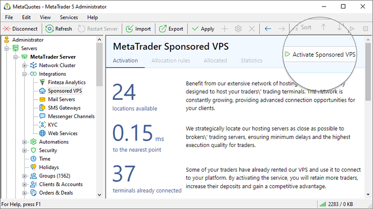
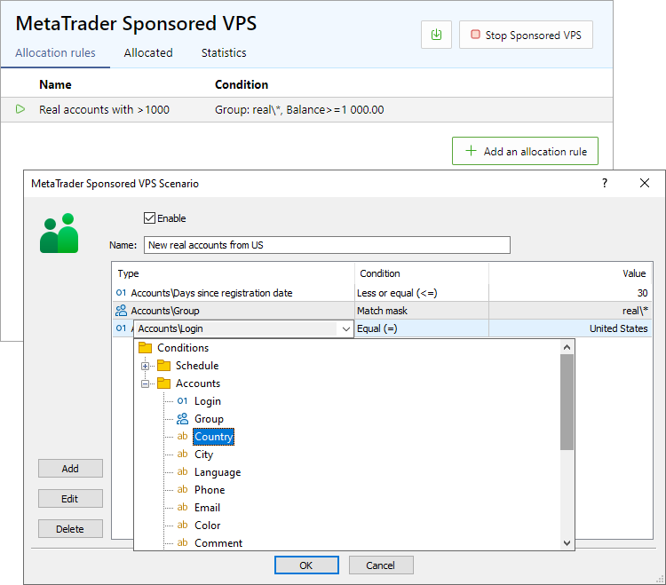
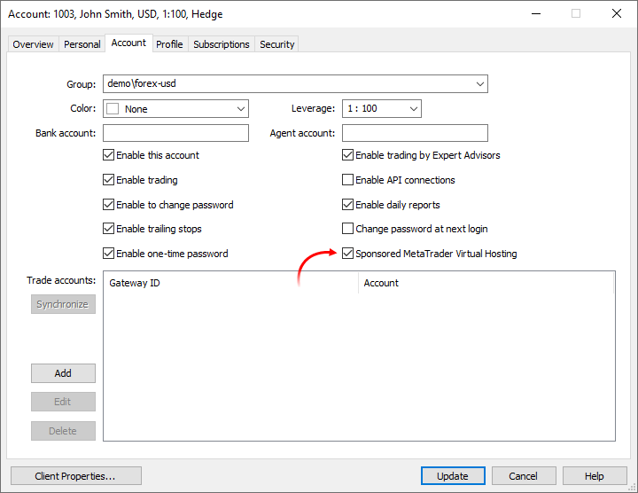
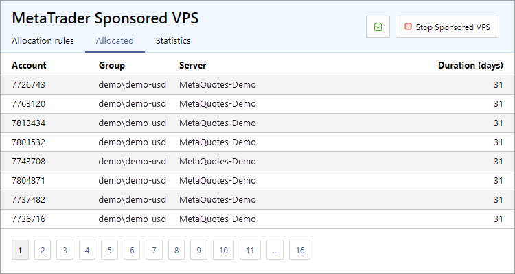
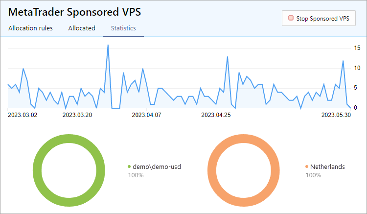
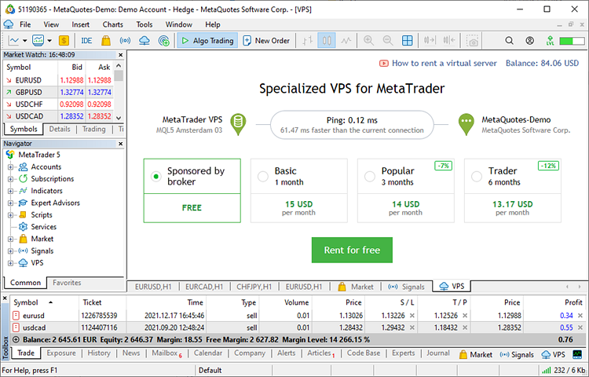

[🏠 Document Start](../../../README.md) / [MetaTrader 5 Trading Platform](../../../MetaTrader-5-Trading-Platform.md) / [Platform Setup](../../Platform-Setup.md) / [Integrations](../Integrations.md) / Sponsored VPS

[Previous](Finteza-Analytics.md) | [Next](Mail-Servers.md)

# Sponsored VPS (#sponsored-vps)

The [Virtual Hosting](https://support.metaquotes.net/en/docs/mt5/client/virtual_hosting) service is extremely important for traders. It enables 24/7 operation of trading robots and [copied signals](https://www.mql5.com/en/signals), without the need to keep the PC turned on permanently. Furthermore, users do not have to worry about the hardware and connections. The service is available directly from the client terminals, so traders can start using it in just a few clicks. The service ensures minimal network delays between the terminal and the broker's server, as the system selects the nearest hosting server automatically.

Sponsored Hosting provides a great tool for attracting new traders. Start offering a free VPS and create a competitive advantage to attract more clients. Furthermore, by providing the ability to trade 24/7 for existing customers, you can increase overall trading volumes.

For further information about Sponsored VPS advantages please see our articles:

  * [Gain a competitive advantage with MetaQuotes VPS](https://support.metaquotes.net/en/news/3439)
  * [4 reasons to tell your traders about VPS for MetaTrader](https://support.metaquotes.net/en/news/3394)
  * [Enable VPS for your traders — it pays off](https://support.metaquotes.net/en/articles/1018)

## Activating (#activating)

To manage the service, use the Integrations \ VPS section in MetaTrader 5 Administrator. Click Activate Sponsored VPS.

## Allocation rules (#allocation)

Allocation of hosting to traders can be flexibly configured. You can set detailed rules using almost any account parameters: balance, country, group, last visit date, etc. For example, hosting can only be provided for real clients with a balance of at least 10,000 USD and trading activity.

Open the "Allocation rules" setting and create a new scenario:

The following conditions are available:

## Schedule (#time)

These parameters set date and time conditions. Hosting is provided if a user requests it on a specified date or time.

### Accounts (#accounts)

These settings specify conditions based on account parameters:

  * Login - hosting is allocated for a specified account.
  * Group, Country, City, Language, Phone, Email, Color, Comment — hosting is allocated for an account from a specified [group (#account)](../Accounts/Editing-Account.md#account), [country (#personal)](../Accounts/Editing-Account.md#personal), [city (#personal)](../Accounts/Editing-Account.md#personal), etc. For example, if "real\*" is specified as a group, then hosting can be allocated for real accounts only. If you specify "Argentina" as a country, then hosting will be allocated only for accounts from Argentina. The condition works similarly for other account parameters.
  * Registration — the condition is set relative to the account creation date in the platform. Specify the date and the comparison type: equal to, less than or greater than. Accordingly, the condition will trigger for account registered on the specified date, earlier or later than this date. For example, if you specify "Registration > 2020.09.01", hosting allocation will only be possible for accounts created after the specified date.
  * Last visit — the condition is set relative to the last connection of the account to the platform. Specify the date and the comparison type: equal to, less than or greater than. Accordingly, the condition will trigger for account connected on the specified date, earlier or later than this date. For example, if you specify "Last visit > 2023.01.01", then the hosting allocation will be available for accounts that last connected to the platform after the specified date.
  * Days since registration — the condition is set relative to the number of days that have passed since the account was created. The calculated number of days is rounded down. For example, if the account was created 5 days and 23 hours ago, this will be counted as 5 days. The principle of operation and purpose of this condition are similar to the "Registration" condition.
  * Days since last login — the condition is set relative to the number of days that have elapsed since the last connection to the account. The calculated number of days is rounded down. For example, if the user connected to the account 7 days and 15 hours ago, this will be counted as 7 days. The principle of operation and purpose of this condition are similar to the "Last visit" condition.
  * Days since last trade activity — the condition is set relative to the number of days that have elapsed since the last operation on the account. This considers any trading operations, commission charges, etc. Balance operations are not taken into account. In addition, the system checks if the account has any open positions or active pending orders. With this condition, you can sort out accounts that connect to the server but do not trade.
  * Online — condition is set relative to the status of account connection to the trade server. Possible values are "true" and "false", i.e. the account is either connected (any connection type: client terminal, mobile terminal and so on) or not.
  * Leverage — the condition is set relative to the [account leverage (#account)](../Accounts/Editing-Account.md#account).
  * Balance — the condition is set relative to the current [account balance (#account-state)](../Accounts/Editing-Account.md#account-state); the amount is specified in the [deposit currency (#currency)](../Groups/Group-Settings.md#currency). Using this condition, you can allocate hosting to large customers only. 
  * Credit is similar to the "Balance" condition. In this case, the amount of [credit funds on the account (#account-state)](../Accounts/Editing-Account.md#account-state) is checked.
  * Positions total — the condition is set by the number of open [positions](../Positions.md) which currently exist on the account. Using it, you can allocate hosting to accounts with specific trading activity.
  * Orders total — similar to the "Total positions" condition, it checks the number of active pending orders on the account.
  * Floating profit, Equity, Margin, Free margin, Margin level — these conditions are similar to the "Balance" condition. Appropriate [trading account states (#account-state)](../Accounts/Editing-Account.md#account-state) are checked here.
  * Deposit currency — condition regarding account [deposit currency (#currency)](../Groups/Group-Settings.md#currency). For example, if you enter "EUR*", sponsored hosting will only be available for EUR accounts.
  * Lead Source, Lead Campaign — [lead source and lead campaign (#leadsource)](../Accounts/Editing-Account.md#leadsource) parameters specified in the account. These conditions will help provide hosting to customers attracted as a result of certain marketing campaigns.
  * Own funds percentage — when trading, clients are able to use their own funds they deposited on their accounts, as well as the credit and bonuses provided by a broker. Both types of funds increase their Equity parameter. The "Own funds percentage" condition allows configuring the automation task depending on the own funds share on a client's account. 100% means the account has client's funds only with no credit and bonuses. On the contrary, 0% means that only credit and bonuses are used for trading.  
The parameter is calculated as (1 - (Credit / Equity)) * 100.  
When calculating, the fractional part of the value is rounded down: 1.5% becomes 1%, 0.9% becomes 0%. The parameter value cannot be greater than 100% or less than 0%. If an action is required after the client has spent all their funds, it is more efficient to use the "Own funds volume" condition.
  * Own funds volume — the parameter works similarly to the previous condition, although it applies an absolute own funds value rather than a relative one. Specified in the deposit currency. The calculation equation: Equity - Credit.

You can create an unlimited number of scenarios, covering any situation. Each scenario is tested independently. If a trader falls under the terms of any of them, they will be able to get sponsored hosting.

## Additional settings (#additional-settings)

You can enable/disable access to sponsored hosting individually for each account. To do this, use the Sponsored MetaTrader Virtual Hosting in the settings:

If this option is enabled, the service will be available regardless of the [allocation rules (#allocation)](Sponsored-VPS.md#allocation) described above. If the option is disabled, the list of rules will be checked.

This option can also be managed via the [Automations](../Automations.md) service. Create a task with the necessary trigger and conditions, and select "Enable/Disable sponsored VPS" as an [action (#account)](../Automations/Actions.md#account). For example, using a task with the [Deposit (#finance)](https://support.metaquotes.net/en/docs/mt5/platform/administration/automation/automation_trigger#finance) trigger allows you to enable VPS only when replenishing an account for a certain amount.

## Report on provided VPS (#report-on-provided-vps)

Open the Allocated section to view the list of accounts that have used the service. This includes the account number, group, server and duration of sponsored hosting.

Statistics section features convenient diagrams for evaluating the use of the service:

## Payment for sponsored VPS (#payment-for-sponsored-vps)

The base cost of the sponsored hosting is USD 15 excluding VAT. This is a monthly rate. The final cost may vary depending on the VAT rate in the country the rental is performed from.

The amount for actually sponsored VPS is automatically included in your monthly platform statement. No additional settings are required.

## Operation on the Client Terminal side (#operation-on-the-client-terminal-side)

According to the configured access, the special payment plan will become available to the relevant users under the VPS section in client terminals. By choosing it, they receive hosting, while the payment for it will be added to the broker's monthly statement.

We have added extra protection to avoid service misuse:

  * Only one sponsored hosting server can be rented for each account at a time, while the allocation of multiple servers is prohibited
  * No other account can be launched on the sponsored hosting server

For further details on the Virtual Hosting service please refer to the [client terminal documentation](https://support.metaquotes.net/en/docs/mt5/client/virtual_hosting).
