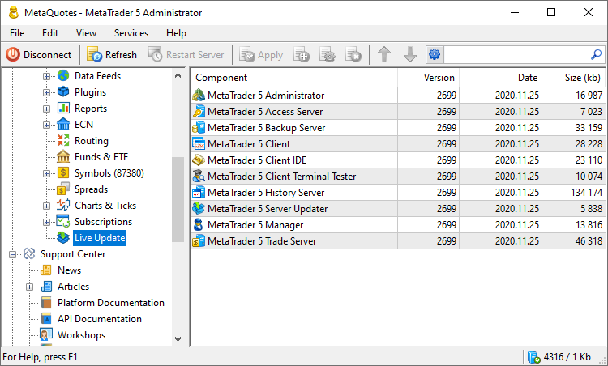

[🏠 Document Start](../../README.md) / [MetaTrader 5 Trading Platform](../../MetaTrader-5-Trading-Platform.md) / [Platform Setup](../Platform-Setup.md) / Live Update

[Previous](Mailbox.md) | [Next](../Migration-from-MetaTrader-4.md)

# Live Update (#live-update)

The system of the live update of the trading platform is a reliable and efficient way to deliver the updated versions of all its components. There are three modes of the system operation. You can choose one of them on the [starting page (#update)](Start-Page.md#update) of the server:

  * Disabled — no updates to the platform components are performed, either automatically or manually.
  * Enabled — in this mode the platform components will be [updated automatically (#auto)](Live-Update.md#auto) when the final versions of updates are released.
  * Enabled with beta versions — besides the release versions, there are beta versions that are released more often. If this option is enabled, all types of updates will be installed. However, it should be noted that intermediate versions can be unstable, so they should be installed only in extreme cases.

> It is strongly recommended to use beta updates only in extreme cases and only on demo servers.

The "Live Update" section contains the list of all updated components of the platform:

Information is represented as a table with the following fields:

  * Component — name of the platform component;
  * Version — current version and build number of the component;
  * Size — size of the component distribution in Kb.

## The Live Update procedure (#auto)

  * On each night of Saturday/Sunday, at [optimization time (#optimization)](Network-cluster/Configuring-Servers.md#optimization), the [history server](../Platform-Components/History-Server.md) starts the "mt5srvupdater64.exe" file that connects to the update server and checks the availability of updates of all the platform components;
  * If there are any updates, they are downloaded;
  * Then the history server informs other platform components about the availability of updates;
  * Server components are immediately updated automatically;
  * In terminals, a window appears that offers to [update](../MetaTrader-5-Administrator/Getting-Started/Live-Update.md) to the latest version.

The " Start Live Update" command in the [Services](../MetaTrader-5-Administrator/User-Interface/Main-Menu/Services.md) menu and in the context menu, allows the manual start of this process.

  * Terminal updates are cached on [access servers](../Platform-Components/Access-Server.md) to reduce the load on the history server;
  * Update files are hidden and protected by digital signatures. They are transferred through a protected channel;
  * During unpacking, updates are also checked by the platform components;

  * To check the result of updating, request the entries of the [history server](Network-cluster/Configuring-Servers/History-Server.md) [journal (#request)](Network-cluster/Journal.md#request) by the LiveUpdate type.

  
---  
  

## Update Rollback (#update-rollback)

> It is not recommended to rollback to previous versions unless there is a strong necessity.

In case there is a need to rollback the trade platform to a previous version after an update, you need to keep several safety measures:

  * Before you start a rollback, make a full backup of the current state of the platform.
  * Considering that some updates are connected with conversion (change of format) of data bases and configuration files, it is prohibited to rollback only executable files of the platform components. A rollback must be made for the entire platform.
  * You should take into consideration, that some updates may introduce some changes into MetaTrader 5 API. Therefore, third-party applications developed using API should be recompiled with their proper versions.

## Context Menu (#context)

The following commands are available in the context menu of this section:

  *  Start Live Update — start the updating process;
  * Auto Arrange — if this option is enabled the size of columns is selected automatically;
  * Grid — this option shows/hides field separators in the table with components.

