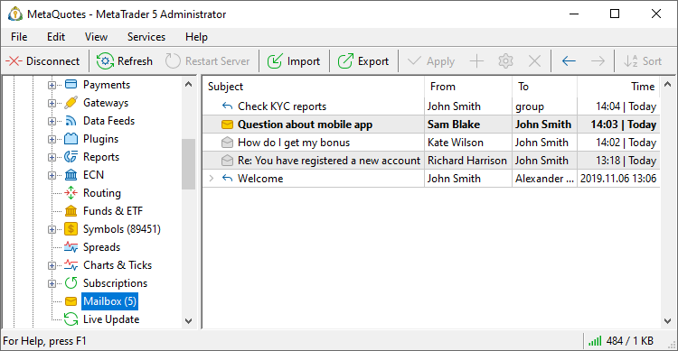
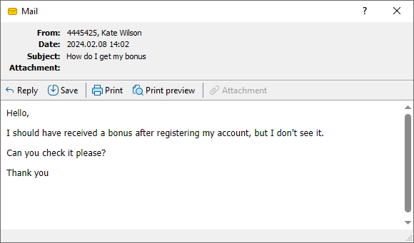
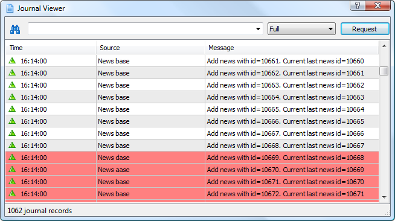
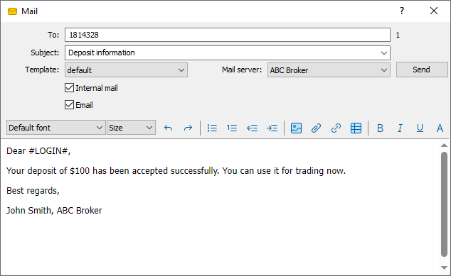

[🏠 Document Start](../../README.md) / [MetaTrader 5 Trading Platform](../../MetaTrader-5-Trading-Platform.md) / [Platform Setup](../Platform-Setup.md) / Mailbox

[Previous](Subscriptions/Controlling.md) | [Next](Live-Update.md)

# Mailbox (#mailbox)

The MetaTrader 5 trading platform features an internal email system which enables communications with clients and between employees. Using emails, you can effectively send important information about your services and company events to traders. The email system is integrated directly into trading terminals. When a message is received in the terminal, a sound notification is played, and thus the trader will not miss important information. In addition, the built-in email system allows you to reach potential clients for whom you do not have reliable contact information, such as phone number or email addresses. If a trader has opened a demo account and connected to your server, your managers can contact the trader offering a real accounts.

Using the [Automations (#message)](Automations/Actions.md#message) service, you can automate any mailings. For example, send promotional materials immediately after opening an account. This will save employee time, eliminate human errors, and increase customer conversion.

All emails received and sent from your account are displayed under the "Mail" section:

Each email contains the subject, sender, recipient, and time of sending/receiving.

Unread mails are indicated by icon , while read ones — by . In order to start viewing the message, click in the field of its subject with the left mouse button. Outgoing mails are marked with the icon. When using the function of replying to a message, mails are grouped in a chain which allows to navigate through mailing with different clients easily. Email threads have an additional icon. Click on it to view the entire conversation.

## Context Menu (#context)

The context menu of the "Mailbox" tab contains the following commands:

  *  Create — [create (#create)](Mailbox.md#create) a message;
  *  View — open a selected mail;
  *  Delete — delete a selected message;
  *  Expand — expand a selected mail chain;
  * Auto Arrange — if this option is enabled, the size of columns is selected automatically;
  * Grid — this option shows/hides grid to separate fields of the mail table.

  * The command of creating a mail is active only if the mailbox name is specified in the [settings (#mailbox)](Managers.md#mailbox) of the manager's account.
  * Mails are stored at the trade server. If a mail is deleted in the terminal interface, it won't be re-downloaded. However, if you delete the mail base of the terminal (the file "/profiles/server_name/mail/mail-account_number.dat") or connect using another terminal, all the mails for the last 30 days will be downloaded again.

  
---  
  

## Viewing Messages (#view)

To start viewing a message, click with the left mouse button in the field of its subject. After that the following window will be opened:

The upper part of the message contains the client's account and name, the date of mail coming, its subject and attached files (if there are).

The toolbar of this window contains the following commands:

  *  Reply — open the window of writing a message with filled address of recipient and the quotation of received message;
  *  Save — save the message on a computer as a HTML file or a text file of the Unicode standard;
  *  Print — print the message;
  *  Print Preview — view the message before printing it;
  *  Attachment — save files attached to the message. Also, an attached file can be opened and saved by simply clicking on its name.

> [Configure the directory](../MetaTrader-5-Administrator/Terminal-Settings/Common.md), to which email attachments will be saved. When you open an attached file, the terminal checks its extension and the corresponds of file contents to this extension. If the file type is allowed and its contents are checked, the terminal will open the file and save it to the specified directory. Otherwise, a warning will be displayed, notifying that the file may harm the computer, and the file will not be saved. The following file types are allowed: PNG, JPG/JPEG, BMP, ZIP, 7Z, GIF, DOC, XLS, DOCX, XSLX, ODT, RTF, CSV, TXT, LOG.

## Viewing Attached Log Files (#journal-viewer)

If a client's message has a log file (a file that has the *.log extension) attached then one can view it using a special function. To do it, it is necessary to click on its name in the "Attachment" field. The following window will be opened:

The upper part of the window of viewing contains the line of searching through the log (the search is performed only by the exact words and it is case sensitive) and the filter of entries (Standard, Errors, Full). Once having the searched word and filter specified, one should press the "Request" button.

> If a client has changed even one entry of the journal then all the entries starting from it are shown with the red color. At the attempt of saving such a file, the warning that says which line in it was changed, is shown.

The context menu of the window of viewing the journal allows to execute the following commands:

  *  Copy — copy selected entries to the clipboard;
  *  Save — save the received logs to the disk as a text document;
  * Auto Arrange — if this option is enabled, the size of columns is selected automatically;
  * Grid — this option shows/hides grid to separate table fields.

## Sending Messages (#create)

> In order to be able to send messages it is necessary to:

To create a message, one should press the " Create" button of the context menu or use the "Insert" hot key having the "Toolbox" window active. The window of creating the mail will appear as soon as it is pressed:

In this window one should fill out the following fields:

  * To — the account number of the message recipient.
  * Subject — title of the message.
  * Template — in this field one can select a mail [template (#templates)](Mailbox.md#templates).
  * Internal mail — select this option to send a message using the internal mail system.
  * Email — use this option to send an email. The address specified in [account personal data (#personal)](Accounts/Editing-Account.md#personal) will be used. Please note:

  * [A mail server](Integrations/Mail-Servers.md) must be configured in the platform to enable email sending.
  * Messages sent by email are not displayed under the "Toolbox \ Mail" section. To check the sending, request the [trade server journal](Network-cluster/Journal.md) using the 'email' keyword. If an email has been sent successfully, the recipient address and the configuration name of the mail server through which the email has been sent, are shown in the log: email to someaddress@mail.net sent [MailServer].

> The attachment of files has the following limitations:

The window for working with the mail text is located lower. The editor features commands for creating lists, as well as inserting images, links and tables. To view or edit the source HTML code of the message, click  on the toolbar.

The context menu of the window of text editing contains the standard commands of working with text: "Copy", "Cut", "Paste", "Insert Link", "Insert Table" and "Insert Image". The context menu also allows to work with mail [templates (#templates)](Mailbox.md#templates) and [macros (#macro)](Mailbox.md#macro).

To send the message, one should press the "Send" button.

### Bulk Mailing (#mass-mailing)

To send emails to multiple recipients, enter a range of accounts through a hyphen in the "To" field. For example, 1000-9000. You can also select [multiple accounts in the list](Accounts.md) and click 'Email' in the context menu. The numbers of the selected accounts will be inserted into the "To" field.

When using Email instead of the internal mail, it could be more efficient to send emails to a list of clients rather than accounts. Clients often have multiple accounts that use the same email address. Because of this, when sending emails to a list of accounts, the client may receive several identical messages. To avoid this, send emails from the [Clients](Clients.md) section. Select the desired client records and click "Internal mail/Email" in the menu. The mailing list will only include unique email addresses from all the trading accounts linked to the selected clients.

## Templates (#templates)

To manage templates, use the context menu of the [mail editing (#create)](Mailbox.md#create) window (text editing area). Open the "Templates" submenu:

  * Save Template — save the current text of the message as a template in the *.htm format. All templates are stored in the [/templates/mail (#mail-templates)](../MetaTrader-5-Administrator/Getting-Started/Structure-of-Directories-and-Files.md#mail-templates) folder of the administrator terminal;
  * Load Template — open the window of choosing a previously saved template for loading it;
  * Remove Template — delete the currently selected template.

> When executing the "Remove Template" command a template is irrecoverably deleted from PC.

## Macros (#macro)

Using the "Macros" submenu of the context menu of the [mail creating (#create)](Mailbox.md#create) window, one can insert macros into the text. They allow to substitute various information depending on the message recipient. The following macros are available:

  * Login (#LOGIN#) — the email/messenger recipient's Account number.
  * Name (#USERNAME#) — the first name and the last name of the recipient.
  * Currency (#USER_CURRENCY#) — the recipient's deposit currency. The currency is determined by the [group (#currency)](Groups/Group-Settings.md#currency), in which the user account is created.
  * Balance (#USER_BALANCE#) — the recipient's balance.
  * Credit (#USER_CREDIT#) — the credit amount on the recipient's account.
  * Equity (#USER_EQUITY#) — the equity amount on the recipient's account.
  * Leverage (#USER_LEVERAGE#) — account leverage.
  * Margin (#USER_MARGIN#) — the amount of funds reserved on the recipient's account.
  * Free margin (#USER_MARGIN_FREE#) — the free margin amount on the recipient's account.
  * Margin level (#USER_MARGIN_LEVEL#) — the margin level on the recipient's account.

These macros substitute email sending time in the message text:

  * Trading time — time used in the platform, taking into account its [settings](Time.md).
  * Local time — time used in the computer on which the platform is installed.
  * UTC time — [UTC](https://en.wikipedia.org/wiki/Coordinated_Universal_Time) time.

