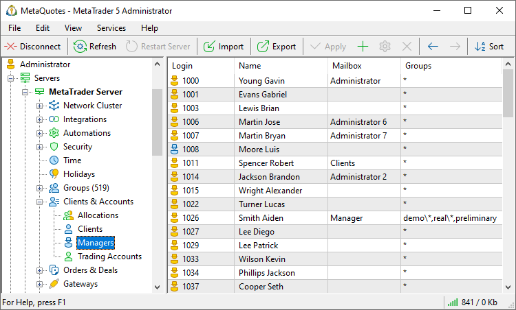
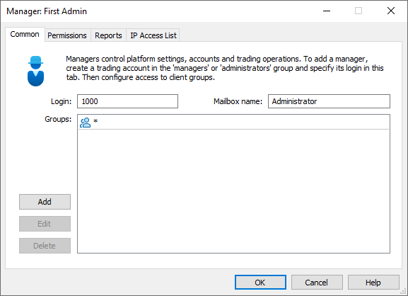
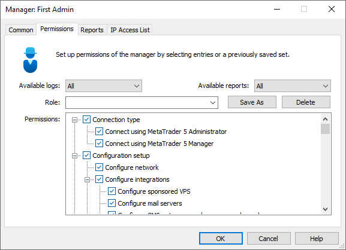
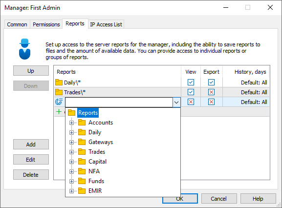
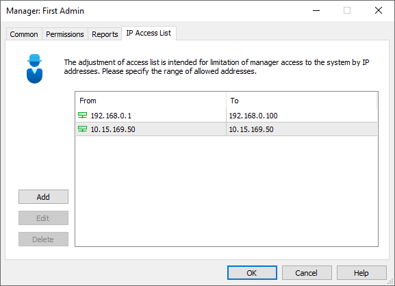

[🏠 Document Start](../../README.md) / [MetaTrader 5 Trading Platform](../../MetaTrader-5-Trading-Platform.md) / [Platform Setup](../Platform-Setup.md) / Managers

[Previous](Payments/in-Client-Terminals.md) | [Next](Orders.md)

# Managers (#managers)

User logins created in the Managers section possess special rights to manage the system (edit accounts, quotes for clients, generate reports, etc.)

Manager accounts are all shown in a table with the following fields:

  * Login — manager's account.
  * Name — manager's name.
  * Mailbox — name of the manager's mailbox.
  * Groups — groups serviced by this manager.

Managers who have permissions to connect via the administrator terminal are marked by icon , all other managers - by .

  * Manager accounts are created only based on accounts added in the corresponding [section](Accounts.md).
  * A manager can service only those [accounts](Accounts.md) that belong to the server, to which the [group (#trade-server)](Groups/Group-Settings.md#trade-server) the manager is included to refers.

  
---  
  
In order to create or edit a manager account, press " Add" and " Edit", respectively. In order to delete a manager, press " Delete". These commands are available in the [Edit](../MetaTrader-5-Administrator/User-Interface/Main-Menu/Edit.md) menu, on the [Standard](../MetaTrader-5-Administrator/User-Interface/Toolbar/Standard.md) toolbar and in the context menu. Upon the execution of these commands, a window of manager settings will appear.

> Additional general information about working with configuration records is given in the ["Working with Instructions"](General-Information/Working-with-Instructions.md) section.

## Supervision of managers (#control)

For the additional control of access to the server data, managers' search queries, data exports, copying to clipboard and table filters used are logged in the platform. The actions are logged on the Manager and Administrator terminal side and on the trading server side.

For example, if the employee exports a report or data on online accounts, clients and quotes, the following entries will be added to the server log:

2020.02.06 08:24:01.114 10.25.217.106 '1024': export report 'Accounts\Accounts Groups' to 'Accounts Groups 2020_01_22 13_00_50.html'   
2020.02.06 08:24:30.865 10.25.217.106 '1024': export online trading accounts, 4 records to 'Online Users.htm'   
2020.02.06 08:24:44.756 10.25.217.106 '1024': export clients, 85 records to 'Clients.csv'   
2020.02.06 08:25:17.225 10.25.217.106 '1024': export ticks of 'Gold' for 2017.06.26, 57895 records to 'Gold.2017_06_26.Ticks.csv'  
---  
  
When copying configurations to clipboard, the following entry is added to the logs:

2020.02.06 08:24:30.865 192.168.0.1 '1033': copy MetaTrader 5 Main Server Journal to clipboard, 6 records  
---  
  

## Common (#common)

The following parameters are specified on this tab:

  * Login — manager login, added in the ["Accounts"](Accounts.md) section. The specified account must be included to the [managers' group (#manager)](Groups/Group-Types.md#manager).
  * Mailbox name — name of the manager's mailbox. If the mailbox name is not specified, the manager will not be able to send emails via the [internal mailing system](Mailbox.md).

In the "Groups" filed, [groups of accounts](Groups.md) that will be serviced by the manager should be specified:

  * Add — add a service group. After you press this button, a new line will appear in the window. Specify one of the groups from the list here. You can use mask "*" and negation sign "!" to set up groups. For example, if you specify "demo*" it will indicate all groups, whose name (including path) starts with "demo" (for example, demo\forex, demoforex, demoforex\usd). If you specify "!managers*,*,", it will indicate all groups except those, whose name starts with "managers".
  * Delete — delete a selected group.
  * Edit — edit a selected group. The same action can be performed buy double-clicking on the group.

  * A manager account can be create only based on the [account](Accounts.md) included to the [managers' group (#manager)](Groups/Group-Types.md#manager).

  * In the manager terminal only the accounts that belong to the groups permitted for the manager are available.

  * Rules for the groups are check from top to bottom. If you allow all groups in the first row, you will not be able to prohibit some of them in the next rules.
  * A rule cannot consist of prohibition only. For example, the rule "!demo*" is not valid. A prohibition can be used together with a permission to see some other groups. For example, "!demo*,real*".

  
---  
  

## Permissions (#permissions)

Managers' permissions and access to different data are set up on this tab:

  * Available logs — selecting period, logs within which will be available to the manager.
  * Available reports — selecting period, within which a manager is able to view various reports and request account trading history in the Manager terminal. In addition to this parameter, individual data depth limits from the [Reports (#reports)](Managers.md#reports) section are also checked when requesting reports. The strictest limit always applies. For example, if the 'Available reports' parameter is set to '6 months' and a specific report has a limit of 90 days, the manager will only be able to request data for the past 90 days.
  * Role — here you can select one of predefined sets of permissions. Using buttons "Save As" and "Delete" you can save and delete your own sets of permissions. These sets are saved in /roles folder of the [directory (#terminal-data)](../MetaTrader-5-Administrator/User-Interface/Main-Menu/File.md#terminal-data), where the terminal information in the user's profile is stored on the PC.

Below the list of permissions is located. In order to enable a permission, tick off them. The following permissions are available here:

  * Connection type
    * Connect using MetaTrader 5 Administrator — connection to the server using the administrator terminal.
    * Connect using MetaTrader 5 Manager— connection to the server using the manager terminal.
  * Configuration setup
    * Configure network — possibility to configure the [platform components](Network-cluster.md).
    * Configure VPS — configuring [Sponsored VPS](Integrations/Sponsored-VPS.md) for traders.
    * Configure mail servers — setting up [integration with email services](Integrations/Mail-Servers.md).
    * Configure messengers — setting up [integration with SMS providers and messengers](Integrations/SMS-Gateways.md).
    * Configure KYC — setting up [integration with KYC services](Integrations/KYC.md).
    * Configure payments — configuring integration with payment systems (in development).
    * Configure web services — access to the [Integration \ Web services](Integrations/Web-Services.md) section.
    * Configure IP access list — setup of [access](Security/Firewall.md) to the platform by IP addresses.
    * Configure automations — setting up [automatic actions](Automations.md) for specified scenarios.
    * Configure server operation time — setup of the server [working hours](Time.md).
    * Configure holidays — setting up [holidays](Holidays.md).
    * Configure groups — setting up [groups of accounts](Groups.md).
    * Configure allocations — setting up groups, in which traders are able to open [demo and preliminary real accounts](Accounts/Account-Allocation-Settings.md) directly from client terminals.
    * Configure corporate links — setting up [links](Accounts/Corporate-Links.md) to be displayed in client terminals.
    * Configure managers' permissions — setting up these permissions.
    * Configure request routing — configuring [rules of routing](Routing.md) of requests.
    * Configure gateways — configuring parameters of [gateways](Gateways.md).
    * Configure plugins — managing [plugins](Plugins.md).
    * Configure datafeeds — setting up [datafeeds](Data-Feeds.md).
    * Configure reports — setting up [reports](Reports.md).
    * Configure symbols — setting up [financial symbols](Symbols.md).
    * Configure history charts synchronization — setting up [synchronization of history data](Synchronization.md) with other servers.
    * Configure ECN — setting up [ECN](ECN.md).
    * Configure funds and ETF — setting up [investment funds](Funds-&-ETF.md).
  * Administration
    * Access server logs — permission to request [server operation logs](Network-cluster/Journal.md).
    * Receive automatic server reports — permission to receive automatically generated reports on the server operation.
    * Edit charts — permission to [edit (#add-edit)](1-Minute-History-Charts.md#add-edit) history data on the server. To access the data, the manager also needs the "Configure symbols" permission.
    * Send emails — permission to [send emails (#create)](Mailbox.md#create) via the internal mailing system.
    * Send news — permission to [send news (#send)](../MetaTrader-5-Administrator/User-Interface/Toolbox/News.md#send). A manager/administrator is able to send news only if their account belongs to a [group (#trade-server)](Groups/Group-Settings.md#trade-server) created at the main trade server.
    * Export data — permission to export data (accounts, orders, etc.) in external files from the manager and administrator terminals. The permission does not affect the ability to [export server configurations](General-Information/ImportExport-Settings.md) from the administrator terminal.
    * Manage server machines — access to a menu for [managing the computer](Network-cluster/Managing-Machines.md) on which the platform server is running.
  * Accounts
    * Accountant (deposit/withdraw) — permission to work with assets on accounts.
    * Access accounts — possibility to view the list of [accounts](Accounts.md).
    * View technical accounts — when combined with "[Show to regular managers (#limits)](Accounts/Editing-Account.md#limits)", provides greater convenience in working with various testing and technical accounts. Disable the "Show to regular managers" permission for all technical accounts, and then disable access to technical accounts for the managers who do not configure the platform. Otherwise, such technical accounts can be confusing for managers working with clients.
    * Manage technical accounts — with this permission, the manager can enable and disable options "[Show to regular managers (#limits)](Accounts/Editing-Account.md#limits)" and "[Include in server reports (#limits)](Accounts/Editing-Account.md#limits)" for a trading account. Without this permission, the manager can only see the states of the relevant options, without the ability to change them (read-only).
    * Access the account personal details — permission to view [personal details on accounts](Accounts.md). You can separately provide access to the name, location (country, city, region, zip code), address, document number, email, phone number, and general data (other less important data: language, status, comment, MetaQuotes ID, etc.).
    * Edit accounts — [modifying account details](Accounts.md).
    * Delete accounts — permission to delete client accounts in the administrator and the manager terminals and via Manager API. In order to delete accounts, a manager account must also have the "Edit accounts" permission.
    * View currently connected clients — permission to view accounts currently connected to the server.
    * Confirm dangerous actions — confirmation dialog is displayed in the manager terminal by default when performing balance operations on a client account and during bulk order closing. In order to perform one of these actions, a randomly generated character sequence should be entered. If disabled, the actions are performed immediately with no confirmation.
    * Push notifications — a right to send push notifications to clients' mobile devices using the manager terminal. Messages are sent based on MetaQuotes ID, which is a unique user identifier. To obtain the ID, a user needs to install MetaTrader 5 Mobile for [iPhone](https://download.mql5.com/cdn/mobile/mt5/ios?hl=en&utm_campaign=download&utm_source=metatrader5.help "iPhone") and [Android](https://download.mql5.com/cdn/mobile/mt5/android?hl=en&utm_campaign=download&utm_source=metatrader5.help "Android"). Detailed information is provided in the manager terminal user guide.
  * Dealing
    * Access orders and positions — permission to view trade [orders](Orders.md), [deals](Deals.md) and [positions](Positions.md). To be able to access this data, the manager must also have the "Access accounts" permission. The "Access orders and positions" permission affects the possibility of enabling the "Modifying of orders" and "Dealer" permissions.
    * Edit orders, positions, and deals — permission to edit any fields of [orders](Orders.md), [deals](Deals.md) and [positions](Positions.md) in the administrator and the manager terminals and via Manager API. Also provides access to the Exposure tab in the Manager terminal.
    * Delete orders, positions, and deals — permission to delete any [orders](Orders.md), [deals](Deals.md) and [positions](Positions.md) in the administrator and the manager terminals and via Manager API. In order to delete trade operations, a manager account must also have the "Edit orders, positions and deals" permission.
    * Dealer — permission to perform trading and dealing operations in the manager terminal. Also provides access to the Exposure tab in the Manager terminal. In addition, it controls access to the availability of group position closing and splitting feature in the Manager terminal.
    * Supervisor — permission to see the entire queue of requests coming from client groups available to the manager, and to see how the requests are processed by other dealers in the manager terminal. A manager works as a Supervisor being not connected as a dealer in the manager terminal. Once the manager has connected as a dealer, they will see only their own requests coming for processing according to the [routing rules](Routing.md).
    * Show raw quotes without spread difference — if this permission is given, an additional command "Show raw quotes" appears in the context menu of the "Market Watch" window in the manager terminal. By enabling it, the manager will be able to see the quotes without [applying the spread settings](Groups/Group-Symbol-Settings/Common.md) of the manager group.
    * Throw in quotes — permission to throw in quotes from the manager terminal.
    * Modify spread and execution mode — permission to modify spread and execution mode from the manager terminal.
    * Risk manager — permission to receive information on the total clients' positions and company's coverage positions. The parameter affects the availability of section "Summary Positions" and "Exposure" as well as of the account "Exposure" tab in the Manager terminal.
    * Edit groups (margin settings) — permission to modify the [margin settings of groups](Groups/Group-Symbol-Settings/Margin.md) via the manager terminal.
    * Edit groups (commission settings) — permission to modify the [commission settings of groups](Groups/Commission-Settings.md) via the manager terminal.
    * Receive reports — permission to request and receive various reports on clients' operations.
  * Payments
    * Access payments — view current and processed payments and payment accounts.
    * Process payments — confirm and decline manually processed payments via the Manager terminal.
    * Edit payments — edit current and processed payments and payment accounts.
    * Delete payments — delete current and processed payments and payment accounts.
  * Back office — permission to access the [Clients](Clients.md) section. Permissions in this section apply to both Manager and Administrator terminals.
    * Access clients — general access to the Clients section.

  *     * Access personal details — access to clients' personal data. You can separately provide access to the name, location (country, city, region, zip code), address, document number, email, phone number, and general data (other less important data: language, status, Lead Source, Lead Campaign, etc.).

  *     * Create clients — permission to [create new client (#create)](Clients.md#create) records manually.
    * Edit clients — permission to edit any client data, except documents.
    * Delete clients — permission to delete client records.
    * KYC check — ability to [launch (#kyc)](Clients.md#kyc) auto verification of client data using [integration with KYC services](Integrations/KYC.md).
    * Access documents — permission to view [clients' documents (#documents)](Clients.md#documents).
    * Create documents — permission to add general information about documents to client records.
    * Edit documents — permission to edit general information about documents in client records.
    * Delete documents — permission to delete general information about documents from client records.
    * Add files to documents — permission to add [document files (#documents)](Clients.md#documents) to client records.
    * Delete files from documents — permission to delete document files from client records.
    * Access comments — permission to read comments to client records and documents.
    * Add comments — permission to add comments to clients and their documents.
    * Delete comments — permission to delete comments to clients and documents.
  * Finteza
    * Access to Finteza — access to the [Finteza Analytics](Integrations.md) section.
    * View websites — view website related information from Finteza in the Analytics section of the Manager terminal.
    * View campaigns — permission to view information on marketing campaigns from Finteza in the Analytics section of the Manager terminal.
    * View reports — the permission is currently not used.
  * Subscriptions — access to the [Subscriptions](Subscriptions.md) section.
    * View subscriptions — view and edit [subscription settings](Subscriptions/Common.md) in the Administrator terminal, as well as view active subscriptions and the history of subscriptions in the Administrator and Manager terminal.
    * Edit subscriptions — ability to [create (#user-subscriptions)](Subscriptions/Controlling.md#user-subscriptions) and [delete subscriptions (#delete-unsubscribe)](Subscriptions/Controlling.md#delete-unsubscribe) for traders in the Administrator and Manager terminal.

> Once the access rights are changed the manager is automatically reconnected for changes to take effect.

## Reports (#reports)

Configure manager access to [server reports](Reports.md). Click "Add" and specify the path to the report or group of reports. Next, set the permissions to view and export report data to a file and specify the depth of information that will be available to the manager.

For efficient permission categorization, create a hierarchy of reports and arrange them into directories according to their purpose. For example, you can create a separate directory with dealer transaction reports, a separate directory for marketers who are responsible database analysis and customer acquisition, etc. Such categorization will assist in configuring access rights: you will only need to specify one line with the directory path rather than specify each individual report.

> When reports are requested, the system checks both the individual data depth limits from the 'Reports' section and the 'Available reports' parameter from the '[Permissions (#permissions)](Managers.md#permissions)' section. The strictest limit always applies. For example, if the 'Available reports' parameter is set to '6 months' and a specific report has a limit of 90 days, the manager will only be able to request data for the past 90 days.

## IP Access List (#access-list)

On this tab, you can set up the range of IP addresses, from which this manager can connect. Thus you can limit managers' access, for example, to the dealing room only.

  * Add — add a range of IP addresses. As soon as you press this button, a new line will appear in the window. In fields "From" and "To" specify the first and last IP of the range, respectively.
  * Delete — delete a selected IP range.
  * Edit — modify a selected IP range. The same action can be performed by a click on the necessary line.

To complete the creation or modification of a manager, press OK. If you press "Cancel", the window will be closed, while changes will not be saved.

## Context Menu (#context)

The context menu of the "Manager" section contains the following commands:

  * Servers — using this command, one can filter the managers displayed in the list by the trade server they belong to. A list containing all trade servers of the platform will be opened as soon as it is executed.
  *  Add — add a new manager.
  *  Edit — edit a selected manager.
  *  Delete — delete a selected manager.
  *  Move Up — move a selected manager up relative to others.
  *  Move Down — move a selected manager down relative to others.
  *  Sort by Login — sort managers by their logins. Sorting is performed on the server, not on the local MetaTrader 5 Administrator.
  *  Export to File — [export](General-Information/ImportExport-Settings.md) the settings of managers to a file.
  *  Import from File — [import (#import)](General-Information/ImportExport-Settings.md#import) the settings of managers to a file.
  *  Find — open the [search](../MetaTrader-5-Administrator/User-Interface/Search.md) window.
  * Auto Arrange — if this option is enabled the size of columns is selected automatically.
  * Grid — this option shows/hides field separators in the table with managers.

