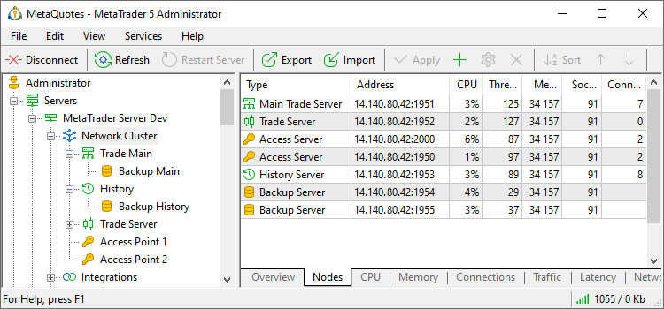

[🏠 Document Start](../../README.md) / [MetaTrader 5 Trading Platform](../../MetaTrader-5-Trading-Platform.md) / [Platform Setup](../Platform-Setup.md) / Network cluster

[Previous](Start-Page.md) | [Next](Network-cluster/Configuring-Servers.md)

# Network Cluster (#network-cluster)

This section is intended for managing all the server components of the online trading system and for [monitoring their state](Network-cluster/Monitor.md). All the added platform components, such as [access servers](Network-cluster/Configuring-Servers/Access-Server.md), [history server](Network-cluster/Configuring-Servers/History-Server.md), [backup servers](Network-cluster/Configuring-Servers/Backup-Server.md), etc., are displayed here.

The following information about the platform components is displayed here:

  * Type — type of the server (main trade server, trade server, history server, access server or backup server);
  * Server — name of the server;
  * Address — IP address and port separated by colon;
  * Public Addresses — the list of [public IP addresses (#network)](Network-cluster/Configuring-Servers.md#network);
  * ID — internal [identifier of the server (#identifier)](Network-cluster/Configuring-Servers.md#identifier) that is used for recognizing it by the other platform components;
  * Connections — number of connections to the server;
  * Base Priority — [priority (#priority)](Network-cluster/Configuring-Servers/Access-Server.md#priority), that is set for the server in its settings;
  * Current Priority — [current priority](../Platform-Components/Access-Server/Priority.md) of the access server;
  * CPU — processor loading (in percentage terms).

To add a new server, one should execute the " Add" command in the ["Edit" (#add)](../MetaTrader-5-Administrator/User-Interface/Main-Menu/Edit.md#add) menu or the same command in the [toolbar](../MetaTrader-5-Administrator/User-Interface/Toolbar/Standard.md) or in the context menu. To change the settings of a server, it is necessary to select it and press the " Edit" button or double-click on it with the left mouse button. To delete a server press the " Delete" button.

  * The process of adding and editing servers is described in the [separate section](Network-cluster/Configuring-Servers.md).
  * The interaction between the servers inside the platform is described in the ["Platform components"](../Platform-Components.md) section.

  * If a server in the list or in the tree has a red icon, for example , it means that it is not connected to the main server. The possible reason can be the incorrect authorization details as well as the stopping of the corresponding service in the operating system.

  
---  
  

## Context Menu (#context)

The context menu of this window allows to execute the following commands:

  *  Restart Server — [restart](Network-cluster/Restarting-and-Stopping-Servers.md) a selected server.
  *  Deploy Server — start [deploying](../Platform-Installation/Fast-Deployment.md) a selected server with specified configuration. This command is only available for servers that are not started yet.
  *  Switch to Backup Server — this procedure allows to make a selected backup server an active trade or history server depending on what type of server is being backed up. At that, the backed up server will become a backup server. This procedure is described in more details in ["Switching to Backup Server"](../Platform-Components/Backup-Server/Switching-to.md).
  *  Restart Data Feeds — restart [data feeds](Data-Feeds/Restarting.md).
  *  Restart Gateways — restart [gateways](Gateways.md).
  * Manage Server Machine — a menu with commands for [managing the computer](Network-cluster/Managing-Machines.md) on which the platform server is running.
  *  Add — [add](Network-cluster/Configuring-Servers.md) a new server.
  *  Edit — [edit](Network-cluster/Configuring-Servers.md) a selected server.
  *  Delete — delete a selected server.
  *  Move Up — move a selected server up relatively to the others.
  *  Move Down — move a selected server down relatively to the others.
  * Automation triggers — create an [automation](Automations.md) task for the selected event or edit an existing one. The menu displays only the triggers and tasks associated with the current section.
  * Automation actions — add an automation action to an existing task or create a new task based on the action. The menu displays only the actions associated with the current section.
  *  Export to File — [export](General-Information/ImportExport-Settings.md) network settings to a file.
  *  Import from File — [import (#import)](General-Information/ImportExport-Settings.md#import) network settings to a file.
  *  Find — open the [search](../MetaTrader-5-Administrator/User-Interface/Search.md) window.
  * Auto Arrange — if this option is enabled, the size of columns is selected automatically.
  * Grid — this option shows/hides grid to separate fields of the table of servers.

