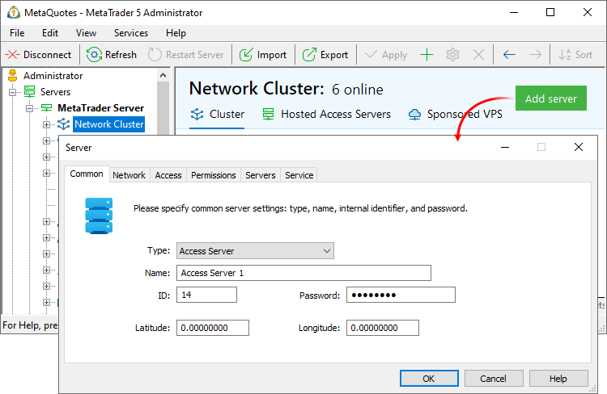
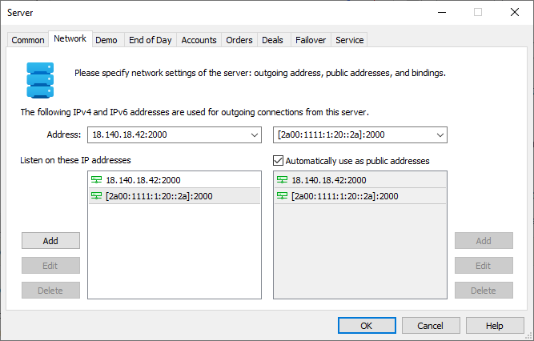
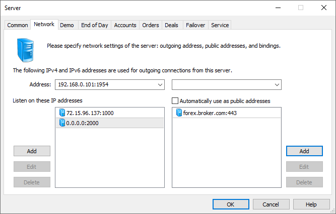
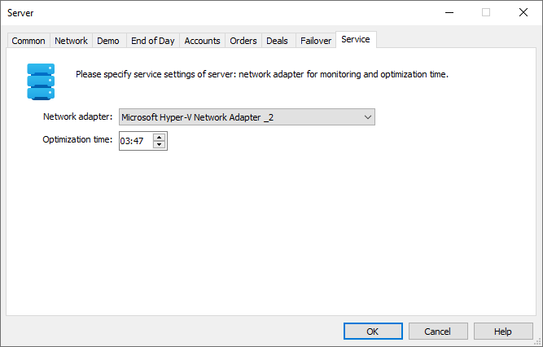

[🏠 Document Start](../../../README.md) / [MetaTrader 5 Trading Platform](../../../MetaTrader-5-Trading-Platform.md) / [Platform Setup](../../Platform-Setup.md) / [Network cluster](../Network-cluster.md) / Configuring Servers

[Previous](../Network-cluster.md) | [Next](Configuring-Servers/Trade-Server.md)

# Configuring Servers (#configuring-servers)

The trading platform cluster consists of several servers. Each server performs specific functions and thus the overall load is distributed among different components.

  * [Trade server](Configuring-Servers/Trade-Server.md)
  * [History server](Configuring-Servers/History-Server.md)
  * [Access server](Configuring-Servers/Access-Server.md)
  * [Backup server](Configuring-Servers/Backup-Server.md)
  * [AntiDDoS server](../Security/Anti-DDoS-Protection.md)

To add a server to the system, [install](../../Platform-Installation/Installation.md) it and add to the "Network section" of the Administrator terminal. The order of operations does not matter.

After completing these steps, [reboot](Restarting-and-Stopping-Servers.md) platform (the main trade server). Only after that the newly installed server will be activated.

Servers have individual sets of settings. They are explained in relevant subsections. Below is a description of the general settings: sections "General", "Network" and "Service" are the same for all types of servers.

## Common (#common)

The "Common" tab contains the following settings:

  * Type — type of the server (main trade server, trader server, history server, access server or backup);
  * Name — name of the server;
  * ID — identifier that is used for internal recognizing of the servers;
  * Password — internal password used for connection of other severs of the platform to this server. The password is set during [server installation](../../Platform-Installation/Installation.md). If the [deployment](../../Platform-Installation/Fast-Deployment.md) function is used, the password should be set in advance, before installation. The password must be 7 to 15 characters long.
  * Latitude/Longitude — geographic coordinates of the server to enable its precise positioning on the [interactive cluster map (#map)](Monitor.md#map).

  * Only one main trade server can be added.

  * If the platform is installed in one local network then it is necessary to indicate the internal IP addresses. If the components are located in different networks then one should specify external addresses.

  
---  
  

## Network (#network)

Network settings of the server are specified on this tab.

### IPv4 and IPv6 support (#ipv4-and-ipv6-support)

IPv4 which is used in every network was created more than 30 years ago. It contains IP addresses of 32 bits, which are represented as four 8-bit numbers separated by dots. This produces more than four billion unique IP addresses. However, the rapidly growing number of users and devices has accelerated the depletion of the pool of available addresses.

To avoid the depletion problem, products started to provide additional support for the modern IPv6. This protocol uses a 128-bit address, represented as x:x:x:x:x:x:x:x, where each x is a hexadecimal value of six 16-bit address elements. Theoretically, this format allows 5 x 10 ^ 28 unique addresses. In addition to an extensive address space, this protocol has other advantages over the older version. You can read about them in specialized articles.

The platform supports two network protocols: IPv4 and IPv6. The corresponding addresses can be specified as outgoing, listen and public.

> To use IPv6, please make sure this protocol is supported by your network infrastructure.

### Outgoing Address (#outgoing-address)

The outgoing address is used for the following purposes:

  * For performing outgoing connections to other servers;
  * For authentication of the server by IP address. During the connection the address specified in the settings is compared to the address of a real connection.

Use the left field to bind to an IPv4 address. The address is specified as IP-address:port, for example: 192.168.0.1:3128.

Use the right field to bind to an IPv6 address. If a port is specified for the address, the main part must be enclosed in square brackets: [address]:port.

> If no outbound address is specified, the server will connect to the cluster without authentication by IP address.

### Listen Addresses (#bind)

A listen (binding) address is an IP address and port that will be listened by the server for incoming external connections. It is recommended to specify an IP address, not domain name, to bind to

Here one can indicate a local IP address as well as an external one, depending on the network configuration:

  * If the server has direct access to the Internet and is not closed with a firewall, it is necessary to specify the external IP address;
  * If the access to the Internet is performed through a firewall in a local network, then one should properly set up the routing of incoming connections from the external IP address to the internal IP address of the access server. In this case, the local address of the server is specified on the tab.
  * To set up listening of a certain port at all available addresses, specify 0.0.0.0:port number. For example, 0.0.0.0:443.

### Public Addresses (#public)

In this section you should specify the list of access points (IP or DNS addresses) that are used to accept connections from other components of the platform and client connections from terminals and API (for access servers). In order to create an access point, press "Add" and enter the IP address and port number separated by a colon. E.g. 88.168.10.91:443.

When other cluster components connect to the server, they sequentially iterate over its public addresses in the same order in which they are listed. If a domain name is specified as a public address, servers will iterate over all associated IP addresses, while preference is given to IPv6.

If you enable the "Automatically use as public addresses" option, then the specified listen addresses will be used as public.

### Connection order between cluster components (#connection-order-between-cluster-components)

LAN is preferred when one cluster component connects to another.

  1. The system checks outgoing connections of both servers: whether they belong to the local subnet 10.*, 172.16.* — 172.31.* or 192.168* and whether they have the same first three octets. Example: the backup server has an outgoing address of 192.168.0.100:1951 and the access server has 192.168.0.105:1950. If this condition is met, then connection will be performed using all local addresses from the list of listening addresses (from the server to which they are connecting).
  2. If only the port (0.0.0.0:port number) is specified as the listening address, the connection address is formed as [outgoing address]:[listening port].
  3. If the connection to the above addresses fails, all public server addresses will be searched in the order in which they are specified.

Consider the following example of a backup server connection to the main server.

  * Backup Server: outgoing address= 192.168.0.104:1954
  * Main Server: outgoing address = 192.168.0.101:1954; listening address = 72.15.96.137:1000, 0.0.0.0:2000; public address: forex.broker.com:443.

In this example, address 192.168.0.101:2000 will be used for connection in the first place. If connection fails, the server will check all IP addresses associated with the forex.broker.com domain.

## Service (#service)

The service settings of servers are specified at this tab.

The following parameters are specified here:

  * Network adapter — network adapter using which the [monitoring](Monitor.md) of the server state will be performed;
  * Optimization time — time of optimization of the server. Different operations for increasing the performance of server and reliability of the platform are performed at that time: deletion of expired demo accounts, optimization of databases and updating of components. It is necessary to choose the time of minimum server load. For example, 03:47 by server time.

### Cluster Optimization Process (#cluster-optimization-process)

A large number of operations are performed one by one during optimization. Some of them are performed daily, others are executed only on Sundays.

If the optimization start time is set to 1:00, the process will be performed as follows:

Trading Server

  * 1:00 — Daylight Saving Time switch is checked. If the time has switched, the server is restarted to apply the changed.
  * 1:00 +/- a few seconds — computer performance data is collected.

Further, no other operations are performed on all days except Sunday. The following operations are performed on Sunday:

  * 1:10 — compacting of databases and configurations (unnecessary and empty entries are deleted), deletion of expired demo accounts, server restart.
  * 2:00 — check for updates; if necessary the server is updated and restarted.
  * 3:00 — launch of compression of previous week's server logs to ZIP archives.

History Server

  * 1:00 +/- a few seconds — computer performance data is collected.
  * 1:10 — compacting of databases and configurations (unnecessary and empty entries are deleted)

Further, no other operations are performed on all days except Sunday. The following operations are performed on Sunday:

  * 2:00 — check for updates; if necessary the server is updated and restarted.
  * 2:20 — launch of tick and minute history optimization. The data of financial instruments that are not available in the platform are deleted from the \history\ directory.
  * 3:00 — launch of compression of previous week's server and gateway logs to ZIP archives.

Access Server

  * 1:00 +/- a few seconds — computer performance data is collected.
  * 1:10 — compacting of databases and configurations (unnecessary and empty entries are deleted)

Further, no other operations are performed on all days except Sunday. The following operations are performed on Sunday:

  * 2:00 — check for updates; if necessary the server is updated and restarted.
  * 2:20 — launch of tick and minute history optimization. The data of financial instruments that are not available in the platform are deleted from the \history\ directory.
  * 3:00 — launch of compression of previous week's server logs to ZIP archives.

Backup Server

  * 1:00 +/- a few seconds — computer performance data is collected.

Further, no other operations are performed on all days except Sunday. The following operations are performed on Sunday:

  * 1:10 — compacting of databases and configurations (unnecessary and empty entries are deleted)
  * 2:00 — check for updates; if necessary the server is updated and restarted.
  * 3:00 — launch of compression of previous week's server logs to ZIP archives.

In addition to the above operations, the server periodically optimizes databases loaded into RAM. These operations can be performed daily as needed and do not significantly impact the platform performance. During optimization, log entries of the following format are recorded:

2025.01.24 09:50:03.469 TradeDeals index compact started   
2025.01.24 09:50:03.469 TradeHistory history_2019.08.dat: index compact started   
2025.01.24 09:50:03.469 TradeHistory history_2019.08.dat: index compact finished [1063523 records]  
---
