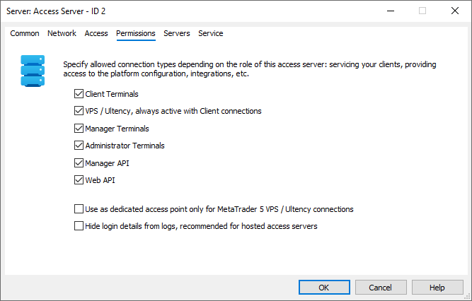
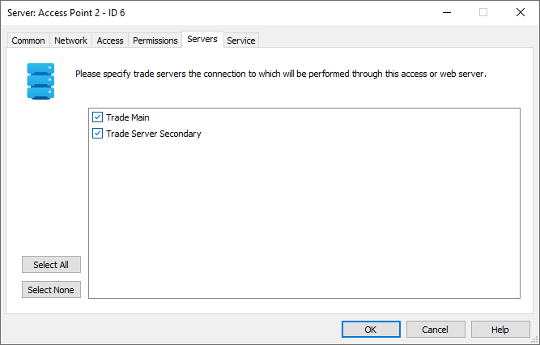

[🏠 Document Start](../../../../README.md) / [MetaTrader 5 Trading Platform](../../../../MetaTrader-5-Trading-Platform.md) / [Platform Setup](../../../Platform-Setup.md) / [Network cluster](../../Network-cluster.md) / [Configuring Servers](../Configuring-Servers.md) / Access Server

[Previous](History-Server.md) | [Next](Backup-Server.md)

# Access Server (#access-server)

Access servers are used as intermediate links between clients and a trade server. The access server performs the following functions:

  * Processing of incoming client connections;
  * Packaging authorization requests and passing them to a trade server;
  * Checking activity of client connections, protecting the trade server from attacks and overloading;
  * Saving history data, depth of market and news, providing them to clients and thus reducing the load to the history server;
  * Providing client terminals with LiveUpdate.

Settings on the ["Common" (#common)](../Configuring-Servers.md#common), ["Network" (#network)](../Configuring-Servers.md#network) and ["Service" (#service)](../Configuring-Servers.md#service) tabs are the same for all the server types. The access server setup window contains three more tabs.

> To quickly add an access point in a high trading activity region, [order Access Server Hosting from MetaQuotes](../Hosted-Access-Servers.md) directly via the Administrator terminal. The new point will become available within 30 seconds.

## Access (#access)

The following parameters are set up on the "Access" tab:

  * Priority is the basic priority of the access server. A server can have basic priority from 0 to 15. The access server preference for client connections is calculated based on the current priority and quality of connection to the server. The current priority depends on the basic priority and the number of current connections to the server. The lower the priority number is, the higher its preference for client connections is. Find more details about the calculation of the current priority in a [separate section](../../../Platform-Components/Access-Server/Priority.md).
  * Enable antiflood control — enable [defense from DoS attacks](../../../Platform-Components/Access-Server/Antiflood-Control.md). The server analyses the network activity of all clients in real time mode by selecting connections with most frequent operations that come from one IP address. If such an attack is detected, the attacking IP address is moved to a temporary list of banned addresses. At a repeated attack, the ban period is extended. This mechanism allows to easily block attack attempts. The control has the following parameters:

  * Connections — the maximum number of server connections from one IP address within a certain time period, after which the address will be temporarily banned.
  * Errors — number of unsuccessful connection attempts, after which the address will be temporarily banned.
  * Maximum news — maximum number of news messages that are stored on the access server.
  * Use this server for monitoring the cluster and failover — when enabled, the backup servers use this server to check the availability of the main (backed up) ones. This is used to automatically switch to the backup server if the main one fails. More detailed information can be found in the [appropriate section (#auto)](../../../Platform-Components/Backup-Server/Switching-to.md#auto).

  * Enabling of the antiflood control is required.
  * If you need to create a virtual, temporarily not existing servers, use the "Idle" priority. Such servers are standby ones. They are connected to only if all other servers do not operate.

  
---  
  

## Permissions (#permissions)

Here you can set up types of connections allowed for the access server:

  * Client terminals — desktop, mobile and web.
  * Terminals operating on a [built-in VPS (#vps)](Access-Server.md#vps), as well as Ultency servers.
  * Manager terminals.
  * Administrator terminals.
  * Applications developed using [Manager API](https://support.metaquotes.net/ru/docs/mt5/api/managerapi).
  * Services operating through [Web API](https://support.metaquotes.net/ru/docs/mt5/api/webapi).

### Creating fast dedicated access points for built-in VPS (#vps)

You can create fast, dedicated access points to connect [VPS terminals](../../Integrations/Sponsored-VPS.md). This will significantly improve the high frequency trading capabilities on your server. By using a widespread distributed network and automatically identifying the server closest to the broker, VPS terminals achieve exceptionally low latency when connecting. Setting up a dedicated access server for these terminals will further enhance speed and enable traders to engage in true high-frequency trading.

To set up a dedicated access point:

  * Restrict standard client connections, allowing connections only for VPS / Ultency.
  * Enable the "Use as a dedicated access point only for MetaTrader 5 VPS / Ultency" option. This prevents the access server from appearing to client terminals, while physical connections remain technically possible. As a result, standard client terminals will not attempt to connect since they will not know the server address.

### Additional security for hosted servers (#additional-security-for-hosted-servers)

[Hosting access servers](../Hosted-Access-Servers.md) is entirely secure. All transmitted data is encrypted, and the access server does not store account databases, passwords, or any other trading account information. For added protection, you can enable the "Hide login details from logs" option. This prevents account numbers from being displayed in the access server [log](../Journal.md). If necessary, this option can be temporarily disabled for troubleshooting, but we recommend keeping it enabled for maximum security.

## Servers (#servers)

On this tab you should select [trade servers](Trade-Server.md) to connect to through the selected access server. To allow connections to certain servers, tick  near them. You can select all or select none of servers using the corresponding buttons.
