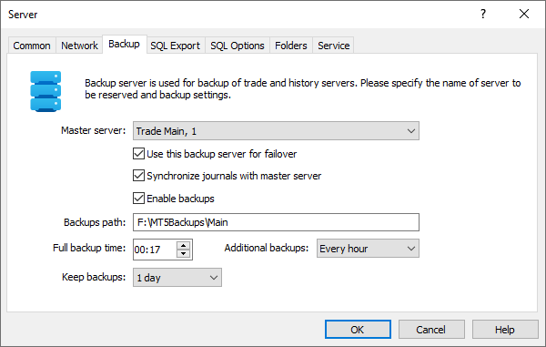
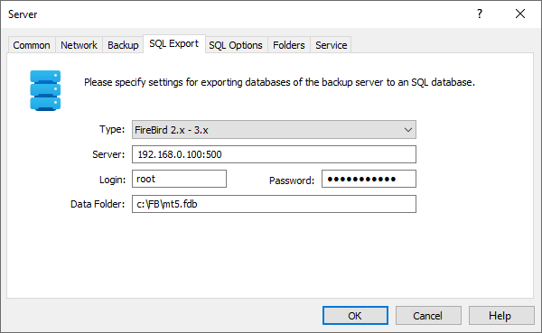
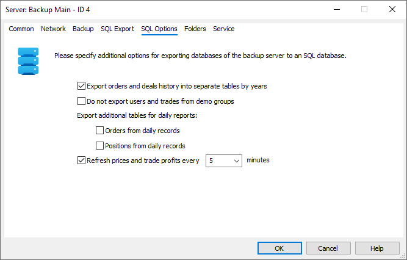
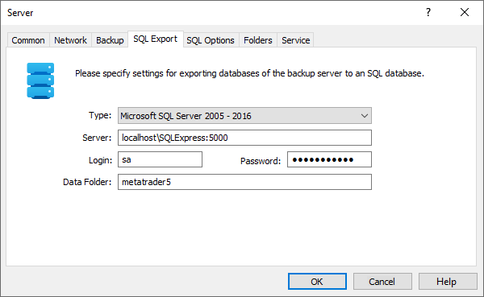
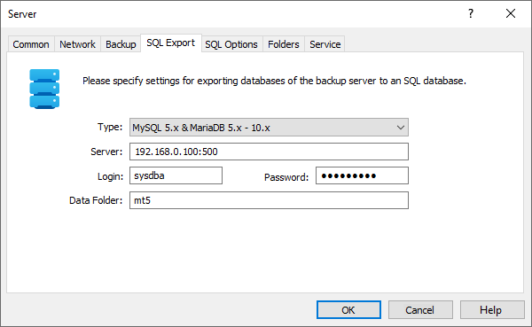
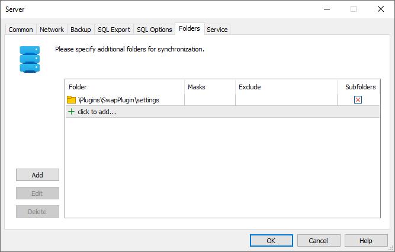

[🏠 Document Start](../../../../README.md) / [MetaTrader 5 Trading Platform](../../../../MetaTrader-5-Trading-Platform.md) / [Platform Setup](../../../Platform-Setup.md) / [Network cluster](../../Network-cluster.md) / [Configuring Servers](../Configuring-Servers.md) / Backup Server

[Previous](Access-Server.md) | [Next](../Hosted-Access-Servers.md)

# Backup Server (#backup-server)

Backup servers allow creating backup copies in case of failure of a history or trade servers. The backup server performs the following functions:

  * It provides real-time backup of a trade server and a history server. Each server is associated with one or more separate backup server instances which can replace it at any time.
  * It creates backup copies of all data bases every day, and regularly creates backups of client and trade databases.
  * When a history server is backed up it creates real time backups of data required for correct restoring of [gateways](../../Gateways.md): custom settings that can be stored (at developer's discretion) in the settings.dat file in a gateway work folder, and trade executions database.
  * They provide [automatic failover (#auto)](../../../Platform-Components/Backup-Server/Switching-to.md#auto) in case the primary server becomes unavailable.
  * Using backup servers, you can easily [migrate servers (#manual)](../../../Platform-Components/Backup-Server/Switching-to.md#manual) to new hardware.
  * Backup servers enable you to quickly [restore](../../../Platform-Components/Backup-Server/Restoring-Server.md) server operation in the manual mode even if the main trade server is unavailable, and connection to the platform via MetaTrader 5 Administrator is not possible.
  * They [replicate information](../../../Platform-Components/Backup-Server/SQL-Export.md) to database managed by MySQL, MariaDB, PostgreSQL, Firebird, MSSQL or Oracle.

> The process of restoring servers is described in a [separate section](../../../Platform-Components/Backup-Server/Restoring-Server.md).

Settings on the ["Common" (#common)](../Configuring-Servers.md#common), ["Network" (#network)](../Configuring-Servers.md#network) and ["Service" (#service)](../Configuring-Servers.md#service) tabs are similar for all types. The backup server setup window contains three more tabs.

## Backup (#backup)

The following parameters are available on this tab:

  * Master server — name of the server whose backups should be created, and the [login (#identifier)](../Configuring-Servers.md#identifier) (ID) of this server;
  * Use this backup server for failover — the trading platform features [an automated failover system (#auto)](../../../Platform-Components/Backup-Server/Switching-to.md#auto), which switches to a backup server in case of main server failure. By default, the platform can switch to any of existing backup servers. If a certain backup server should not be used by the automatic failover system, disable this option for that server. This may be needed if the backup server is used only for [exporting data to SQL database](../../../Platform-Components/Backup-Server/SQL-Export.md). You can disable the "Enable backups" option for such servers - this will save resources required for the creation of backup copies in a disk.  
The option only disables switching to that server in the automated mode. If necessary, you can switch to this backup server [in manual mode (#manual)](../../../Platform-Components/Backup-Server/Switching-to.md#manual).
  * Synchronize journals with master server — the backup server is a copy of the backed up one since it stores the same data as the main server, including log files. If you only use the backup server for [data export to SQL (#sql)](Backup-Server.md#sql), you can disable log synchronization with the primary server to save disk space.
  * Enable backups — apart from synchronizing with the main server in real time, the backup server creates [database file copies (#file)](../../../Platform-Components/Backup-Server/Backup-Features.md#file) on the disk on a daily basis. Such copies allow [restoring (#restore)](../../../Platform-Components/Backup-Server/Backup-Features.md#restore) the main server status on a specific day. Disable this option to avoid creating file copies. It does not affect data synchronization with the main server in real time. The backup server will still remain a full copy of the main one. Creating file copies can be disabled if the server is used only for [exporting data to SQL (#sql)](Backup-Server.md#sql).
  * Backups path — the path on the computer where the file copies of of the databases will be saved. Do not specify the trading platform installation directory here.
  * Backup time — time of creating file copies.
  * Additional backups — frequency of creating additional file copies. By default, file copies are created every 24 hours, but you can set this to happen more often — once per hour or once per 4 hours. Keep in mind that this will require more server resources and more disk space. This option is only available for the backup of trading servers; backup copies of history servers are always created once every 24 hours.
  * Keep backups — file copies storage period. All backup copies older than a period specified in this field are automatically deleted. The parameter is not available for backup servers replicating history servers. They keep only one last state of price databases. It is impossible to store several states for different days due to the large size of the databases.
  * Enable ticks backups — copies of [ticks](../../BidAskLast-Ticks.md) are created once a day during a full backup. The backup is performed incrementally — the first copy stores the full data cast, while subsequent ones contain only the changes relative to the first copy, which significantly reduces the volume of files. The copies are stored in the \ticks directory where they are arranged in subdirectories by days, for example, ticks\2015.11.17, ticks\2015.11.18, etc. By default, the option is disabled since tick data takes much space.  
  
For manual tick data recovery, copy the folders with backup copies to the new history server consistently beginning with the oldest. For example, suppose that the backup server has the folders: ticks\2015.11.17, ticks\2015.11.18, and ticks\2015.11.19. First, copy the contents of ticks\2015.11.17 to the \ticks directory of the history server. Then, overwrite the contents with the data from the ticks\2015.11.18 folder, and after doing that - by the contents from the ticks\2015.11.19 folder.

> In addition to creating periodic and full databases backups, the backup servers make starting database copies. Such copies are created before the initial synchronization with the primary server in case its database is damaged. Starting backups have the *start postfix. Initial synchronization is performed during the first connection to the primary server after the backup server start or restart. After the initial synchronization, the backup server will receive data on changes made in the primary server, in real time.

## SQL Export (#sql)

A backup server can export its databases to an SQL database in real-time mode. Considering that data backup is also performed in real-time mode, all data stored in the backup server is sent to SQL database almost immediately.

The following database management systems (DBMS) can be used to export data:

  * Microsoft SQL Server 2005, 2008, 2008 R2, 2012, 2014, 2016, 2017, 2019, 2022
  * MySQL 5.1, 5.5, 5.6, 5.7, 8.0, 8.1
  * MariaDB (all versions)
  * Oracle 11g, 12c, 18c, 19c, 21c, 23ai
  * PostgreSQL 8.4 - 17

The backup server supports the export of the following data:

  * configurations: [trading symbols](../../Symbols.md) and [groups of clients](../../Groups.md)
  * client bases: total [client base](../../Accounts.md) and client trading account status
  * trading bases: [orders](../../Orders.md), [deals](../../Deals.md), [positions](../../Positions.md)
  * trading history bases: orders and deals history

  * A full description of the exported data is in the ["SQL Export"](../../../Platform-Components/Backup-Server/SQL-Export.md) section.

  * If you use a backup server only for exporting data to SQL, disable the ["Use the backup server for failover" (#failover)](Backup-Server.md#failover) option. Otherwise the server can switch to the primary server mode and will stop exporting data. You may also disable the ["Enable backups" (#enable-backups)](Backup-Server.md#enable-backups) option to save resources required for the creation of backup copies in a disk.

  
---  
  
The following parameters should be specified for export setup:

  * Type — type of DBMS, to which data will be exported;
  * Server — address of the server with installed DBMS. Address format may vary for different DBMS. Examples for each type of DBMS are given below;
  * Login — login for connection to a database;
  * Password — password for connection to a database;
  * Data Folder — database name in DBMS, to which the data will be exported. A database should be created in advance. Examples of how to set up this parameter are given below.

Data export process can be monitored via a backup server [Journal](../Journal.md) using SQL keyword to request the entries.

## SQL Settings (#sql-settings)

Data export to a database using SQL can be configured on this tab.

  * Export history orders and deals into separate tables by years — by default, historical orders, deals and daily reports are exported into three separate tables. However, over time, the platform's databases can grow significantly, causing the tables in the SQL database to grow accordingly. If this option is enabled, the data will be additionally split into separate tables by years. You will have separate tables for each year for historical orders, trades and daily reports. This will reduce the load on the server by reducing the table sizes, as well as speed up queries to the database.  
When enabling this option, modify your SQL queries against the database accordingly. For more information about exported tables, please see ["SQL Export"](../../../Platform-Components/Backup-Server/SQL-Export.md).

  * Export additional tables for daily reports — [daily reports](../../../Platform-Components/Trade-Server/Daily-Reports.md) store information about the end-of-day status of the trader's open positions and pending orders. You can export this data to an SQL database.  
Please note that the export of these tables will only begin after the relevant options are enabled. For previously exported daily data, position and order information will not be updated. If you need to export all data, save data from the custom columns (if any) of the mt5_daily tables and remove these tables from the SQL database. In this case, the backup server will re-export all daily data, including position and order information. Full data replication may take a considerable amount of time, so we recommend performing this operation only on weekends.

  * Do not export users and trades from demo groups — when the option is enabled, accounts from [demo groups (#demo)](../../Groups/Group-Types.md#demo), as well as trade operations (orders, deals and positions) of these accounts will not be exported to SQL base. This helps to reduce the load on database and increase the speed of queries.
  * Refresh prices and trade profits every N minutes — to reduce the consumption of resources you can limit the rate of exporting the price and profit data. The data include [symbol prices](../../../Platform-Components/Backup-Server/SQL-Export/mt5-prices.md), current prices of [positions](../../../Platform-Components/Backup-Server/SQL-Export/mt5-positions.md) and [orders](../../../Platform-Components/Backup-Server/SQL-Export/mt5-orders.md), floating profit of positions and almost all information in the table of the [state of trade account](../../../Platform-Components/Backup-Server/SQL-Export/mt5-accounts.md).

Click "OK" to complete a backup server creation or editing. If you click "Cancel", the window will be closed without saving changes.

### Sample Data Export Settings for Various DBMS Types (#sample-data-export-settings-for-various-dbms-types)

Microsoft SQL Server

Sample parameter settings when configuring data export to Microsoft SQL Server:

  * Type — Microsoft SQL Server 2005 - 2022.
  * Server — address of the server (IP address or domain name) with the installed DBMS, MSSQL copy name and a port for connection (optional). For example, localhost\SQLExpress:5000, 192.168.0.1\SQLExpress.
  * Login — sa. Account used for connection should have the rights to create/edit/delete tables and data.
  * Password — some_password.
  * Data Folder — specific name of the database where the data is exported. For example, metatrader5. The database should be created in advance. 

MySQL / MariaDB

Sample parameter settings when configuring data export to MySQL (similar parameters are used for MariaDB):

  * Type — MySQL 5.x & MariaDB 5.x - 11.x.
  * Server — address of the server (IP address or domain name) with the installed DBMS and a port for connection (optional). For example, 192.168.0.100:5000, sqlserver.company.net.
  * Login — sysdba. Account used for connection should have the rights to create/edit/delete tables and data;
  * Password — some_password;
  * Data Folder — name of the database (schema) where the data is exported. For example, metatrader5. The database should be created in advance.

## Folders (#folders)

The server allows synchronizing not only the standard files and the platform databases, but also any custom directories and files as well. For example, many data feeds and plugins require LIC, DAT and other files for their operation. These files should also be backed up.

Specify custom directories for backup on the Folders tab.

  * Folder — path to the folder files from which should be backed up. Paths are specified relative to the installation directory of the primary server.
  * Masks — comma-separated list of copied files. File names can be defined using masks. If the list is specified, only listed files matching the mask are copied. Otherwise, all files from the directory will be copied.
  * Exclude — comma-separated list of ignored files. File names can be defined using masks. If the list is specified, only files from the list and the ones matching the mask will be skipped.
  * Subfolders — whether or not to back up subdirectories in the specified folder.

Example:

Folder=plugins\HistoryPlugin   
Masks=EURUSD*.*,*.lic,*.dat;   
Exclude=*.log,*.tmp  
---  
  
.lic and .dat files, as well as files beginning with EURUSD are synchronized in the <server_installation_directory>\plugins\HistoryPlugin folder, while .log and .tmp files are ignored.
