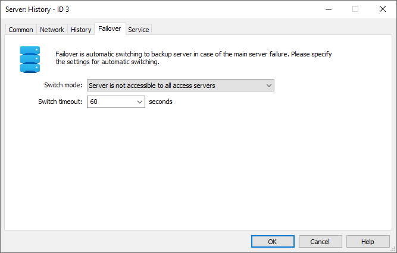

[🏠 Document Start](../../../../README.md) / [MetaTrader 5 Trading Platform](../../../../MetaTrader-5-Trading-Platform.md) / [Platform Setup](../../../Platform-Setup.md) / [Network cluster](../../Network-cluster.md) / [Configuring Servers](../Configuring-Servers.md) / History Server

[Previous](Trade-Server.md) | [Next](Access-Server.md)

# History Server (#history-server)

History server is a part of the online trading platform. It is used for:

  * Receiving, filtering and packing price and news data
  * Storing and providing price history as minute bars and ticks
  * Storing and providing the price thread
  * Receiving, checking and distributing Live Updates among MetaTrader 5 servers

Information that comes from [data feeds](../../Data-Feeds.md) is passed to the history server and is then resent to [access servers](Access-Server.md) and [trade servers](Trade-Server.md). Settings on the ["Common" (#common)](../Configuring-Servers.md#common), ["Network" (#network)](../Configuring-Servers.md#network) and ["Service" (#service)](../Configuring-Servers.md#service) tabs are the same for all the server types. The history server setup window contains one more tab - History.

## History (#history)

The following parameters are set up on this tab:

  * Datafeeds timeout — the period of time (in seconds), within which a server is waiting for history data (quotes and news) from a [data feed](../../Data-Feeds.md) or a [gateway](../../Gateways.md). If no data have been received within this period, the server switches over to another data feed. Minimum timeout is 10 seconds. Changing this setting requires a server restart.
  * Maximum news — the maximum number of news messages that can be stored on the history server.

## Failover (#backup)

Here you can specify the parameters of the [automatic switching to the backup server (#auto)](../../../Platform-Components/Backup-Server/Switching-to.md#auto) in case the current one fails. The necessity to switch to the backup server is defined by the monitoring ("witness") servers. The backup server itself and access servers (with [monitoring mode (#witness)](Access-Server.md#witness) enabled) act as the monitoring ones. The backup server monitors the availability of the master server in real time mode and checks if it is available for the access servers as well.

  * Switch mode — mode of switching to the backup server:

  *     * Off — automatic switch to the backup server is disabled.
    * Server is not accessible to most access servers — the number of the monitoring servers unable to access the master server should exceed the ones able to access it at least by one for the switch to occur.
    * Server is not accessible to all access servers — the master server should be unavailable for all monitoring servers for the switch to occur.
  * Switch timeout — here you can specify the time (in seconds) during which the server should be unavailable for monitoring servers to start switching to the back-up server. Also, after this time period, other platform components start their attempts to connect to the [access points (#network)](../Configuring-Servers.md#network) of the current backup server (trying to connect to it as to the main one).

> More detailed information about switching to the backup server can be found in the [separate section (#auto)](../../../Platform-Components/Backup-Server/Switching-to.md#auto).

To complete creation or editing of a history server, press "OK". If you press "Cancel", the window will be closed, while changes won't be saved.
