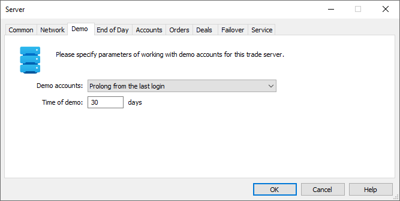
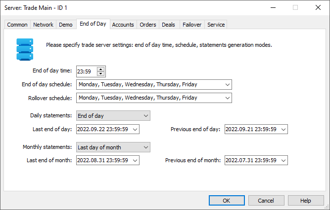
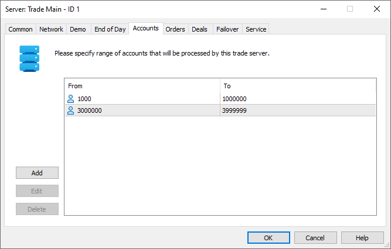
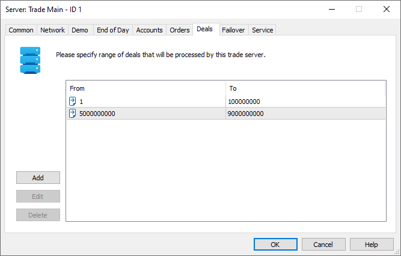

[🏠 Document Start](../../../../README.md) / [MetaTrader 5 Trading Platform](../../../../MetaTrader-5-Trading-Platform.md) / [Platform Setup](../../../Platform-Setup.md) / [Network cluster](../../Network-cluster.md) / [Configuring Servers](../Configuring-Servers.md) / Trade Server

[Previous](../Configuring-Servers.md) | [Next](History-Server.md)

# Trading Server (#trading-server)

There are two types of trade servers in the system - the main one and all other additional ones. Plus to trade server functions, the main server implements system configuration management and management of other servers. The trade server performs the following functions:

  * Storage and management of client records
  * Authentication and authorization of client connections
  * Storage and management of trade records
  * Checking, management and execution of trade requests
  * Management of the internal mailing system

The procedure of setting up the main and other trade servers are similar. Settings on the ["Common" (#common)](../Configuring-Servers.md#common), ["Network" (#network)](../Configuring-Servers.md#network) and ["Service" (#service)](../Configuring-Servers.md#service) tabs are the same for all server types. The trade server setup window contains four more tabs.

  * Only one main trade server can exist in a system.
  * The installation of the main and additional trade servers is described in the [corresponding section](../../../Platform-Installation/Installation.md).
  * There is a number of [special features (#trade)](../../../Platform-Installation/Installation.md#trade) of adding secondary trade servers to the system.

  
---  
  

## Demo (#demo)

This tab is intended for setting up the parameters of working with demo account on the trade server:

  * Demo accounts — type of working with demo accounts. Three variants are available:
    * Disable — opening new demo accounts via client terminals will be impossible on this server. At that demo accounts can still be opened via administrator and manager terminals and via API.
    * Prolong from the last login — with each connection to a demo account, its expiration date will be increased by the time specified in "Time of demo" if the account hasn't expired by the time of connection. Only connections using the Master password (not the Investor one) are considered.
    * With fixed period — demo accounts will be active for the time period specified in "Time of demo";
  * Time of demo — number of days when the demo accounts opened on this server will be active.

> If you disable opening new demo accounts (select the option "Disable""), then demo accounts opened earlier will work according to the option "Prolong from the last login".

Expired demo accounts are deleted every Sunday [during optimization (#optimization)](../Configuring-Servers.md#optimization). The following entries appear in the trade server journal during deletion:

2017.06.04 03:57:02.626 ClientBase prepare demo accounts for clean   
2017.06.04 03:57:02.626 ClientBase '1008': demo account added to clean [80 days]   
2017.06.04 03:57:02.626 ClientBase prepare demo accounts for clean finished [1 users]   
2017.06.04 03:57:02.626 TradeCenter demo clean started [1 logins]   
2017.06.04 03:57:02.626 TradeCenter demo clean finished  
---  
  
The deletion of a demo account also deletes its trading operations.

## End of Day (#eod)

This tab is intended for setting up the end of day time and the generation of daily and monthly statements.

  * End of day time — time of the trading day end, when the generation of [statements (#reports)](../../Groups/Group-Settings.md#reports), charging of [swaps (#swaps)](../../Groups/Group-Settings.md#swaps), [interest rate (#interest)](../../Groups/Group-Settings.md#interest) and [commissions](../../Groups/Commission-Settings.md) is performed. The execution of the procedures is started on the 59th second of the specified time.
  * End of day schedule — in this field, specify days when the operations connected with the end of a trading day are performed. The generation of reports, charging of swaps, interest rate and commissions is performed on these days only. This option does not affect the generation of monthly statements.
  * Rollover schedule — by default, [rollover calculations](../../Symbols/Symbol-Settings/Swaps.md) are not performed on Saturday and Sunday (even if these days are specified in the "End of day" parameter). When work days are shifted to weekend, you may adjust the operation of the trading platform accordingly. For example, if a work day is shifted from Monday to Saturday, you can enable rollover calculation on Saturday. However, note that traders' rollover will be calculated eight times for that week, instead of seven: five simple swaps and one three-day swap. To compensate for the extra rollover, explicitly disable rollover calculation on Monday. Otherwise, rollover will be charged even if you set up a [holiday](../../Holidays.md) on that day and disable trading in the [server schedule](../../Time.md). On the next day (Tuesday), rollover settings should be reset to the original state.  
In addition to enabling rollover calculation, make sure to enable "End of Day" for that day. Otherwise, rollover will not be charged.
  * Daily statements — time when daily statements are generated: at the end of a trade day (before swaps, interest rate and commissions are charged) or at the beginning of a trade day (after swaps, interest rate and commissions are charged).
  * Last end of day — the date and time of the last end of day. When generating the last daily statement, the server uses trading data beginning from the specified date.
  * Previous end of day — the date and time of the previous end of day. Daily statements include a client's trading status for the previous trading day. The server uses the specified date to calculate it.
  * Monthly statements — month closing date on which the monthly reports should be generated: the last day of the current month of the first day of the next month.
  * Last end of month — the date and time of the last end of month. When generating the last monthly statement, the server uses trading data beginning from the specified date.
  * Previous end of month — the date and time of the previous end of month. Daily statements include a client's trading status for the previous trading month. The server uses the specified date to calculate it.

> It is strongly not recommended to change the dates of the last and the previous ends of day and month. Edit them only in case of emergency (for example, if the server emergency shutdown during the generation of daily/monthly statements has led to incorrect dates).

### The order of end-of-day/month service operations (#the-order-of-end-of-daymonth-service-operations)

During the end-of-day, clients and managers are forbidden to perform any trading operations, including balance operations. On any attempt, the server will return the "Market closed" error.

The order of service operations depends on the report generation mode: at the end or at the beginning of the day. The performed actions also depend on whether the end of the trading day (as determined by the "End of day" parameter) and end of month (as determined by the actual end of month) fall on this day.

When generating reports at the end of the day:

Condition | Operation  
---|---  
If there is end of the trading day | 1\. Beginning of the 'end of day' at the time specified in the "[End of day (#end-of-day)](Trade-Server.md#end-of-day)" parameter under server settings  
If there is end of the month | 2\. Beginning of the 'end of month' at the time specified in the "[End of day (#end-of-day)](Trade-Server.md#end-of-day)" parameter under server settings  
| 3\. Beginning of operations for each group:  
If there is end of the trading day | 4\. Calculation and settlement of commissions (including agent commission) with the "[Daily (#charge)](../../Groups/Commission-Settings.md#charge)" calculation mode  
If there is end of the month | 5\. Calculation and settlement of commissions (including agent commission) with the "[Monthly (#charge)](../../Groups/Commission-Settings.md#charge)" calculation mode  
If there is end of the trading day | 6\. Calculation of interest on available funds and saving them in the client record  
If there is end of the month | 7\. Calculation and of the accumulated interest on available funds and depositing it to the balance  
If there is end of the trading day | 8\. Generation of daily reports  
If there is end of the trading day | 9\. Updating of the previous day balances (used in daily/monthly reports)  
If there is end of the month | 10\. Generation of monthly reports  
If there is end of the month | 11\. Update of previous month balances (used in daily/monthly reports)  
If there is end of the trading day | 12\. Calculation of swaps  
| 13\. End of operations for each group  
If there is end of the trading day | 14\. End of "end of day"  
If there is end of the month | 15\. End of "end of month"  
  
When generating reports at the beginning of the day:

Condition | Operation  
---|---  
If there is end of the trading day | 1\. Beginning of the 'end of day' at the time specified in the "[End of day (#end-of-day)](Trade-Server.md#end-of-day)" parameter under server settings  
If there is end of the month | 2\. Beginning of the 'end of month' at the time specified in the "[End of day (#end-of-day)](Trade-Server.md#end-of-day)" parameter under server settings  
| 3\. Beginning of operations for each group:  
If there is end of the trading day | 4\. Calculation and settlement of commissions (including agent commission) with the "[Daily (#charge)](../../Groups/Commission-Settings.md#charge)" calculation mode  
If there is end of the month | 5\. Calculation and settlement of commissions (including agent commission) with the "[Monthly (#charge)](../../Groups/Commission-Settings.md#charge)" calculation mode  
If there is end of the trading day | 6\. Calculation of interest on available funds and saving them in the client record  
If there is end of the month | 7\. Calculation and of the accumulated interest on available funds and depositing it to the balance  
If there is end of the trading day | 8\. Calculation of swaps  
If there is end of the trading day | 9\. Generation of daily reports  
If there is end of the trading day | 10\. Updating of the previous day balances (used in daily/monthly reports)  
If there is end of the month | 11\. Generation of monthly reports  
If there is end of the month | 12\. Update of previous month balances (used in daily/monthly reports)  
| 13\. End of operations for each group  
If there is end of the trading day | 14\. End of "end of day"  
If there is end of the month | 15\. End of "end of month"  
  

## Accounts (#accounts)

Here you set up the range from which logins will be generated at the opening of new accounts. In order to add a range, press "Add". After that a new line will appear in the window. In "From" column, specify the first account that will be serviced in this range, and specify the last one in "To". In order to modify an already existing range, double click on the necessary field or select it and press "Edit". To delete a selected range, press "Delete".

  * Account ranges on different trade servers must not coincide. We strongly recommend to strictly plan the distribution of accounts between servers.
  * The range indication is obligatory. Otherwise, it will be impossible to create accounts on the server.

  * The last value of the range must be greater by 1 000 than the highest number of account already allocated on the server.

  * The ranges should not be changed during trading time. After changing them, restart the platform.

  
---  
  

## Orders (#orders)

Here you should set up the range, from which numbers of orders set on this trade server will be allocated. In order to add a range, press "Add". After that, a new line will appear in the window. In "From" column, specify the first order that will be serviced in this range, and specify the last one in "To". In order to modify an already existing range, double click on the necessary field or select it and press "Edit". To delete a selected range, press "Delete".

  * Orders ranges on different trade servers must not coincide. We strongly recommend to strictly plan the distribution of orders between servers.
  * The range indication is obligatory. Otherwise, it will be impossible to set orders on the server.

  * The last value of the range must be greater by 1 000 than the highest number of order already placed on the server.

  * The range or orders is also used for assigning tickets to [positions](../../Positions.md).

  * The ranges should not be be changed during trading time. After changing them, restart the platform.

  
---  
  

## Deals (#deals)

Here you should set up the range, from which numbers of deals executed on this trade server will be set. In order to add a range, press "Add". After that, a new line will appear in the window. In "From" column, specify the first deal that will be serviced in this range, and specify the last one in "To". In order to modify an already existing range, double click on the necessary field or select it and press "Edit". To delete a selected range, press "Delete".

  * Deals ranges on different trade servers must not coincide. We strongly recommend to strictly plan the distribution of orders between servers.
  * The deals range indication is obligatory. Otherwise, it will be impossible to set orders on the server.

  * The last value of the range must be greater by 1 000 than the highest number of deal already performed on the server.

  * The ranges should not be be changed during trading time. After changing them, restart the platform.

  
---  
  

## Failover (#backup)

Here you can specify the parameters of the [automatic switching to the backup server (#auto)](../../../Platform-Components/Backup-Server/Switching-to.md#auto) in case the current one fails. The necessity to switch to the backup server is defined by the monitoring ("witness") servers. The backup server itself and access servers (with [monitoring mode (#witness)](Access-Server.md#witness) enabled) act as the monitoring ones. The backup server monitors the availability of the master server in real time mode and checks if it is available for the access servers as well.

  * Switch mode — mode of switching to the backup server:
    * Off — automatic switch to the backup server is disabled.
    * Server is not accessible to most access servers — the number of the monitoring servers unable to access the master server should exceed the ones able to access it at least by one for the switch to occur.
    * Server is not accessible to all access servers — the master server should be unavailable for all monitoring servers for the switch to occur.
  * Switch timeout — here you can specify the time (in seconds) during which the server should be unavailable for monitoring servers to start switching to the back-up server. Also, after this time period, other platform components start their attempts to connect to the [access points (#network)](../Configuring-Servers.md#network) of the current backup server (trying to connect to it as to the main one).

> More detailed information about switching to the backup server can be found in the [separate section (#auto)](../../../Platform-Components/Backup-Server/Switching-to.md#auto).

To complete creating or editing a trade server press "OK". If you press "Cancel", the window will be closed, while settings will not be saved.
