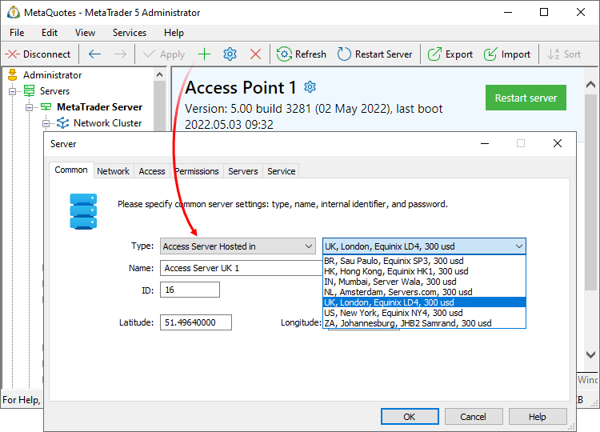

[🏠 Document Start](../../../README.md) / [MetaTrader 5 Trading Platform](../../../MetaTrader-5-Trading-Platform.md) / [Platform Setup](../../Platform-Setup.md) / [Network cluster](../Network-cluster.md) / Hosted Access Servers

[Previous](Configuring-Servers/Backup-Server.md) | [Next](Restarting-and-Stopping-Servers.md)

# Secure MetaTrader 5 Access Server hosting from MetaQuotes

Access points in regions with high trading activity can improve your customer service quality by ensuring fast and reliable connection to the platform. You can deploy access servers easily in a much more cost-efficient manner by ordering their hosting from our company.

We have been providing [VPS for traders](https://www.mql5.com/en/vps) over many years, gaining much experience along the way. The huge popularity of the service (thousands of orders every month) confirms the validity of our approach, which is focused on simple renting and hosting management. The service is available directly from the client terminals, while the purchase and environment migration take just a few clicks. Traders do not have to worry about anything else.

The same simple and convenient solution is available to brokerage companies.

We have already made all the necessary arrangements and have signed contracts with the largest data centers. You can place your order via the Administrator terminal. Your traders will be able to connect to your platform through a new access point within 30 seconds.

## Service advantages

  * Hi-end powerful servers with 10 Gbps transfer speeds.
  * The auto launch of a new access point takes about 10 seconds.
  * Monthly subscription which can be terminated any time. You do not need to plan things ahead and purchase the hosting service for the period of one year or longer. If the activity of your traders shifts from one region to another, just cancel the previously ordered hosting and deploy a new one as needed.
  * No need for the previous global server rent experience. We provide a wide range of data centers in geographically important locations. Large brokerage companies and banks rent their servers in the same data centers.
  * No need to worry about server maintenance. We deal with all technicalities.

## Your data is secured

We offer the hosting of [Access Servers](../../Platform-Components/Access-Server.md) which serve as the access points of your platform. Their objective is to maintain client connections:

  * Handling connections, packing and forwarding authorization requests to a trade server.
  * Controlling the activity of connections to protect the server from attacks and overloads.
  * Caching price and news data to decrease the load on the history server.

The access servers store no data containing trading account passwords, keys or trades of any form. All account information (personal data, trading operations, transaction histories, etc.) is encrypted on the side of the client terminals and broadcast by the access servers to the trade server as is. The data is decoded only on the trade server side.

Therefore, the access server hosting is completely secure in terms of broker data access.

## Our equipment

The deployment is performed via our own equipment in Equinix LD4 (London), Equinix NY4 (New York), Equinix HK1 (Hong Kong) and Servers.com (Amsterdam) data centers. All servers are up-to-date and feature NVMe disks.

Since access servers maintain client connections, the network speed is of utmost importance. In this regard, our hosting provides great possibilities — up to 10 Gbps.

IPv4 and IPv6 addresses are allocated.

> You can view server configuration details on the cluster map in the "Hosted Access Servers" section. We do not provide remote access to rented servers, since we fully undertake all maintenance.

## How to deploy an access server

Use the [interactive cluster map (#map)](Monitor.md#map) to view traders' activity by region, as well as the location of your access servers along with the network latency data. You can quickly detect the regions where additional access points are necessary.

After analyzing your infrastructure, order the hosting service directly via the Administrator terminal. Add a new access server of the 'Access Server Hosted in US/UK/NL/HK' type.

You can select the required location for your server during the purchase process. Currently, we offer deployments in the following data centers:

  * Equinix LD4 — London, UK
  * Equinix NY4 — New York, USA
  * Equinix HK1 — Hong Kong
  * Equinix SP3 — São Paulo, Brazil
  * Servers.com AMS1 — Amsterdam, Netherlands
  * Server Wala — Mumbai, India
  * JHB2 Samrand — Johannesburg, South Africa

Once you select a location on the Network tab, IPv4 and IPv6 addresses of the future access server will be added automatically. Other settings are specified just like for ordinary [access servers](Configuring-Servers/Access-Server.md). Save changes and a new server will be allocated in the selected data center. The component connects to your cluster without additional configuration. The allow rule for the allocated IP address is automatically added to the Windows firewall on trade and history servers.

You will be able to use the hosting capabilities almost immediately. Your traders will be able to connect to your platform through a new access point within 30 seconds.

> Make sure that the correct [network settings (#network-connection)](../../Platform-Installation/System-Preparation.md#network-connection) are used on the machine where the main trade server is installed. Otherwise, the access server will not be able to connect to the cluster.

## Try MetaTrader 5 Access Server — the first week is free of charge

The cost of hosting one access server is USD 300 per month. No minimal rental period of six months or a year, which is a typical requirement in case of large data centers, is required. You can cancel your subscription at any time.

Try the service free of charge for a week and establish its quality and efficiency. Order the hosting service in the Administrator terminal and obtain a trial subscription. No need to pay for the service if you change your mind during this one-week period.
