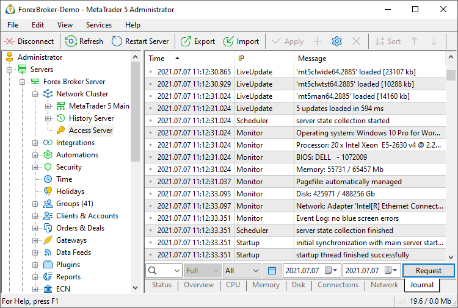

[🏠 Document Start](../../../README.md) / [MetaTrader 5 Trading Platform](../../../MetaTrader-5-Trading-Platform.md) / [Platform Setup](../../Platform-Setup.md) / [Network cluster](../Network-cluster.md) / Journal

[Previous](Monitor.md) | [Next](../Integrations.md)

# Journal (#journal)

On this tab you can view logs of work of the platform components.

In the journal, entries are marked by different icons:

  *  — error message.

  *  — critical error message.

  *  — warning.
  *  — information message.
  *  — day separator in the journal. In the IP field of such entries the total size of logs generated for the day is shown.

Log files for all servers except the backup server can be found at [server installation directory]\logs. The backup server logs are available at [backup server installation directory]\logs\mtbackup.

> Different types of errors returned by the server are described in the [separate section](../../Platform-Components/Trade-Server/Return-Errors.md).

## Requesting Entries (#request)

You can also request only some of journal entries. In order to do this, enter the searched word in the search field. Additionally you can specify the time period and type of log request:

  * Full — all types of journal entries;
  * Without logins — all messages except the information about the connections of users to a server;
  * Errors only — only messages about errors.

You can also select the type of events:

  * All — all types of events, except LiveUpdate;
  * Configuration — changes in the server configuration;
  * System — system events;
  * Network — events connected with the network activity;
  * History — events connected with [history data](../1-Minute-History-Charts.md);
  * Accounts — events connected with [accounts](../Accounts.md) on the server;
  * Trades — events connected with trade operations on the server;
  * API — events connected with work via API;
  * LiveUpdate — events connected with [update](../Live-Update.md) of the platform components;
  * Report Mailer — events connected with sending [daily reports (#reports)](../Groups/Group-Settings.md#reports) via e-mail;
  * Failover — events connected with [automatic switching to a backup server (#auto)](../../Platform-Components/Backup-Server/Switching-to.md#auto).

  * Please note that the request of logs is performed only by the server that is chosen in the tree to the left.
  * The LiveUpdate logs are not displayed when choosing the "All" type of events, because they are stored in a separate file (mt5srvupdater.log).
  * For a more accurate request of journal entries, use [keywords (#keywords)](Journal.md#keywords).

  
---  
  
To receive logs press "Request" or execute the same command of the [context menu (#context)](Journal.md#context). After that the logs will be displayed as a table with the following fields:

  * Time — time when the event occurred;
  * IP — IP address, with which this event id connected;
  * Message — description of the event.

> If the journal file was manually edited on the server, then the first edited entry and all coming after it will be highlighted red.

## Request Language (#request-language)

To request entries from the [journal](Journal.md) of the server operation, keywords and logic operators are used. It will help to easily find the required information about different aspects of the platform functioning.

### Keywords (#keywords)

To analyze the server journal use any words and word phrases that can be found in server logs. You should remember that if you request the full journal without the request line, you will not receive the whole server journal, because the volume of given information is limited (approximately up to 30000 lines of the server journal).

To analyze separate situations use the following key words:

  * Startup — information about server initialization and restart;
  * Exit — information about server stop;
  * Synchronization — [synchronization](../Synchronization.md) of history. Possible errors: no connection with the server you want to synchronize with;
  * ClientBase — information on work with the base of [accounts](../Accounts.md). Possible errors: incorrect base header, error writing/reading from disk, not enough memory;
  * History — information on work with history data of a symbol. Possible errors: incorrect base header, error writing/reading from disk, incorrect quotes in the base;
  * datafeed or 'Datafeed name' — activation and work of [datafeeds](../Data-Feeds.md). Possible errors: error creating feeder, incorrect timeout stop, error reading data from the feeder;
  * Filter — filtering of quotes (quotes no passed to the server);
  * Mail — work with the [mail base](../Mailbox.md). Possible errors: incorrect base header, error writing/reading from disk, not enough memory;
  * Monitor — performance measuring and work with the [monitoring](Monitor.md) base. Possible errors: incorrect base header, impossibility to obtain information about the PC performance;
  * News — [news base](../../MetaTrader-5-Administrator/User-Interface/Toolbox/News.md). Possible errors: incorrect header or base version;
  * Access, Common, Feeders, Groups, Managers, SymbolGroups, HistorySync, Holidays — files of corresponding server configurations. Possible errors: read/write error;
  * Network — [server](../Network-cluster.md) operation. Possible errors: port already busy;
  * LiveUpdate — work of the [LiveUpdate](../Live-Update.md) system and its base;
  * block — block setting and removing by [antiflood control (#antiflood)](Configuring-Servers/Access-Server.md#antiflood);
  * '...' — to analyze actions on a certain account, specify the account number in single quotes. For example: '12345';
  * #... — to analyze actions on a certain [order](../Orders.md) or [deal](../Deals.md), specify this order with symbol "#". For example: #111222.
  * login — connection with an account to the server. These entries contain information about connection: time, type (client, manager, web, etc.), terminal build and other details.
  * logout — disconnection of an account from the server.

### Logical Operators (#logical-operators)

You can specify key words joined by logical operators in the request line. The search line supports the following logical operators:

  * | (or) — logical operator OR allows selecting journal lines that contain either the first or the second key word;
  * & (and) — logical operator AND allows selecting only those journal lines that contain both the first and the second key words. A space between key words is considered logical operator AND;
  * ^ (-, not) — logical operator of exclusion NOT allows selecting journal lines that do not contain the specified key word.

The possibility to create a precise request line using logical operators allows quickly and efficiently select required logs. For example, line "'5'&login" allows selecting the journal entries about the logging in of a manager with login 5.

> The request is case sensitive. For example, search by "Session" and "session" will give different results.

## Context Menu (#context)

The journal context menu contains the following commands:

  *  Request — request logs;
  * Search — using this submenu, you can easily form new requests on the basis of an already found entry in the journal:

  *  Account — copy an account from the found entry to the request field of the journal;
  *  Order — copy an order ticket from the found entry to the request field of the journal;
  *  Deal — copy a deal ticket from the found entry to the request field of the journal
  *  Symbol — copy a symbol name from the found entry to the request field of the journal;
  *  Computer ID — copy a unique computer identifier (CID) the found entry to the request field of the journal;
  *  IP — copy an IP address the found entry to the request field of the journal.
  * Copy As — this command allows copying information from the journal to the clipboard. There are three variants of how to save it: " As Lines", "As List of Logins", "As List of IP Addresses";
  * Firewall — enables the quick addition of [firewall rules](../Security/Firewall.md) without leaving the journal page. Select one or more log lines containing the required addresses in the "IP" field. For example, these can be logs about anti-flood control activation. Next, select "Allow" or "Block" in the menu. This will add a new record containing the selected addresses to the end of the list of firewall rules. The "Allow" command adds rules with the "Permit always" type.  
When adding the rule, the system searches for the selected addresses in existing rules. If the address to be blocked (allowed) has already been blocked (or allowed), a new rule is not created.
  * Export — export the requested logs in a CSV or HTML file;
  *  Find — search through requested logs;
  * Auto arrange — If this option is enabled, the size of columns is selected automatically;
  * Grid — show/hide grid to separate fields;
  * Columns — show/hide columns of IP and Message in the Journal.

