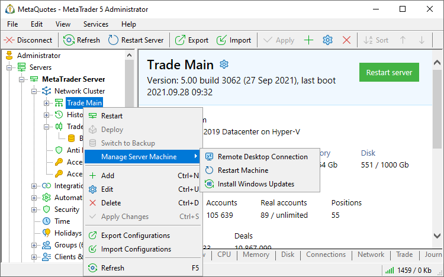
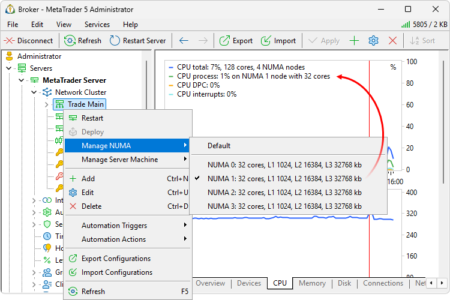
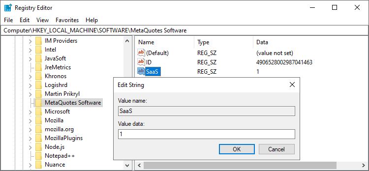
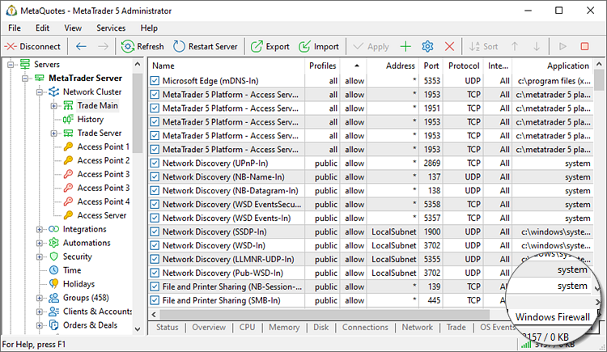
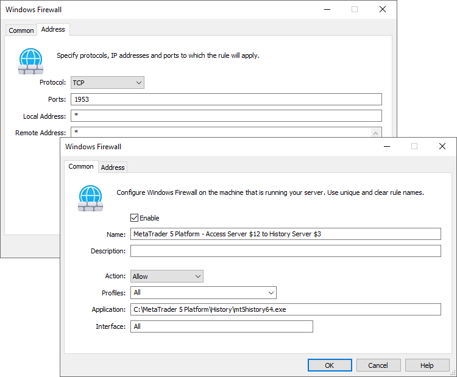
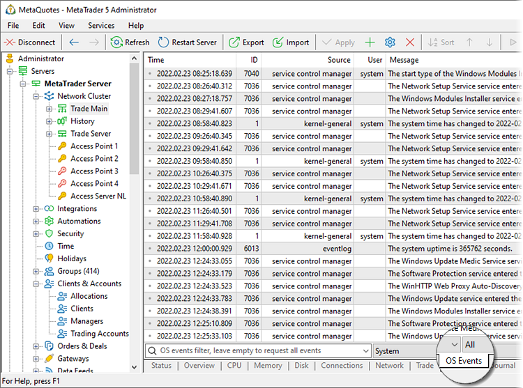
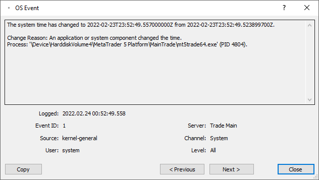
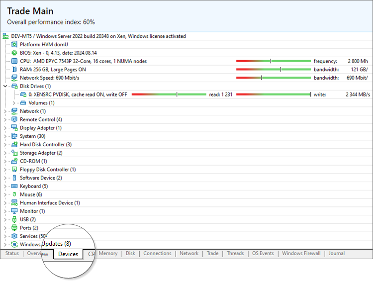
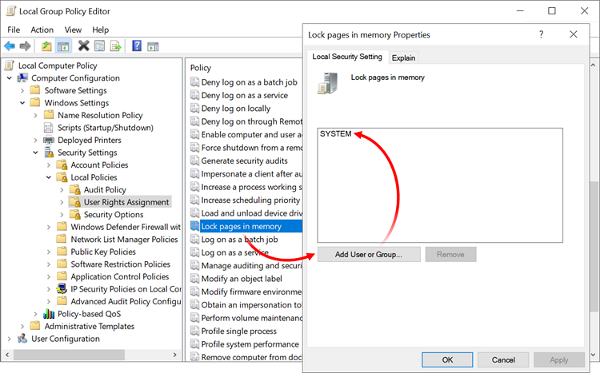

[🏠 Document Start](../../../README.md) / [MetaTrader 5 Trading Platform](../../../MetaTrader-5-Trading-Platform.md) / [Platform Setup](../../Platform-Setup.md) / [Network cluster](../Network-cluster.md) / Managing Machines

[Previous](Restarting-and-Stopping-Servers.md) | [Next](Status.md)

# Managing Cluster Machines (#managing-cluster-machines)

The Administrator terminals enables convenient management of the machines on which the trading platform servers are running. With these commands, you do not need to connect to the server machine manually in order to install updates or to restart it. Use the relevant command from the server menu:

If computer drives are [BitLocker-protected](https://docs.microsoft.com/en-us/windows/security/information-protection/bitlocker/bitlocker-overview), a reboot requires a password to unlock them. To enable automated system restart after the installation of updates, BitLocker protection is suspended until the next system restart:

  * Protection is disabled before installing the updates
  * The system installs the updates
  * The computer is restarted without entering the BitLocker password
  * BitLocker protection is immediately enabled

A similar process is applied during the execution of the computer restart command.

Another command enables quick connection to the server machine via remote desktop. To connect, specify only the password, while the system will automatically substitute the required IP address.

## Binding server process to a specific NUMA node (#numa)

You can bind the process of a server to a specific [NUMA node](https://en.wikipedia.org/wiki/Non-uniform_memory_access). This allows for more efficient resource management and can provide a performance boost.

  * Running an application on a specific node minimizes memory access latency, as most or all data resides in that node's local memory. Additionally, load and latency are reduced due to lower inter-node traffic.
  * Processors within the same node typically share an L3 cache, which improves performance for multi-threaded tasks with local data.
  * Reduces resource contention (CPU and memory) with other processes running on different nodes.
  * As system load and the number of cluster components increase, servers can be distributed across different nodes, enabling effective scaling.
  * Minimizes external influences (such as thread migrations and cache misses), resulting in more stable and predictable performance.
  * Knowing that the application is tied to a specific node, the operating system can more effectively allocate threads and manage memory without forcing the application to suffer from node migration.

To bind a server to a node, use its context menu:

After binding, restart the server for the changes to take effect. Then, in the CPU section, confirm that the server has started on the selected node.

## Security (#saas)

A separate manager account [permission (#permissions)](../Managers.md#permissions) regulates access to computer administration commands — "Manage server machines".

For access servers, you can additionally set a physical restriction on administration access.

If your company policy or your hosting provider's policy do not allow access to update installations or reboots, you can disable these options at the machine level via the registry. Use the SaaS string key with the path "HKEY_LOCAL_MACHINE\SOFTWARE\MetaQuotes Software" and set it to a non-zero value. In this case, even if the relevant permissions are granted in the platform, the manager will not be able to use these commands.

Restart a computer after adding a key or changing its value.

SaaS key also disables [firewall management (#firewall)](Managing-Machines.md#firewall) and [viewing event logs (#os-events)](Managing-Machines.md#os-events).

## Managing operating system firewall (#firewall)

All platform servers feature the ability to remotely manage the operating system firewall on the computer they are installed on.

Administrators do not need to remotely connect to the computer to view and edit the list of current incoming rules. Simply open the Windows Firewall section in the network cluster.

To create a new rule, click  on the toolbar. To change the existing rule, double-click on it in the list.

The standard rule parameters are available for a setup:

  * Enable — if the rule is currently not needed but may be of use later, it can be temporarily disabled.
  * Name — rules should have concise and comprehensible names. All names should be unique.
  * Description — optional parameter allowing you to add some details about the rule purpose.
  * Action — action applied to a specified application\address\port: Allow or Block.
  * Profiles — system network profiles the rule is to be applied to: Domain, Private, Public. All profiles are enabled by default.
  * Application — path to the application the rule is to be applied to.
  * Interface — type of the connection the rule is to be applied to: Remote access, Wireless, LAN. All profiles are enabled by default.

In the address section, specify:

  * Protocol — the protocol the rule is to be applied to: TCP, UPD, etc.
  * Ports — the ports the rule is to be applied to.
  * Local Address — local addresses and networks the rule is to be applied to.
  * Remote Address — IP addresses and networks the rule is to be applied to. Each entry should be placed on a separate string with no comma separation.

### Bulk rule configuration (#bulk-rule-configuration)

The section context menu features the commands for quick bulk rule setup:

  * Allow \ Fix all — perform all actions described below.
  * Allow \ IPv4 functionality — enable the rules for handling IPv4 connections.
  * Allow \ IPv6 functionality — enable the rules for handling IPv6 connections.
  * Allow \ Remote Desktop — enable the rules allowing remote connection.
  * Allow \ MetaTrader 5 Cluster — when installing the platform, as well as when installing separate servers, the rules allowing the connection of all components to one another are added to the Windows firewall rules. For example, the incoming allowing rules for all the remaining components are created on the main trade server machine. The MetaTrader 5 Cluster command checks the presence of all rules for the cluster on the machine and creates them anew if necessary.
  * Disallow \ Useless OS rules — disable the rules not needed for the cluster operation.

  * The tool works only with incoming firewall rules. Outgoing rules cannot be viewed and edited.
  * An account should have the "Connect via MetaTrader 5 Administrator" and "Manage server machines" permissions to access the Windows firewall section. The rules cannot be managed on machines with the "[SaaS (#saas)](Managing-Machines.md#saas)" key.

  
---  
  

## Operating system events (#os-events)

All platform servers allow the request of the operating system event logs from the computer on which the servers are installed.

You can monitor and handle arising issues without accessing the computer via remote access solutions. System events can be viewed directly from the Administrator terminal, which offers a more convenient presentation form than the standard Windows interface. The terminal provides the full description of events, with some of the unnecessary details disabled.

Select a server, go to the "OS Events" section and execute the following request:

The requested events can be filtered:

  * By contents — type the desired phrase
  * By level, at which the event occurred (channel):

  * System — the events generated by Windows components, for example failed attempts to launch services or to initialize drivers
  * Application — program operation events and errors
  * Security — system security events (login, changes in folder access permissions, etc.)
  * Installation — events related to the installation of applications
  * By event importance (descending):

  * Critical
  * Errors
  * Warning
  * Information
  * Details
  * By date

To view event details, click on the event line:

  * To access the OS events section, the account needs the following [permissions (#permissions)](../Managers.md#permissions): "Connect via MetaTrader 5 Administrator" and "Access server logs".
  * System events cannot be viewed on machines with the ["SaaS" key (#saas)](Managing-Machines.md#saas).

  
---  
  

## Devices (#devices)

The platform collects detailed information about cluster server computers to help administrators keep the infrastructure up to date. In the new "Devices" section, we have created an analogue of the Windows task manager, adapted for maximum utility and optimized by removing unnecessary information.

The section provides the following details:

  * Information about installed devices, drivers, and settings that are critical to performance.
  * Processor, disks and RAM performance metrics.
  * Availability of the [Large Page (#large-pages)](Managing-Machines.md#large-pages) technology for RAM.
  * Available Windows updates that can be [installed with one command](Managing-Machines.md).
  * Use of a virtual machine.

## Large Pages (#large-pages)

The platform [Large Pages](https://learn.microsoft.com/en-us/windows/win32/memory/large-page-support) for memory management in Windows. This technology has been introduced to optimize memory management on Windows. It reduces overhead associated with memory management in systems requiring large data volumes, including trading platforms.

Operating systems typically divide physical memory into small blocks called [pages](https://en.wikipedia.org/wiki/Page_(computer_memory)), usually 4 KB in size. When a process needs memory, the OS allocates several pages and maintains a Page Table that maps [virtual addresses](https://en.wikipedia.org/wiki/Virtual_memory) used by the process to physical addresses in RAM.

Each time a process accesses memory, the system translates the virtual address to a physical one using the Page Table. For processes that use large amounts of memory, the Page Table can become large and frequently accessed, adding extra load to the processor.

Large Pages technology allocates larger memory blocks instead of the standard 4 KB pages. This reduces the number of entries in the Page Table and decreases the frequency of accesses to it.

### How to Enable Large Pages (#how-to-enable-large-pages)

Large Pages technology is memory-intensive. It is recommended to enable it only if you have at least 32 GB of RAM. Ensure you have sufficient memory for the platform operations.

  * Open the Command Prompt and type gpedit.msc
  * In the window that opens, navigate to "Local Computer Policy \ Computer Configuration \ Windows Settings \ Security Settings \ Local Policies \ User Rights Assignment".
  * In the list of policies, find 'Lock pages in memory' and add access to it for the SYSTEM user.
  * Save your settings and restart your computer.
  * Verify that the technology is enabled by checking the "[Devices (#devices)](Managing-Machines.md#devices)" section in the server settings in MetaTrader 5 Administrator. The status will be displayed in the RAM property.

For further details about the Large Pages and their configurations, please refer to the article at <https://mahdytech.com/large-pages-how-when/>.
