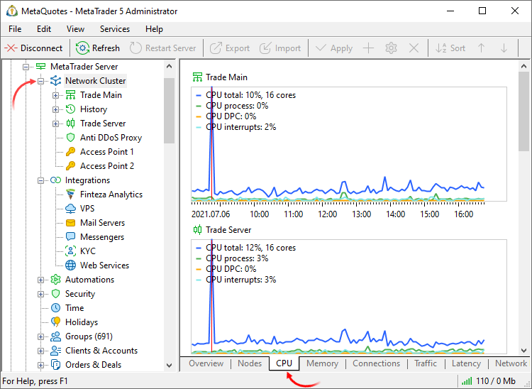
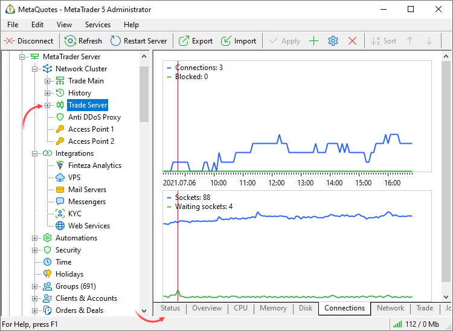
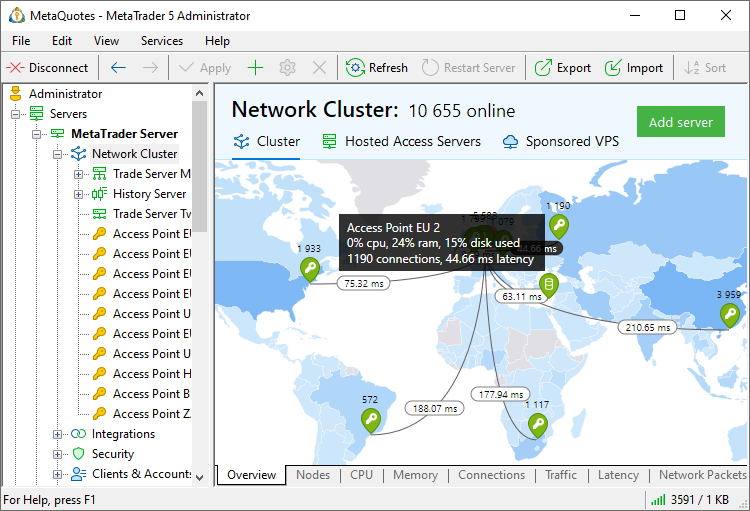
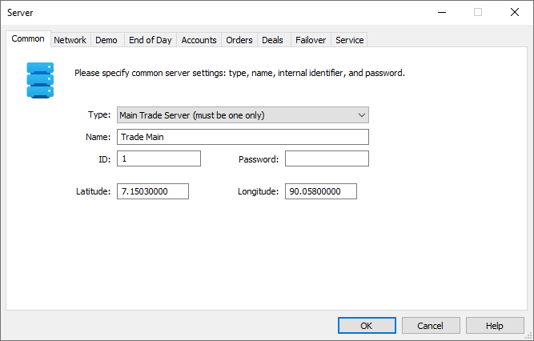
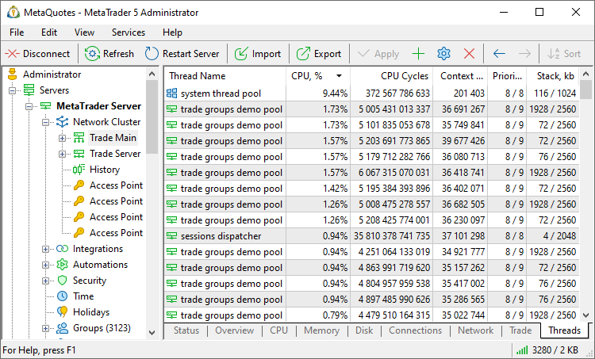
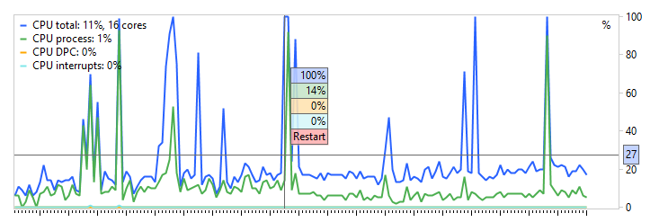

[🏠 Document Start](../../../README.md) / [MetaTrader 5 Trading Platform](../../../MetaTrader-5-Trading-Platform.md) / [Platform Setup](../../Platform-Setup.md) / [Network cluster](../Network-cluster.md) / Monitor

[Previous](Status.md) | [Next](Journal.md)

# Monitoring (#monitoring)

Each minute, the platform measures multiple parameters of its own operation and maintains the performance database allowing an administrator to quickly assess the status of the cluster components and respond to potential issues.

The data is conveniently presented as graphs for the entire cluster and each platform component separately.

To see the data on the entire platform, select the "Network Cluster" and then one of the tabs: CPU, Traffic, Network Packets, Memory, Connections or Trade.

Server restarts are shown on the graphs as vertical red lines. To view exact graph values, enable the [crosshair mode (#context)](Monitor.md#context) in the context menu.

To view more detailed information about any component, select it in the tree.

  * The variables are measured once a minute. Most of them show a one-time instant state of the server (for example, CPU load at a particular moment in time). The state can be different between measurements.

  * Performance measurements of different platform components are not synchronized (they are performed in different times). Therefore, common parameters (such as CPU) can differ in monitoring results of different components, even if they are installed on one physical server.

  * On higher chart timeframes (5 minutes, 15 minutes, 1 hour, 1 day), the displayed variables represent the sum, the highest and the lowest values over the selected period. For example, the 15-minute [connections diagram (#connections)](Monitor.md#connections) displayed the maximum number of connections for every 15 minutes.
  * Current metrics (in the upper left corner of the graph) always display the last minute values regardless of the selected timeframe.

  
---  
  

## Cluster map (#map)

The Overview section of the network cluster displays an interactive map of platform servers. The map enables easy platform state monitoring in terms of server loads, network delays and other metrics.

The number of connections is shown for each server. Additionally, map regions are colored depending on the number of connections from them: more intense colors are used for higher connection numbers. Thus, you can spot regions with an extremely high load which require additional access points.

Hover the mouse over a server to view monitoring details: CPU load, Memory and disk usage, and the number of connections. Disconnected servers are shown in red on the map.

Use the mouse wheel or the "+" and "-" keys to change the map scale.

Server position on the map is determined by the IP-addresses automatically, through the built-in GeoIP database. If the coordinates could not be accurately determined automatically, you can specify them manually under the server properties:

The Hosted Access Servers section displays the location and configuration of machines on which you can order [Access Server Hosting from MetaQuotes](Hosted-Access-Servers.md). Click on a hosting point icon to proceed to renting a server in the selected location.

In the "Sponsored VPS" section, you can view the network infrastructure of the [hosting service](../Integrations/Sponsored-VPS.md), as well as the number of VPSs you have sponsored for your traders in each location.

## Processor (#cpu)

  * Total CPU usage in percentage. This parameter affects on how fast users and their trade operations are serviced. If the processor load exceeds 50% in the middle of a work day, it's time to think of the computer upgrade. If the CPU load is more than 85%, the chart is colored red. This value is critical. If the processor load is 100%, it means that the processing power is not enough for processing of tasks. However, rare spike loads are no reason to worry.
  * CPU usage by the server process. If the total CPU load is high, while server process load is not very high, the computer resources must be consumed by some third-party application.
  * Number of CPU cores.
  * CPU DPC ([Deferred Procedure Call](https://en.wikipedia.org/wiki/Deferred_Procedure_Call)). DPCs have lower priority compared to normal calls. In a normal call, control is immediately transferred to called procedure code. With a DPC call, control is transferred only at a time "favorable" for the processor. While the processor is occupied by higher-priority tasks, lower-priority DPCs are placed in a special DPC Queue. Fore more information, please refer to [Microsoft documentation](https://docs.microsoft.com/en-us/azure/monitoring/infrastructure-health/vmhealth-windows/winserver-processor-cpudpctime).
  * CPU [Interrupts](https://en.wikipedia.org/wiki/Interrupt). This parameter provides an indirect measure of activity of connected devices: from the system clock to the mouse. A large interrupt load can mean hardware problems on the server. Fore more information, please refer to [Microsoft documentation](https://docs.microsoft.com/en-us/previous-versions/windows/it-pro/windows-server-2003/cc786359(v=ws.10)).

  * If the total CPU load stays at 85% or more, and the load by DPCs/interrupts is 15% or higher, this may indicate insufficient processor performance. In this case, we recommend that you replace the processor with a more powerful one, or allocate additional processors if you are using a virtual machine.
  * If the total CPU load is less than 85% and the load by DPCs/interrupts is less than 15%, but you still have performance issues, the problem can be caused by third-party soft- or hardware. If DPC load surges unexpectedly, such load can be caused by recently installed soft- or hardware.
  * If you are using a multiprocessor system and the load is distributed unevenly among CPUs, try installing additional network adapters, one for each processor. This will help improve system performance. Fore more information, please refer to [Microsoft documentation](https://docs.microsoft.com/en-us/azure/monitoring/infrastructure-health/vmhealth-windows/winserver-processor-cpudpctime).
  * The number of threads used by the server process. The values should be generally constant and may only change by a few units.
  * The total number of descriptors (handles) in the system. A descriptor is a pointer, which enables a program to access a dedicated resource. The more descriptors a process uses, the more resources it consumes.
  * The number of descriptors (handles) used by the server process.

When you switch to higher timeframes, the graph shows the highest values for the selected period.

## Memory Usage (#ram)

  * The amount of free RAM, in megabytes and percent. Availability of a large amount of free memory is extremely important for a server. This enables you to serve more users currently connected, and handle large databases. If the available memory becomes less than 100MB, the graph is colored in red.
  * The amount of RAM allocated by the server process.
  * Page Faults – a page fault occurs when the server process tries to access a page in virtual memory but the page is not currently in physical memory and needs to be loaded from disk. This metric allows you to assess the efficiency of memory management. For more details, refer to the article [The Basics of Page Faults](https://techcommunity.microsoft.com/t5/ask-the-performance-team/the-basics-of-page-faults/ba-p/373120).

When you switch to higher timeframes, the graph shows the lowest values (for free memory and the memory block) and the highest values (for the memory allocated by the server) for the selected period.

> Allocation of a large amount of RAM for a trade server is a normal behavior. The server allocates and uses memory depending on the total amount of available physical memory. The more memory is available, the larger share of this memory the server can allocate to speed up its performance.

## Disk Usage (#disk)

  * Free disk space, in megabytes and percentage.

  * The number of input/output operations per second ([IOPS](https://en.wikipedia.org/wiki/IOPS)). This metric allows you to monitor the actual disk load. Track this metric carefully when using public cloud services such as AWS. They may have limits of several hundred operations per second. Since platform servers frequently execute bulk operations requiring thousands or even tens of thousands of IOPS, you may experience slowdowns in cloud environments. We recommend using NVME drives or high-speed network storage solution, as the speed of disk devices directly affects trading delays.

  * Disk queue length. The values of this parameter should be close to zero. An increase in the value indicates that the disk fails to timely write data. In this case you should consider replacing the hard drive.
  * Average latency. It shows the average response time of the physical disk to requests. This includes both processing time and queue time. The metric enables more efficient disk performance monitoring and assists in the identification of potential problems. High values (more than 15 ms) may indicate significant disk fragmentation, low speed, or malfunction.
  * Data reading speed, in MB/s.
  * Data writing speed, in MB/s.

When you switch to higher timeframes, the graph shows the lowest values (for free space) and the highest values (for the queue length and speed) for the selected period.

  * Disk performance values are measured once a day.
  * The measurement of data reading and writing speed is not accurate. The measures are only provided for reference.

  
---  
  

## Connections (#connections)

  * Connections show statistics on the total amount of all standard operating terminal connections and temporary connections made for executing trades, downloading history or news. In the quiet market, this parameter allows determining the number of online users. It is shown for the cluster and for individual servers.

  * On access servers, connections show the number of client connections.
  * On trade server, the figure means virtual connections (clients actually connect via access servers).
  * On history servers, the metric shows connections of other components of the cluster.
  * Blocked shows the number of connections blocked by the [antiflood control](../../Platform-Components/Access-Server/Antiflood-Control.md) system or by the [built-in firewall](../Security/Firewall.md).
  * Sockets show the number of active sockets. This values means the total number of TCP endpoints (with a specific IP address and port number) connected throughout the operating system. This also takes into account half-open connections when there is no connection, but the socket is still closed by the operating system.
  * Waiting sockets: the number of half-open connections when there is no connection, but the socket is still not closed by the operating system (sockets that do not have the TCP_STATE_LISTEN, TCP_STATE_ESTAB or MIB_TCP_STATE_CLOSED status).

When you switch to higher timeframes, the graph shows the highest values (for connections) and total values (for sockets and blocked connections) for the selected period.

## Network and Traffic (#network)

  * Incoming and outgoing traffic, in Mbps. The load of the [selected network interface (#network-adapter)](Configuring-Servers.md#network-adapter) is measured in terms of the incoming and outgoing traffic (the average value per minute is used). The traffic of all programs that run on the server computer is taken into account. Unexpected load spikes can easily point to DDoS attacks.
  * Packets show the total number of network packets.
  * Retransmits: the number of resent packets (the absolute number and percent of the total amount). Values above 3% indicate poor network connection.
  * Packet Queue: the number of network packets in the server's processing queue.
  * Packet Efficiency: calculated as the number of packets in the queue divided by the number of physical connections to the server. This metric helps evaluate the efficiency of network operations.

When you switch to higher timeframes, the graph shows the highest values (for speed) and total values (for packets) for the selected period.

The Networks section features graphs displaying network latency between cluster components:

  * The main server displays latency to the history server
  * The history server shows latency to the main server
  * Latency to the main and history servers are shown for additional servers
  * The backup server displays latency to the main and backup servers

## Threads (#thread)

The Threads section displays the activity of all computational threads on the server. In particular, it shows the activity of plugin and report threads, as well as the resources they consume. Use this information monitor your server loads and to determine whether you need to upgrade your hardware. This information will also assist in identifying third-party solutions which slow down the platform.

Examples of threads utilized by the server:

  * automation task — execution of tasks in the Automations service
  * logger — operation logs
  * trade group tick apply pool — application of new ticks to a group: updating trading account states, updating prices, and recalculating position floating profits
  * trade groups demo pool — processing of demo accounts
  * trade groups real pool — processing of real accounts
  * trade request check — validation of incoming requests
  * trade request process - processing of trade requests.
  * trade request route — distribution of trading requests in accordance with the routing rules

The following information is available for each thread:

  * CPU — CPU usage by the specified process
  * CPU Cycles — the total number of computational cycles spent by the processor to service the process, per second. The higher this metric, the more actively the processor is used.
  * Context switches — the total number of [context switches](https://en.wikipedia.org/wiki/Context_switch). High values (1000 or more) may indicate too many active threads in the system. They are trying to access the CPU time, and the system has to switch too often between them, thus wasting resources. For further details please read the [Microsoft Documentation](https://docs.microsoft.com/en-us/previous-versions/windows/it-pro/windows-2000-server/cc938613(v%3dtechnet.10)).
  * Priority — base and dynamic process priority
  * Stack — the amount of used and allocated memory stack
  * Kernel Time — kernel mode operating time An increase in this metric compared to the time spent in user mode can indicate system-level issues: problems in drivers, hardware errors or slow hardware. For further details please read the [Microsoft Documentation](https://docs.microsoft.com/en-us/windows-hardware/drivers/gettingstarted/user-mode-and-kernel-mode).
  * User Time — user mode operating time
  * ID — thread identifier.

Use the context menu to set the refresh frequency for thread information. Three modes are available: slow (500 ms), normal (1 s), and pause.

## Restarts and crashes (#restart)

When restarting the server, some load metrics may increase significantly because a lot of service operations occur at this time. To better understand the reasons for such load surges, restart moments are displayed on the monitoring graphs as red vertical lines. If you do not need this information, you can hide it using the context menu.

The monitoring graphs also display the moments of server crashes, which are shown as purple vertical lines. Since this is critical information, crash data cannot be disabled. You should track such crashes and find out the causes. One of the most common reasons is the incorrect operation of [plugins](../Plugins.md).

For all servers, a log entry with information about the previous crash is added to the journal at startup:

Startup last session that started 2024.05.21 09:57:31 crashed  
---  
  

## Trade (for Trade Servers) (#trade)

  * Users — the total number of accounts on the server.
  * Real — the number of live accounts on the server.
  * Online — the number of accounts, which are currently connected to the server (in the minute of measurement).
  * Errors — the number of errors in connecting to the server during the minute of measurement (such as invalid password and others).
  * Deals — the total number of deals executed on the server per minute.
  * Real deals — the number of deals performed on real accounts per minute.
  * Requests — the total number of trade requests executed on the server per minute.
  * Real requests — the number of trade requests from real accounts executed on the server per minute.
  * Average and maximum request time — time in milliseconds between the addition of a trade request into a server queue and its execution. Statistics on all requests.
  * Average and maximum real request time — time in milliseconds between the addition of a trade request into a server queue and its execution. Statistics on requests sent from accounts belonging to real groups.

A separate group of diagrams show the statistics of trade request failures. Analyze them to improve operational control and customer service quality. For example, by analyzing the diagrams, you can easily see if your routing rules or gateways began to work incorrectly.

  * Rejects on request checks — the request did not pass the validation check: incorrect volume, stop levels, etc. The full list of checks is available in the [MetaTrader 5 API documentation](https://support.metaquotes.net/en/docs/mt5/api/hook_scheme) (clause 4).
  * Rejects on requotes — the request was rejected due to a significant price change. Such rejections can only appear during [Instant Execution (#max-deviation)](../Symbols/Symbol-Settings/Execution.md#max-deviation).
  * Rejects on processing — an error occurred while processing the request by the server.
  * Rejects on funds shortage — the client did not have enough money to fulfill the request.
  * Rejects on routing rules — the request was rejected according to the [routing rule](../Routing/Actions-and-Conditions.md).
  * Rejects on dealers — the request was rejected by a dealer via the Manager terminal or Manager API.
  * Rejects on gateway — the request was routinely rejected by the gateway, for example, if an external system refuses to execute it.
  * Rejects on gateway processing — an error occurred while processing the request by the gateway.

When you switch to higher timeframes, the graph shows the highest values (for accounts) and total values (for errors, deals and requests) for the selected period.

## History (for History Server) (#history)

  * Ticks — the number of ticks received per minute.
  * Depth of Market — the number of received changes in the Market Depth.
  * Trade statistics — the number of changes in the trade statistics received per minute.
  * Data sources — the number of data sources running at the time measurement.
  * Gateways — the number of gateways running at the time measurement.

When you switch to higher timeframes, the graph shows the highest values (for data feeds and gateways) and total values (for price data) for the selected period.

# Performance parameters in the servers journal (#performance-parameters-in-the-servers-journal)

Apart from the graphs, the performance parameters are also displayed in [each server's journal](Journal.md). Such entries can be requested using "Monitor" keyword.

Sample entries:

2018.11.23 02:51:01.657 Monitor connections: 0, cpu: 12%, process cpu: 0%, threads: 1369, process threads: 94, handles: 23398, process handles: 799, disk queue: 0   
2018.11.23 02:51:01.657 Monitor net in: 272 kb/s, 16366 kb, net out: 17 kb/s, 1077 kb, retransmit: 0.109% (22 of 20081 packets), sockets: 162   
2018.11.23 02:51:01.657 Monitor ticks: 17755, requests: 0 (real: 0), executions 0 (processed: 0), deals: 0 (real: 0, auto: 0, manual: 0, gateway: 0)   
2018.11.23 02:51:01.657 Monitor users: 6999, real: 8, online: 0   
2018.11.23 02:51:01.657 Monitor transactions symbols: 0, groups: 0, users: 0, orders: 0, history: 0, deals\positions: 0, requests: 0   
2018.11.23 02:51:01.657 Monitor trade request processed income: 0, checked: 0, locked: 0   
2018.11.23 02:51:01.657 Monitor trade request queue income: 0, checked: 0, waiting: 0, locked: 0   
2018.11.23 02:51:01.657 Monitor base cache miss users: 0, deals: 0 months: 0, history: 0 months: 0, daily: 0 months: 0   
2018.11.23 02:51:01.657 Monitor total packets: 20, external contexts: 8, internal contexts: 13, session commands: 0   
2018.11.23 02:51:01.657 Monitor memory available: 40697 Mb, memory commit: 3362 Mb, max region: 40697 Mb, system commit: 25895 / 69631 Mb   
2018.11.23 02:51:01.657 Monitor allocators: 102216 Kb (fragments: 59, used 92270 Kb, free: 9946 Kb, items: 136013)   
2018.11.23 02:51:01.657 Monitor clients index: 28 kb, search index: 15 Kb, cache: 0 kb, cache miss: 0)   
2018.11.23 02:51:01.657 Monitor documents index: 26 kb, search index: 26 Kb, cache: 0 kb, cache miss: 0)   
2018.11.23 02:51:01.657 Monitor comments index: 5 kb, search index: 4 Kb, cache: 0 kb, cache miss: 0)   
2018.11.23 02:51:01.657 Monitor files index: 26 kb, search index: 15 Kb, cache: 0 kb, cache miss: 0)  
---  
  
The entries contain the following data:

  * connections — number of the current server connections.
  * trades — number of trades since the last time the status data has been collected.
  * blocked — the number of connections that were blocked by the [Antiflood Control](../../Platform-Components/Access-Server/Antiflood-Control.md) system.
  * cpu — current CPU load in %.
  * process cpu — current CPU usage by the server process in %.
  * dpc cpu — CPU load when handling deferred procedure calls. Please see the the [Processor (#cpu)](Monitor.md#cpu) section for further details.
  * interrupt cpu — CPU load when handling interrupts from devices. Please see the the [Processor (#cpu)](Monitor.md#cpu) section for further details.
  * threads — number of threads.
  * process threads — number of threads used by the server process.
  * handles — number of system handles.
  * process handles — number of system handles used by the server process.
  * disk queue — disk queue length.
  * avg. transfer — disk [average latency (#disk)](Monitor.md#disk).
  * net in — incoming traffic volume (in kilobits) on the adapter [selected for measurement (#service)](Configuring-Servers.md#service).
  * net out — outgoing traffic volume (in kilobits) on the adapter [selected for measurement (#service)](Configuring-Servers.md#service).
  * retransmit — number of resent packets.
  * sockets — total number of sockets in the operating system.
  * ticks — number of ticks received per minute.
  * requests — the total number of trade requests executed on the server per minute (of which, requests from real customers).
  * executions — number of trade executions received per minute (of which processed).
  * deals — the total number of deals executed on the server per minute (of which, deals from real clients, those processed automatically, processed manually and processed by the gateway).
  * request time avg — average request processing time in milliseconds: for all requests and for requests from real accounts).

  * single tick apply — tick processing data:
    * avg: W / X us calc, max: Y / Z us calc — average and maximum time for applying one tick / time associated with the recalculation of the account trading status and of floating profit for orders and positions. Specified in microseconds.
    * package avg: W / X us calc, max: Y / Z us calc — average and maximum time of applying a package of ticks (multiple ticks arriving simultaneously) / time associated with the recalculation of the account trading status and of floating profit for orders and positions. Specified in microseconds.
    * delay avg: X / Y us max — average and maximum tick delay. Calculated as the difference between the tick time and the current time when the tick is processed. Specified in microseconds.
  * threads tick apply — data on group tick processing threads, used for service purposes.
    * avg: X / Y us max — average / maximum time for calling the tick processing method. Specified in microseconds.
    * period avg: X / Y us — average / maximum period between calls of the tick processing method. Specified in microseconds.
    * ticks avg: X / Y max — average / maximum number of ticks processed in the tick processing method.

  * users — the total number of accounts on the server (of which real, of which currently online).
  * transactions — number of changes performed in symbol configurations, account details, open orders, closed orders, deals\positions and trade requests.
  * trade request processed — number of processed trade requests: number of incoming, verified requests and those captured from the queue.
  * trade request queue — the state of the trade server request queue. An increase in the queue may indicate that the server does not have enough resources to process requests on time. income — incoming requests which has not yet been processed; checked — the requests which have been checked; waiting — requests awaiting execution, locked — requests captured by dealers and gateways for processing.
  * automation trigger queue — the number of triggered [automation triggers](../Automations/Triggers.md). activated — the number of activated tasks; action queue — the number of tasks awaiting action; executed — the number of executed requests.
  * users, deals, history, daily, report — size of databases of users, deals, orders, daily reports and server reports. This section also provides information about the number of entries in the databases and the cache size (entries from databases which the server keeps in memory).
  * base cache miss — number of misses when accessing the databases of users, deals, historical orders and daily reports. A miss occurs when the server accesses data in the cache, but such data is not available in the cache (for example, they were pushed out by other data). In case of a cache miss, the server is forced to access the disk and load the requested data into the cache; this reduces the overall system performance. The number of misses when accessing the appropriate monthly database is shown in 'months' (data about users and trade operations are stored on a disk, in separate files by months). In fact, this is the number of calls to monthly databases on the disk.  
A large number of misses may indicate an insufficient RAM amount and non-optimal access to databases. A large number of misses during server start is a normal behavior (there is no data in the cache yet at this time).
  * index cache state — the record is displayed when a database index is replaced from the cache. This happens when the server needs to load new data into the cache (the index of the database that the user has accessed), but there is not enough space for this data. In this case, currently unused data is unloaded from memory. Statistics of the unloaded index is written to the server log: name, number of hits, last access time and size.  
An example of such logs is shown [below (#cache)](Monitor.md#cache).
  * clients index — [client](../Clients.md) database index size, size of its search indexes, amount of client data in the cache and number of misses (similar to 'base cache miss').
  * documents index — [document (#documents)](../Clients.md#documents) database index size, size of its search indexes, amount of document data in the cache and number of misses (similar to 'base cache miss').
  * comments index — [comment (#comments)](../Clients.md#comments) database index size, size of its search indexes, amount of comment data in the cache and number of misses (similar to 'base cache miss').
  * files index — file database index size, size of its search indexes, amount of file data in the cache and number of misses (similar to base cache miss).
  * total packets — number of network packets in the system at the time of data collection.
  * external contexts — external connections.
  * internal contexts — internal connections.
  * session commands — internal parameter displaying the number of unprocessed commands.
  * async requests — number of asynchronous requests.
  * memory available — the lesser of two values:
    * total size of free memory blocks available for the process,
    * size of the available (free) physical memory.
    * memory commit — total volume of memory blocks allocated to the process.
    * max region — size of the maximum continuous free memory block (overall memory fragmentation parameter).
    * system commit — total volume of memory blocks allocated for the operation of the operating system.
    * allocators — data on the memory internal status (this parameter is used only by the developers).

> Performance metrics are measured and written to the journal once a minute. Performance measurements of different platform components are not synchronized (they are performed in different times).

### A log example with data about server operations with the trade cache (#cache)

Trading history is stored on the server disk grouped by months. When data of a certain month is accesses, the server loads the minimum month description, i.e. the index, to its memory. The collection of monthly indexes loaded into server memory is the monthly data cache. The cache information is periodically printed to the server log:

07:00:05.119 Monitor deals months: 36646 Mb / 33 records, month miss: 0, cache: 15077 Mb / 23525376 records, cache miss: 15  
---  
  
This record shows information on the database itself (the first part) and on the cache (the second part): size, number of months and number of missed access attempts.

Cache misses occur when the required month is not in memory, and its index has to be loaded from disk - this can possibly replace another month due to the limited memory.

When data is replaced, statistics of each month is printed to log:

index cache state: deals_YYYY.MM.dat: index cache state: XXX hits, last access: XXX, size: XXX mb  
---  
  
The log displays the name, the number of hits, last access date and size.

The presence of three or more misses in a monthly cache ('months miss') or 500 or more misses in the read cache ('cache miss') may indicate:

  * The need to increase memory for the server — index data take up a lot of space, therefore, the cache can contain few months. Before making a decision, you should additionally check how many months are loaded into memory.
  * A client (plugin\report\manager\terminal), who accesses deep trading history or requests a bulk of deals from different months. In this case, you should find the source of such requests.

## Context Menu (#context)

Using the context menu the following commands can be executed:

  * Overview — switch to the overview mode, where the four main parameters of the server operation are shown;
  * Connections — switch to viewing statistics on server connections;
  * Free memory — switch to viewing statistics of free memory;
  * CPU usage — switch to viewing statistics on CPU usage;
  * Network usage — switch to viewing statistics on network usage;
  * Others — open the submenu for selecting additional parameters;
  * 5 minutes — switch the graph period to 5-minute;
  * 15 minutes — switch the graph period to 15-minute;
  * 1 hour — switch the graph period to hour;
  *  Save as Picture — save the current diagram as an image (*.bmp, *.gif or *.png);
  * Grid — show/hide grid in charts.

