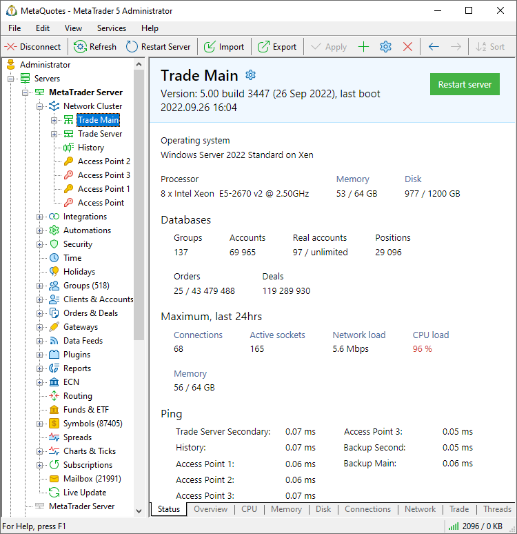

[🏠 Document Start](../../../README.md) / [MetaTrader 5 Trading Platform](../../../MetaTrader-5-Trading-Platform.md) / [Platform Setup](../../Platform-Setup.md) / [Network cluster](../Network-cluster.md) / Status

[Previous](Managing-Machines.md) | [Next](Monitor.md)

# Status (#status)

The section displays important component operation characteristics: hardware load, database sizes, network speed and much more. These metrics should be monitored closely: hardware should always have a power reserve to ensure the maximum platform performance.

## Basic Information (#basic-information)

Basic information about the selected server is shown at the top of the window:

  * Version — server version, build number and its date.
  * Last boost — last system boot time. The server [restart](Restarting-and-Stopping-Servers.md) button is located in the right part.
  * Operating system — name of the operating system. The minimum recommended system is Windows Server 2016 Standard x64.
  * Processor — CPU type and its clock rate. The minimum recommended CPU type is Intel i7 4xxx 4 quad-core and above.
  * Memory — free RAM amount/total RAM.
  * Disk — free hard drive space in gigabytes. Make sure there is always enough free disk space.

## Databases (#databases)

This block features information about databases on the selected server. It is only available for trading servers.

  * Groups — the total number of [groups](../Groups.md) on the server.
  * Accounts — the total number of [accounts](../Accounts.md) on the server.
  * Real accounts — the total number of real clients on the server, as well as the limitation on the number of clients according to the license (if any). Real accounts refer to the client records that are not included in demo*, manager*, preliminary* and contest* [groups](../Groups/Group-Types.md). The statistics only include [enable accounts (#enable)](../Accounts/Editing-Account.md#enable) from which [trading is allowed (#trading)](../Accounts/Editing-Account.md#trading).
  * Positions — the number of [positions](../Positions.md) on the trade server.
  * Orders — the number of active [orders](../Orders.md) and history orders on the selected server.
  * Deals — the total number of [deals](../Deals.md) executed on the selected server.

## Maximum load (#maximum-load)

This block shows the maximum server load registered during the current session:

  * Connections — statistics on the total amount of all standard operating terminal connections and temporary connections made for executing trades, downloading history or news. In the quiet market, this parameter allows determining the number of online users. It is shown for the cluster and for individual servers.

  * On access servers, connections show the number of client connections.
  * On trade server, the figure means virtual connections (clients actually connect via access servers).
  * On history servers, the metric shows connections of other components of the cluster.
  * Active sockets — the total number of TCP endpoints (with a specific IP address and port number) connected throughout the operating system. This also takes into account half-open connections when there is no connection, but the socket is still closed by the operating system.
  * Network load — total incoming and outgoing traffic, in Mbit/s. The load of the [selected network interface (#network-adapter)](Configuring-Servers.md#network-adapter) is measured in terms of the incoming and outgoing traffic (average value per minute). Takes into account the traffic of all programs that run on the server computer. Unexpected load spikes can easily point to DDoS attacks.
  * CPU load — total CPU load in percent. This parameter affects on how fast users and their trade operations are serviced. If the processor load regularly exceeds 50% in the middle of a work day, it is time to think of the computer upgrade. Over 85% load is critical. If the processor load is 100%, it means that the processing power is not enough for processing of tasks. However, rare spike loads are no reason to worry.
  * Memory — free RAM amount/total RAM. Availability of a large amount of free memory is extremely important for a server. This enables you to serve more users currently connected, and handle large databases. If the available memory becomes less than 100MB, the graph is colored in red.

To view the statistics in dynamics, use [monitoring](Monitor.md) section.

## Ping (#ping)

This section shows network delays between the selected server and all other components of the cluster.

> Server operation statistics (network load, CPU and others) are updated during [optimization (#optimization)](Configuring-Servers.md#optimization).

## Backup last time (#last-backup)

This section is only displayed for backup servers. It indicates the last time the backups were made.

  * Startup — at startup the backup server creates a [file copy (#file)](../../Platform-Components/Backup-Server/Backup-Features.md#file) of its databases which were synchronized with the main trade server in real time. This happens before the start of synchronization with the main server in case its databases are already damaged. This allows the rolling back to the previous state using the file copy.
  * Full — the time when the [file copies (#file)](../../Platform-Components/Backup-Server/Backup-Features.md#file) of all databases were created.
  * Archive — the time when [additional file copies (#archive-backup-period)](Configuring-Servers/Backup-Server.md#archive-backup-period) were created.
  * Databases synchronization — the time of the last backup of [non-core data](../../Platform-Components/Backup-Server/Backup-Features.md) (the initial synchronization at server startup or periodic synchronization during operation).
  * SQL synchronization — time of the last full synchronization of databases and platform configurations with the [SQL database.](../../Platform-Components/Backup-Server/SQL-Export.md). It is launched when a backup server is started or after connection to the SQL database or to the trading server is lost. After synchronization, the SQL database is updated in real time in accordance with the transactions of changes in the platform databases.

