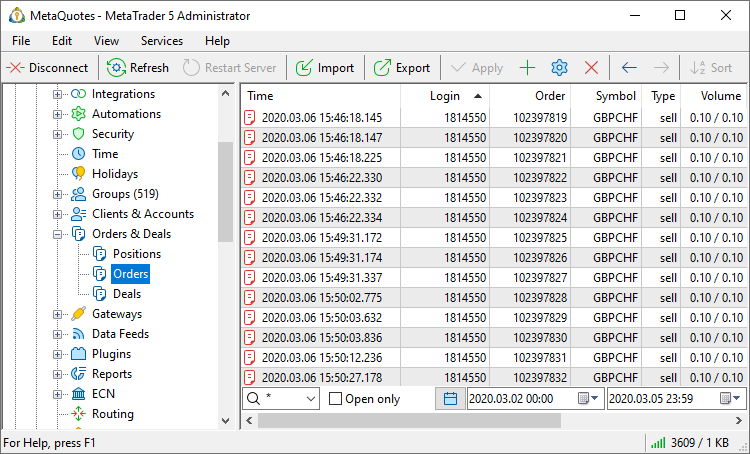
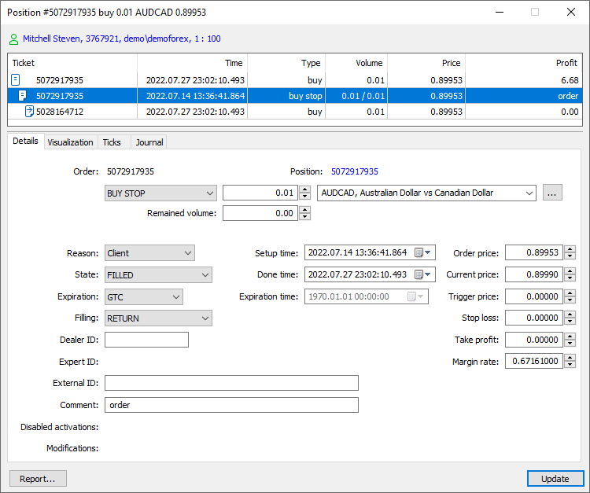
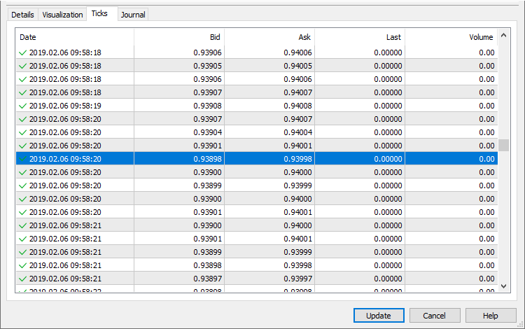

[🏠 Document Start](../../README.md) / [MetaTrader 5 Trading Platform](../../MetaTrader-5-Trading-Platform.md) / [Platform Setup](../Platform-Setup.md) / Orders

[Previous](Managers.md) | [Next](Deals.md)

# Orders (#orders)

Using the "Orders" section, you can manage the history of orders placed by clients, pending orders and the orders that are not executed at the moment.

Depending on the items chosen in the [context menu (#context)](Orders.md#context), different [information about orders (#view)](Orders.md#view) is displayed here. Orders can be sorted out by any field. To do it, click with the left mouse button on its name.

## Requesting Orders (#request)

To view orders, compose a request. A request can be performed:

  * By Groups  
To do it, select a group from the dropdown list.
  * By Logins  
To do it, should specify one or several logins separated with commas.
  * By Tickets  
To request orders by their numbers specify one or several numbers separated with commas. Before the numbers it is necessary to specify the "#" symbols.

Then you can specify the following parameters of the request:

  * Trading instruments for which orders will be requested. One symbol or a group of symbols can be selected from the list. Optionally, you can specify a comma separated list of trading instruments or groups of symbols. For example, Forex\*, CFD\*, Metals\GOLD. Please note that filtering is performed on the server side, and not on the administrator terminal side. To obtain data on other instruments, send another request. The request is performed for all financial instruments by default.
  * If you check the "Open only" option then only the pending orders that haven't triggered yet will be displayed.
  * Then you can specify one of the predefined periods of request using the  button: "Today", "Last 3 days", "Last week", "Last 3 months", "Last 6 months" and "All history". To specify a custom request period, use the fields to the right. Orders are requested based on the execution time. Open orders do not have this parameter, so they will be included in all queries.
  * Then you can specify a database the orders will be requested from: current database or one of the [backups (#backup)](Orders.md#backup).

To execute the request, press the "Request" button or execute the " Request" command in the [context menu (#request)](Orders.md#request).

## Viewing an Order (#view)

To start viewing or editing an order, double-click on it in the list. The trading operation dialog is a fully-featured tool with a plethora of advanced features, such as the display of the structure of operations, visualization, tick history and logs.

### Account details (#account-details)

The upper part of the dialog features brief information about the account, on which the operation was performed: name, login, group and leverage. Click on this line to view [account details](Accounts/Editing-Account.md).

### Overview and related operations (#connected-transactions)

All related trading operations are shown in this block: deals executed as a result of order execution and the resulting position. Thus you can easily access the entire chain of related actions. Select an operation from the tree and all relevant parameters will be instantly displayed in the bottom part.

### Trading operation details (#details)

The following parameters are indicated for orders:

  * Login — [account](Accounts.md) number the order was placed on;
  * Order — order number (ticket);
  * Setup time — time when the order was placed by the client. If the order is processed in an external trading system, this field displays the time of order placing in the external system (not in the MetaTrader 5 platform). When Stop Limit orders are triggered, a new value is written to this field, instead of the time the order was placed by the client: the time when the corresponding limit order was placed.
  * Position — ticket of the position opened, modified or closed due to this order. For "close by" orders, two tickets are displayed: closed position ticket and opposite position ticket.
  * Type — order type: "Buy", "Sell", "Buy Limit", "Sell Limit", "Buy Stop", "Sell Stop", "Buy Stop Limit", "Sell Stop Limit" or "Close By";
  * Initial volume — volume requested in the order;
  * Symbol — [symbol](Symbols.md) the order was placed for;
  * Filling — additional parameters of [order execution (#fill-policy)](General-Information/Trading-System.md#fill-policy): "All or none", "Cancel remainder", "Book or Cancel" or "Return remainder".
  * Order price — price specified by trader for execution of the order;
  * Trigger price — this field is intended for the "Buy Stop Limit" and "Sell Stop Limit" orders. It contains the price level when they trigger and the corresponding limit orders are placed.
  * Stop loss — the Stop Loss level;
  * Take profit — the Take Profit level;
  * Comment — text comment to the order. This field can contain trader's comments if they were specified.
  * Margin rate — rate of converting the symbol margin currency to the deposit currency.
  * Expiration — [expiration type (#expiration)](Symbols/Symbol-Settings/Trade.md#expiration) of the order: "GTC" (Good Till Canceled), "Day" or "Specified".
  * Expiration time — if lifetime of the order has expired then this field contains the date and time of expiration;
  * Disable activation — additional conditions (flags), with which order activation is prohibited. The flags can be set by Gateway API when orders are sent to an external system. For example, if activation of stop loss and take profit must be controlled by an external system, a flag disabling activation on the MetaTrader 5 side can be set for the order. Order flags are inherited by [positions (#activation)](Positions.md#activation) created upon order execution. Available flags:
    * Limit — no processing of limit level hitting.
    * Stop — no processing of stop level hitting.
    * Stop Limit — no processing of stop limit level hitting.
    * SL — no processing of Stop Loss activation.
    * TP — no processing of Take Profit activation.
    * Stop Out — no processing of Stop Out activation.
    * Expiration — no processing of expired order cancellation.
  * Modifications — if the order is changed manually, this field displays who implemented the changes:
    * Administrator — order changed by an administrator.
    * Manager — open price changed by a manager.
    * Restore — order restored.
    * Admin API — order changed via Manager API administrator interface.
    * Manager API — order changed via Manager API manager interface.
    * Server API — order changed via Server API.
    * Gateway API — order changed via Gateway API.

  * The orders changed by an administrator or manager, as well as restored orders are highlighted in the list in red.

  * Use [Trade Modification Report](Reports/Trade-Modifications.md) to obtain information about all modified trade operations.

  
---  
  
  * Reason — a reason of placing the order:
    * Client — the order is placed manually by a client via the client terminal;
    * Expert — the order is placed by a client using an Expert Advisor;
    * Dealer — the order is placed by a dealer via the manager terminal;
    * SL — the order is placed as a result of Stop Loss triggering;
    * TP — the order is placed as a result of Take Profit triggering;
    * SO — the order is placed because a client reached the [Stop-Out (#stopout)](Groups/Group-Settings.md#stopout) level;
    * Rollover — the order is placed when reopening position for charging [swaps](Symbols/Symbol-Settings/Swaps.md);
    * External Client — the order is placed by a client from an external trading system.
    * Variation margin — the order is placed for accruing variation margin.
    * Gateway — the order is placed by a MetaTrader 5 gateway that had connected to the trading platform.
    * Signal — the order is placed as a result of copying a [trade signal](https://www.mql5.com/en/signals) according to a subscription in the client terminal.
    * Settlement — the order is placed as a result of performing operations connected with the settlement of a futures contract/option. Not used at the moment.
    * Transfer — the order is placed due to transferring a position at the settlement price to a new symbol with the same underlying asset. Not used at the moment.
    * Synchronization — the order is placed as a result of [synchronization (#trade-accounts)](Accounts/Editing-Account.md#trade-accounts) of an account's trade state with an external system.
    * External Service — the order is placed from an external trading system for technical reasons (for example, to correct the trade state of a client).
    * Mobile — the order was created via the MetaTrader 5 mobile terminal for Android or iPhone.
    * Web — the order was created via the web terminal.
    * Split — the order was created as a result of a symbol split.
    * Corporate action — the order was created as a result of a corporate action, such as consolidating or renaming securities, transferring a client to a different account, etc. API applications set this flag for service operations so that the platform does not account for such corporate actions in commission calculations.
    * Migration — order was created while importing clients' trading operations from the MetaTrader 4 server.
  * Expert — the identifier (magic number) of an Expert Advisor that has sent this order from the client terminal.
  * Done time — time when the order was executed. If the order is processed in an external trading system, this field displays the time of order execution in the external system (not in the MetaTrader 5 platform);
  * State — current state of the order (filled, rejected, partially filled, expired, etc.). Editing allowed for emergency situations only. It is strongly not recommended to change this setting manually without a special need;
  * Current price — current price of the symbol the pending order was placed for. For market orders, a value from the "Order price" field is displayed here;
  * Remained volume — if the order is not filled in the volume requested by trader this field will display the remainder volume;
  * ID — unique identifier of the order in the external systems.
  * Dealer — number of account of the [dealer (#dealing-permission)](Managers.md#dealing-permission) that processed this order. If "0" is specified in this field, it means that the order was processed without a dealer.

If a manager has access rights for [modifying orders (#dealing-permission)](Managers.md#dealing-permission) then any field in this window can be modified. As soon as all the changes are made, the "Update" button should be pressed. If you press the "Delete" button the order will be deleted from the currently selected database.

### Visualization (#visualization)

In this section, execution of a trading operation is visualized on the tick chart of the appropriate symbol.

### Nearest ticks before and after the operation (#ticks)

When examining disputable situations with traders, it is often necessary to analyze quotes which were broadcasted at the trading operation execution time. The relevant quote data can be obtained in a couple of clicks. Open operation details and navigate to the "Ticks" section. The terminal will automatically request the quote history from the server for the entire day on which the operation was performed. The nearest quote to operation execution time will be automatically selected in the list of received quotes.

### Operation journal (#journal)

This is another tool to assist during the follow-up operation examination. There is no need to manually request [logs from the server](Network-cluster/Journal.md) and to filter its records. Open operation details, navigate to the "Journal" section and the terminal will automatically request the necessary logs from the server, using ticket and time interval filters (from the operation date to the current day).

### Trading operation report (#report)

The trading operation details available in the editing dialogs can be saved as a report. The report contains the entire chain of operations from an order to a position, visualization on a tick chart, extract from the server log and the trading account overall status.

To generate a file, click "Report" in the context menu in the "[Overview and related operations (#connected-transactions)](Orders.md#connected-transactions)" section. Next, select data to be saved: account state, trading totals, logs, tick chart, etc.

Select the path on the disk and click "Save".

## Moving Orders to History (#history)

Any open order can be move canceled and moved to history. At that, its state will be changed to "Canceled". Click "To history":

Orders moved to history cannot trigger or be executed; also margin is not charged for them.

## Reopening Orders (#reopen)

Pending orders can be reopened from the orders' trading history. Before reopening the order, client's trading positions and account should be properly corrected:

  * Delete the trade opened according to the order.
  * Correct the client's positions using the special command. To do this, open the account's dialog window and execute ["Fix Positions" (#check-fix)](Accounts/Editing-Account.md#check-fix) context menu command in the Overview tab.
  * Correct the client's balance. Select the appropriate account in the list and execute ["Balance->Fix Balance"](Accounts/Checking-and-Fixing-Balance.md) context menu command.

After that, the triggered order can be reopened. To do this, move to Orders section, find the necessary order, open it for editing and click "Reopen":

## Backup Databases of Orders (#backup)

[Backup copies (#file)](../Platform-Components/Backup-Server/Backup-Features.md#file) are copies of the order database at certain points in time. They are created daily on the [backup server (#enable-backups)](Network-cluster/Configuring-Servers/Backup-Server.md#enable-backups). To get the list of available backup copies, select "More backups..." and specify a time period:

After specifying a period the additional items will appear in the field of choosing database — all the backups made for the specified period of time. Then you should [request (#request)](Orders.md#request) orders from the selected database. Any order can be restored to the current database using the " Restore" command of the context menu.

> Restored orders are not deleted from the backup databases.

## Context Menu (#context)

The context menu of the "Orders" section contains the following commands:

  *  Edit — modify a selected order;
  *  Delete — delete a selected order;
  *  Request — execute a [request (#request)](Orders.md#request);
  *  Restore — restore a selected order from a backup database to the current one. This command is active only if a backup database is currently requested;
  * Copy As — copy orders selected in the list:

  *  Lines — copy entire selected information.
  * List of Logins — copy the list of logins only.
  * List of Tickets — copy the list of tickets only.
  *  Export — [export](General-Information/Data-Export.md) requested orders as a *.HTM, *.HTML file or as a *.CSV file;
  *  Journal — request the [journal](Network-cluster/Journal.md) entries by a selected order;
  *  Find — open the [search](../MetaTrader-5-Administrator/User-Interface/Search.md) window;
  * Show Milliseconds — show the time of trade operations with a millisecond precision;
  * Auto Arrange — if this option is enabled the size of columns is selected automatically;
  * Grid — this option shows/hides field separators in the table with orders;
  * Columns — using this sub-menu, one can choose which [details of orders (#view)](Orders.md#view) will be displayed in the list.

