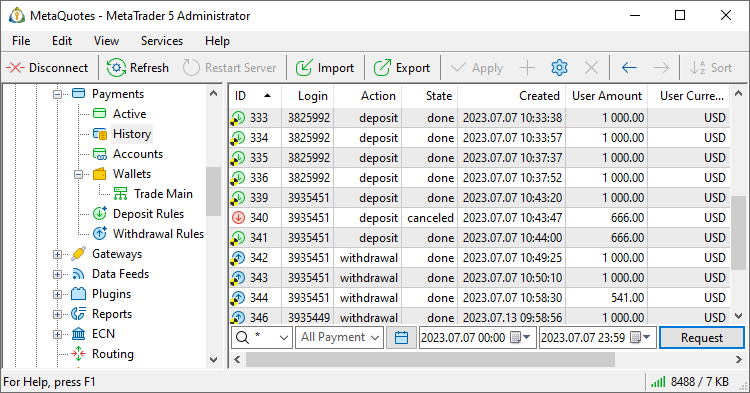
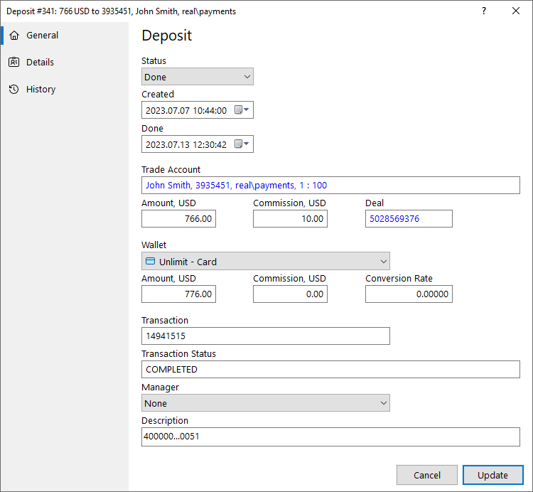
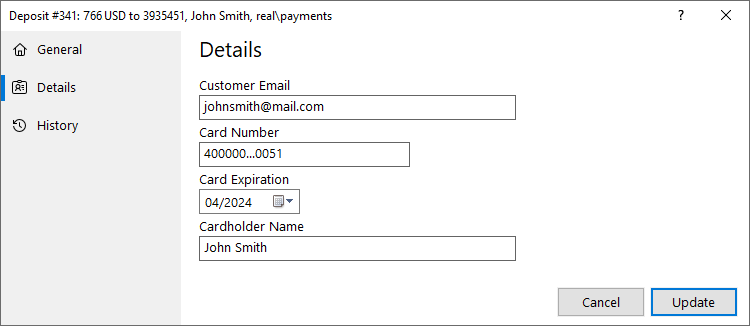
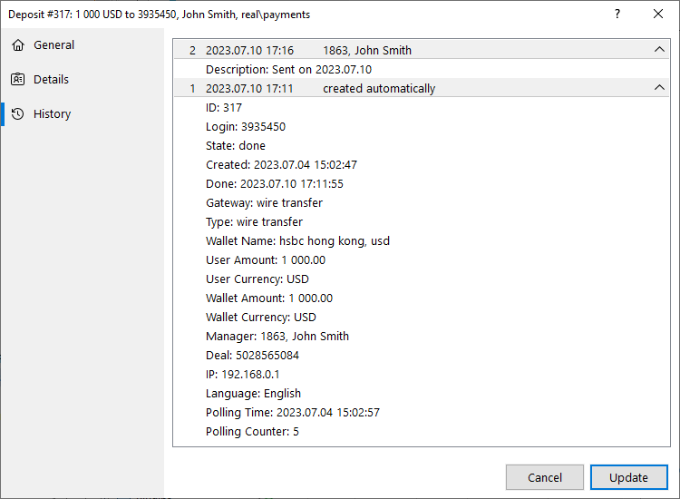
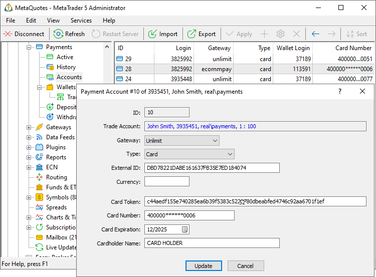
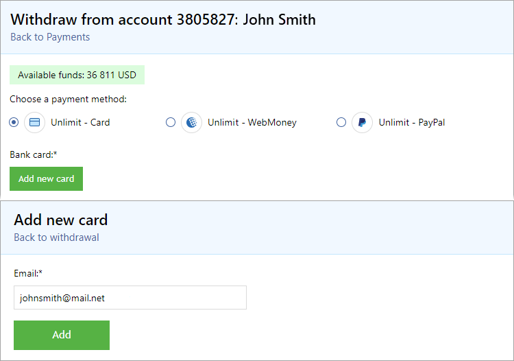
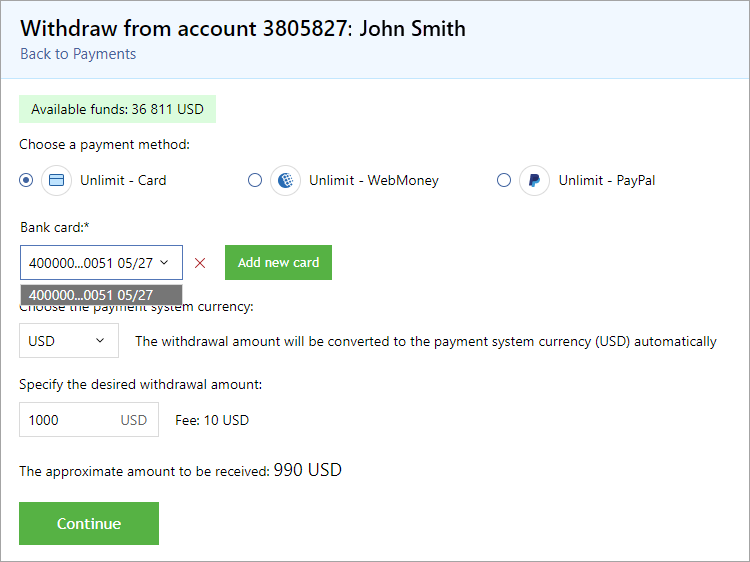
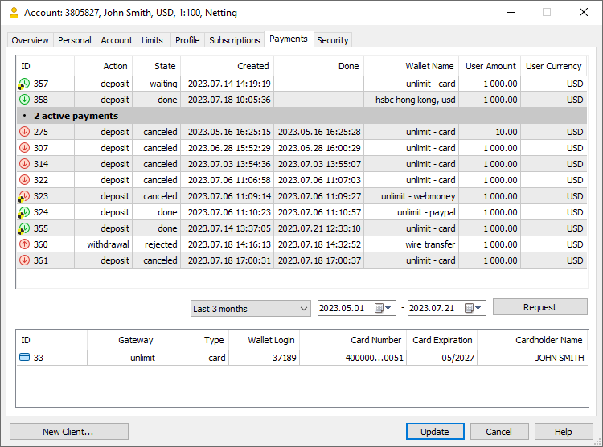

[🏠 Document Start](../../../README.md) / [MetaTrader 5 Trading Platform](../../../MetaTrader-5-Trading-Platform.md) / [Platform Setup](../../Platform-Setup.md) / [Payments](../Payments.md) / Controlling

[Previous](Payment-Processing-Rules.md) | [Next](Processing.md)

# Controlling Payments (#controlling-payments)

Service usage can be monitored using the Active and History sections. The sections feature the transactions that are currently being [processed by managers](Processing.md), as well as the history of completed/rejected transactions.

To view transactions, request them from the server. Specify the filter to the right of the icon :

  * By accounts — specify one or several account numbers separated by commas.
  * By trader group — select a group from the list or specify the group name manually.
  * By login — specify one or several accounts separated by commas.
  * By wallet — filter records by [wallet](Payment-Gateways.md).

For the payment history additional options are available:

  * By date — select a predefined period using the  button or specify the dates manually.

Specify the desired filters and press "Request". Select an operation in the list to view its details.

  * Access to viewing and managing payments is subject to separate [manager account (#payments)](../Managers.md#payments) permissions.

  * For additional payment control, use [special automation triggers (#payments)](../Automations/Triggers.md#payments). You can use them to set up notifications about any transactions and export data to external systems.

  
---  
  

## General Payment Details (#common)

###  (#)

The following information is shown for each payment:

  * Status — payments can have one of the following statuses:
    * Initial — payment created on the server. Only used for internal purposes.
    * Processing — the operation is being processed by the payment provider.
    * Waiting — the operation is pending to be processed by the manager.
    * Locked — the operation is [captured by the manager](Processing.md) for further processing.
    * Done — the payment was successfully completed.
    * Rejected — the operation was rejected by the manager.

  *     * Rejected without refund — used when rejecting payments made through wallets that do not support automatic refunds. For further details please read "[Refunds (#refund)](Processing.md#refund)".

  *     * Canceled — the transaction was rejected by the payment provider.
    * Failed — an error occurred while processing the payment.
  * Created — the date of the transaction in the client terminal.
  * Trading account — login of the account on which the operation is performed.
  * Amount — the operation amount requested by the client. Specified in the deposit currency.
  * Commission — commission charged by the broker in accordance with the [settings (#commissions)](Payment-Gateways.md#commissions).
  * Deal — ticket of the [balance operation](../Deals.md) via which funds are credited to or debited from the trading account.
  * Wallet — the name of the [wallet](Payment-Gateways.md) via which the operation is performed.
  * Amount — the amount of the transaction on the side of the payment provider. It is specified in the currency selected by the user on the client terminal side when making the operation.
  * Commission — the payment provider's commission for the operation.
  * Conversion Rate — the rate of conversion from the client's currency to the payment system currency (or vice versa).
  * Transaction — transaction ID assigned by the payment system.
  * Transaction Status — transaction status transmitted by the payment system.
  * Manager — the login and name of the manager who [processed the operation](Processing.md). It is filled only for manually processed transactions.
  * Description — additional information about the operation. Can be filled in by payment systems or manually by managers.

> Changing the payment status manually does not trigger any processing events. If "Canceled" is set for a successful top-up, the amount is not debited from the account. This should be done manually. If "Rejected" is set for a withdrawal operation being processed, the previously blocked amount is not released. To do this, the payment should be rejected via the [manager terminal](Processing.md).

## Details (#details)

Information in this section depends on the payment method: card, e-wallet, or bank transfer. The details depend on the payment system.

  * For cards, these include card number, expiration date and owner's name
  * For wallets, wallet number or ID is shown
  * Bank transfers provide account details: bank name, division and code, account number, client name, etc.

## History (#history)

For efficient employee performance monitoring and secure storage of information, all changes in payment transactions are tracked and displayed in the Versions section. Version support allows you to see all changes made to the transaction. You can revert changes if necessary, since all earlier specified data are stored in the platform.

Information on each change contains the number and date of the change as well as the relevant manager's login. To view more detailed information about the changes, click on the row. The details show each changed parameter: its name, previous value and new value.

## Payment Accounts (#accounts)

At the moment, payment accounts are used only for transactions with bank cards. They store card details. Payment accounts are created when a user [adds a new card (#add-card)](Controlling.md#add-card) or makes a deposit from a new card (the card is also added in this case).

To view the payment account details, go to the Payments \ Accounts section and query the records. Select a record to view its details:

The following details are provided for payment accounts:

  * ID — unique account ID within the MetaTrader 5 platform.
  * Trading Account — details of the trading account for which the account is saved: holder's name, account number, group, leverage.
  * Gateway — payment provider.
  * Type — type of payment method: card, PayPal, WebMoney, etc.
  * External ID — unique ID used by the payment system to identify the account.

  * Currency — currency with which the payment method operates. This field is required for some providers who link cards to a specific currency. If no currency is specified, the payment instrument can use any currency for transactions.

  * Card token — unique ID used by the payment system to identify the card. Unlike the external ID, the token for the same card can change.
  * Card Number — masked card number. The system does not store full card numbers.
  * Card Expiration — card expiration date.
  * Cardholder Name — the name of the card holder.

> The payment system does not store full card details (number and CVV) due to legal restrictions. This would require an organization to hold a special license. Instead, the system stores a unique token, by which the external system can identify the card.

### Adding Cards (#add-card)

Due to specific requirements of some payment providers, the system needs to know in advance which card will be used to withdraw funds. If the user has not previously added cards and has not deposited funds (cards are added automatically during deposits), then when withdrawing funds in the client terminal, the user must first add the card:

Upon pressing Add, the user is forwarded to the payment system page and specifies card details. The system performs a special operation of 1 USD to authorize the card. This amount is locked on the card and then immediately unlocked, so nothing is debited from the user. After that, a payment account is created in the platform, which stores a special token — a unique identifier by which the payment system can identify the card.

After that, the user returns to the payment page, selects a card and performs the transaction.

  * During deposit operations, the used cards are added to the system automatically. It is not necessary to add cards separately. The user can enter the amount and click Continue.

  * If [creation of accounts is disabled (#permissions)](Payment-Gateways.md#permissions) in the payment gateway settings, the option for adding new cards will disappear from the terminal. It will only be possible to add a new card by making a deposit.

  
---  
  

## Payments in Accounts (#account-payments)

[Account properties](../Accounts/Editing-Account.md) store all related transactions and payment accounts. Select a transaction in the list to view the details.

