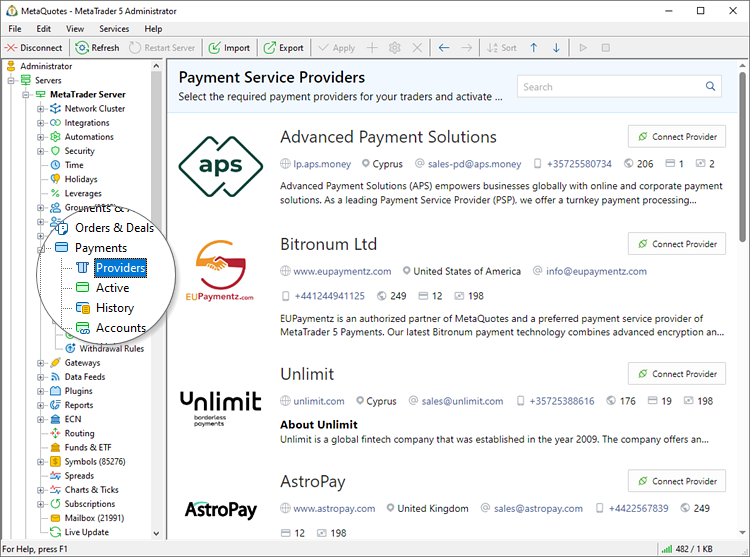
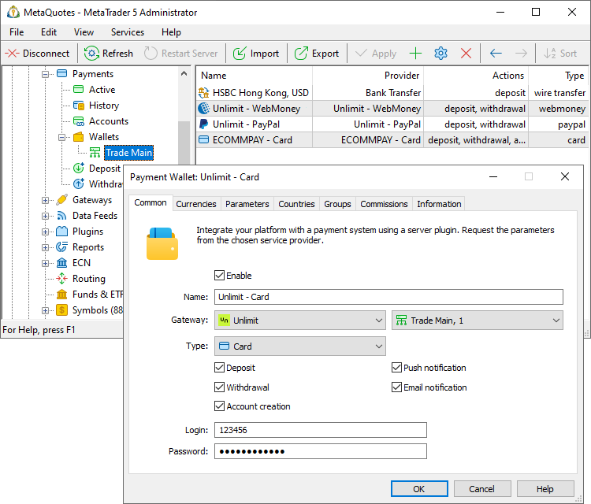
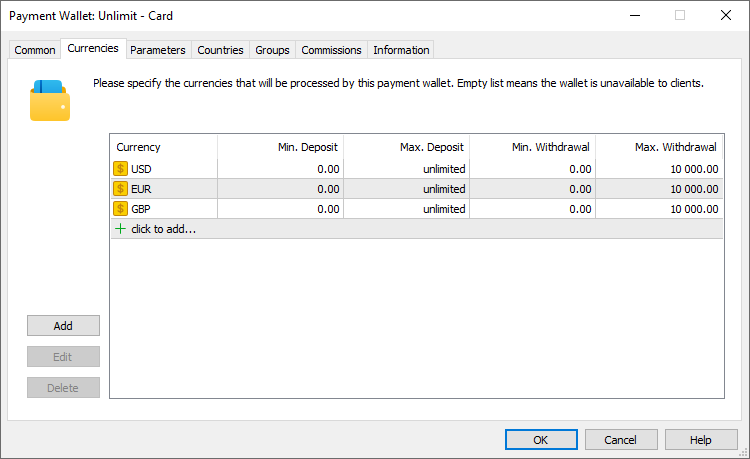
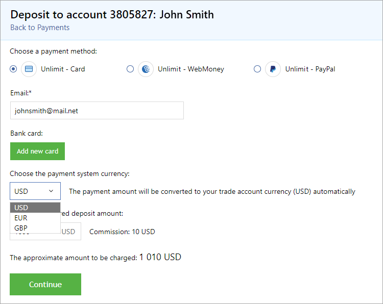
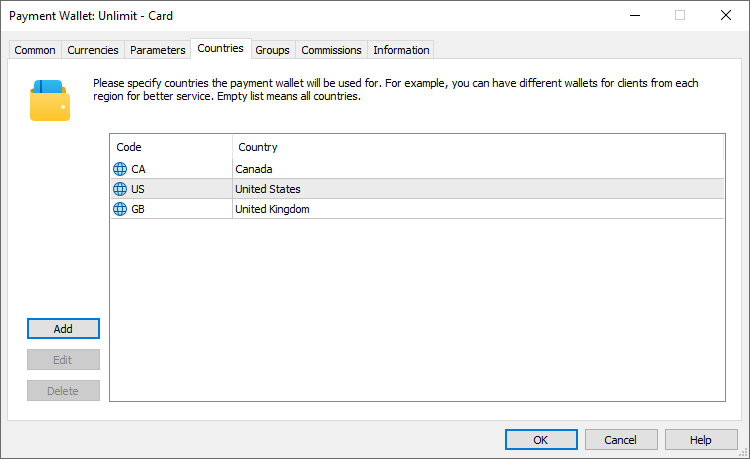
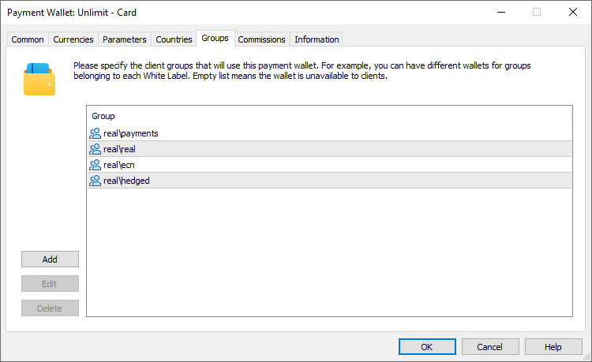
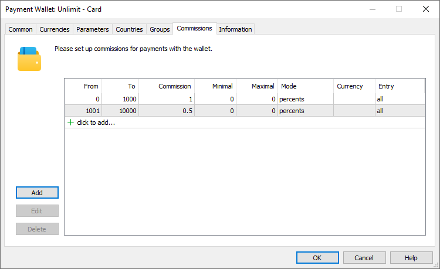
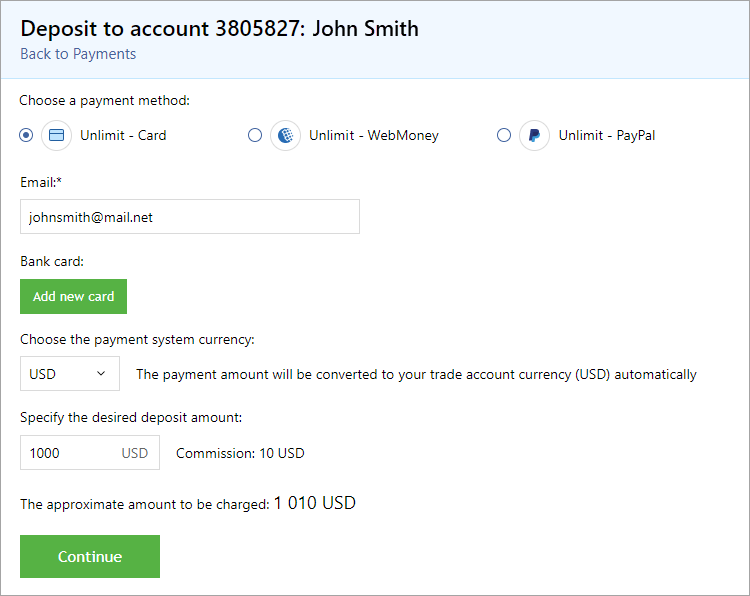
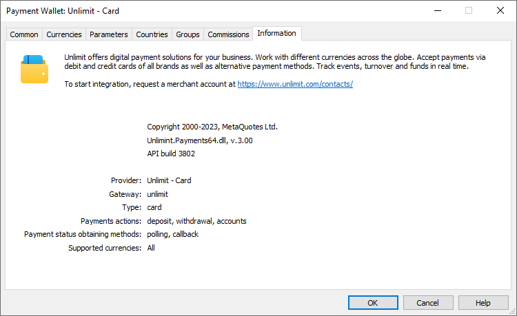

[🏠 Document Start](../../../README.md) / [MetaTrader 5 Trading Platform](../../../MetaTrader-5-Trading-Platform.md) / [Platform Setup](../../Platform-Setup.md) / [Payments](../Payments.md) / Payment Gateways

[Previous](../Payments.md) | [Next](Payment-Gateways/Unlimit.md)

# Payment Gateways (#payment-gateways)

To enable payments in MetaTrader 5, choose a provider company that will receive and send payments on your behalf. All currently available providers are featured in the showcase:

If your preferred payment provider is not currently available in the service, please [reach out to us](../../Technical-Support.md) for possible integration options.

To start working with a provider, you will need to sign an agreement with the selected company. Click 'Connect Provider' and fill out a short form. The company representative will contact you and will provide further instructions. Upon finalizing the agreement with the payment provider, you will receive the necessary details to configure integration in the platform. Typically, this includes a login and a password or a special access key.

Go to Payments \ Wallets and create a new wallet. Please note that you should configure separate wallets for each trading server. Thus, if you have multiple trading servers, create wallets for each of them.

You can create multiple wallets for each payment provider (gateway), by dividing the configurations by payment methods, currencies, etc. This will allow more flexible customization of the service. For example, you can provide access to different payment methods for different categories of traders.

Specify general settings:

  * Name — the name of the wallet. Set clear names that include the name of the payment system and other details, such as available payment methods, currencies, etc. Appropriate naming will ensure efficient wallet management.
  * Gateway — payment provider: [Unlimit](Payment-Gateways/Unlimit.md), [ECOMMPAY](Payment-Gateways/ECOMMPAY.md), [APS](Payment-Gateways/APS.md), [AstroPay](Payment-Gateways/AstroPay.md), [EU Paymentz](Payment-Gateways/EU-Paymentz.md), [Kora](Payment-Gateways/Kora.md), [emerchantpay](Payment-Gateways/emerchantpay.md), [Pay.com](Payment-Gateways/Pay-com.md), [Exactly](Payment-Gateways/Exactly.md), [Ozow](Payment-Gateways/Ozow.md), [AK Remit](Payment-Gateways/AK-Remit.md), [The Kingdom Bank](Payment-Gateways/The-Kingdom-Bank.md), [OpenPayd](Payment-Gateways/OpenPayd.md), [STICPAY](Payment-Gateways/STICPAY.md), [ChipPay](Payment-Gateways/ChipPay.md), [Uniwire](Payment-Gateways/Uniwire.md), [UniPayment](Payment-Gateways/UniPayment.md) or [Bank Transfer](Payment-Gateways/Bank-Transfer.md).
  * Trading server — the server for which the wallet is configured. Payments through this wallet will only be available to accounts running on the same server.
  * Type — payment method type: bank card, electronic wallet, etc. The list of available options depends on the selected provider.
  * Allowed operations — deposits, withdrawals, [payment accounts (#accounts)](Controlling.md#accounts). At the moment, payment accounts are used only for transactions with bank cards. If the creation of payment accounts is disabled, users can still:
    * Deposit funds using a new card. Upon completion of the transaction, the card details partially masked will be automatically saved in MetaTrader 5 as [a payment account (#accounts)](Controlling.md#accounts).
    * Deposit funds using previously saved cards.
    * Withdraw funds using previously saved cards. The option to withdraw to a new card and the "[Add New Card (#add-card)](Controlling.md#add-card)" button will not be displayed in client terminals.
  * Push notification — send notifications about transaction results to traders' mobile devices. Push notifications are sent to MetaQuotes ID specified in [account settings (#personal)](../Accounts/Editing-Account.md#personal). Notification text is customizable via [templates (#templates)](Payment-Gateways.md#templates).
  * Email notification — send email about transaction results to traders' email addresses specified in [account properties (#personal)](../Accounts/Editing-Account.md#personal). At least one default [mail server](../Integrations/Mail-Servers.md) must be configured in the platform to enable email sending. Notification text is customizable via [templates (#templates)](Payment-Gateways.md#templates).

Further settings depend on the provider:

  * [Unlimit](Payment-Gateways/Unlimit.md)
  * [ECOMMPAY](Payment-Gateways/ECOMMPAY.md)
  * [APS](Payment-Gateways/APS.md)
  * [AstroPay](Payment-Gateways/AstroPay.md)
  * [EU Paymentz](Payment-Gateways/EU-Paymentz.md)
  * [Kora](Payment-Gateways/Kora.md)
  * [emerchantpay](Payment-Gateways/emerchantpay.md)
  * [Pay.com](Payment-Gateways/Pay-com.md)
  * [Exactly](Payment-Gateways/Exactly.md)
  * [Ozow](Payment-Gateways/Ozow.md)
  * [AK Remit](Payment-Gateways/AK-Remit.md)
  * [The Kingdom Bank](Payment-Gateways/The-Kingdom-Bank.md)
  * [OpenPayd](Payment-Gateways/OpenPayd.md)
  * [STICPAY](Payment-Gateways/STICPAY.md)
  * [ChipPay](Payment-Gateways/ChipPay.md)

  * [Uniwire](Payment-Gateways/Uniwire.md)

  * [UniPayment](Payment-Gateways/UniPayment.md)

  * [Bank Transfer](Payment-Gateways/Bank-Transfer.md)

> If you need additional payment providers or payment methods, please contact our [support team](../../Technical-Support.md).

## Currency (#currencies)

Use this section to configure the currencies that will be available for transactions through this wallet. To make a currency available, add a new line and specify the parameters:

  * Currency — the name of the currency. The list of available currencies depends on the selected provider and payment method. Check with the provider if the desired currency is supported.
  * Min. Deposit — the minimum amount in the specified currency that can be deposited via this wallet.
  * Max. Deposit — the maximum amount in the specified currency that can be deposited via this wallet.
  * Min. Withdrawal — the minimum amount in the specified currency that can be withdrawn via this wallet.
  * Max. Withdrawal — the maximum amount in the specified currency that can be withdrawn via this wallet.

The settings in this section affect the display of deposit and withdrawal pages in client terminals for this wallet. In particular, the list of currencies and restrictions on transaction amounts.

If the payment currency is different from the deposit currency, the amount will be automatically converted when credited/debited from the account. Conversion follows the same rules that are applied for [trading profit conversions](../Symbols/Symbol-Settings/Trade/Conversion.md). For deposits, the conversion is made at the rate of purchasing the account currency for the transaction currency, while the relevant selling rate is used for withdrawals. For example, if the account currency is EUR and the transaction currency is USD, then the deposit amount will be converted at the EURUSD Ask price and the withdrawal amount will be converted at EURUSD Bid price.

If no currency is specified for the wallet, this means that it accepts payments in any currency. If the setting does not fit the provider requirements and a client requests a payment in an unsupported currency, the operation is rejected.

## Parameters (#parameters)

This section specifies additional options specific to each payment provider. They are described in the respective subsections.

  * [Unlimit](Payment-Gateways/Unlimit.md)
  * [ECOMMPAY](Payment-Gateways/ECOMMPAY.md)
  * [APS](Payment-Gateways/APS.md)
  * [AstroPay](Payment-Gateways/AstroPay.md)
  * [EU Paymentz](Payment-Gateways/EU-Paymentz.md)
  * [Kora](Payment-Gateways/Kora.md)
  * [emerchantpay](Payment-Gateways/emerchantpay.md)
  * [Pay.com](Payment-Gateways/Pay-com.md)
  * [Exactly](Payment-Gateways/Exactly.md)
  * [Ozow](Payment-Gateways/Ozow.md)
  * [AK Remit](Payment-Gateways/AK-Remit.md)
  * [The Kingdom Bank](Payment-Gateways/The-Kingdom-Bank.md)
  * [OpenPayd](Payment-Gateways/OpenPayd.md)
  * [STICPAY](Payment-Gateways/STICPAY.md)
  * [ChipPay](Payment-Gateways/ChipPay.md)

  * [Uniwire](Payment-Gateways/Uniwire.md)

  * [UniPayment](Payment-Gateways/UniPayment.md)

  * [Bank Transfer](Payment-Gateways/Bank-Transfer.md)

## Countries (#countries)

Specify the list of countries in which this wallet will be used. For example, if you are setting up transactions through a payment system that is used only in Brazil, specify this particular country in the wallet settings. Thus, all other users for whom this system is irrelevant will not see it in terminals.

If no country is specified, the wallet will be available to clients from any country.

> When opening a preliminary account, the country is determined automatically on the client terminal side, but the client can specify another country in the registration form. You can change the country manually in [account properties (#personal)](../Accounts/Editing-Account.md#personal).

## Groups (#groups)

Specify the list of groups for which this wallet will be used. Using this feature, you can organize work with your White Label partners. For example, they can select the preferred payment providers and pay for their services, or vice versa, they may opt not to use the integrated payment system.

The payments section is only available for real accounts and is not shown for other account types.

## Commissions (#commissions)

Configure commissions for operations through this wallet. For deposits, the amount indicated in the terminal will be credited to the user's account, while the user will pay more in the payment system, taking into account the commission. For withdrawals, the amount including the commission will be debited from the user's account, while the actually received amount in the payment system (card or wallet) will be smaller and will be equal to the withdrawal amount specified in the terminal.

Commissions can be multilevel, i.e. vary depending on the transaction amount. Create amount ranges and specify your own parameters for each of them:

  * From/To — minimum and maximum transaction amount to apply the setting. Commission units depend on the Mode field. For the "interest" mode, the values are set in the client's deposit currency. In all other cases, they are set in accordance with the specified currency.
  * Commission — commission amount. Commission units depend on the Mode field.
  * Minimal/Maximal — minimum and maximum amount of commission. Commission units depend on the Mode field. For the "interest" mode, the values are set in the client's deposit currency. In all other cases, they are set in accordance with the specified currency. To disable the minimum or maximum commission limit, set the value to 0.
  * Mode — commission calculation units:
    * Deposit currency — the deposit currency of the account that makes the payment.
    * Wallet currency — one of the available [wallet currencies (#currencies)](Payment-Gateways.md#currencies). The amount will be charged in the currency selected by the user on the client terminal side. The setting makes sense for wallets with one currency or currencies with a similar rate. Otherwise, the actual commission amount may vary significantly depending on the currency that the user selects.
    * Specified currency — the currency specified in the Currency field.
    * Percent — percentage of the transaction amount. The maximum value is 100%.
  * Currency — commission currency. The parameter is only used for the "Specified currency" mode. The currency has a three-letter representation, e.g. EUR, USD, JPY, etc.
  * Direction — the type of transactions for which the commission will be charged: deposits, withdrawals, or all.

The commission amount in client terminals is displayed next to the transaction amount:

## Information (#information)

This section displays general information about the payment provider, supported currencies, and payment methods. It also specifies the name and version of the integration module (DLL).

## Notification Templates (#templates)

You can send push or email notifications to traders about transaction results. Notifications are enabled in [common wallet settings](Payment-Gateways.md). They are provided for the following cases:

  * Successful deposit
  * Failed deposit
  * Deposit operation completed in the payment system and is awaiting [manager's confirmation (#action)](Payment-Processing-Rules.md#action)
  * Successful withdrawal
  * Failed withdrawal
  * Withdrawal is awaiting [confirmation by a manager (#action)](Payment-Processing-Rules.md#action) after which it will be sent to the payment system

Notification templates are located in [trade server directory]\templates\payment\\. You can customize them.

Macros in the templates allow substituting payment details, user data, and company information in the notification text.

### Payment Macros (#macros-payment)

  * <!--PAYMENT_ID--> — payment identifier.
  * <!--PAYMENT_DATE_CREATED--> — payment creation date.
  * <!--PAYMENT_TIME_CREATED--> — payment creation time.
  * <!--PAYMENT_LOGIN--> — client's login (account number).
  * <!--PAYMENT_ACTION--> — payment type: deposit or withdrawal.
  * <!--PAYMENT_TYPE--> — payment method: card, bank transfer, etc.
  * <!--PAYMENT_USER_AMOUNT--> — amount requested by the user in the deposit currency.
  * <!--PAYMENT_USER_COMMISSION--> — broker commission to be charged on the transaction in accordance with the [wallet settings (#commissions)](Payment-Gateways.md#commissions). Indicated in the deposit currency.
  * <!--PAYMENT_USER_CURRENCY--> — user deposit currency.
  * <!--PAYMENT_WALLET_AMOUNT--> — transaction amount on the payment system side.
  * <!--PAYMENT_WALLET_COMMISSION--> — payment system commission. The macro is reserved for future use. Currently, all supported providers withhold commission from the broker, so the value of this macro is always 0 for the user.
  * <!--PAYMENT_WALLET_CURRENCY--> — payment system currency.

Also supported in emails:

  * [General macros](../../Platform-Components/Trade-Server/Mail-Templates.md) substituting user data.
  * <!--SUBJECT=..--> — email subject variable.

