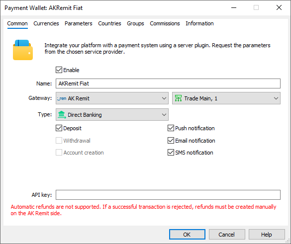
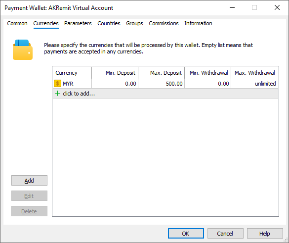
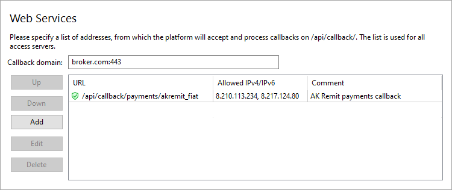
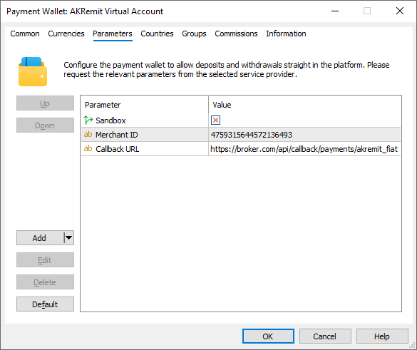

[🏠 Document Start](../../../../README.md) / [MetaTrader 5 Trading Platform](../../../../MetaTrader-5-Trading-Platform.md) / [Platform Setup](../../../Platform-Setup.md) / [Payments](../../Payments.md) / [Payment Gateways](../Payment-Gateways.md) / AK Remit

[Previous](Ozow.md) | [Next](The-Kingdom-Bank.md)

# AK Remit (#ak-remit)

[AK Remit](https://www.ak-remit.com/) offers online payments in Malaysia, Indonesia and Vietnam. To accept deposits, you can use fast and regular wire transfers, as well as cryptocurrency payments.

To connect AK Remit payments, click 'Connect Provider' in the [showcase](../Payment-Gateways.md) and fill out a short online form. You can also use the registration form on the [provider's website](https://www.ak-remit.com/contact-us/). The company representative will contact you and will provide further instructions.

After registration, you will receive connection details: API Key and Merchant ID. You will use this data to configure the wallet on the platform side.

Create a [payment gateway configuration](../Payment-Gateways.md) and select AK Remit as your gateway:

In the 'Type' field, select a payment method:

  * Bank Transfer — manual bank transfers (Virtual Accounts, VA).
  * Direct Banking — fast interbank transfers.
  * Crypto — cryptocurrency payments.

For further details, please see the [Limitations and features of the system (#limitations)](AK-Remit.md#limitations). If you wish to use multiple payment methods in parallel, create separate wallet configurations.

In the API Key field, enter the corresponding key provided by AK Remit. Next, go to the Parameters tab and specify the Merchant ID:

## System Features and Limitations (#limitations)

The provider supports transfers in three currencies:

  * Malaysian Ringgit (MYR) — fast bank transfers via Financial Process Exchange (FPX) and QR codes (DuitNow). Supported banks: Maybank, RHB, HongLeong Bank, Public Bank, CIMB Bank, Affin Bank, QR DuitNow. Manual bank transfers (Virtual Accounts, VA) through any banks are also supported.
  * Vietnamese Dong (VND) — fast bank transfers via Financial Process Exchange (FPX) and QR codes (Viet QR). Supported banks: Techcom Bank, BIDV, AgriBank, Eximbank, MB Bank, Sacom Bank, VIB, Viet QR. Manual bank transfers (Virtual Accounts, VA) through any banks are also supported.
  * Indonesian Rupiah (IDR) — manual bank transfers (Virtual Accounts, VA); supported banks: BRI, Mandiri, BNI, Danamon, Permata Bank, Maybank, CIMB.

The system also supports transfers in cryptocurrencies: ETH, BNB and USDT.

[Refund operations (#refund)](../Processing.md#refund) through the platform are not supported. If you cancel a successful payment on the MetaTrader 5 side, you will need to manually create a refund on the AK Remit side.

The payment system does not support withdrawal operations.

## Setting Up the Environment (#sandbox)

AK Remit supports operations in a sandbox (test) environment. In this environment, the provider simulates transaction processing so that you can check how payments work, without performing real money transactions. To connect to the sandbox environment, contact AK Remit for a special wallet. You will receive separate API Key and Merchant ID. Specify them in the wallet settings and enable the 'Sandbox' option.

## Currency Settings (#currencies)

AK Remit supports payments in the MYR, VND and IDR currencies, and in cryptocurrencies: ETH, BNB and USDT. Specify the required options in the gateway settings. Also set the transaction amount limit in accordance with AK Remit requirements.

The platform supports conversion only for currencies with a three-character code. If you use USDT for payments as is, traders will only be able to top up accounts with the same [deposit currency (#currency)](../../Groups/Group-Settings.md#currency). For other deposit currencies, conversion of the payment amount will not be possible, even if you add the corresponding currency pair to the platform (for example, USDTUSD).

To avoid this limitation, the gateway uses USD as the USDT currency. Accordingly, you need to specify USD in the gateway settings. During a deposit or withdrawal operation, the transaction amount will be converted from the user's account currency to USD and then sent to the payment system as a USDT transaction.

> When using USD instead of USDT, please consider possible currency risks associated with the USDTUSD exchange rate.

## Configuring Callback Requests (#callback)

Callback requests are used to promptly receive payment statuses. AK Remit sends requests to a URL that you set in your wallet settings. Accordingly, to enable the receipt of these notifications at the specified address in the platform, you should configure the platform accordingly.

> The use of callbacks is optional. However, if you do not configure them, updating payment statuses may take longer. This could negatively impact the quality of your customer service.

On the platform side, the callbacks are received and processed by access servers. To configure notifications:

1\. Register a domain (or subdomain for your existing domain). AK Remit will access the platform at this address. Also, address of the endpoint for callbacks will be formed relative to this address.

2\. Associate the domain with the [public IP address (#public)](../../Network-cluster/Configuring-Servers.md#public) of one or more access servers. For further information, please see [Integration\Web Services](../../Integrations/Web-Services.md).

3\. [Add an SSL certificate (#ssl)](../../Integrations/Web-Services.md#ssl) for the specified domain in the Integration\Web Services section. The operation requires a certificate issued by a trusted certification authority, while self-signed certificates are not allowed even in a sandbox environment. Operation is only possible via the HTTPS protocol. HTTP is not supported.

4\. Choose an endpoint address for receiving callback requests. The address is specified relative to the previously selected domain, taking into account the following rules:

https://broker.com/api/callback/payments/akremit_fiat  
---  
  
  * The first part is an example of a domain name.
  * The second part is a predefined part of the address that is used for all callback requests related to payment systems. For example, callbacks to https://broker.com/api/callback/my/callback will not reach wallets.
  * The third part is defined by you. You can specify any address, but we strongly recommend using a logical and clear naming system. Depending on the type of payment method selected, the following addresses are substituted into the Callback URL parameter in the default gateway settings:
    * Wire Transfer — .../api/callback/payments/akremit_va
    * Direct banking — .../api/callback/payments/akremit_fiat
    * Crypto — .../api/callback/payments/akremit_crypto

5\. Add the selected URL to the allowed list in the Web Services section and specify the list of IP addresses, from which the payment provider will send transaction status notifications. Please contact AK Remit for this list of addresses.

6\. Specify the callback address in the Callback URL parameter in the payment gateway settings. The system will use it to attribute the received request to the relevant wallets. Please make sure to specify a full address. The URL must include a domain name. Specifying an IP address is not allowed.

## Other Settings (#other-settings)

All other settings are standard and do not differ from other gateways. You can set up currencies, commissions, gateway access by country, group, etc. For further details, please visit the [Payment Gateways](../Payment-Gateways.md) section.
