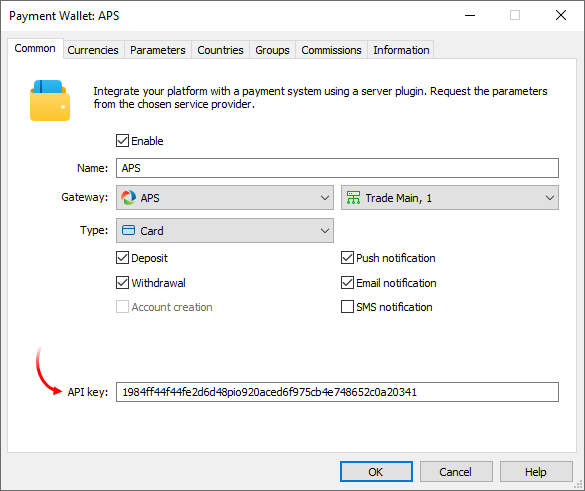
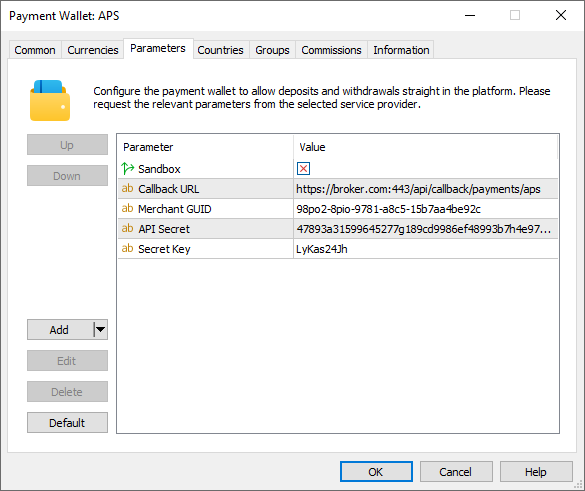
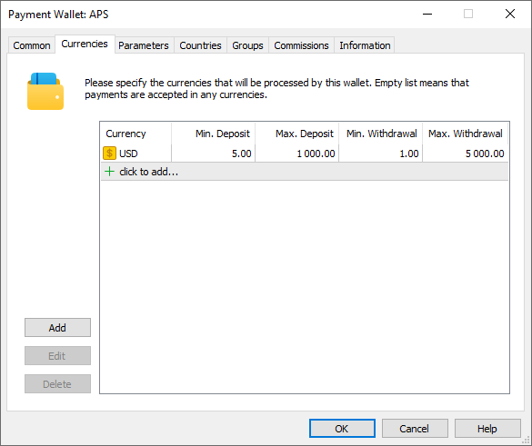
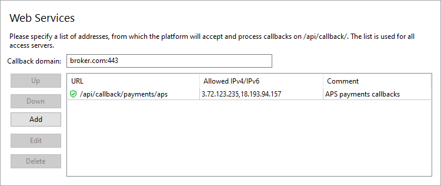

[🏠 Document Start](../../../../README.md) / [MetaTrader 5 Trading Platform](../../../../MetaTrader-5-Trading-Platform.md) / [Platform Setup](../../../Platform-Setup.md) / [Payments](../../Payments.md) / [Payment Gateways](../Payment-Gateways.md) / APS

[Previous](ECOMMPAY.md) | [Next](AstroPay.md)

# Advanced Payment Solutions (#advanced-payment-solutions)

[Advanced Payment Solutions (APS)](https://aps.money/) empowers businesses globally with online and corporate payment solutions. With APS, you can access multiple payment solutions for your clients worldwide, streamlining administrative processes and saving operational costs. The system supports card payments in more than 50 countries, as well as digital currency transactions and [Binance Pay](https://pay.binance.com) payments.

To connect APS payments, click 'Connect Provider' in the [showcase](../Payment-Gateways.md) and fill out a short online form. The company representative will contact you and will provide further instructions. After registration, you will receive system connection details:

  * Merchant GUID
  * Secret Key
  * App Token
  * App Secret

APS creates separate accounts to work with Binance Pay and card payments. Each account has individual connection data.

Create a [payment gateway configuration](../Payment-Gateways.md), select APS for the gateway, and specify 'App token' in the 'API Key' field:

In the 'Type' field, select a payment method you wish to connect:

  * Card
  * Binance Pay
  * OVO, Dana, LinkAja, QRIS (Indonesia)
  * FPX, Boost, DuitNow (Malaysia)
  * PromptPay (Thailand)
  * Viet QR, Momo, ViettelPay, ZaloPay (Vietnam)

If you want to use several payment methods, create separate wallet configurations.

Go to the 'Parameters' tab and specify Merchant GUID, Secret Key and App Secret:

## System limits (#limitations)

Clients use their Binance ID to make transactions through Binance Pay. The system does not disclose this identifier. In the transaction statuses on the MetaTrader 5 side, traders and managers will see Binance Pay ID, which is a different identifier. It does not match the Binance ID.

## Setting up the environment (#sandbox)

APS supports operations in a sandbox environment. In this environment, the provider simulates transaction processing so that you can check how payments work, without performing real money transactions. To connect to the sandbox environment, contact APS for a special wallet. When setting up this wallet in the platform, open the Parameters tab and enable the Sandbox option. This option must be disabled for wallets running in a live environment.

> You can verify the Binance Pay operation in test environment only using real Binance accounts. There are no test accounts.

## Currency settings (#currencies)

APS supports payments for a certain list of currencies. Request from the provider a list of available currencies and explicitly specify currencies in the wallet settings. In addition, you will need to set a limit on transaction amounts in accordance with APS requirements.

## Setting up callback requests (#callback)

Callbacks are used to quickly get transaction processing results. In each transaction, the platform transmits a special URL to which APS should send the processing result. To ensure proper generation of the addresses, you need to configure the platform accordingly.

> The use of callback requests is mandatory. Withdrawal operations do not work correctly without callbacks. Also, without callbacks, [Binance Pay ID (#limitations)](APS.md#limitations) will not be provided to the platform in operation details.

On the platform side, the callbacks are received and processed by access servers. To set up notifications:

1\. Register a domain (or a subdomain for your existing domain). APS will access the platform at this address. Also, endpoint addresses for callbacks will be formed relative to this address.

2\. Associate the domain with the [public IPv4 address (#public)](../../Network-cluster/Configuring-Servers.md#public) of one or more access servers. For further information please see [Integration\Web Services](../../Integrations/Web-Services.md). Please note that only IPv4 addresses are supported. Therefore, the domain must be associated with exactly such an address.

3\. [Add an SSL certificate (#ssl)](../../Integrations/Web-Services.md#ssl) for the specified domain in the Integration\Web Services section. The operation requires a certificate issued by a trusted certification authority, while self-signed certificates are not allowed even in a sandbox environment. Only the HTTPS protocol is allowed. HTTP is not supported.

4\. Select the address for the endpoint where callbacks will be accepted. The address is specified relative to the previously selected domain, taking into account the following rules

https://broker.com/api/callback/payments/aps  
---  
  
  * The first part is an example of a domain name.
  * The second part is a predefined part of the address that is used for all callbacks related to payment systems. For example, callbacks to https://broker.com/api/callback/my/callback will not reach wallets.
  * The third part is defined by you. You can enter any address, however we strongly recommend using a logical and clear naming system.

> Use different addresses for Callback requests if you create multiple APS wallet configurations.

5\. Add the selected URL to the allowed list in the Web Services section and specify the list of IP addresses, from which the payment provider will send transaction status notifications. You can obtain the address list from APS.

> Use port 443 to receive callbacks. APS does not support other ports.

6\. Specify the callbacks address in the 'Callback URL' parameter in the payment gateway settings. This address will be sent to APS in every transaction. Please make sure to specify a full address. The URL must include a domain name. Specifying an IP address is not allowed.

## Other settings (#other-settings)

All other settings are standard and do not differ from other gateways. You can set up currencies, commissions, gateway access by country, group, etc. For further details please visit the [Payment Gateways](../Payment-Gateways.md) section.
