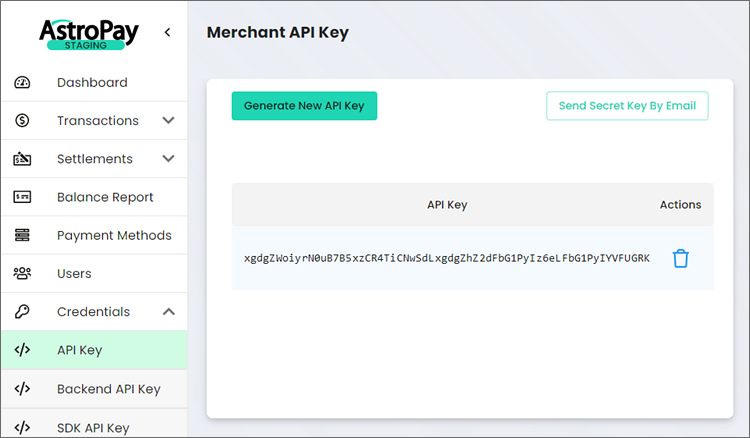
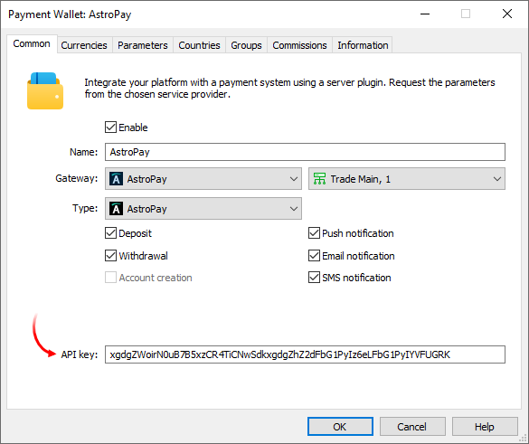
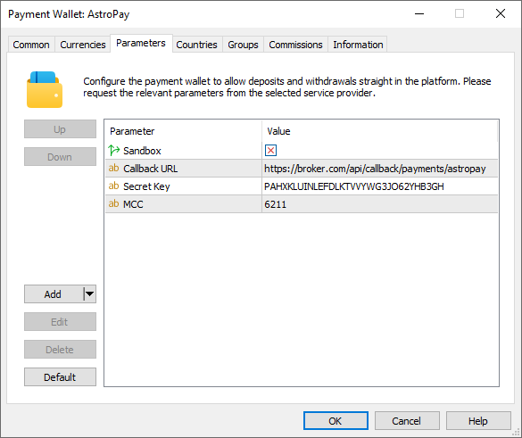
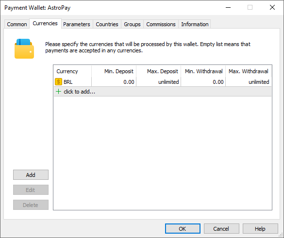
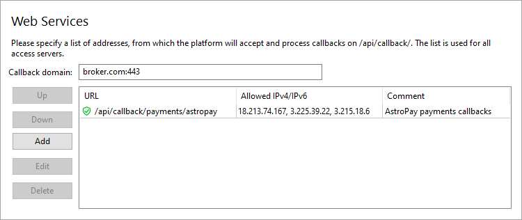

[🏠 Document Start](../../../../README.md) / [MetaTrader 5 Trading Platform](../../../../MetaTrader-5-Trading-Platform.md) / [Platform Setup](../../../Platform-Setup.md) / [Payments](../../Payments.md) / [Payment Gateways](../Payment-Gateways.md) / AstroPay

[Previous](APS.md) | [Next](EU-Paymentz.md)

# AstroPay (#astropay)

[AstroPay](https://www.astropay.com/) allows deposits and withdrawals directly using their AstroPay wallets. If the user does not have a wallet, the provider will transparently assist in paying/receiving money in any available way. In addition, AstroPay enables direct utilization of the Brazilian PIX money transfer system.

To connect AstroPay payments, click 'Connect Provider' in the [showcase](../Payment-Gateways.md) and fill out a short online form. The company representative will contact you and will provide further instructions. Upon entering into the agreement, [a merchant panel](https://merchants.astropay.com/) will be created for you. It will contain the necessary details for connecting the platform to the provider.

Open 'Credentials \ API Key' and click 'Generate API Key':

Next click 'Send Secret By Email' to receive the 'Secret Key' parameter to the email address registered in your merchant panel.

Create a [payment gateway configuration](../Payment-Gateways.md), select AstroPay for the gateway, and specify the previously received App Key in the 'API Key' field:

In the 'Type' field, select AstroPay or PIX Brasil depending on which payment method you wish to connect. If you want to use both payment methods, create two separate wallet configurations. Go to the Parameters tab and specify Secret key from the email:

The MCC ([Merchant category code](https://en.wikipedia.org/wiki/Merchant_category_code)) parameter is used to include information about the type of provided services. The default value is '6122 — Security Brokers and dealers'. Typically there is no need to change it.

## System limits (#limitations)

The payment system has the following limits:

  * One MetaTrader 5 account can use no more than two AstroPay wallets. If the limit is exceeded, a corresponding error will be displayed on the payment page which opens in client terminals.
  * One AstroPay wallet can be used on no more than two MetaTrader 5 accounts. If the limit is exceeded, a corresponding error will be displayed on the payment page which opens in client terminals.
  * [Refund operations (#refund)](../Processing.md#refund) through the platform are not supported for payments via PIX.
  * Payments through PIX are only made in Brazilian reals.

## Setting up the environment (#sandbox)

Upon connection to the system, you start working in a [sandbox (#sandbox)](https://developers-wallet.astropay.com/docs/onetouch/intro#sandbox) environment. In this environment, the provider simulates transaction processing so that you can check how payments work, without performing real money transactions. For the sandbox environment, you should log into your account using a separate link: <https://merchants-stg.astropay.com>. To configure a wallet for sandbox operations, use API Key and Secret Key from the sandbox account and enable the "Sandbox" parameter in the wallet settings on the MetaTrader 5 side:

To switch to the live operating mode, disable this option and replace the API Key and Secret Key with those available in the provider’s main account at <https://merchants.astropay.com/>.

## Currency settings (#currencies)

AstroPay supports payments for a certain list of currencies. Request from the provider a list of available currencies and explicitly specify currencies in the wallet settings. In addition, you will need to set a limit on transaction amounts in accordance with AstroPay requirements.

> When setting up payments through the PIX system, specify only Brazilian Real (BRL) as the available currency.

## Setting up callback requests (#callback)

Callbacks are used to quickly get transaction processing results. In each transaction, the platform transmits a special URL to which AstroPay should send the processing result. To ensure proper generation of the addresses, you need to configure the platform accordingly.

The use of callback requests is mandatory. The module does not work correctly without callbacks:

  * PIX payments may transition to a successful state after some time following their cancellation or expiration. Without properly functioning callbacks, the platform will be unable to receive the updated status of the operation.
  * Refunds to AstroPay wallets through the platform will not be possible since the information needed for the refund (user identifier) is only provided in callbacks.

On the platform side, the callbacks are received and processed by access servers. To set up notifications:

1\. Register a domain (or a subdomain for your existing domain). AstroPay will access the platform at this address. Also, endpoints for callbacks will be formed relative to this address.

2\. Associate the domain with the [public IPv4 address (#public)](../../Network-cluster/Configuring-Servers.md#public) of one or more access servers. For further information please see [Integration\Web Services](../../Integrations/Web-Services.md). Please note that only IPv4 addresses are supported. Therefore, the domain must be associated with exactly such an address.

3\. [Add an SSL certificate (#ssl)](../../Integrations/Web-Services.md#ssl) for the specified domain in the Integration\Web Services section. The operation requires a certificate issued by a trusted certification authority, while self-signed certificates are not allowed even in a sandbox environment. Only the HTTPS protocol is allowed. HTTP is not supported.

4\. Select the address for the endpoint where callbacks will be accepted. The address is specified relative to the previously selected domain, taking into account the following rules

https://broker.com/api/callback/payments/astropay  
---  
  
  * The first part is an example of a domain name.
  * The second part is a predefined part of the address that is used for all callbacks related to payment systems. For example, callbacks to https://broker.com/api/callback/my/callback will not reach wallets.
  * The third part is defined by you. You can enter any address, however we strongly recommend using a logical and clear naming system.

5\. Add the selected address to the allow list in the Web Services section, and also specify the list of IP addresses from which notifications will be allowed. You can request the addresses from AstroPay.

6\. Specify the callbacks address in the 'Callback URL' parameter in the payment gateway settings. This address will be sent to AstroPay in every transaction. Please make sure to specify a full address. The URL must include a domain name. Specifying an IP address is not allowed.

## Other settings (#other-settings)

All other settings are standard and do not differ from other gateways. You can set up currencies, commissions, gateway access by country, group, etc. For further details please visit the [Payment Gateways](../Payment-Gateways.md) section.
