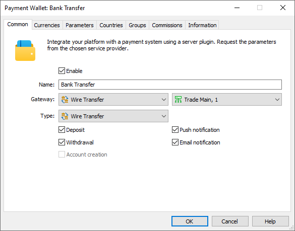
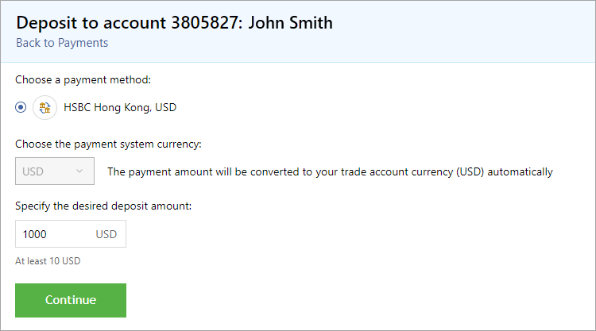
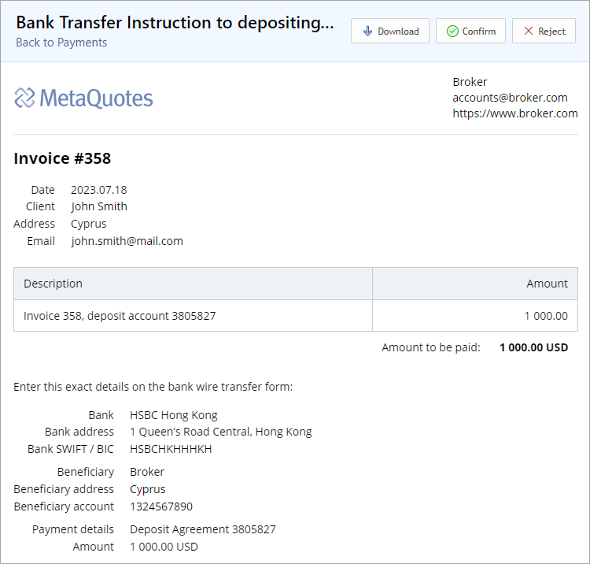
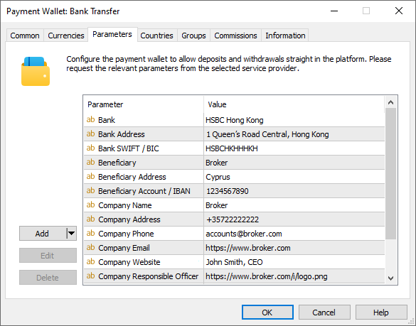
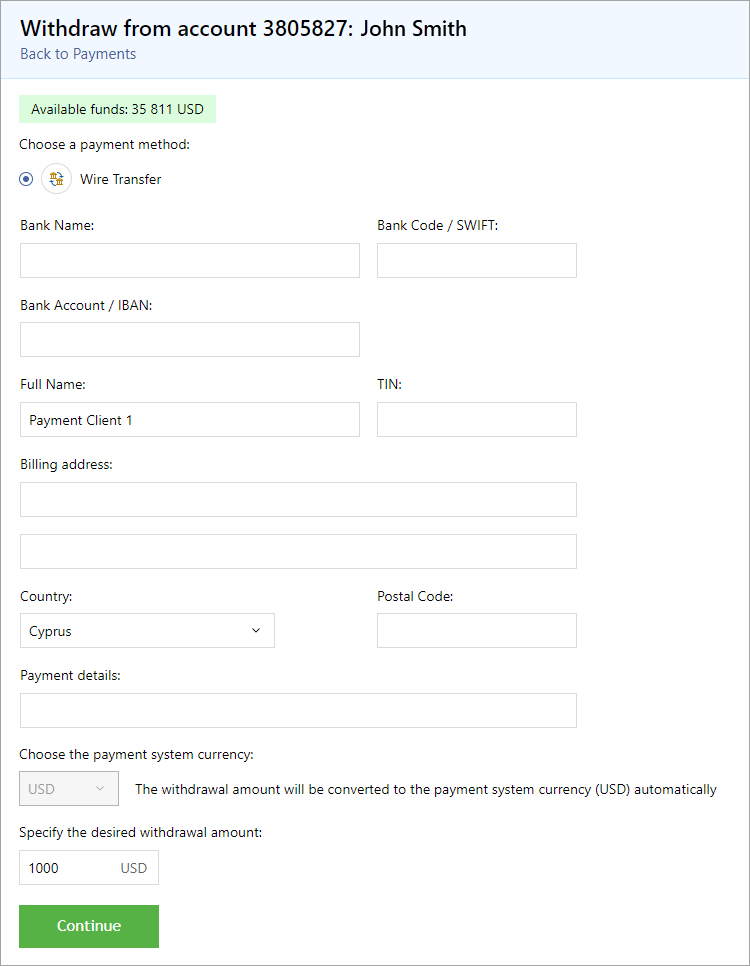
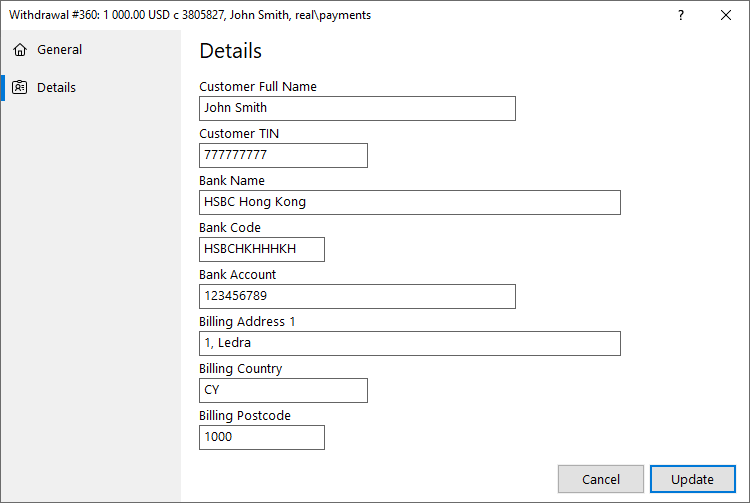

[🏠 Document Start](../../../../README.md) / [MetaTrader 5 Trading Platform](../../../../MetaTrader-5-Trading-Platform.md) / [Platform Setup](../../../Platform-Setup.md) / [Payments](../../Payments.md) / [Payment Gateways](../Payment-Gateways.md) / Bank Transfer

[Previous](UniPayment.md) | [Next](../Payment-Processing-Rules.md)

# Bank Transfer (#bank-transfer)

This payment processing option does not require integration with third-party online systems. It significantly facilitates and automates operations with bank transfers. By setting up bank transfers in the platform, you will receive a convenient payment processing tool. An option for depositing and withdrawing funds through bank transfers will appear in client terminals.

Create a [payment gateway configuration](../Payment-Gateways.md) and select "Bank transfer" as the gateway:

All other settings, except the Parameters section, are standard and do not differ from other gateways. You can set up currencies, commissions, gateway access by country, group, etc. For further details please visit the [Payment Gateways](../Payment-Gateways.md) section.

The Parameters section provides settings for account deposits via bank transfer. They will be discussed below.

## Deposits (#deposit)

To make a deposit, the user selects the appropriate option in the terminal's payments section:

Next, the user is forwarded to the page with the invoice, which should be paid. This page is [customizable](Bank-Transfer.md). When an invoice page is opened, an [active payment](../Controlling.md) with the "Processing" status is created in the system. A unique internal number is automatically assigned to it.

After checking the invoice, the client must confirm or decline it. Confirmation means that all data is correct, and the user will pay the invoice. After that, the payment's status in the system changes to "Pending". If the client declines the invoice for some reason, the payment record is deleted from the platform in order not to overload the database.

Next, you should check the receipt of money in your bank account. Once you receive the money, [confirm the payment through the Manager terminal](../Processing.md). Immediately after that, the amount will be credited to the client's trading account as a separate balance operation.

### Configuring invoices for bank transfers (#invoice-template)

An invoice is generated in the terminal based on the template, which is located in the file [main server directory]\templates\bank_transfer\default.htm. You can modify the template, but be careful with the macros, which substitute company, payment, and bank details in the template text. You can also create different [template versions for different languages (#multilanguage)](../../../Platform-Components/Trade-Server/Mail-Templates.md#multilanguage).

Macro values for the company and bank details are taken from the [payment gateway settings (#parameters)](../Payment-Gateways.md#parameters):

  * <!--COMPANY_LOGO--> — company logo, the 'Company Logo Url' parameter. In the gateway settings, the value can be filled in with a link to the corresponding image hosted on a publicly accessible site.
  * <!--COMPANY_NAME--> — company name, the 'Company Name' parameter. If the parameter is not filled in the gateway settings, the name will be taken from the [client group settings (#company)](../../Groups/Group-Settings.md#company).
  * <!--COMPANY_ADDRESS--> — company address, the 'Company Address' parameter.
  * <!--COMPANY_PHONE--> — company phone number, the 'Company Phone' parameter.
  * <!--COMPANY_EMAIL--> — company email, the 'Company Email' parameter. If the parameter is not filled in the gateway settings, the name will be taken from the client group settings.
  * <!--COMPANY_WEBSITE--> — company website, the 'Company Website' parameter. If the parameter is not filled in the gateway settings, the name will be taken from the client group settings.
  * <!--COMPANY_RESPONSIBLE_OFFICER--> — the name of the company employee, the 'Company Responsible Officer' parameter.
  * <!--COMPANY_SIGNATURE--> — the signature of the company employee, the 'Company Signature Url' parameter. In the gateway settings, the value can be filled in with a link to the corresponding image hosted on a publicly accessible site. If you cannot place the company's seal and the responsible officer's signature on publicly available resources for security reasons, you can add images to the template in binary form. For example: .
  * <!--COMPANY_SEAL--> — company's seal, the 'Company Seal Url' parameter. In the gateway settings, the value can be filled in with a link to the corresponding image hosted on a publicly accessible site.
  * <!--WALLET_BANK--> — bank name, the 'Bank' parameter.
  * <!--WALLET_BANK_ADDRESS--> — bank address, the 'Bank Address' parameter.
  * <!--WALLET_BANK_SWIFT--> — bank's SWIFT/BIC, the 'Bank SWIFT/BIC' parameter.
  * <!--WALLET_BENEFICIARY--> — account holder name, the 'Beneficiary' parameter.
  * <!--WALLET_BENEFICIARY_ADDRESS--> — account holder's address, the 'Beneficiary Address' parameter.
  * <!--WALLET_BENEFICIARY_ACCOUNT--> — account number or IBAN, the 'Beneficiary Account / IBAN' parameter.

Payment data is also filled in using macros, but their values are determined directly by the operation. Their description is available under the [payment gateways (#macros-payment)](../Payment-Gateways.md#macros-payment) section. Client data is filled in using the following macros:

  * <!--CLIENT_NAME--> — client's name.
  * <!--CLIENT_ADDRESS--> — client's address.
  * <!--CLIENT_PHONE--> — client's phone number.
  * <!--CLIENT_EMAIL--> — client's email.

Values for the macros are taken from account data on the server.

## Withdrawals (#withdrawal)

To withdraw funds, the user selects the appropriate option in the terminal's payments section: This will open a form for specifying bank details to which funds from the trading account will be transferred.

Once the form is filled out, an [active payment](../Controlling.md) with the "Waiting" status is created in the platform. A unique internal number is automatically assigned to it. This payment stores the details specified by the user. When the transaction is created, a balance operation to debit funds is immediately performed on the user's trading account. In fact, funds are blocked to prevent users from withdrawing more than they actually have.

Next, your accountant should make a bank transfer to the specified details. After that the [payment must be confirmed through the Manager terminal](../Processing.md).

If the transfer cannot be completed for some reason, the payment should be rejected. In this case, the amount of the failed operation will be automatically credited back to the trading account as a separate balance operation. The comment of the operation will contain "rollback #[withdrawal operation ticket]".
