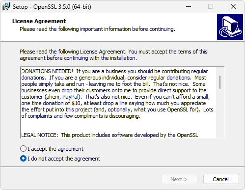
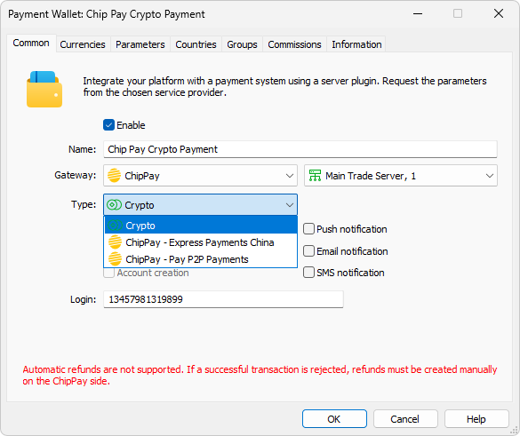
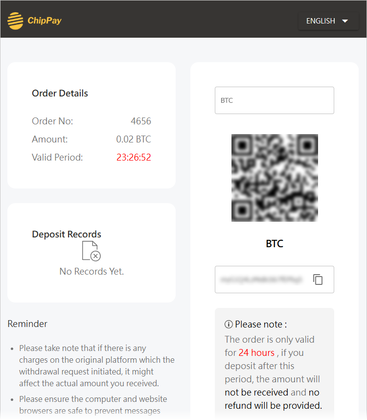
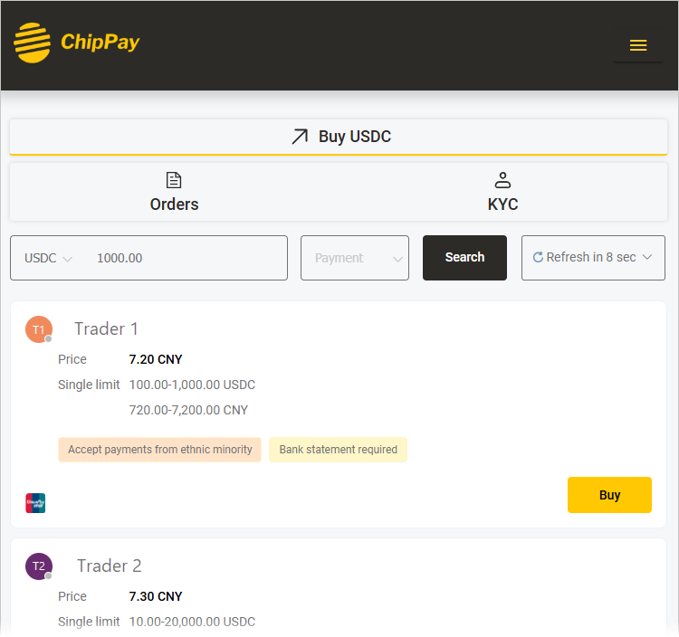
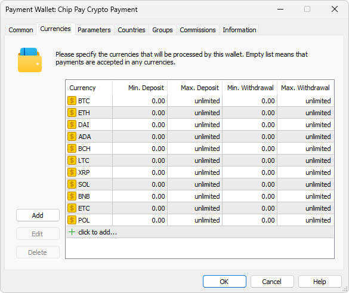
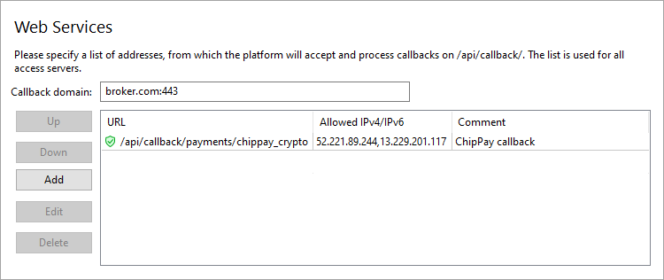
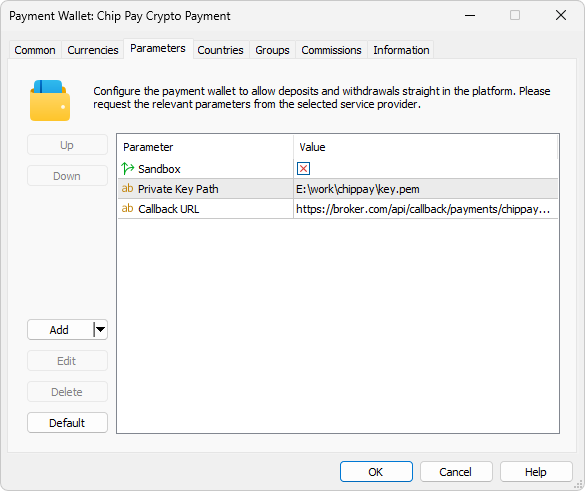

[🏠 Document Start](../../../../README.md) / [MetaTrader 5 Trading Platform](../../../../MetaTrader-5-Trading-Platform.md) / [Platform Setup](../../../Platform-Setup.md) / [Payments](../../Payments.md) / [Payment Gateways](../Payment-Gateways.md) / ChipPay

[Previous](STICPAY.md) | [Next](Uniwire.md)

# ChipPay (#chippay)

ChipPay specializes in helping partners manage their clients' fiat and cryptocurrency payment and exchange needs, especially in regions across Asia where traditional PSPs may face limitations. The company offers a stable, high-performance payment gateway that operates 24/7 and supports T+0 fund settlements. With ChipPay, you can handle your funds securely while avoiding freezing risks.

To connect ChipPay payments, click 'Connect Provider' in the [showcase](../Payment-Gateways.md) and fill out a short online form. You can also use the registration form on the [provider's website (#/)](https://www.chippay.com/#/). The company representative will contact you and will provide further instructions.

## Generating a Key and Obtaining a MID (#generating-a-key-and-obtaining-a-mid)

To ensure data security, the platform digitally signs each transaction. Uniques signatures are generated using asymmetric encryption:

  * The private key is securely stored on the platform's side. It is used exclusively to sign transactions. This key is never shared externally.
  * You provide ChipPay with the corresponding public key, which is used solely to verify the authenticity of signatures. It cannot be used to generate signatures.

This guarantees that only you can sign transaction data, ensuring that no one else can initiate payments on your behalf.

The system uses the standard SSL protocol for secure communication. You may generate your public and private key pair using any preferred method. Below is an example using the OpenSSL open-source library:

Go to the OpenSSL GitHub page and open the Binaries section: <https://github.com/openssl/openssl/wiki/Binaries>. Download and install the appropriate OpenSSL distribution for Windows:

After installation, open the Command Prompt as an administrator. From the command lime, navigate to the OpenSSL installation directory, for example:

CD C:\Program Files\OpenSSL-Win64\bin  
---  
  
Execute the following two commands in sequence:

openssl genpkey -out key.pem -algorithm RSA -pkeyopt rsa_keygen_bits:1024   
openssl rsa -in key.pem -outform PEM -pubout -out pub.pem  
---  
  
These commands will generate two files in the same directory:

  * pub.pem — your public key. Provide it to your ChipPay representative.
  * key.pem — your private key. Securely store it on the server where the MetaTrader 5 platform is installed. You will need to specify the [path to this file (#private-key-path)](ChipPay.md#private-key-path) when configuring the payment gateway.

Once the public key is received, ChipPay will issue your MID (Merchant Identifier), which serves as your unique ID within their system.

## Provider Configuration (#provider-configuration)

Create a [payment gateway configuration](../Payment-Gateways.md), select ChipPay for the gateway, and specify the previously received MID in the "Login" field:

In the 'Type' field, select the payment method:

  * Crypto — deposit via cryptocurrency using a temporary intermediary wallet.
  * Chip Pay Express Payments China — deposit and withdrawal in CNY.
  * Chip Pay P2P Payments — deposit through ChipPay's P2P system, where the user purchases cryptocurrency for crediting to the broker's account.

To use multiple payment methods in parallel, create separate wallet configurations. Detailed descriptions of each payment method follow [below (#limitations)](ChipPay.md#limitations).

Next, navigate to the Parameters tab and specify the path to the private key file you generated earlier:

## System Features and Limitations (#limitations)

Crypto deposits are implemented as follows:

  * When a user initiates a deposit through the Crypto method and specifies an amount in MetaTrader 5, ChipPay generates a unique cryptocurrency wallet and displays it on the payment page. The user must transfer the exact requested amount in the specified cryptocurrency to the provided wallet address.
  * During the payment lifetime (12 hours in the production environment and 24 hours in the test environment), the user can transfer funds to the specified wallet in any amount and in any [supported cryptocurrency (#10202)](https://open.chippay.com/api/EnaddExchangeOrder.html#10202). If the amount transferred is less than requested or if the currency differs, the transaction will be marked as unsuccessful. If the amount exceeds the requested sum, the payment will be successful, but the excess funds will not be accounted for or refunded.
  * All funds transferred by the user are credited to the broker's ChipPay account.
  * For each top-up, ChipPay sends transaction data to MetaTrader 5 for accurate reconciliation in the broker's payment records.

The P2P Payments method uses ChipPay's internal exchange. The user selects a counterparty from a list and purchases USDC using CNY. Other currencies are not supported in this method. Supported payment methods include: bank card, AliPay, WeChat, etc. After successful payment, the equivalent USD amount is credited to the broker's ChipPay account. ChipPay's internal exchange rate is used for conversion.

The Express Payments China method also uses the internal ChipPay exchange. The user selects a counterparty, transfers CNY via P2P, and the counterparty transfers the equivalent amount in cryptocurrency to the broker's wallet. Before proceeding with the transfer, the user must provide their name and phone number. By default, these fields are auto-filled using information from the user's [account (#personal)](../../Accounts/Editing-Account.md#personal).

This Express Payments China method also supports withdrawals to a bank card.

## Setting Up the Environment (#sandbox)

ChipPay supports operations in a sandbox environment. In this environment, the provider simulates transaction processing so that you can check how payments work, without performing real money transactions. To connect to the sandbox, ChipPay will assign you a separate test MID. Enter it in your wallet settings, under the Common tab, and enable the 'Sandbox' option in the Parameters tab.

## Currency Settings (#currencies)

Depending on the method, specify the appropriate currency to prevent customers from selecting other currencies when making payments via the terminal.

  * Crypto — a full list of supported cryptocurrencies is available in the documentation: <https://open.chippay.com/api/EnaddExchangeOrder.html#10202>. Currencies with names longer than three characters are not currently supported.
  * Chip Pay Express Payments China — only CNY.
  * Chip Pay P2P Payments — Chip Pay P2P Payments — only USD and CNY. USD deposits are converted 1:1 to USDT when credited to the user's account. For CNY payments, the user is credited in CNY, while the broker receives an equivalent amount in USDT, converted at ChipPay's internal exchange rate.

You must also set transaction limits in accordance with ChipPay's guidelines.

## Setting up callback requests (#callback)

Callback requests are used to promptly receive payment statuses. In each transaction, the platform transmits a special URL, to which ChipPay should send the processing result. To ensure proper generation of the addresses, you need to configure the platform accordingly.

> The use of callback requests is mandatory. Without them, you will not be able to receive transaction processing statuses.

On the platform side, the callbacks are received and processed by access servers. To configure notifications:

1\. Register a domain (or subdomain for your existing domain). ChipPay will use this address to communicate with the platform, and the endpoint address for callback requests will be formed relative to it.

2\. Associate the domain with the [public IP address (#public)](../../Network-cluster/Configuring-Servers.md#public) of one or more access servers. For further information, please see [Integration\Web Services](../../Integrations/Web-Services.md).

3\. [Add an SSL certificate (#ssl)](../../Integrations/Web-Services.md#ssl) for the specified domain in the Integration\Web Services section. The operation requires a certificate issued by a trusted certification authority, while self-signed certificates are not allowed even in a sandbox environment. Operation is only possible via the HTTPS protocol. HTTP is not supported.

4\. Choose an endpoint address for receiving callback requests. The address is specified relative to the previously selected domain, taking into account the following rules:

https://broker.com/api/callback/payments/chippay  
---  
  
  * The first part is an example of a domain name.
  * The second part is a predefined part of the address that is used for all callback requests related to payment systems. For example, callbacks to https://broker.com/api/callback/my/callback will not reach wallets.
  * The third part is defined by you. You can specify any address, but we strongly recommend using a logical and clear naming system. Depending on the type of payment method selected, the following addresses are substituted into the Callback URL parameter in the default gateway settings:

  *     * Crypto — .../api/callback/payments/chippay_crypto
    * Chip Pay Express Payments China — .../api/callback/payments/chippay_exp
    * Chip Pay P2P Payments — .../api/callback/payments/chippay_p2p

5\. Add the selected URL to the allowed list in the Web Services section and specify the list of IP addresses, from which the payment provider will send transaction status notifications. Please contact ChipPay for this list of addresses.

6\. Specify the callback address in the Callback URL parameter in the payment gateway settings. The system will use it to attribute the received request to the relevant wallets. Please make sure to specify a full address. The URL must include a domain name. Specifying an IP address is not allowed.

## Other Settings (#other-settings)

All other settings are standard and do not differ from other gateways. You can set up currencies, commissions, gateway access by country, group, etc. For further details, please visit the [Payment Gateways](../Payment-Gateways.md) section.
