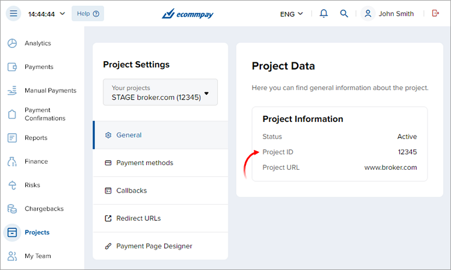
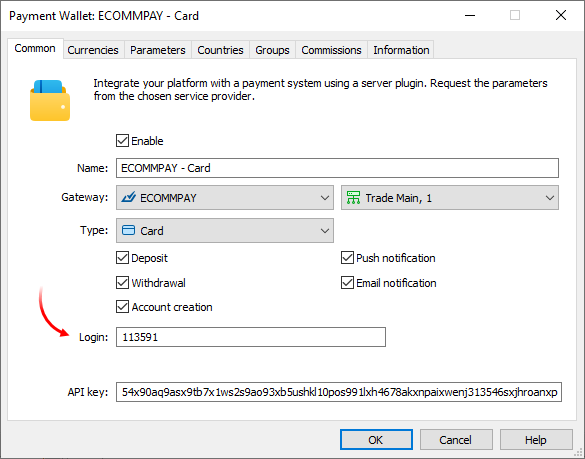
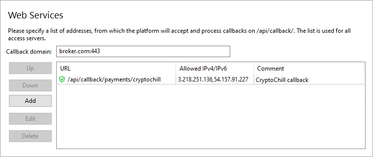
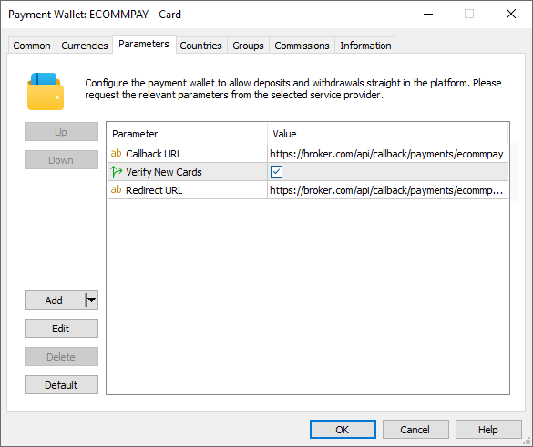
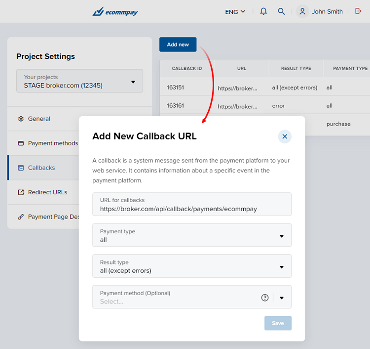
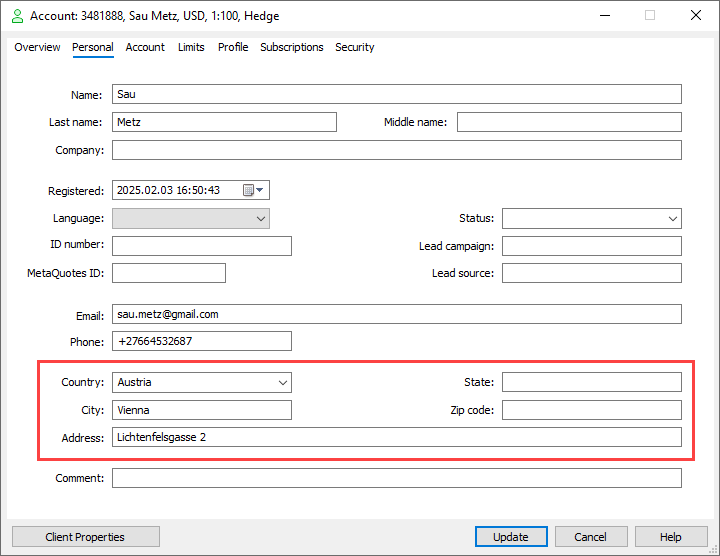

[🏠 Document Start](../../../../README.md) / [MetaTrader 5 Trading Platform](../../../../MetaTrader-5-Trading-Platform.md) / [Platform Setup](../../../Platform-Setup.md) / [Payments](../../Payments.md) / [Payment Gateways](../Payment-Gateways.md) / ECOMMPAY

[Previous](Unlimit.md) | [Next](APS.md)

# Integration with ECOMMPAY (#integration-with-ecommpay)

[ECOMMPAY](https://ecommpay.com/) is an international payment service provider and direct card acquirer for mid-sized & large e-commerce businesses. The single gateway allows companies to receive and process transactions through popular payment systems, including Visa, Mastercard, PayPal, Alipay, etc. ECOMMPAY also provides advanced payment protection and a flexible risk management system.

To connect ECOMMPAY payments, fill out a short [online form](https://ecommpay.com/apply-now/). Their representative will contact you and will provide further instructions. After registration, you will receive system connection details.

ECOMMPAY will create a project through which payments will be processed. This project has:

  * ID
  * Key

For further details please see the [ECOMMPAY documentation (#en-pp-quickstart)](https://developers.ecommpay.com/en/en_pp_quickstart.html#en-pp-quickstart).

The project ID can be viewed in your account in the Project\Project Settings section. The key is provided to you once, when the project is created. If you lose or need to change your credentials, you should contact the ECOMMPAY support service.

Create a [payment gateway configuration](../Payment-Gateways.md), select ECOMMPAY as the gateway, and indicate connection details: project ID in the Login fields and the in the API key field:

In the "Type" field, select the payment method you want to connect:

  * Card payments
  * Skrill
  * Neteller

To use multiple payment methods in parallel, create separate wallet configurations. If you need additional payment methods, please contact our [support team](../../../Technical-Support.md).

## Select card verification type (#verify)

For security purposes and to reduce regulatory requirements for the broker, users can withdraw funds only to previously linked cards. MetaTrader 5 provides a relevant procedure for adding a [payment account (#account-payments)](../Controlling.md#account-payments). ECOMMPAY supports the procedure in two modes: [card_verify](https://developers.ecommpay.com/en/en_platform_account_verification_model.html?hl=card_verify) and [card_tokenize](https://developers.ecommpay.com/en/en_pp_token.html?hl=card_tokenize). The first one is more preferable as it allows 3DS authentication (with an additional payment authorization with a code or through a mobile application) and verification of card details. However, it is not supported for all ECOMMPAY customers. You should check with ECOMMPAY if this mode is available to you. If it is, enable the Verify New Cards option in the gateway settings.

Upon successful deposit operations, the card is linked automatically. There is no need to preauthorize it.

## Setting up callbacks (#callback)

Callbacks are used to quickly get transaction processing results. After each operation, ECOMMPAY sends its status to a URL which you specify in the project settings. Accordingly, to enable the receipt of these notifications at the specified address in the platform, you should configure the platform accordingly.

For further details about callbacks on the ECOMMPAY side please visit the [documentation (#en-gate-callbacks)](https://developers.ecommpay.com/en/en_Gate_Callbacks.html#en-gate-callbacks).

> The use of callbacks is optional. However, if you do not them, updating payment statuses can take up to three minutes. This may reduce the quality of your customer service.

On the platform side, the callbacks are received and processed by access servers. To set up notifications:

1\. Register a domain (or a subdomain for your existing domain). ECOMMPAY will access the platform at this address. Also, endpoint addresses for callbacks will be formed relative to this address.

2\. Associate the domain with the [public address (#public)](../../Network-cluster/Configuring-Servers.md#public) of one or more access servers. For further information please see [Integration\Web Services](../../Integrations/Web-Services.md).

3\. [Add an SSL certificate (#ssl)](../../Integrations/Web-Services.md#ssl) for the specified domain in the Integration\Web Services section. The operation requires a certificate issued by a trusted certification authority, while self-signed certificates are not allowed even in a test environment. Only the HTTPS protocol is allowed. HTTP is not supported.

4\. Select the address for the endpoint where callbacks will be accepted. The address is specified relative to the previously selected domain, taking into account the following rules:

https://broker.com/api/callback/payments/ecommpay  
---  
  
  * The first part is an example of a domain name.
  * The second part is a predefined part of the address that is used for all callbacks related to payment systems. For example, callbacks to https://broker.com/api/callback/my/callback will not reach wallets.
  * The third part is defined by you. You can enter any address, however we strongly recommend using a logical and clear naming system.

5\. Add the selected address to the allow list in the Web Services section, and also specify the list of IP addresses from which notifications will be allowed. You can request the addresses from ECOMMPAY.

> Use port 443 to receive callbacks. ECOMMPAY does not support other ports.

6\. Specify the callbacks address in the Callback URL parameter in the payment gateway settings. The system will use it to attribute the received request to the relevant wallets. Please make sure to specify a full address. The URL must include a domain name. Specifying an IP address is not allowed.

7\. Open your ECOMMPAY personal account and go to the Callbacks section in the project. Using the 'Add new' command, create three callbacks with the following parameters:

  * Payment type = all, Result type = all (except errors)
  * Payment type = all, Result type = error
  * Payment type = purchase, Result type = tokenize

In each of them, specify the same address in the 'URL for callbacks' field. The address is specified along with the domain.

## Redirect URL (#redirect-url)

Typically, upon completing a payment on its page, the provider redirects the user back to the merchant's website. The provider allows specifying a predetermined redirection page.

In the case of payments in MetaTrader 5, this redirection page is the client terminal itself. Since the terminal does not have a public internet address, a special callback address must be configured within the platform. The provider will send requests to this address upon payment completion, and the platform will intercept these requests to automatically redirect the user to the appropriate page within the terminal.

Create a redirect address in the same way as you do for [callback requests (#callback)](ECOMMPAY.md#callback). The address must be a subpath to the address for callback requests. For example, the callback address is

https://broker.com/api/callback/payments/ecommpay  
---  
  
Then the redirect address can be

https://broker.com/api/callback/payments/ecommpay/payment-result  
---  
  
The highlighted part can be anything.

Enter this address in the Redirect URL parameter in the payment gateway settings and inform your ECOMMPAY manager.

> The Redirect URL must be a subpath of the Callback URL.

## Account configuration (#accounts)

For merchants operating in the Forex and cryptocurrency trading sectors, VISA imposes additional requirements. When processing payment transactions, they must provide not only the customer's full name (entered by the user when specifying card details) but also their address. The ECOMMPAY module supports this requirement and automatically fills in the necessary details based on the information from the trading account:

To ensure successful payment processing, the following fields must be completed in the account: Country, City, and Address. The State field is required only for U.S. citizens and must specify the state of residence.

## Other settings (#other-settings)

All other settings are standard and do not differ from other gateways. You can set up currencies, commissions, gateway access by country, group, etc. For further details please visit the [Payment Gateways](../Payment-Gateways.md) section.
