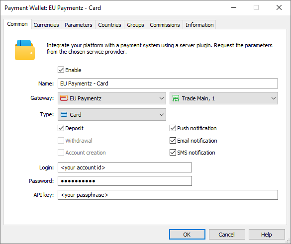
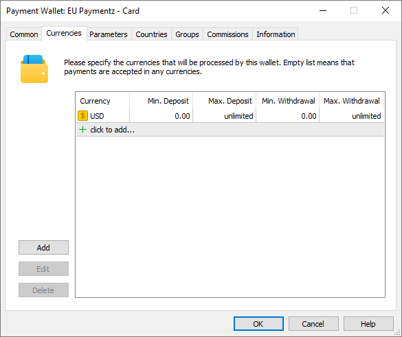
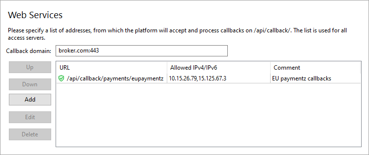
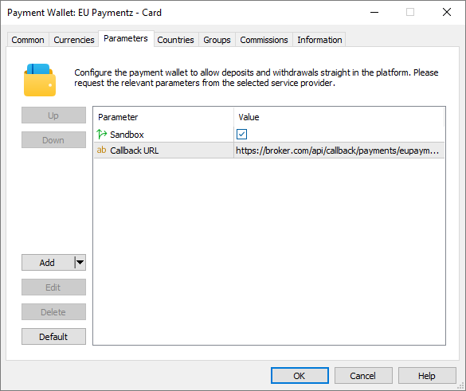

[🏠 Document Start](../../../../README.md) / [MetaTrader 5 Trading Platform](../../../../MetaTrader-5-Trading-Platform.md) / [Platform Setup](../../../Platform-Setup.md) / [Payments](../../Payments.md) / [Payment Gateways](../Payment-Gateways.md) / EU Paymentz

[Previous](AstroPay.md) | [Next](Kora.md)

# EU Paymentz (#eu-paymentz)

With [EU Paymentz](https://www.eupaymentz.com/), users can replenish their accounts using bank cards, as well as deposit and withdraw funds using local interbank transfers (EFT, Electronic Fund Transfer), including transactions in African countries.

To connect EU Paymentz payments, click 'Connect Provider' in the [showcase](../Payment-Gateways.md) and fill out a short online form. You can also use the registration form on the [provider's website](https://www.eupaymentz.com/high-risk-payment-gateway/). The company representative will contact you and will provide further instructions. EU Paymentz provides three types of accounts:

  * CC sent - Direct and 3DS Response: implies that the broker (merchant) will collect and send card data. This option requires special licenses and compliance with the PCI DSS standard, so it is not implemented in MetaTrader 5.
  * No CC sent - Hosted: payments are made using banking card, and data is entered on the PSP's page.
  * No CC sent - Direct: payments are made using other methods, in particular local interbank transfers.

The last two accounts can be connected to the platform. You can request one or both, depending on your needs.

Upon finalizing the agreement with the payment provider, you will receive the necessary details to connect to the system, including the account id, password and passphrase.

Create a [payment gateway configuration](../Payment-Gateways.md), select EU Paymentz for the gateway, and enter the data received previously

  * account id in the 'Login' field
  * password in the 'Password' field
  * passphrase in the 'API Key' field

In the 'Type' field, select 'Card' or 'Bank transfer' depending on which payment method you wish to connect. If you want to use both payment methods, create two separate wallet configurations.

## System limits features (#limitations)

The payment system has the following features:

  * Only deposit transactions are supported for card payments.
  * EFT (Electronic Fund Transfer) payments can be used for deposits and withdrawals.
  * Payment is not possible if the client is connected to the platform access server from the local network. Please take this into account when testing the system.
  * EFT payments combine multiple payment methods. When performing a transaction, the user is asked to enter the bank account number, bank code, and bank name. The account number is always required; the need to fill out other parameters depends on the specific payment method.

## Setting up the environment (#sandbox)

EU Paymentz supports operations in a test (sandbox) environment. In this environment, the provider simulates transaction processing so that you can check how payments work, without performing real money transactions. To connect to the sandbox environment, contact EU Paymentz for a special wallet. When setting up this wallet in the platform, open the Parameters tab and enable the Sandbox option. This option must be disabled for wallets running in a live environment.

## Currency settings (#currencies)

EU Paymentz supports payments for a certain list of currencies. Request from the provider a list of available currencies and explicitly specify currencies in the wallet settings. In addition, you will need to set a limit on transaction amounts in accordance with EU Paymentz requirements.

## Setting up callback requests (#callback)

Callbacks are used to quickly get transaction processing results. In each transaction, the platform transmits a special URL to which EU Paymentz should send the processing result. To ensure proper generation of the addresses, you need to configure the platform accordingly.

> The use of callbacks is optional. However, if you do not them, updating payment statuses can take up to three minutes. This may reduce the quality of your customer service.

On the platform side, the callbacks are received and processed by access servers. To set up notifications:

1\. Register a domain (or a subdomain for your existing domain). EU Paymentz will access the platform at this address. Also, address of the endpoint for callbacks will be formed relative to this address.

2\. Associate the domain with the [public IPv4 address (#public)](../../Network-cluster/Configuring-Servers.md#public) of one or more access servers. For further information please see [Integration\Web Services](../../Integrations/Web-Services.md). Please note that only IPv4 addresses are supported. Therefore, the domain must be associated with exactly such an address.

3\. [Add an SSL certificate (#ssl)](../../Integrations/Web-Services.md#ssl) for the specified domain in the Integration\Web Services section. The operation requires a certificate issued by a trusted certification authority, while self-signed certificates are not allowed even in a sandbox environment. Only the HTTPS protocol is allowed. HTTP is not supported.

4\. Select the address for the endpoint where callbacks will be accepted. The address is specified relative to the previously selected domain, taking into account the following rules

https://broker.com/api/callback/payments/eupaymentz  
---  
  
  * The first part is an example of a domain name.
  * The second part is a predefined part of the address that is used for all callbacks related to payment systems. For example, callbacks to https://broker.com/api/callback/my/callback will not reach wallets.
  * The third part is defined by you. You can enter any address, however we strongly recommend using a logical and clear naming system.

5\. Add the selected address to the allow list in the Web Services section, and also specify the list of IP addresses from which notifications will be allowed. You can request the addresses from EU Paymentz.

6\. Specify the callbacks address in the 'Callback URL' parameter in the payment gateway settings. This address will be sent to EU Paymentz in every transaction. Please make sure to specify a full address. The URL must include a domain name. Specifying an IP address is not allowed.

## Other settings (#other-settings)

All other settings are standard and do not differ from other gateways. You can set up currencies, commissions, gateway access by country, group, etc. For further details please visit the [Payment Gateways](../Payment-Gateways.md) section.
