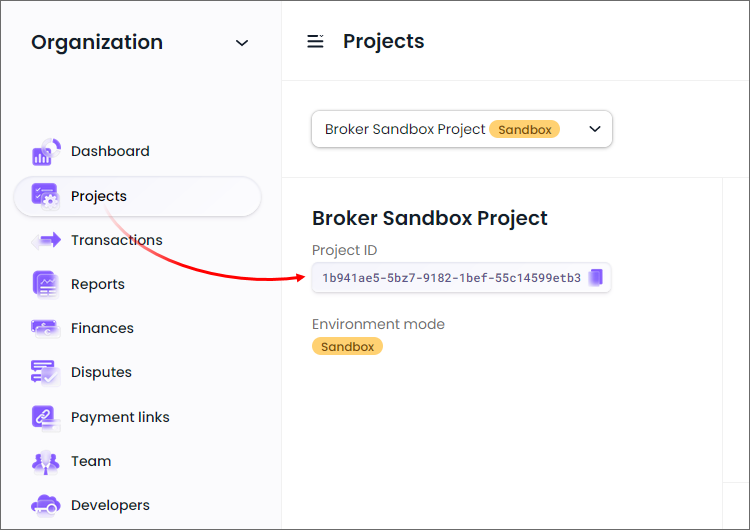
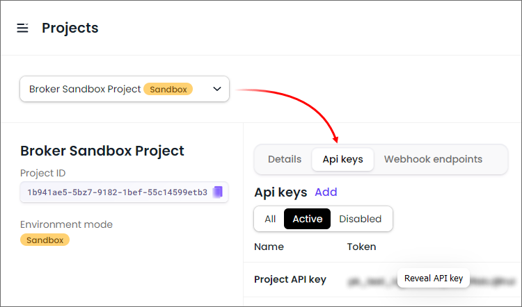
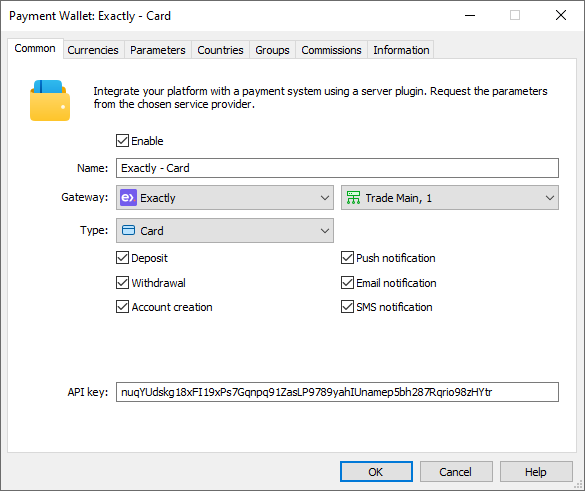
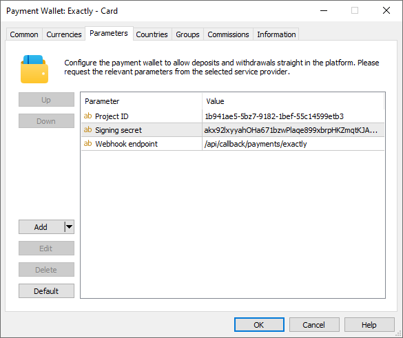
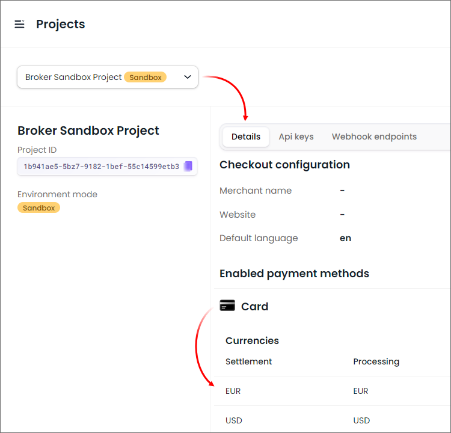
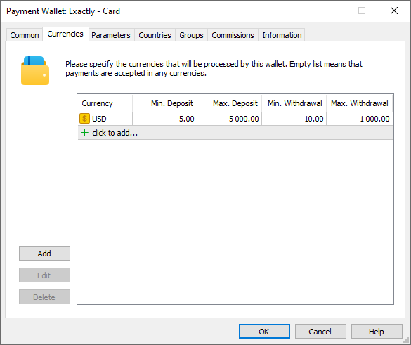
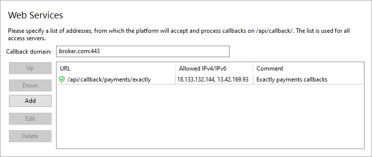
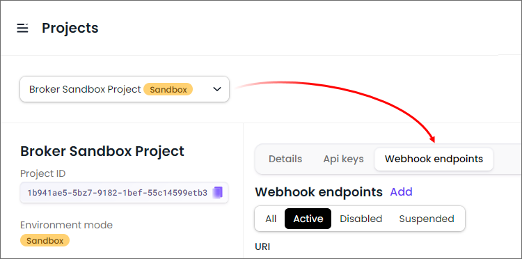
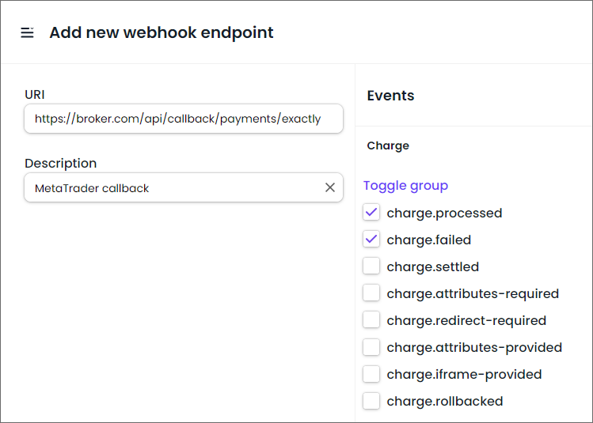
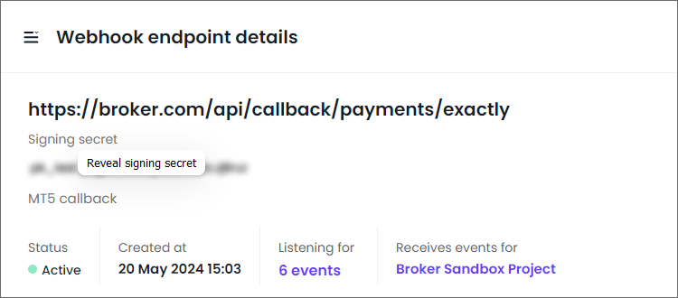

[🏠 Document Start](../../../../README.md) / [MetaTrader 5 Trading Platform](../../../../MetaTrader-5-Trading-Platform.md) / [Platform Setup](../../../Platform-Setup.md) / [Payments](../../Payments.md) / [Payment Gateways](../Payment-Gateways.md) / Exactly

[Previous](Pay-com.md) | [Next](Ozow.md)

# Exactly (#exactly)

The payment provider [Exactly](https://exactly.com/) offers a wide range of payment methods, including cards, bank transfers via the Open Banking system for the EU and UK, PIX system for Brazil, and MB Way and Multibanco systems for Portugal. The provider supports payments in 60+ currencies in more than 200 countries.

To connect Exactly payments, click 'Connect provider' in the [showcase](../Payment-Gateways.md) and fill out a short form. You can also use the registration form on the [provider's website](https://application.exactly.com/). The company representative will contact you and will provide further instructions.

After registration, you will be given access to your personal account, where you can find settings for connecting the provider in MetaTrader 5. You will need the following parameters:

  * 'Project ID' and 'API Key' to connect the wallet
  * 'Signing secret' to set up [callback requests (#callback)](Exactly.md#callback)

Open the 'Projects' section and copy the 'Project ID' parameter:

On the right side, go to the 'Api keys' section and copy the API key. If the key does not exist, create a new one by clicking 'Add'.

Create a [payment gateway configuration](../Payment-Gateways.md), select Exactly for the gateway and specify the API key under the Common section:

In the 'Type' field, select a payment method you wish to connect:

  * Card payments
  * Bank transfers via Open Banking system
  * MB Way
  * Multibanco
  * PIX

If you want to use multiple payment methods, create separate wallet configurations.

Open the Parameters section and copy the Project ID from your personal account to the corresponding parameter:

## System features and limitations (#limitations)

The payment system has the following features:

  * Withdrawal operations are only supported for cards.
  * [Refund operations (#refund)](../Processing.md#refund) are only supported for cards and the MB Way system.

## Setting Up the Environment (#sandbox)

Exactly supports operations in a sandbox environment. In this environment, the provider simulates transaction processing so that you can check how payments work, without performing real money transactions. To connect to the sandbox environment, contact Exactly for a special wallet. You will receive a separate project. Copy the API key and Project ID from this project and paste it to the appropriate parameters in the wallet settings in MetaTrader 5.

The payment gateway automatically determines the status of the current project: production or sandbox. All payments made in the sandbox environment are marked as demo transactions on the MetaTrader 5 side.

## Currency settings (#currencies)

Exactly supports payments in a variety of currencies. Each payment method supports different sets of currencies. The list of currencies is specified in the project settings in your personal account:

In your wallet settings, specify a list of supported currencies in accordance with the information from your personal account. Also, set a limit on transaction amounts in accordance with Exactly requirements.

## Setting up callback requests (#callback)

Callback requests are used to quickly receive transaction processing results. After each transaction, Exactly sends its status to the URL address which you specified in the wallet settings. Therefore, to ensure the platform receives these notifications at the specified address, it must be configured accordingly.

> The use of callback requests is optional. However, if you do not configure them, payment status updates may take longer. This could negatively impact the quality of your customer service.

On the platform side, the callback requests are received and processed by access servers. To configure notifications:

1\. Register a domain (or subdomain for your existing domain). Exactly will use this address to communicate with the platform, and the endpoint address for callback requests will be formed relative to it.

2\. Associate the domain with the [public IP address (#public)](../../Network-cluster/Configuring-Servers.md#public) of one or more access servers. For further information, please see [Integration\Web Services](../../Integrations/Web-Services.md).

3\. [Add an SSL certificate (#ssl)](../../Integrations/Web-Services.md#ssl) for the specified domain in the Integration\Web Services section. The operation requires a certificate issued by a trusted certification authority, while self-signed certificates are not allowed even in a sandbox environment. Operation is only possible via the HTTPS protocol. HTTP is not supported.

4\. Choose an endpoint address for receiving callback requests. The address is specified relative to the previously selected domain, taking into account the following rules

https://broker.com/api/callback/payments/exactly  
---  
  
  * The first part is an example of a domain name.
  * The second part is a predefined part of the address that is used for all callback requests related to payment systems. For example, callbacks to https://broker.com/api/callback/my/callback will not reach wallets.
  * The third part is defined by you. You can enter any address, however we strongly recommend using a logical and clear naming system.

5\. Add the selected URL to the allowed list in the Web Services section and specify the list of IP addresses, from which the payment provider will send transaction status notifications. Please contact Exactly for this list of addresses.

6\. Specify the callback address in the 'Webhook endpoint' parameter in the payment gateway settings. The system will use it to attribute the received request to the relevant wallets. The address is specified without a domain name.

7\. Specify the address for Callback requests in your Exactly account. Open the project, go to the 'Webhook endpoints' section and click Add:

Configure the webhook parameters:

  * URL — the address for sending webhooks in accordance with the settings specified in steps 5 and 6. The address should be specified with the domain included.
  * Description — an arbitrary name

On the right side, select the events that will be sent through this webhook:

  * charge.processed
  * charge.failed
  * transfer.processed
  * transfer.failed
  * charge-authorize.processed
  * charge-authorize.failed

Save your changes. Return to the list of webhooks and click on the newly created webhook to open its settings.

To protect notifications from changes, Exactly signs each callback request with a special password, which is specified in the 'Signing secret' field. Click 'Reveal signing secret'.

Paste this value into the 'Signing secret' parameter in the wallet settings to enable the platform to verify signatures.

8\. Request Exactly's technical support to add the "payment-result" domain to the whitelist for your account.

For regular online purchases, after a transaction is completed, the user is redirected from the payment page back to the store (merchant) page. Since MetaTrader 5 is not a web service, it does not have such a page. Instead, the user is redirected to a special address https://payment-result/Exactly%20Card. Based on this redirect, the platform understands that the payment is completed and returns the user to the main payment page.

To enable this redirect, the "payment-result" domain must be resolved on the Exactly side.

## Other Settings (#other-settings)

All other settings are standard and do not differ from other gateways. You can set up currencies, commissions, gateway access by country, group, etc. For further details, please visit the [Payment Gateways](../Payment-Gateways.md) section.
