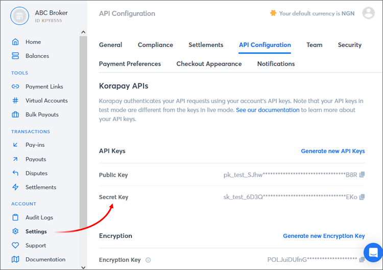
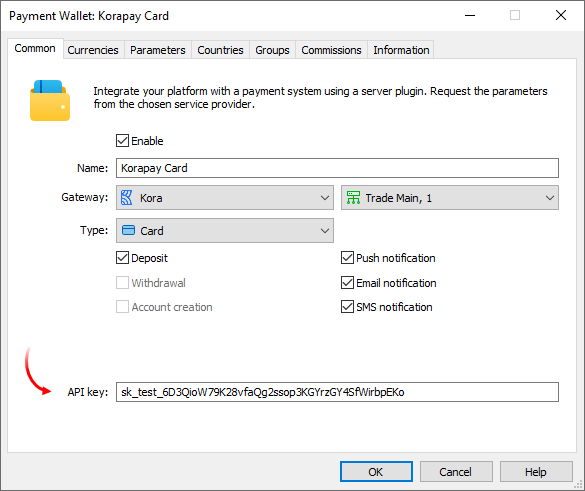
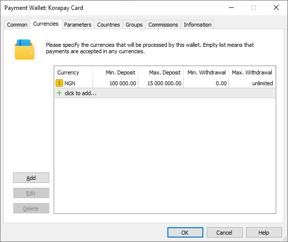
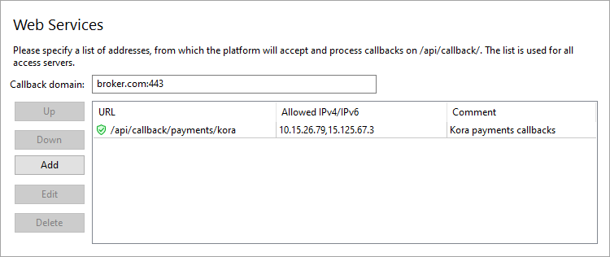
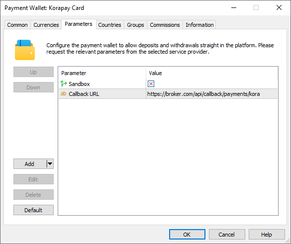

[🏠 Document Start](../../../../README.md) / [MetaTrader 5 Trading Platform](../../../../MetaTrader-5-Trading-Platform.md) / [Platform Setup](../../../Platform-Setup.md) / [Payments](../../Payments.md) / [Payment Gateways](../Payment-Gateways.md) / Kora

[Previous](EU-Paymentz.md) | [Next](emerchantpay.md)

# Kora (#kora)

[Kora](https://www.korahq.com/) is a Pan-African payment infrastructure offering payment solutions in Nigeria, Kenya and Ghana. With this integration, you can provide the possibility for your traders to top up accounts using cards and bank transfers. In addition, the system provides mobile payment options for Kenya and Ghana.

To connect Kora payments, click 'Connect Provider' in the [showcase](../Payment-Gateways.md) and fill out a short online form. You can also use the registration form on the [provider's website](https://www.korahq.com/contact-us). The company representative will contact you and will provide further instructions. Using the created credential, go to your merchant account, navigate to Account \ Settings \ API Configuration and copy 'Secret Key' provided in this section.

Create a [payment gateway configuration](../Payment-Gateways.md), select Kora for the gateway, and specify the previously received Secret Key in the 'API Key' field:

In the "Type" field, select "Card", "Mobile Money" or "Bank Transfer" depending on which payment method you connect. If you want to use multiple payment methods, create separate wallet configurations.

## System limits features (#limitations)

The payment system has the following features:

  * For card payments, only transactions in NGN and KES currencies are supported.
  * Deposit transactions via bank transfers are only possible in NGN. Withdrawals to bank cards are available in KES and NGN.
  * Mobile payments are only available in the KES and GHS currencies.
  * For payments via Mobile Money, the user must indicate a telephone number, which must consist of 12 digits, including the country code. For example, 254700000000.

## Setting up the environment (#sandbox)

Kora supports operations in a [sandbox environment](https://developers.korapay.com/docs/test-live-modes). In this environment, the provider simulates transaction processing so that you can check how payments work, without performing real money transactions. You can switch between these modes in your personal account. To configure a wallet for sandbox operations, enable the "Sandbox" parameter in the wallet settings on the MetaTrader 5 side:

## Currency settings (#currencies)

Kora supports payments for a certain list of currencies. You should explicitly specify the required currencies in the wallet settings. In addition, you will need to set a limit on transaction amounts in accordance with Kora requirements and your company policies.

When configuring payments via Mobile Money with the possibility of withdrawal operations, you can select only one of the currencies supported for this method: KES or GHS. To set up payments in both currencies, create two separate gateway configurations. Similar restrictions apply when configuring withdrawals via Wire Transfer. In this case, specify either the KES or NGN currency. If you only enable deposit transactions, this limitation can be ignored.

## Setting up callback requests (#callback)

Callbacks are used to quickly get transaction processing results. In each transaction, the platform transmits a special URL to which Kora should send the processing result. To ensure proper generation of the addresses, you need to configure the platform accordingly.

> The use of callbacks is optional. However, if you do not them, updating payment statuses can take up to three minutes. This may reduce the quality of your customer service.

On the platform side, the callbacks are received and processed by access servers. To set up notifications:

1\. Register a domain (or a subdomain for your existing domain). Kora will access the platform at this address. Also, endpoints for callbacks will be formed relative to this address.

2\. Associate the domain with the [public IPv4 address (#public)](../../Network-cluster/Configuring-Servers.md#public) of one or more access servers. For further information please see [Integration\Web Services](../../Integrations/Web-Services.md). Please note that only IPv4 addresses are supported. Therefore, the domain must be associated with exactly such an address.

3\. [Add an SSL certificate (#ssl)](../../Integrations/Web-Services.md#ssl) for the specified domain in the Integration\Web Services section. The operation requires a certificate issued by a trusted certification authority, while self-signed certificates are not allowed even in a sandbox environment. Only the HTTPS protocol is allowed. HTTP is not supported.

4\. Select the address for the endpoint where callbacks will be accepted. The address is specified relative to the previously selected domain, taking into account the following rules

https://broker.com/api/callback/payments/kora  
---  
  
  * The first part is an example of a domain name.
  * The second part is a predefined part of the address that is used for all callbacks related to payment systems. For example, callbacks to https://broker.com/api/callback/my/callback will not reach wallets.
  * The third part is defined by you. You can enter any address, however we strongly recommend using a logical and clear naming system.

5\. Add the selected address to the allow list in the Web Services section, and also specify the list of IP addresses from which notifications will be allowed. You can request the addresses from Kora.

6\. Specify the callbacks address in the 'Callback URL' parameter in the payment gateway settings. This address will be sent to Kora in every transaction. Please make sure to specify a full address. The URL must include a domain name. Specifying an IP address is not allowed.

## Other settings (#other-settings)

All other settings are standard and do not differ from other gateways. You can set up currencies, commissions, gateway access by country, group, etc. For further details please visit the [Payment Gateways](../Payment-Gateways.md) section.
