[🏠 Document Start](../../../../README.md) / [MetaTrader 5 Trading Platform](../../../../MetaTrader-5-Trading-Platform.md) / [Platform Setup](../../../Platform-Setup.md) / [Payments](../../Payments.md) / [Payment Gateways](../Payment-Gateways.md) / OpenPayd

[Previous](The-Kingdom-Bank.md) | [Next](STICPAY.md)

# OpenPayd (#openpayd)

OpenPayd provides a comprehensive banking and payment infrastructure, including accounts, currency exchange, international and local payments, acquiring services, and Open Banking solutions. With an expanding portfolio of licenses covering the UK, Europe, and North America, OpenPayd equips numerous digital businesses worldwide with essential payment solutions. The platform currently supports 102 countries.

By enabling OpenPayd paiments in MetaTrader 5, you can accept client deposits via manual and automated bank transfers through the Direct Banking system. The service supports 14 currencies, including EUR, USD, and GBP, as well as popular cryptocurrencies.

To enable payments through OpenPayd, click 'Connect Provider' in the [showcase](../Payment-Gateways.md) and complete a short application form. You can also use the registration form on the [provider's website](https://www.openpayd.com/contact-us/). After registration, a company representative will contact you to guide you through the next steps.

Once registered, you will gain access to your personal account, where you can find the necessary connection details. Open your account settings and go to 'Developers \ API Keys'. If you do not have an API key yet, create one:

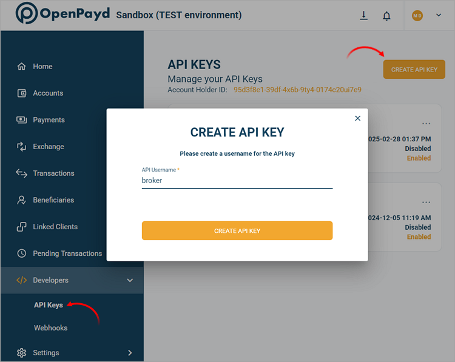

Enter any recognizable name as 'API Username' and click 'Create API key'. A password will be displayed once – save it securely, as you will not be able to view it again after closing the window.

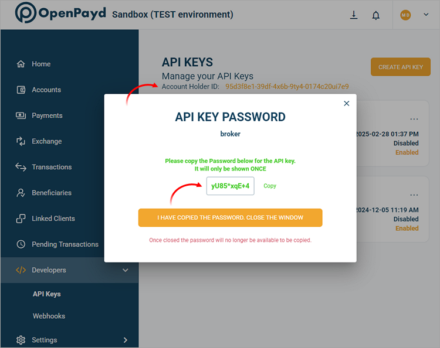

You will also need the Account Holder ID, which is displayed at the top of the section.

Create a new [payment gateway configuration](../Payment-Gateways.md) and select 'OpenPayd' as the gateway:

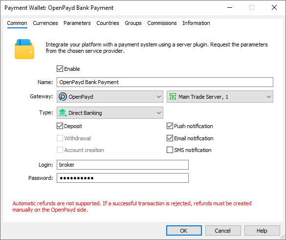

In the 'Type' field, select a payment method:

  * Wire Transfer (manual)
  * Direct Banking — fast interbank transfers

If you want to use multiple payment methods, create separate wallet configurations.

In the Login field, enter the API Username from your API key. In the Password field, enter the API key password. Navigate to the 'Parameters' tab and enter the 'Account Holder ID' obtained from the 'Developers \ API Keys' section.

## Environment Configuration (#sandbox)

OpenPayd offers a sandbox environment for testing transactions. In this environment, the provider simulates transaction processing so that you can check how payments work, without performing real money transactions. To access the test environment, contact OpenPayd for a special wallet. A separate account with necessary credentials will be provided. Enter these credentials in your wallet settings and enable the 'Sandbox' parameter.

If the wallet is used in real environment, you should configure its 'Environment' parameter accordingly. OpenPayd provides different environments depending on the jurisdiction in which the broker operates:

  * UK – for companies in the UK and those outside the European Economic Area (EEA).
  * EU – for companies within the EEA.

Confirm the appropriate setting with your OpenPayd manager.

## Currency Configuration (#currencies)

Each currency in OpenPayd operates through a separate internal account. To use it for payments in MetaTrader 5, specify its ID in the gateway settings. Open the Accounts section in your OpenPayd profile and create an account in the desired currency.

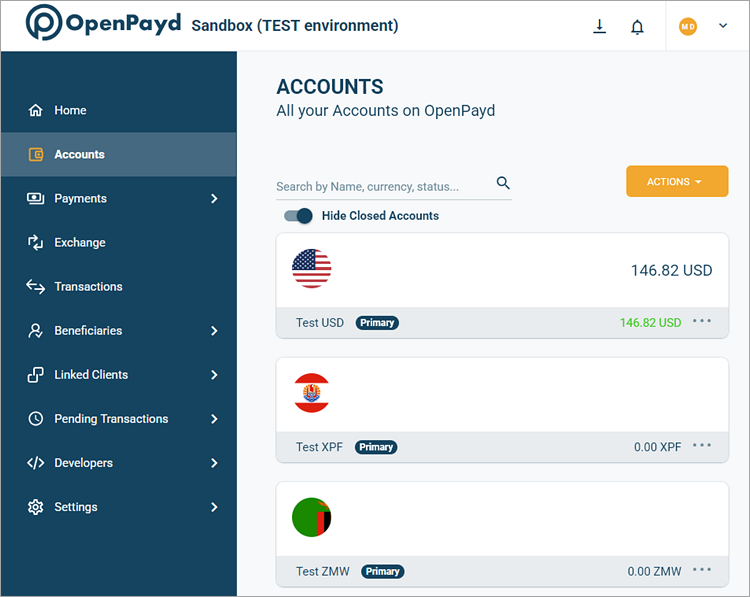

Select the created account to open its details and copy the ID field.

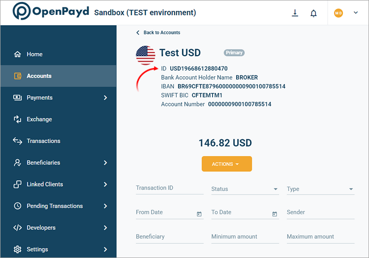

Paste this ID into the Account ID parameter in your payment gateway settings. To use multiple currencies, specify their account IDs separated by commas.

Next, specify the corresponding currencies in the 'Currencies' and transaction limits according to OpenPayd requirements.

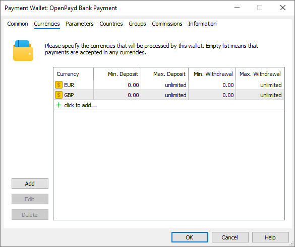

> Direct Banking supports only GBP and EUR.

## Setting up callback requests (#callback)

Callback requests are used to promptly receive payment statuses. OpenPayd sends requests to a URL specified by you in your wallet settings. Accordingly, to enable the receipt of these notifications at the specified address in the platform, you should configure the platform accordingly.

> The use of callback requests is mandatory for the "Bank Transfer" method. Without them, you will not be able to receive transaction processing statuses.

On the platform side, the callbacks are received and processed by access servers. To configure notifications:

1\. Register a domain (or subdomain for your existing domain). OpenPayd will use this address to communicate with the platform, and the endpoint address for callback requests will be formed relative to it.

2\. Associate the domain with the [public IP address (#public)](../../Network-cluster/Configuring-Servers.md#public) of one or more access servers. For further information, please see [Integration\Web Services](../../Integrations/Web-Services.md).

3\. [Add an SSL certificate (#ssl)](../../Integrations/Web-Services.md#ssl) for the specified domain in the Integration\Web Services section. The operation requires a certificate issued by a trusted certification authority, while self-signed certificates are not allowed even in a sandbox environment. Operation is only possible via the HTTPS protocol. HTTP is not supported.

4\. Choose an endpoint address for receiving callback requests. The address is specified relative to the previously selected domain, taking into account the following rules:

https://broker.com/api/callback/payments/openpayd_direct  
---  
  
  * The first part is an example of a domain name.
  * The second part is a predefined part of the address that is used for all callback requests related to payment systems. For example, callbacks to https://broker.com/api/callback/my/callback will not reach wallets.
  * The third part is defined by you. You can specify any address, but we strongly recommend using a logical and clear naming system. 

5\. Add the selected URL to the allowed list in the Web Services section and specify the list of IP addresses, from which the payment provider will send transaction status notifications. Please contact OpenPayd for this list of addresses.

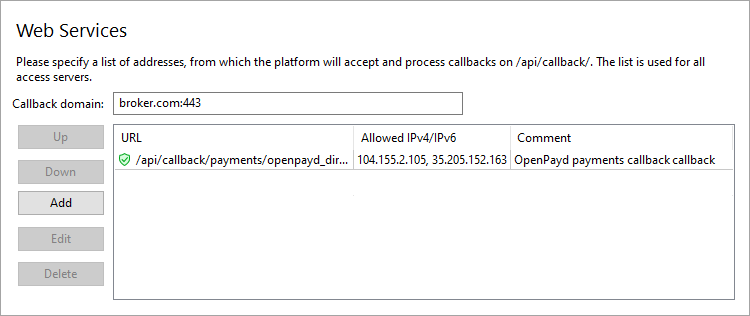

6\. Specify the callback address in the Callback URL parameter in the payment gateway settings. The system will use it to attribute the received request to the relevant wallets. Please make sure to specify a full address. The URL must include a domain name. Specifying an IP address is not allowed.

7\. Add the final address for callback requests to your OpenPayd personal account in the Developers\Webhooks section. Click Add Webhook, enter the address, and select the following as the events to receive:

  * Open Banking - Payment Status Updated – for the Direct Banking method
  * Pay In - Completed – for the Bank Transfer method

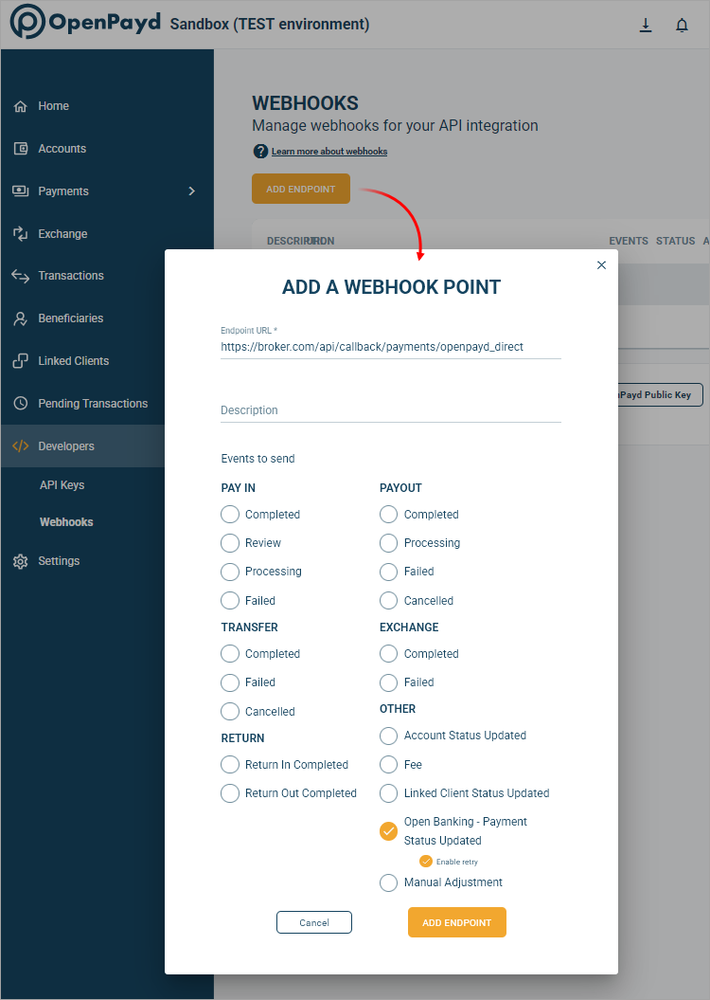

## Request Signing (#request-signing)

To protect the information transmitted, OpenPayd signs each request sent with a special private key. To enable the platform to verify the authenticity of requests, download the public key from your account. Open the Developers\Webhooks section and click 'Download OpenPayd Public Key':

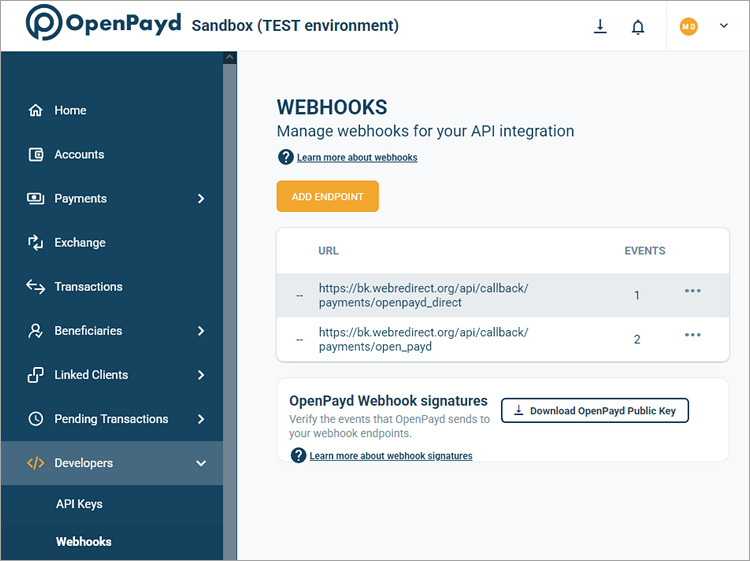

Save the resulting PUBLIC_KEY.pem file in any directory on the server where your MetaTrader 5 platform is installed. Next, specify the absolute path to this file in the 'Security Key Path' parameter in the payment gateway settings:

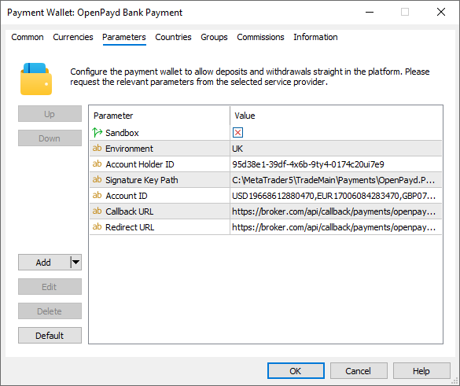

> When configuring the web callback address in the Callback URL parameter, be sure to specify the signature verification key.

## Redirect URL (#redirect-url)

This setting is only required for the Direct Banking method.

Typically, upon completing a payment on its page, the provider redirects the user back to the merchant's website. The provider allows specifying a predetermined redirection page.

In the case of payments in MetaTrader 5, this redirection page is the client terminal itself. Since the terminal does not have a public internet address, a special callback address must be configured within the platform. The provider will send requests to this address upon payment completion, and the platform will intercept these requests to automatically redirect the user to the appropriate page within the terminal.

Create a redirect address in the same way as you do for [callback requests (#callback)](OpenPayd.md#callback). The address must be a subpath to the address for callback requests. For example, the callback address is

https://broker.com/api/callback/payments/openpayd_direct  
---  
  
Then the redirect address can be

https://broker.com/api/callback/payments/openpayd_direct/payment-result  
---  
  
The highlighted part can be anything.

Enter this address in the Redirect URL parameter in the payment gateway settings and inform your OpenPayd manager.

> The Redirect URL must be a subpath of the Callback URL.

## Other Settings (#other-settings)

All other settings are standard and do not differ from other gateways. You can set up currencies, commissions, gateway access by country, group, etc. For further details, please visit the [Payment Gateways](../Payment-Gateways.md) section.

## Manual Bank Transfers with OpenPayd (#manual-bank-transfers-with-openpayd)

When initiating a manual bank transfer in the client terminal, the trader will see the broker's OpenPayd account details based on their selected currency and [Account ID (#currencies)](OpenPayd.md#currencies) settings. The payment reference will be displayed in the format "MT5 <Login> <PaymentID>".

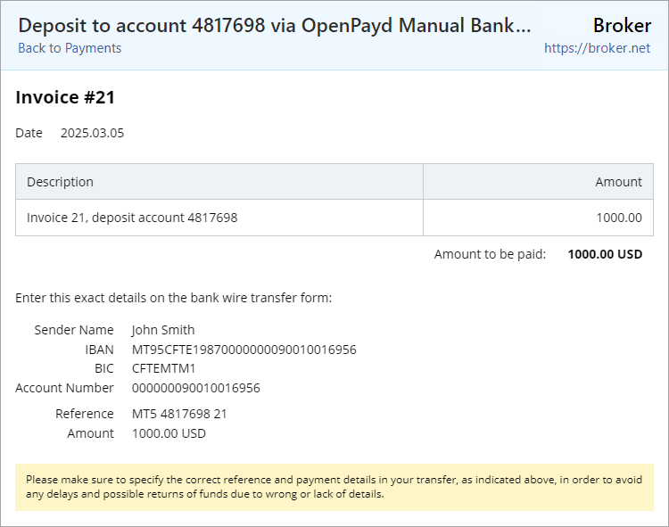

The user must complete the transfer with this Reference. Upon receiving the transaction, OpenPayd will notify the payment plugin via a web callback, and the plugin will finalize the payment using the transaction Reference.

If the user does not complete the transfer within 14 days, the transaction will be moved to the [payment history (#history)](../Controlling.md#history). However, if OpenPayd later sends a corresponding web callback, the payment can still be successfully processed.
