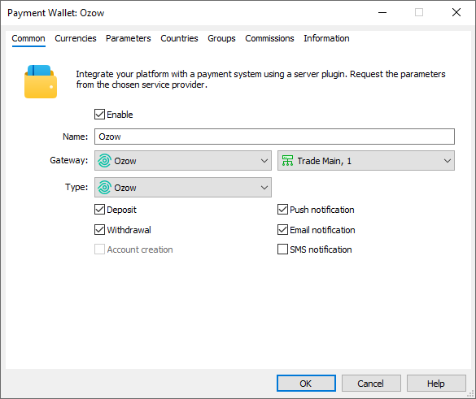
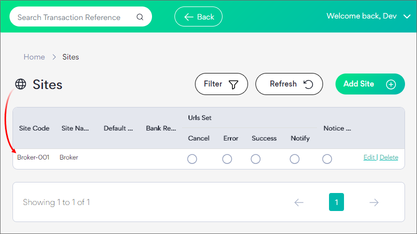
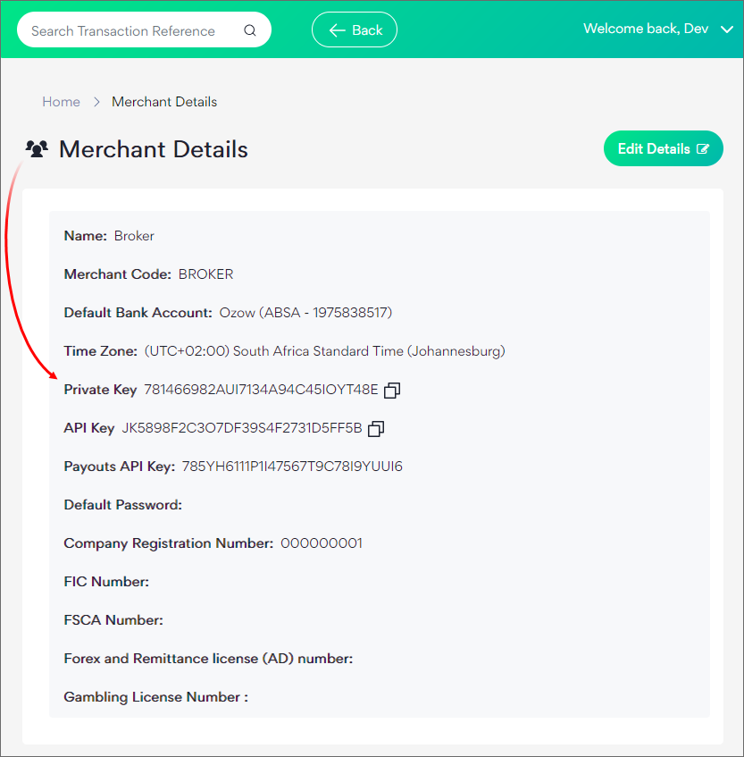
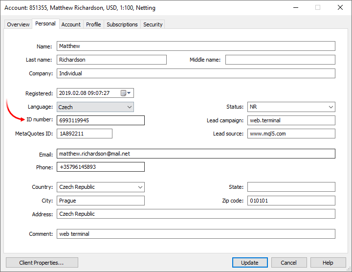
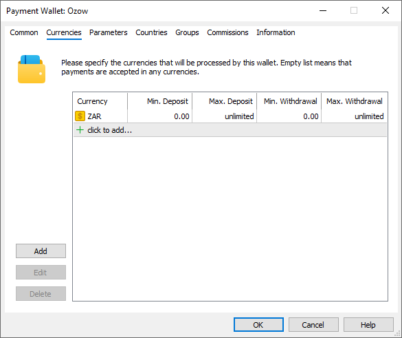
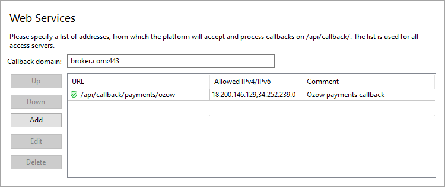
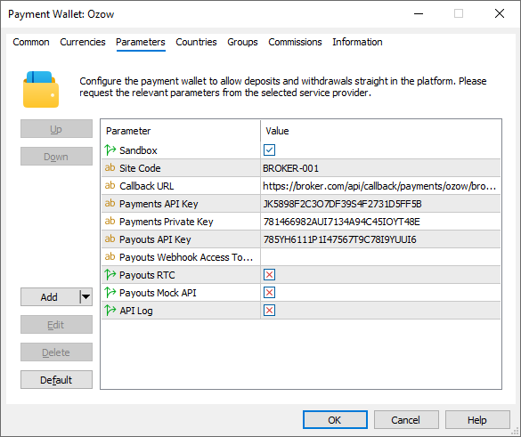

[🏠 Document Start](../../../../README.md) / [MetaTrader 5 Trading Platform](../../../../MetaTrader-5-Trading-Platform.md) / [Platform Setup](../../../Platform-Setup.md) / [Payments](../../Payments.md) / [Payment Gateways](../Payment-Gateways.md) / Ozow

[Previous](Exactly.md) | [Next](AK-Remit.md)

# Ozow (#ozow)

The [Ozow](https://ozow.com/) payment provider operates on South Africa, offering the ability to deposit and withdraw funds via local bank transfers. Designed to simplify and accelerate the traditional inter-bank payment process, Ozow provides a seamless, fast, and secure alternative to outdated payment methods. By eliminating the manual steps and significantly reducing transaction times, Ozow empowers merchants to process payments in seconds.

To connect Ozow payments, click 'Connect Provider' in the [showcase](../Payment-Gateways.md) and fill out a short online form. You can also use the registration form on the [provider's website](https://ozow.com/become-a-merchant). The company representative will contact you and will provide further instructions.

After registration, you will be given access to your personal account, where you can find settings for connecting the provider in MetaTrader 5.

Create a [payment gateway configuration](../Payment-Gateways.md) and select 'Ozow' for the gateway:

The "Type" field provides only one payment method – Ozow. The payment system/bank will be selected on the payment provider page, to which the user is redirected from the trading terminal. Next, select the permitted operations: deposits or withdrawals.

All settings for connecting to the provider are configured under the "Parameters" section:

Specify 'Site Code' – the merchant site code for processing payments, available in the '[Sites](https://stagingdash.ozow.com/MerchantAdmin/Site)' section of your Ozow account. In this case, your platform will act as a website.

If you do not have a site yet, or you need an additional one, for example, to set up another wallet, create the site. To do this, click 'Add Site'.

Next, set the access keys in the wallet settings on the MetaTrader 5 side:

  * Payments API Key – the authorization key for deposit requests, corresponds to the API Key parameter in the merchant panel.
  * Payments Private Key – the key used to sign deposit requests, corresponds to the Private Key parameter in the merchant panel.
  * Payouts API Key – authorization and signature key for payout requests.

These parameters are available in your Ozow account, under the [Merchant Details](https://stagingdash.ozow.com/MerchantAdmin/Merchant/Details) section:

## System Features and Limitations (#limitations)

Payments on the Ozow side can have the [PendingInvestigation status (#transaction-object)](https://hub.ozow.com/docs/step-3-check-transaction-status-using-api#transaction-object) — An inconclusive result was received by the bank. The payment needs to be verified manually. The status is used in case of processing issues on the bank's side.

If the payment on the MetaTrader 5 side is displayed as Pending for a long time, find it through your Ozow account and check the status. If the payment is in the PendingInvestigation status, find out more about what happened to the transaction. After that, contact Ozow technical support, requesting them to finalize the payment state: Complete, Error or Cancelled. Be sure to ask for a status update in the API as well, otherwise the payment on the platform side will remain in the pending state.

Ozow requires users to provide their document number (passport, ID, etc.) for every financial transaction. To prevent the submission of false information, the platform does not allow users to enter the document number manually. Instead, the number is automatically filled in using the details from the trading account:

Therefore, for payments through Ozow to work correctly, the broker must obtain the user's document number and specify it in the account settings.

## Setting Up the Environment (#sandbox)

Ozow supports operations in a sandbox environment. In this environment, the provider simulates transaction processing so that you can check how payments work, without performing real money transactions. To connect to the sandbox environment, contact Ozow for a special wallet. You will receive a separate project. Copy the access keys from this project and paste them to the appropriate fields in the wallet settings in MetaTrader 5. Also enable the 'Sandbox' option.

All payments made in the sandbox environment are marked as demo transactions on the MetaTrader 5 side.

## Currency Settings (#currencies)

Ozow only supports payments in one currency: South African Rand (ZAR). Specify it in the gateway settings. Also, set a limit on transaction amounts in accordance with Ozow requirements.

## Configuring Callback Requests (#callback)

Callback requests are used to promptly receive payment statuses ([notify url (#notification-response)](https://hub.ozow.com/docs/step-2-process-ozow-response#notification-response)) and to confirm payouts ([payout webhook](https://hub.ozow.com/docs/step-3-verify-payout-webhook-merchant-implementation)). Ozow sends requests to a URL specified by you in your wallet settings. Accordingly, to enable the receipt of these notifications at the specified address in the platform, you should configure the platform.

> The use of callback requests is mandatory. Without them, you will not be able to provide withdrawal operations.

On the platform side, the callbacks are received and processed by access servers. To configure notifications:

1\. Register a domain (or subdomain for your existing domain). Ozow will use this address to communicate with the platform, and the endpoint address for callback requests will be formed relative to it.

2\. Associate the domain with the [public IP address (#public)](../../Network-cluster/Configuring-Servers.md#public) of one or more access servers. For further information, please see [Integration\Web Services](../../Integrations/Web-Services.md).

3\. [Add an SSL certificate (#ssl)](../../Integrations/Web-Services.md#ssl) for the specified domain in the Integration\Web Services section. The operation requires a certificate issued by a trusted certification authority, while self-signed certificates are not allowed even in a sandbox environment. Operation is only possible via the HTTPS protocol. HTTP is not supported.

4\. Choose an endpoint address for receiving callback requests. The address is specified relative to the previously selected domain, taking into account the following rules:

https://broker.com/api/callback/payments/ozow  
---  
  
  * The first part is an example of a domain name.
  * The second part is a predefined part of the address that is used for all callback requests related to payment systems. For example, callbacks to https://broker.com/api/callback/my/callback will not reach wallets.
  * The third part is defined by you. You can enter any address, however we strongly recommend using a logical and clear naming system.

5\. Add the selected URL to the allowed list in the Web Services section and specify the list of IP addresses, from which the payment provider will send transaction status notifications. Please contact Ozow for this list of addresses.

6\. Specify the callback address in the Callback URL parameter in the payment gateway settings. The system will use it to attribute the received request to the relevant wallets. Please make sure to specify a full address. The URL must include a domain name. Specifying an IP address is not allowed.

Also, indicate 'Payouts Webhook Access Token', the token for authenticating payout confirmation callbacks. This is a unique code that you should choose. It must be long enough and contain different types of characters: numbers, lowercase and uppercase letters.

7\. Provide the Callback URL and Payouts Webhook Access Token to Ozow support to enable payout functionality. They will add these parameters to your profile.

Testing Procedure for Connecting Withdrawal Operations

To connect withdrawal operations in a real environment, Ozow requires the [Payouts Integration Testing](https://hub.ozow.com/docs/payouts-integration-testing) procedure. In simplified form, the procedure is as follows:

1\. Enable the API Log parameter in the gateway settings to log raw statuses of operations and callback requests received from Ozow API endpoints.

2\. Follow the steps in the "The following scenario needs to be tested" section of the Ozow guide.

3\. Enable the Payouts Mock API parameter in the gateway settings; it is a flag indicating the use of the test mode for payments.

4\. Follow the steps in the "Simulation records in Mock API" section of the Ozow guide, switching the Mock API to the desired mode using curl or other methods:

Reset to successful payout:

curl --request POST "https://stagingpayoutsapi.ozow.com/mock/v1/settestconfiguration" --header "Content-Type: application/json" --header "SiteCode: BROKER-001" --header "ApiKey: 785YH6111P1I47567T9C78I9YUUI6" \--data-raw "{\"SiteCode\":\"BROKER-001\"}"  
---  
  
IsAccountDecryptionFailed:

curl --request POST "https://stagingpayoutsapi.ozow.com/mock/v1/settestconfiguration" --header "Content-Type: application/json" --header "SiteCode: BROKER-001" --header "ApiKey: 785YH6111P1I47567T9C78I9YUUI6" --data-raw "{\"SiteCode\":\"BROKER-001\",\"IsAccountDecryptionFailed\":true}"  
---  
  
IsNotVerifiedResponse:

curl --request POST "https://stagingpayoutsapi.ozow.com/mock/v1/settestconfiguration" --header "Content-Type: application/json" --header "SiteCode: BROKER-001" --header "ApiKey: 785YH6111P1I47567T9C78I9YUUI6" --data-raw "{\"SiteCode\":\"BROKER-001\",\"IsNotVerifiedResponse\":true}"  
---  
  
IsAccountDecryptionKeyMissing:

curl --request POST "https://stagingpayoutsapi.ozow.com/mock/v1/settestconfiguration" --header "Content-Type: application/json" --header "SiteCode: BROKER-001" --header "ApiKey: 785YH6111P1I47567T9C78I9YUUI6" --data-raw "{\"SiteCode\":\"BROKER-001\",\"IsAccountNumberDecryptionKeyMissing\":true}"  
---  
  
Replace the highlighted parts in your requests with your Site Code and Payouts API Key.

5\. Collect the API responses needed for the report from the trade server [log](../../Network-cluster/Journal.md), screenshots of transactions from your personal account and emails that you will receive from Ozow. The server logs look like this:

Response to a withdrawal request:

13:53:23.958 Ozow Withdrawal Payout Request JSON response: { "payoutId" : "", "payoutStatus" : { "status" : 1, "subStatus" : 101, "errorMessage" : "Payout amount below minimum amount" } } 13:53:58.913 Ozow Withdrawal Payout Request JSON response: { "payoutId" : "20240920-1000-4a63-a36a-44ef3979042d", "payoutStatus" : { "status" : 1, "subStatus" : 201, "errorMessage" : "" } }  
---  
  
Response to a withdrawal transaction status request:

13:54:01.582 Ozow Withdrawal Payout Status JSON response: { "id" : "20240920-1000-4a63-a36a-44ef3979042d", "amount" : 10.0, "merchantReference" : "MT5_D67", "customerBankReference" : "4048", "siteCode" : "MET-MET-001", "isRtc" : false, "notifyUrl" : "https://bkmqdev.webredirect.org/api/callback/payments/ozow?mt5_type=payout_status", "bankingDetails" : { "bankGroupId" : "4816019c-3314-4c80-8b6b-b2cd16dcc4ec", "branchCode" : "250655", "accountNumber" : "FDrXvOYmHHEb/vHnhCDgWA==" }, "payoutStatus" : { "status" : 1, "subStatus" : 201, "errorMessage" : "" } }  
---  
  
Callback with a withdrawal transaction status:

13:54:07.496 Ozow Withdrawal Payout Notification JSON response: {"PayoutId":"20240920-1000-4a63-a36a-44ef3979042d","SiteCode":"MET-MET-001","MerchantReference":"MT5_D67","CustomerMerchantReference":"4048","EstimatedProcessingTime":null,"PayoutStatus":{"Status":5,"SubStatus":0,"ErrorMessage":null},"HashCheck":"ae0eb3e045891407f919467fca8a78b833f5e9e68265eddd47ef6161d38cd0daf2c6a59de237f51db6028d7f2c92de0f737b513665b4cd81aee089d1b54dfdbb"}  
---  
  
Use these examples to search your server log for similar entries based on keywords.

6\. Once you have completed testing, disable the Payouts Mock API and API Log options.

## Other Settings (#other-settings)

All other settings are standard and do not differ from other gateways. You can set up currencies, commissions, gateway access by country, group, etc. For further details, please visit the [Payment Gateways](../Payment-Gateways.md) section.
