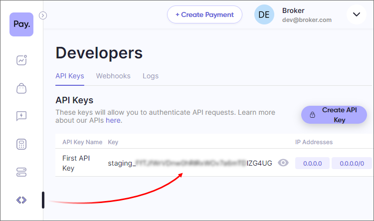
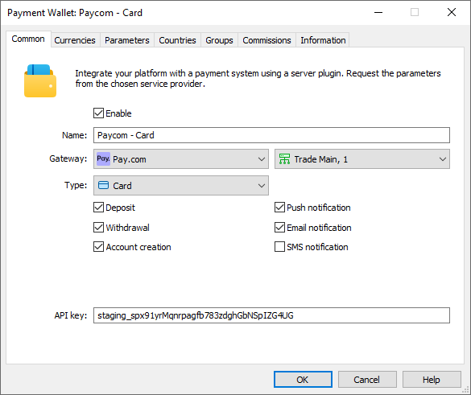
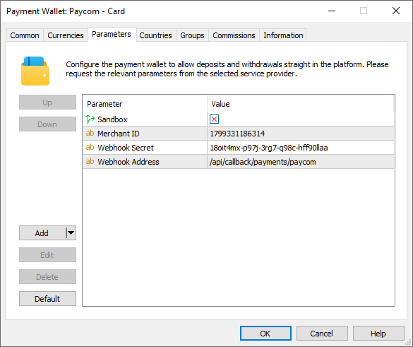
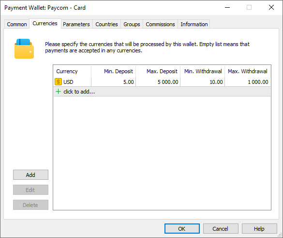
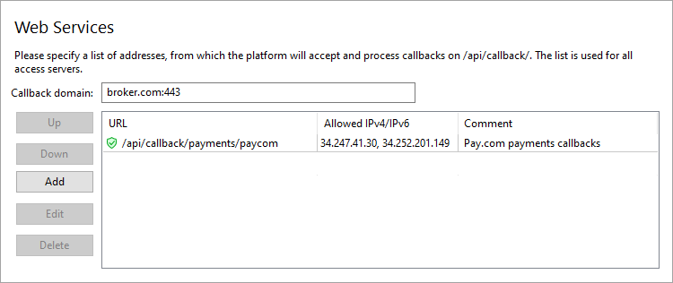
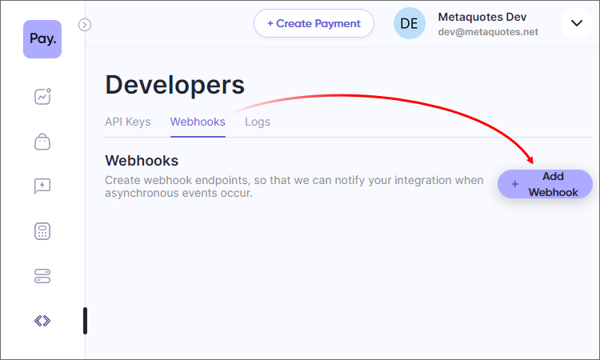
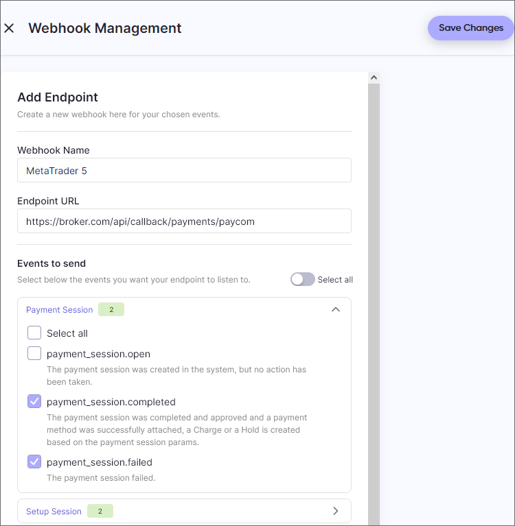

[🏠 Document Start](../../../../README.md) / [MetaTrader 5 Trading Platform](../../../../MetaTrader-5-Trading-Platform.md) / [Platform Setup](../../../Platform-Setup.md) / [Payments](../../Payments.md) / [Payment Gateways](../Payment-Gateways.md) / Pay.com

[Previous](emerchantpay.md) | [Next](Exactly.md)

# Pay.com (#paycom)

[Pay.com](https://pay.com/) is a comprehensive provider that simplifies the process of accepting online payments through cards, Google Pay, Apple Pay and PayPal. The provider supports 100+ currencies and 200+ countries, and uses special technology to prevent the most common reasons for rejected transactions.

To connect Pay.com payments, click 'Connect Provider' in the [showcase](../Payment-Gateways.md) and fill out a short online form. You can also use the registration form on the [provider's website](https://pay.com/contact-sales). The company representative will contact you and will provide further instructions.

After registration, you will be given access to your personal account, where you can manage transactions, and a unique Merchant ID. Additionally, request from Pay.com to enable withdrawal transactions operations for your account, as they may not be available.

Open the 'Developers' section in your personal account and copy the API key. You will need it to set up payments in MetaTrader 5. If there is no key, create it by clicking 'Create API Key'.

Create a [payment gateway configuration](../Payment-Gateways.md), select Pay.com for the gateway and specify the API login and password:

In the 'Type' field, select a payment method you wish to connect:

  * Card payments, including support for Google Pay and Apple Pay
  * PayPal

If you want to use multiple payment methods, create separate wallet configurations.

Go to 'Parameters' and enter your Merchant ID received from Pay.com:

## System features and limitations (#limitations)

Users can only withdraw funds via PayPal to the same wallets that they have previously used to deposit funds. A [payment account (#accounts)](../Controlling.md#accounts) will be created only in this case. There is no separate procedure for linking a wallet.

## Setting up the environment (#sandbox)

Pay.com supports operations in a sandbox environment. In this environment, the provider simulates transaction processing so that you can check how payments work, without performing real money transactions. To connect to the sandbox environment, contact Pay.com for a special wallet. You will receive a separate test account. Copy the API key from it and paste it to the appropriate field in the wallet settings in MetaTrader 5. Also enable the 'Sandbox' option on the Parameters tab of the gateway settings. This option must be disabled for wallets running in a live environment.

> Due to system limitations, PayPal withdrawals are not supported in the sandbox environment.

## Currency settings (#currencies)

Pay.com supports payments in a variety of currencies. Request a list of available currencies for each payment method from the provider and explicitly specify currencies in the wallet settings. Also, set a limit on transaction amounts in accordance with Pay.com requirements.

## Setting up callback requests (#callback)

Callback requests are used to quickly receive transaction processing results. After each transaction, Pay.com sends its status to the URL address which you specify in the wallet settings. Therefore, to ensure the platform receives these notifications at the specified address, it must be configured accordingly.

> The use of callback requests is optional. However, if you do not configure them, payment status updates may take longer. This could negatively impact the quality of your customer service.

On the platform side, the callback requests are received and processed by access servers. To configure notifications:

1\. Register a domain (or subdomain for your existing domain). Pay.com will use this address to communicate with the platform, and the endpoint address for callback requests will be formed relative to it.

2\. Associate the domain with the [public IP address (#public)](../../Network-cluster/Configuring-Servers.md#public) of one or more access servers. For further information, please see [Integration\Web Services](../../Integrations/Web-Services.md).

3\. [Add an SSL certificate (#ssl)](../../Integrations/Web-Services.md#ssl) for the specified domain in the Integration\Web Services section. The operation requires a certificate issued by a trusted certification authority, while self-signed certificates are not allowed even in a sandbox environment. Operation is only possible via the HTTPS protocol. HTTP is not supported.

4\. Choose an endpoint address for receiving callback requests. The address is specified relative to the previously selected domain, taking into account the following rules

https://broker.com/api/callback/payments/paycom  
---  
  
  * The first part is an example of a domain name.
  * The second part is a predefined part of the address that is used for all callbacks related to payment systems. For example, callbacks to https://broker.com/api/callback/my/callback will not reach wallets.
  * The third part is defined by you. You can enter any address, however we strongly recommend using a logical and clear naming system.

5\. Add the selected URL to the allowed list in the Web Services section and specify the list of IP addresses, from which the payment provider will send transaction status notifications. You can obtain the address list from Pay.com.

6\. Specify the callback address in the Callback URL parameter in the payment gateway settings. The system will use it to attribute the received request to the relevant wallets. The address is specified without a domain name.

7\. Specify the address for callbacks in your Pay.com account Open 'Developers\ Webhooks' and click 'Add Webhook':

Configure the webhook parameters:

  * Webhook Name — an arbitrary name
  * Endpoint URL — the address for sending webhooks in accordance with the configurations specified in steps 5 and 6. The address should be specified with the domain included.

Next, select the events that will be sent through this webhook:

  * payment_session.completed
  * payment_session.failed
  * setup_session.completed
  * setup_session.failed
  * payout.succeeded
  * payout.failed

Save your changes. Return to the list of webhooks and click on the newly created webhook to open its settings.

To protect notifications from changes, Pay.com signs each callback request with a special password, which is specified in the 'Secret' field. Copy it into the 'Webhook Secret' parameter in your wallet settings to allow the platform to verify signatures.

## Other settings (#other-settings)

All other settings are standard and do not differ from other gateways. You can set up currencies, commissions, gateway access by country, group, etc. For further details, please visit the [Payment Gateways](../Payment-Gateways.md) section.
