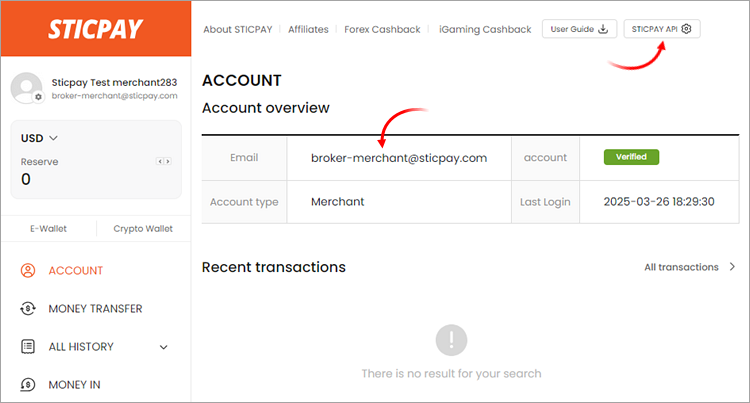
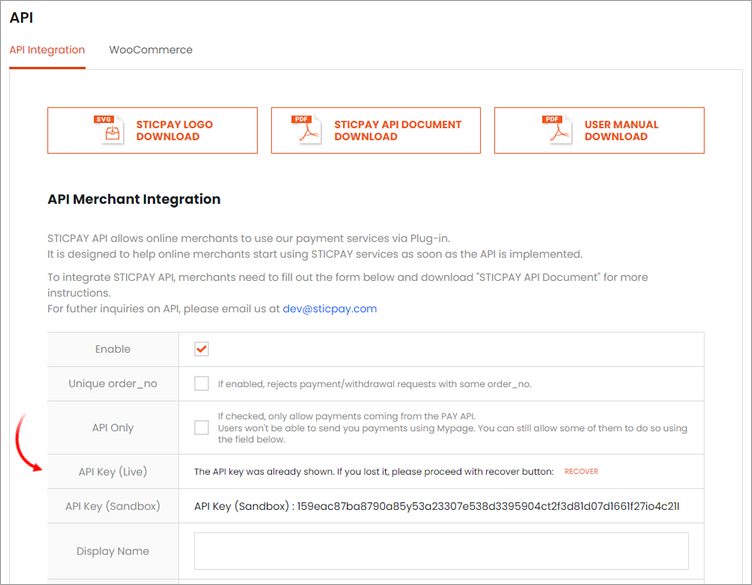
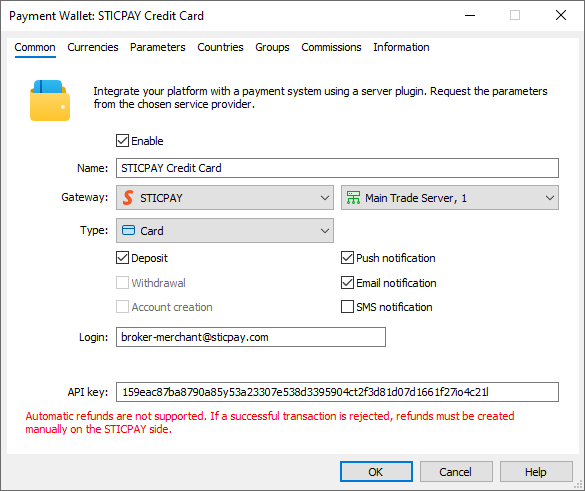
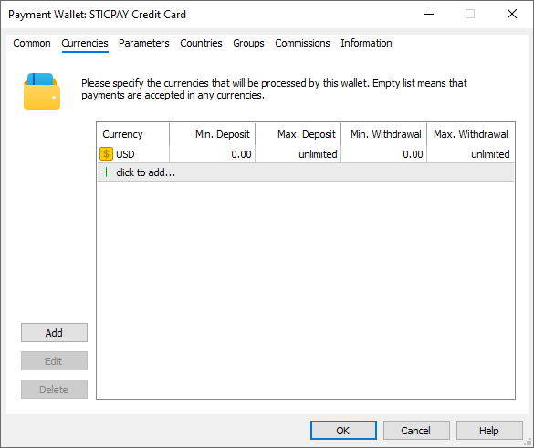
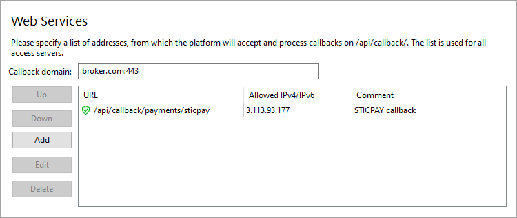
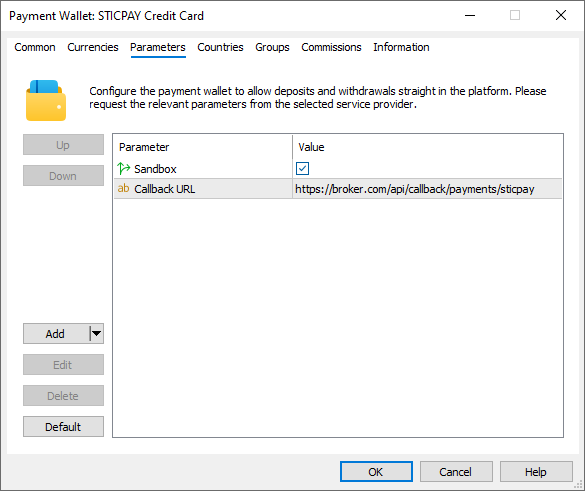
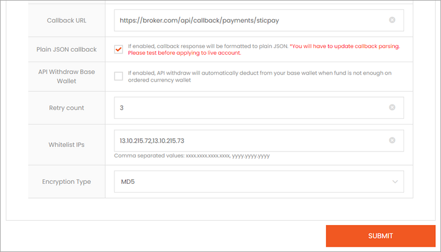

[🏠 Document Start](../../../../README.md) / [MetaTrader 5 Trading Platform](../../../../MetaTrader-5-Trading-Platform.md) / [Platform Setup](../../../Platform-Setup.md) / [Payments](../../Payments.md) / [Payment Gateways](../Payment-Gateways.md) / STICPAY

[Previous](OpenPayd.md) | [Next](ChipPay.md)

# STICPAY (#sticpay)

[STICPAY](https://www.sticpay.com/) is a global payment provider based in London, offering secure, innovative, and user-friendly financial services. STICPAY provides a wide range of deposit and withdrawal methods, covering Asia, Europe, Africa, the Americas, and Oceania. The system is used in over 200 countries worldwide.

STICPAY supports payments via cards, local payment methods (e.g., PIX, PicPay, CODI, PromptPay), instant bank transfers, and transactions through its own e-wallet.

To enable payments through STICPAY, click 'Connect Provider' in the [showcase](../Payment-Gateways.md) and complete a short application form. You can also use the registration form on the [provider's website](https://www.sticpay.com/open_account/merchant). After registration, a company representative will contact you to guide you through the next steps.

Once registered, you will gain access to your personal account, where you can find the necessary connection details, including the login and the API key. Login is your username in the STICPAY system, which is created during registration in the form of an email. To find your API key, click STICPAY API in the top menu:

Copy the key from the API Key (Live) field for a live environment or API Key (Sandbox) for a [sandbox (#sandbox)](STICPAY.md#sandbox) environment.

Create a [payment gateway configuration](../Payment-Gateways.md), select STICPAY for the gateway and enter the previously received credentials in the "Login" and "API Key" fields:

In the 'Type' field, select a payment method:

  * Map charts
  * PIX for Brazil
  * PicPay for Brazil
  * CODI for Mexico
  * PromptPay for Thailand
  * Direct Banking — fast interbank transfers
  * STICPAY — transfers via [STICPAY e-wallet](https://www.sticpay.com/about_sticpay)
  * Maya for Philippines

If you want to use multiple payment methods, create separate wallet configurations.

## System features and limitations (#limitations)

[Refund operations (#refund)](../Processing.md#refund) through the platform are not supported. If you cancel a successful payment on the MetaTrader 5 side, you will need to manually create a refund on the STICPAY side.

## Environment Configuration (#sandbox)

STICPAY offers a sandbox environment, allowing you to test transactions. In this environment, the provider simulates transaction processing so that you can check how payments work, without performing real money transactions. To connect to the sandbox environment, use the appropriate API key from your personal account. Enter these credentials in your wallet settings, under the Common tab, and enable the 'Sandbox' option in the Parameters tab.

## Currency Configuration (#currencies)

The currency of transactions depends on the payment method:

  * Card — any currencies
  * PIX — BRL
  * PicPay — BRL
  * CODI — MXN
  * PromptPay — THB 
  * Direct Banking — any currencies
  * STICPAY — any currencies
  * Maya — PHP

Depending on the method, specify the appropriate currency to prevent customers from selecting other currencies when making payments via the terminal. Also, set a limit on transaction amounts in accordance with STICPAY requirements.

## Setting up callback requests (#callback)

Callback requests are used to promptly receive payment statuses. In each transaction, the platform transmits a special URL, to which STICPAY should send the processing result. To ensure proper generation of the addresses, you need to configure the platform accordingly.

> The use of callback requests is mandatory. Without them, you will not be able to receive transaction processing statuses. The exception is the payment method with the STICPAY wallet, which can work without Callback requests.

On the platform side, the callbacks are received and processed by access servers. To configure notifications:

1\. Register a domain (or subdomain for your existing domain). STICPAY will use this address to communicate with the platform, and the endpoint address for callback requests will be formed relative to it.

2\. Associate the domain with the [public IP address (#public)](../../Network-cluster/Configuring-Servers.md#public) of one or more access servers. For further information, please see [Integration\Web Services](../../Integrations/Web-Services.md).

3\. [Add an SSL certificate (#ssl)](../../Integrations/Web-Services.md#ssl) for the specified domain in the Integration\Web Services section. The operation requires a certificate issued by a trusted certification authority, while self-signed certificates are not allowed even in a sandbox environment. Operation is only possible via the HTTPS protocol. HTTP is not supported.

4\. Choose an endpoint address for receiving callback requests. The address is specified relative to the previously selected domain, taking into account the following rules:

https://broker.com/api/callback/payments/sticpay  
---  
  
  * The first part is an example of a domain name.
  * The second part is a predefined part of the address that is used for all callback requests related to payment systems. For example, callbacks to https://broker.com/api/callback/my/callback will not reach wallets.
  * The third part is defined by you. You can enter any address, however we strongly recommend using a logical and clear naming system.

5\. Add the selected URL to the allowed list in the Web Services section and specify the list of IP addresses, from which the payment provider will send transaction status notifications. Please contact STICPAY for this list of addresses.

6\. Specify the callback address in the Callback URL parameter in the payment gateway settings. The system will use it to attribute the received request to the relevant wallets. Please make sure to specify a full address. The URL must include a domain name. Specifying an IP address is not allowed.

7\. For enhanced security, STICPAY uses a whitelist of addresses from which the merchant is allowed to make requests to the API. Click STICPAY API in any section of your personal account, go to the 'Whitelist IPs' field, and specify a comma-separated list of [public addresses of your trading servers (#public)](../../Network-cluster/Configuring-Servers.md#public) on which the payment module operates:

## Other Settings (#other-settings)

All other settings are standard and do not differ from other gateways. You can set up currencies, commissions, gateway access by country, group, etc. For further details, please visit the [Payment Gateways](../Payment-Gateways.md) section.
