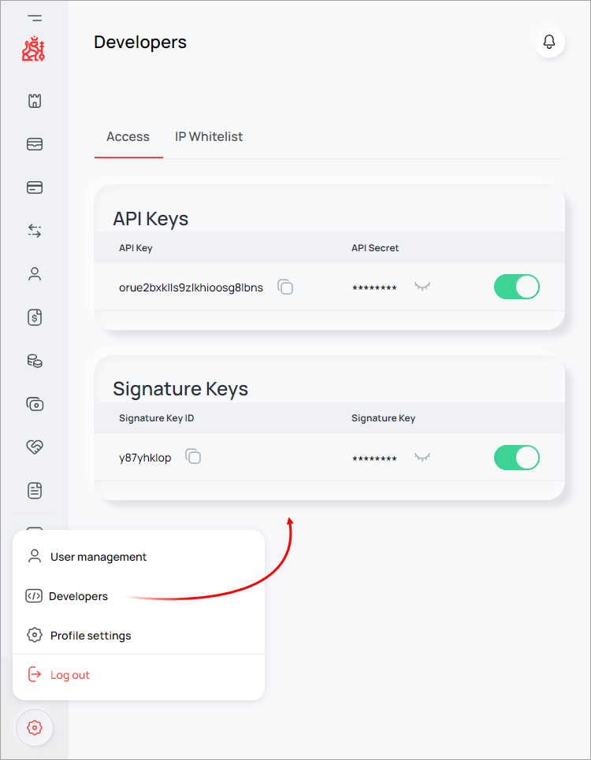
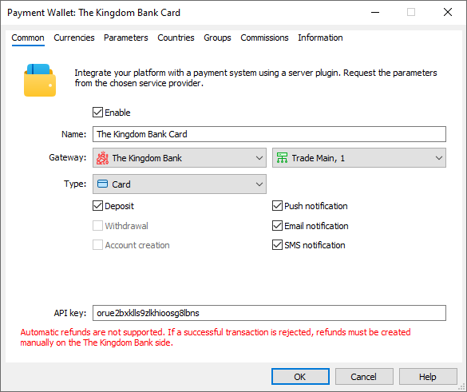
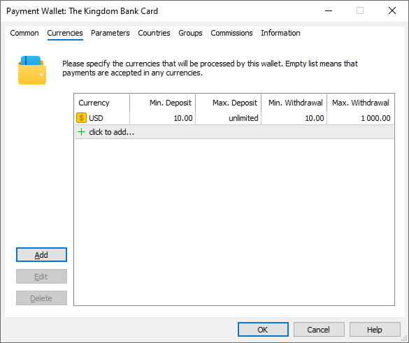
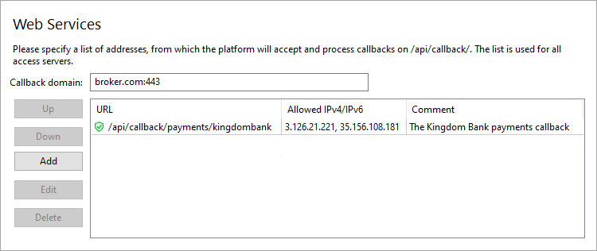
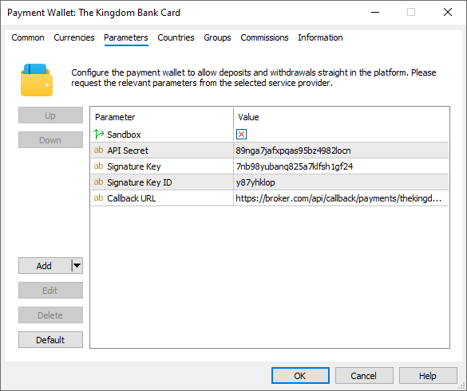

[🏠 Document Start](../../../../README.md) / [MetaTrader 5 Trading Platform](../../../../MetaTrader-5-Trading-Platform.md) / [Platform Setup](../../../Platform-Setup.md) / [Payments](../../Payments.md) / [Payment Gateways](../Payment-Gateways.md) / The Kingdom Bank

[Previous](AK-Remit.md) | [Next](OpenPayd.md)

# The Kingdom Bank (#the-kingdom-bank)

[The Kingdom Bank](https://www.thekingdombank.com/) is a digital-asset friendly international bank based in the Commonwealth of Dominica. The company provides corporate and correspondence banking services, local and global payments in more than 80 countries. Supported payment methods include credit cards, crypto transactions, direct bank transfers, as well as local systems, such as PIX, Efecty, etc.

To connect payments via The Kingdom Bank, click 'Connect provider' in the [showcase](../Payment-Gateways.md) and fill out a short online form. You can also use the registration form on the [provider's website](https://portal.thekingdombank.com/signup). The company representative will contact you and will provide further instructions.

After registration, you will be given access to your personal account, where you can find details for connecting the provider. Open your account settings and go to the Developers section. Copy the following parameters:

  * API Key
  * API Secret
  * Signature Key ID
  * Signature Key

Create a [payment gateway configuration](../Payment-Gateways.md) and select 'The Kingdom Bank' as your gateway:

In the 'Type' field, select a payment method:

  * Wire Transfer (manual)
  * Card
  * PIX Brasil
  * Efecty, Colombia
  * Przelewy24
  * MoMo
  * Direct Banking — fast interbank transfers
  * Crypto — cryptocurrency payments
  * The Kingdom Bank Wallet — The Kingdom Bank wallet
  * Any — other methods supported by the provider and available for your account, but not explicitly supported by the payment gateway. When using this option, the payment method will be selected during payment in the client terminal.

For further details, please see the [Limitations and features of the system (#limitations)](The-Kingdom-Bank.md#limitations). If you wish to use multiple payment methods in parallel, create separate wallet configurations.

In the API Key field, enter the corresponding key from your account settings. Next, go to the 'Parameters' tab and specify other parameters from your account settings: API Secret, Signature Key, Signature Key ID.

## System features and limitations (#limitations)

The system supports transfers in the following cryptocurrencies: ADA, BTC, DOGE, ETH, SOL, XRP and USD. For USD, the blockchain USDT.TRC20 is used by default. In addition, the system supports the use of USDC.ERC20, USDC.TRC20 and USDT.ERC20. The currency is selected during the payment through the client terminal.

[Refund operations (#refund)](../Processing.md#refund) through the platform are only supported for Direct Banking, Kingdom Wallet, and PIX Brasil. For all other methods, if you cancel a successful payment on the MetaTrader 5 side, you will need to manually create a refund on the Kingdom Bank side.

The payment system supports withdrawal operations only for PIX Brasil and Direct Banking methods.

## Setting Up the Environment (#sandbox)

The Kingdom Bank supports operations in a sandbox (test) environment. In this environment, the provider simulates transaction processing so that you can check how payments work, without performing real money transactions. To connect to the sandbox environment, contact The Kingdom for a special wallet. You will receive a separate test account with the required connection details. Specify them in the wallet settings and enable the 'Sandbox' option.

## Currency settings (#currencies)

The Kingdom Bank supports payments in a variety of currencies. Specify the required options in the gateway settings. In addition, you will need to set a limit on transaction amounts in accordance with The Kingdom Bank requirements.

The platform only supports conversion for currencies with a three-character code, while the provider additionally supports thr four-digit USDT and USDC currencies. If you specify them as is, then traders will only be able to top up accounts with the same [deposit currency (#currency)](../../Groups/Group-Settings.md#currency). For other deposit currencies, conversion of the payment amount will not be possible, even if you add the corresponding currency pair to the platform (for example, USDTUSD or USDCUSD).

To avoid this limitation, the gateway uses USD as the USDT and USDC currency. Accordingly, you need to specify USD in the gateway settings. During a deposit or withdrawal operation, the transaction amount will be converted from the user's account currency to USD and then sent to the payment system as a USDT or USDC transaction.

> When using USD instead of USDT/USDC, please consider possible currency risks associated with the USDTUSD/USDCUSD exchange rate.

## Setting up callback requests (#callback)

Callback requests are used to promptly receive payment statuses. The Kingdom Bank sends requests to a URL that you set in your wallet settings. Accordingly, to enable the receipt of these notifications at the specified address in the platform, you should configure the platform accordingly.

> The use of callback requests is mandatory. Without callbacks, users will not be able to save previously used payment methods. Since withdrawals are only possible through previously used methods, this type of operation will not be available. Also, without Callback requests, updating payment statuses may take longer. This could negatively impact the quality of your customer service.

On the platform side, the callbacks are received and processed by access servers. To configure notifications:

1\. Register a domain (or subdomain for your existing domain). The Kingdom Bank will access the platform at this address. Also, the endpoint address for callbacks will be formed relative to this address.

2\. Associate the domain with the [public IP address (#public)](../../Network-cluster/Configuring-Servers.md#public) of one or more access servers. For further information, please see [Integration\Web Services](../../Integrations/Web-Services.md).

3\. [Add an SSL certificate (#ssl)](../../Integrations/Web-Services.md#ssl) for the specified domain in the Integration\Web Services section. The operation requires a certificate issued by a trusted certification authority, while self-signed certificates are not allowed even in a sandbox environment. Operation is only possible via the HTTPS protocol. HTTP is not supported.

4\. Choose an endpoint address for receiving callback requests. The address is specified relative to the previously selected domain, taking into account the following rules:

https://broker.com/api/callback/payments/kingdombank  
---  
  
  * The first part is an example of a domain name.
  * The second part is a predefined part of the address that is used for all callback requests related to payment systems. For example, callbacks to https://broker.com/api/callback/my/callback will not reach wallets.
  * The third part is defined by you. You can specify any address, but we strongly recommend using a logical and clear naming system. 

5\. Add the selected URL to the allowed list in the Web Services section and specify the list of IP addresses, from which the payment provider will send transaction status notifications. Please contact The Kingdom Bank for this list of addresses.

6\. Specify the callback address in the Callback URL parameter in the payment gateway settings. The system will use it to attribute the received request to the relevant wallets. Please make sure to specify a full address. The URL must include a domain name. Specifying an IP address is not allowed.

## Other Settings (#other-settings)

All other settings are standard and do not differ from other gateways. You can set up currencies, commissions, gateway access by country, group, etc. For further details, please visit the [Payment Gateways](../Payment-Gateways.md) section.
