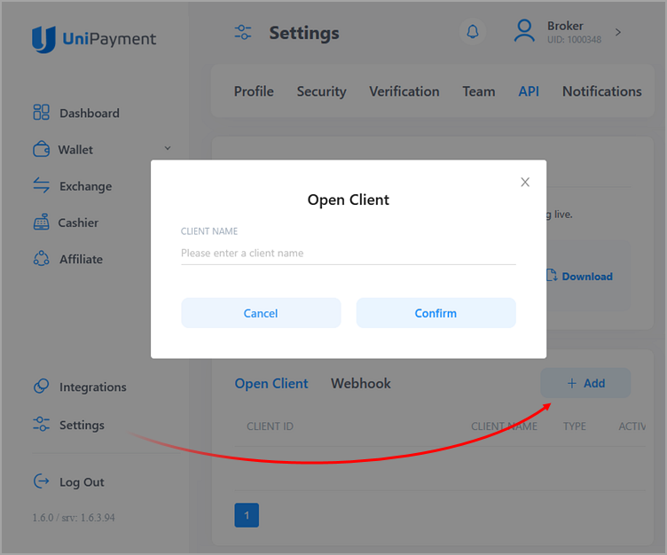
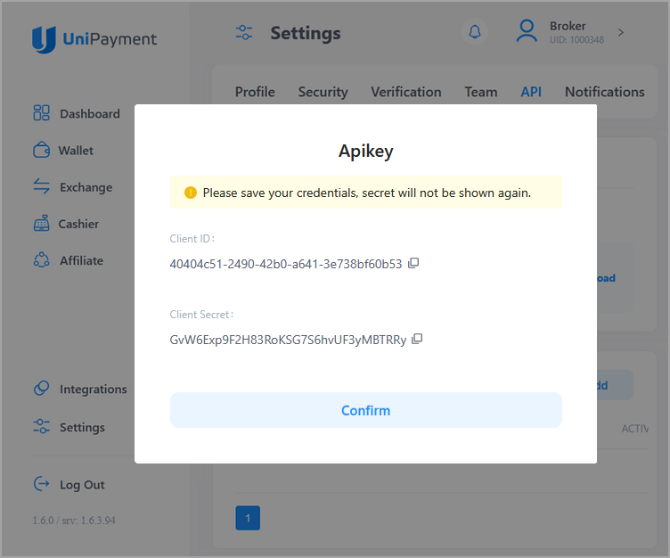
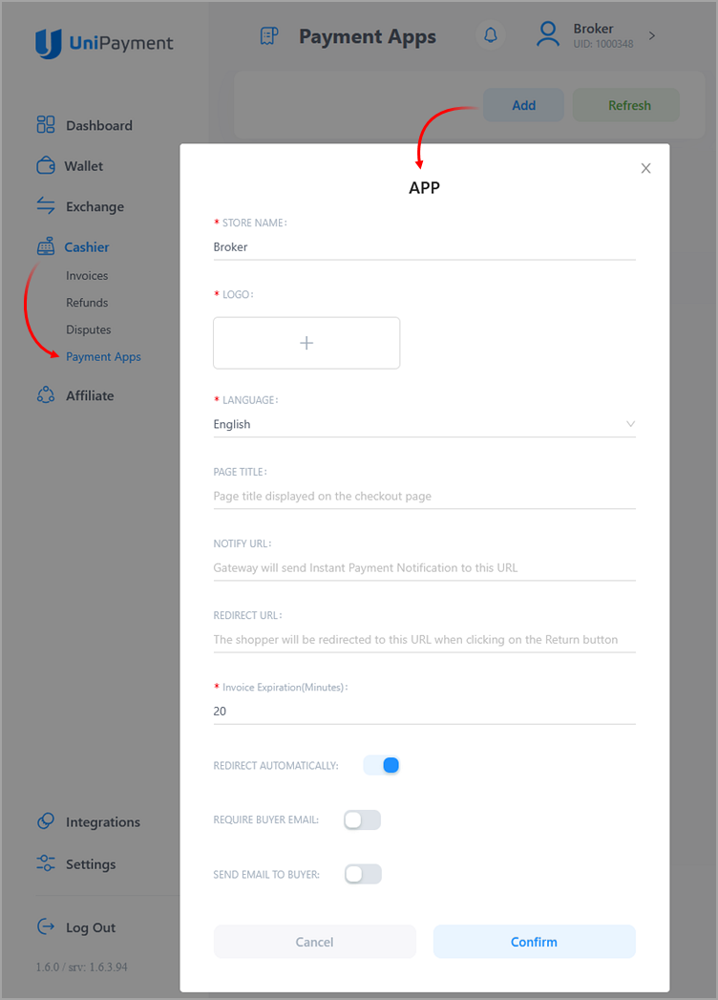
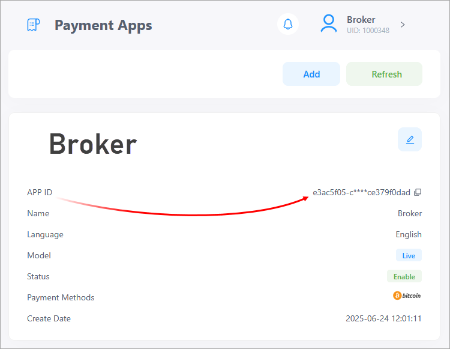
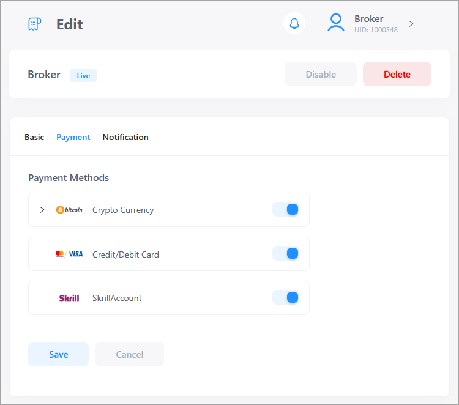
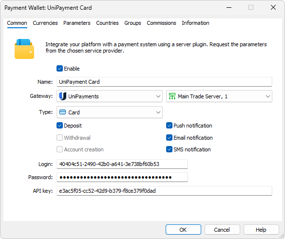
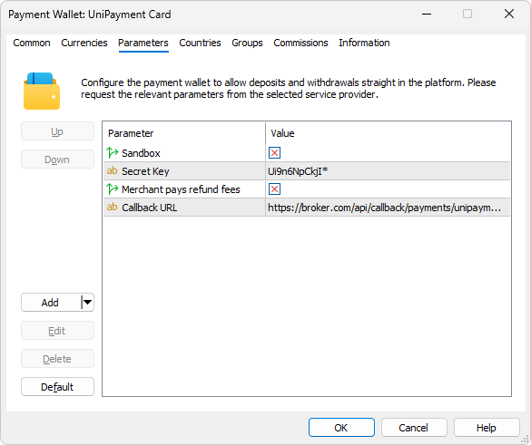
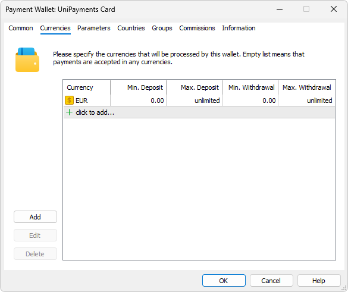
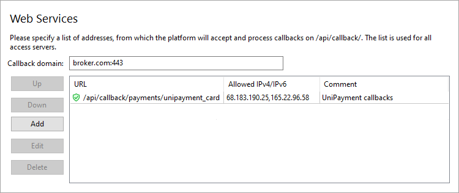
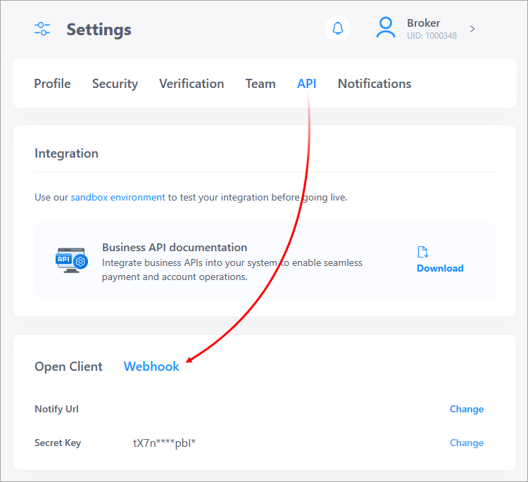

[🏠 Document Start](../../../../README.md) / [MetaTrader 5 Trading Platform](../../../../MetaTrader-5-Trading-Platform.md) / [Platform Setup](../../../Platform-Setup.md) / [Payments](../../Payments.md) / [Payment Gateways](../Payment-Gateways.md) / UniPayment

[Previous](Uniwire.md) | [Next](Bank-Transfer.md)

# UniPayment (#unipayment)

UniPayment is a trusted global payment platform designed for forex businesses seeking seamless financial operations. The provider supports multi-channel payment solutions, including VISA/MASTERCARD card payments, Crypto stablecoin and Skrill e-wallets.

To connect UniPayment payments, click 'Connect Provider' in the [showcase](../Payment-Gateways.md) and fill out a short online form. You can also use the registration form on the [provider's website (#/register)](https://console.unipayment.io/#/register). The company representative will contact you and will provide further instructions.

## Creating an API Key (#api)

After registration, you will be given access to your [personal account (#/login)](https://console.unipayment.io/#/login), where you can find details for connecting the provider. Open 'Settings \ API' and click 'Add'.

Enter a name for the key, for example, MetaTrader 5, and click 'Confirm'. You will see the generated Client ID and the 'Client Secret' value. Save this data as it will be required for configuring the wallet on the MetaTrader 5 side. Please note that once the window is closed, you will no longer be able to view the 'Client Secret'.

## Creating an API Application (#app)

Create an API application through which payments will be made. Open the 'Cashier \ Payments Apps' section and click 'Add':

Specify the details that will be displayed on the payment form in client terminals:

  * Company name in the 'Store name' field
  * Logo
  * Default language for payment form
  * Invoice expiration time, leave default value

Next, click 'Confirm' and copy the App ID:

Open the application settings by clicking the pencil button and go to the 'Payments' section. Select the payment methods that you will be using.

## Provider Configuration (#configure)

Create a [payment gateway configuration](../Payment-Gateways.md), select UniPayment for the gateway, and specify the previously received details:

  * Client ID in the 'Login' field
  * Client Secret in the 'Password' field
  * App ID in the 'API Key' field

In the 'Type' field, select a payment method:

  * Card — deposit with a bank card.
  * Skrill — deposit via Skrill e-wallet.
  * Crypto — deposit using cryptocurrency.

If you want to use multiple payment methods, create separate wallet configurations.

Go to the 'Parameters' tab and set the 'Merchant pays refund fees' parameter. When processing refunds, the provider charges a transaction fee. If this option is enabled, the fee will be deducted from your account. If the option is disabled, the fee will be deducted from the client's refund, resulting in a lower amount returned to them.

## System features and limitations (#limitations)

UniPayment supports only deposit operations. Withdrawals are not available.

## Setting Up the Environment (#sandbox)

UniPayment supports operations in a sandbox environment. In this environment, the provider simulates transaction processing so that you can check how payments work, without performing real money transactions. To connect to the sandbox environment, the company will provide you with a separate personal account, where you can obtain all the necessary integration details as described above. Additionally, enable the 'Sandbox' option in the wallet settings so that the platform marks all transactions within it as test operations.

## Currency settings (#currencies)

Depending on the method, specify the appropriate currency to prevent customers from selecting other currencies when making payments via the terminal.

  * Cards and Skrill support EUR, GBP, USD.
  * Cryptocurrencies supported include BTC, ETH, USDC, and USDT. However, only a fiat currency corresponding to the client's country should be specified in the wallet settings. When a deposit is made, UniPayment will automatically suggest the appropriate cryptocurrency.

You should also set transaction amount limits in accordance with UniPayment's requirements.

## Setting up callback requests (#callback)

Callback requests are used to promptly receive payment statuses. In each transaction, the platform transmits a special URL, to which UniPayment should send the processing result. To ensure proper generation of the addresses, you need to configure the platform accordingly.

> The use of callback requests is mandatory. Without them, you will not be able to receive transaction processing statuses.

On the platform side, the callbacks are received and processed by access servers. To configure notifications:

1\. Register a domain (or subdomain for your existing domain). UniPayment will use this address to communicate with the platform, and the endpoint address for callback requests will be formed relative to it.

2\. Associate the domain with the [public IP address (#public)](../../Network-cluster/Configuring-Servers.md#public) of one or more access servers. For further information, please see [Integration\Web Services](../../Integrations/Web-Services.md).

3\. [Add an SSL certificate (#ssl)](../../Integrations/Web-Services.md#ssl) for the specified domain in the Integration\Web Services section. A certificate issued by a trusted certification authority is mandatory for operation; self-signed certificates are not allowed even for testing environments. Operation is only possible via the HTTPS protocol. HTTP is not supported.

4\. Choose an endpoint address for receiving callback requests. The address is specified relative to the previously selected domain, taking into account the following rules:

https://broker.com/api/callback/payments/unipayment  
---  
  
  * The first part is an example of a domain name.
  * The second part is a predefined part of the address that is used for all callback requests related to payment systems. For example, callbacks to https://broker.com/api/callback/my/callback will not reach wallets.
  * The third part is defined by you. You can specify any address, but we strongly recommend using a logical and clear naming system. Depending on the type of payment method selected, the following addresses are substituted into the Callback URL parameter in the default gateway settings:

  *     * Карта — .../api/callback/payments/unipayment_card
    * Skrill — .../api/callback/payments/unipayment_skrill
    * Crypto — .../api/callback/payments/unipayment_crypto

5\. Add the selected URL to the allowed list in the Web Services section and specify the list of IP addresses, from which the payment provider will send transaction status notifications. Please contact UniPayment for this list of addresses.

6\. Specify the callback address in the Callback URL parameter in the payment gateway settings. The system will use it to attribute the received request to the relevant wallets. Please make sure to specify a full address. The URL must include a domain name. Specifying an IP address is not allowed.

7\. To protect notifications from changes, UniPayment signs each callback request with a special password, Specify it in the 'Secret Key' section under 'Settings \ API \ Webhook' in your account settings:

Paste the value into the 'Secret Key' parameter in your wallet settings to enable the platform verify signatures.

## Other Settings (#other-settings)

All other settings are standard and do not differ from other gateways. You can set up currencies, commissions, gateway access by country, group, etc. For further details, please visit the [Payment Gateways](../Payment-Gateways.md) section.
