[🏠 Document Start](../../../../README.md) / [MetaTrader 5 Trading Platform](../../../../MetaTrader-5-Trading-Platform.md) / [Platform Setup](../../../Platform-Setup.md) / [Payments](../../Payments.md) / [Payment Gateways](../Payment-Gateways.md) / Uniwire

[Previous](ChipPay.md) | [Next](UniPayment.md)

# Uniwire (#uniwire)

Uniwire is a crypto payments system you can shape to your changing environment. You can accept, convert, pay out, and store a wide range of cryptocurrencies. The company specializes in enterprise-level solutions tailored to the unique needs of brokers and exchanges. Its multi-chain platform, Uniwire, supports BTC, ETH, LTC, SOL, MATIC, TRX, XRP, TON, Bitcoin Lightning, stablecoins such as USDT and USDC, and much more.

To connect Uniwire payments, click 'Connect Provider' in the [showcase](../Payment-Gateways.md) and fill out a short online form. You can also use the registration form on the [provider's website](https://cryptochill.com/accounts/signup/). The company representative will contact you and will provide further instructions.

## Creating a Key (#creating-a-key)

After registration, you will be given access to your [personal account](https://cryptochill.com/accounts/login/), where you can find details for connecting the provider. Open 'Settings \ API Keys' and select 'New API Key'.

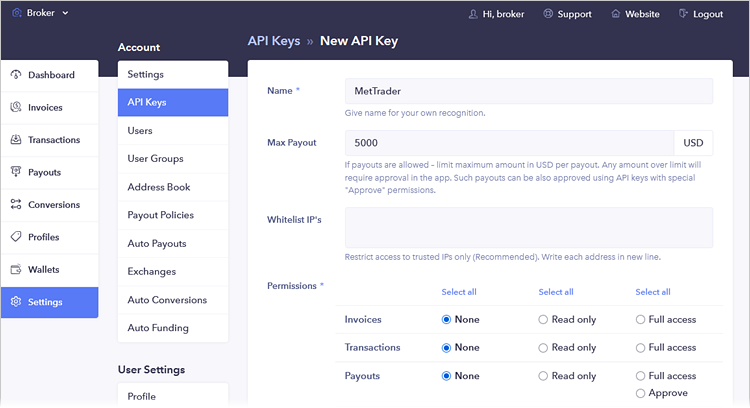

Specify any name to distinguish the key used for MetaTrader 5 from others. For added security, you can enter a list of [public IP addresses (#public)](../../Network-cluster/Configuring-Servers.md#public) of your trading servers in the "Whitelist IPs" field. This ensures that the system will only interact with your platform. Next, enable all permissions and click 'Save Key'.

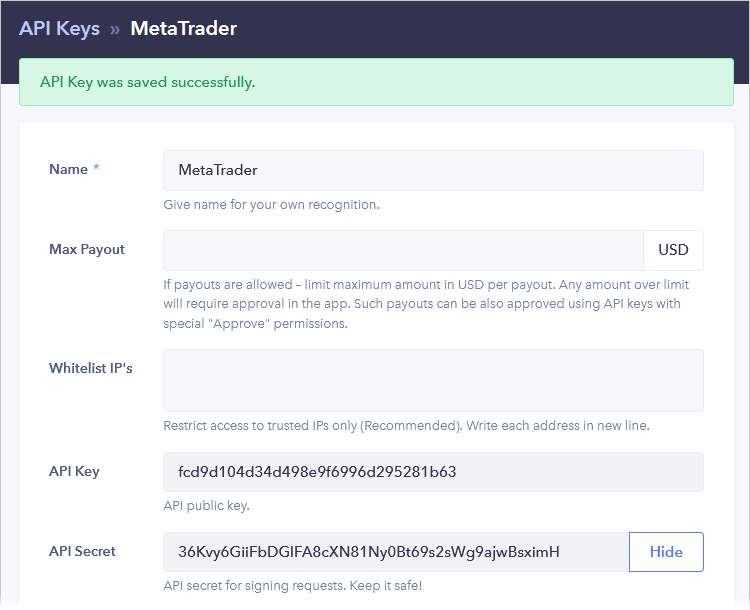

Copy the generated API Key and API Secret.

## Provider Configuration (#provider-configuration)

Create a [payment gateway configuration](../Payment-Gateways.md), select Uniwire as your gateway, and specify

  * API Key in the "Login" field
  * API Secret in the "Password" field

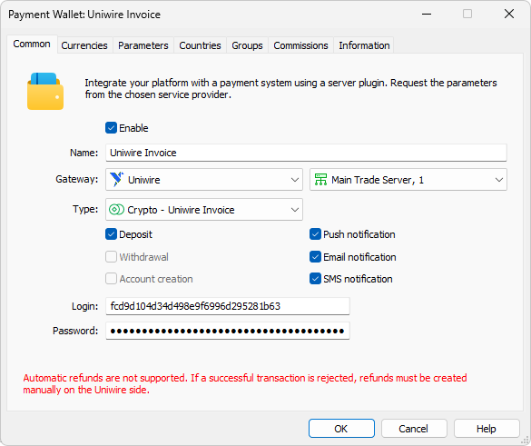

In the 'Type' field, select the payment method:

  * Invoice — cryptocurrency deposit.
  * Payout — withdrawal of funds to a crypto wallet.

If you want to use multiple payment methods, create separate wallet configurations.

Open the Profiles section in your personal account and select 'New Profile':

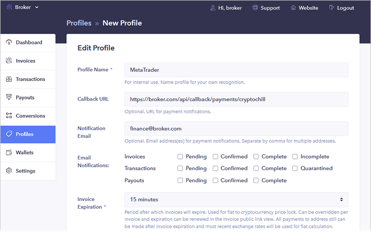

Specify any name to distinguish the profile used for MetaTrader 5 from others. At the bottom of the page, select the currencies you plan to work with:

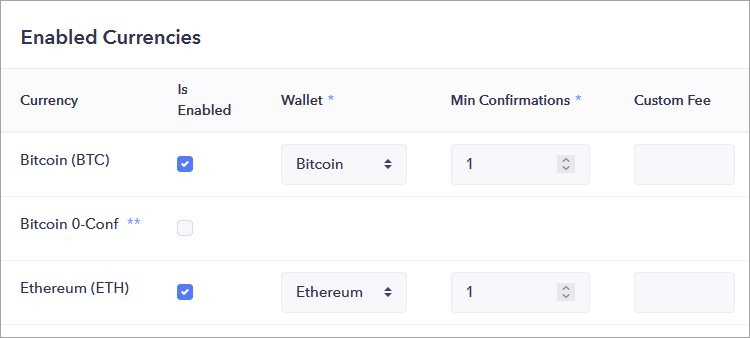

For each selected currency, choose the wallet that will be used to track all related transactions. Uniwire will create the necessary wallets for you.

Save the profile and copy its ID from the list:

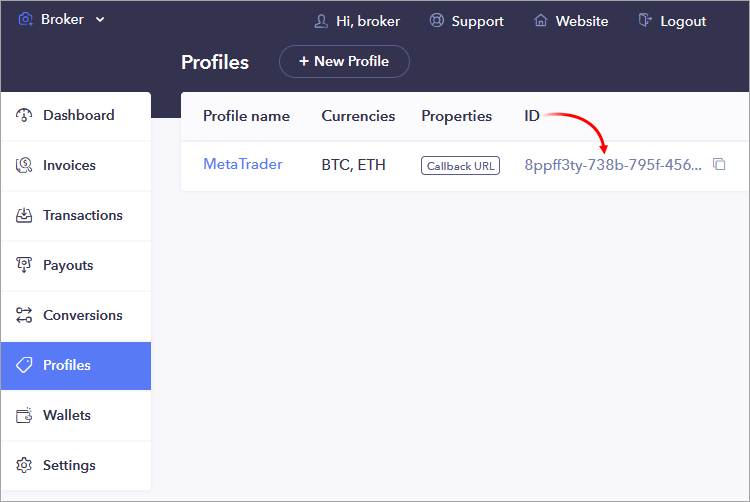

Then, open the wallet configuration on the MetaTrader 5 side, go to the "Parameters" tab, and enter the profile ID in the 'Profile ID' field.

## Setting Up the Environment (#sandbox)

Uniwire supports operations in a sandbox environment. In this environment, the provider simulates transaction processing so that you can check how payments work, without performing real money transactions. To switch between environments, use your personal account dashboard:

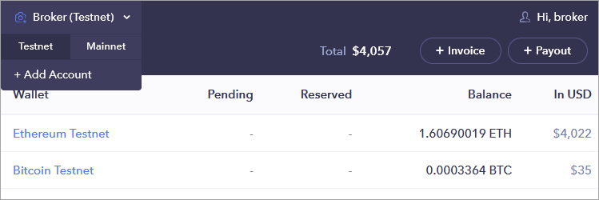

The payment module automatically determines the type of transaction based on the system's responses and, if necessary, marks it as a test transaction.

## Currency Settings (#currencies)

When making a deposit or withdrawal, the user specifies two currencies:

  * The currency in which they want to deposit or withdraw funds. This is set in the wallet settings.
  * The currency they will actually use for the transaction — the one the merchant or broker will receive or send. Available options are configured in the [Profiles (#profile)](Uniwire.md#profile) section of your personal account.

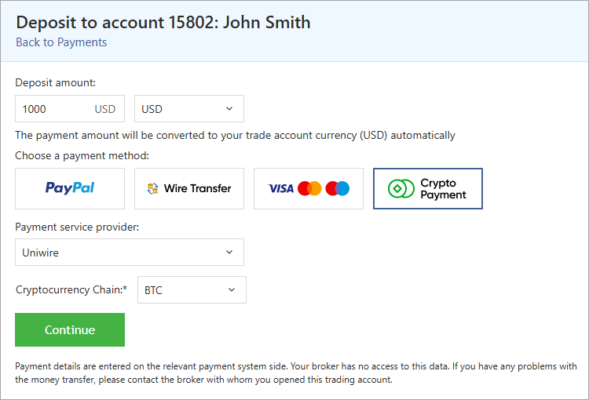

Currencies are converted using Uniwire's internal exchange rate.

To specify the currencies users will use for deposits or withdrawals, open the "Currencies" tab in the wallet settings. Only currencies with three-letter codes are supported. You can also set transaction amount limits in this section.

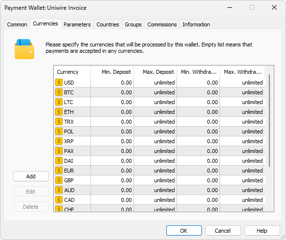

## Setting up callback requests (#callback)

Callback requests are used to promptly receive payment statuses. In each transaction, the platform transmits a special URL, to which Uniwire should send the processing result. To ensure proper generation of the addresses, you need to configure the platform accordingly.

The use of callback requests is optional. However, if you do not configure them, updating payment statuses may take longer. This could negatively impact the quality of your customer service. In addition, callback requests are used to process delayed deposits:

  * When initiating a deposit, the user is provided with an address in the selected blockchain to transfer the funds.
  * If the user does not complete the transfer within 15 minutes, Uniwire will mark the transaction as expired and mark it as failed.
  * However, the payment address issued to the user will remain valid without any restrictions. If the user later transfers funds to this address, Uniwire will send a callback request to the platform with an updated payment status.
  * If your system is configured to handle callback requests, the funds will be successfully credited to the user's account in MetaTrader 5.

On the platform side, the callbacks are received and processed by access servers. To configure notifications:

1\. Register a domain (or subdomain for your existing domain). Uniwire will use this address to communicate with the platform, and the endpoint address for callback requests will be formed relative to it.

2\. Associate the domain with the [public IP address (#public)](../../Network-cluster/Configuring-Servers.md#public) of one or more access servers. For further information, please see [Integration\Web Services](../../Integrations/Web-Services.md).

3\. [Add an SSL certificate (#ssl)](../../Integrations/Web-Services.md#ssl) for the specified domain in the Integration\Web Services section. The operation requires a certificate issued by a trusted certification authority, while self-signed certificates are not allowed even in a sandbox environment. Operation is only possible via the HTTPS protocol. HTTP is not supported.

4\. Choose an endpoint address for receiving callback requests. The address is specified relative to the previously selected domain, taking into account the following rules:

https://broker.com/api/callback/payments/uniwire  
---  
  
  * The first part is an example of a domain name.
  * The second part is a predefined part of the address that is used for all callback requests related to payment systems. For example, callbacks to https://broker.com/api/callback/my/callback will not reach wallets.
  * The third part is defined by you. You can enter any address, however we strongly recommend using a logical and clear naming system.

5\. Add the selected URL to the allowed list in the Web Services section and specify the list of IP addresses, from which the payment provider will send transaction status notifications. Please contact Uniwire for this list of addresses.

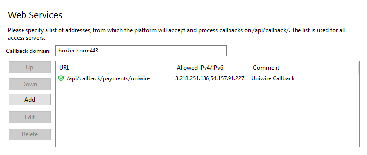

6\. Specify the callback address in the Callback URL parameter in the payment gateway settings. The system will use it to attribute the received request to the relevant wallets. The address must be specified without the domain name.

7\. Open the previously created [profile (#profile)](Uniwire.md#profile) in your Uniwire personal account and click 'Edit Profile'. Specify the full address for callback requests, including the domain, in the Callback URL field.

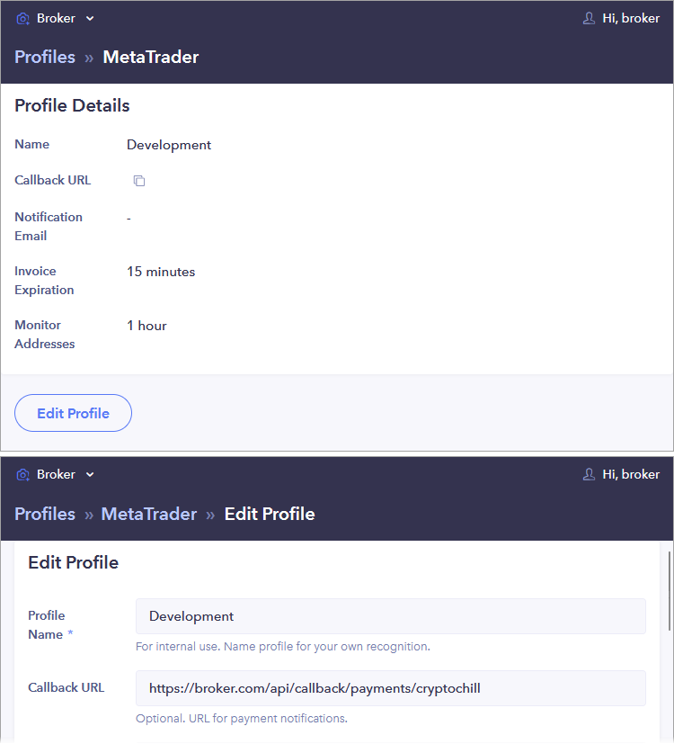

8\. Open the 'Settings \ API Keys' section in your Uniwire account and copy the 'Callback Token' value

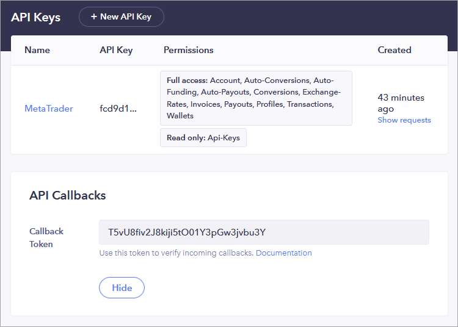

Add the value to the corresponding wallet parameter on the MetaTrader 5 side:

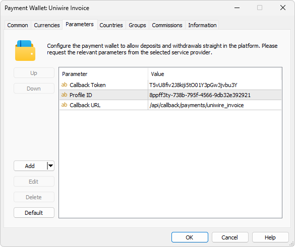

## Other Settings (#other-settings)

All other settings are standard and do not differ from other gateways. You can set up currencies, commissions, gateway access by country, group, etc. For further details, please visit the [Payment Gateways](../Payment-Gateways.md) section.
