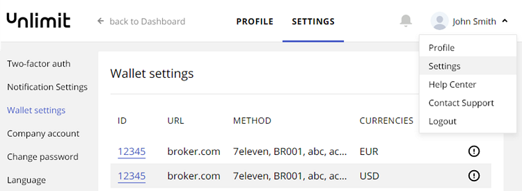
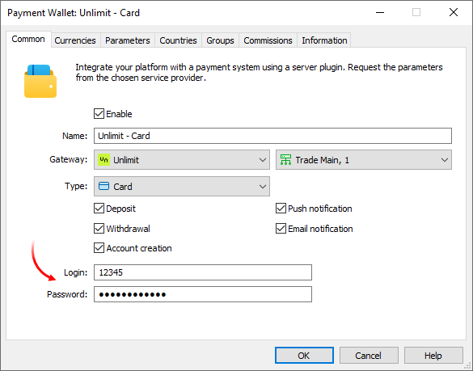
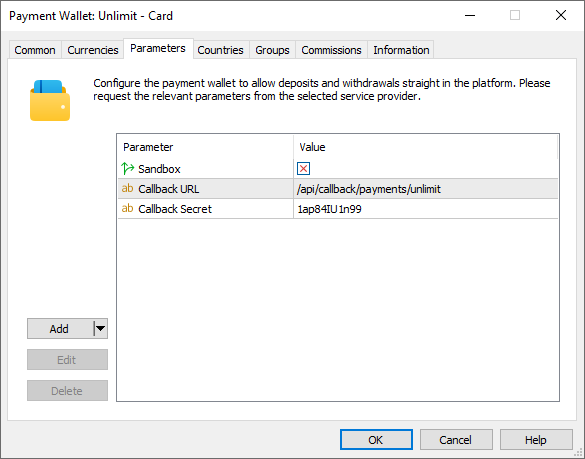
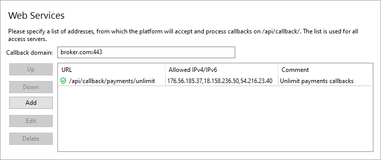
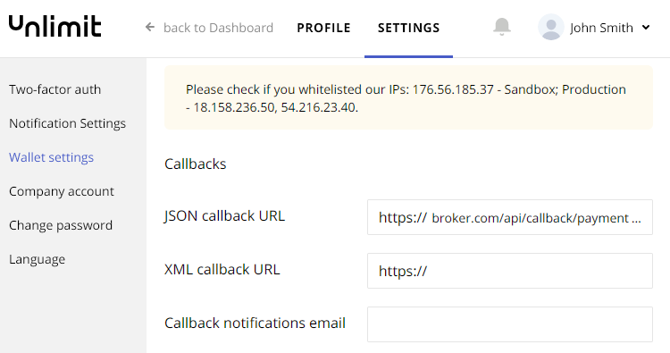
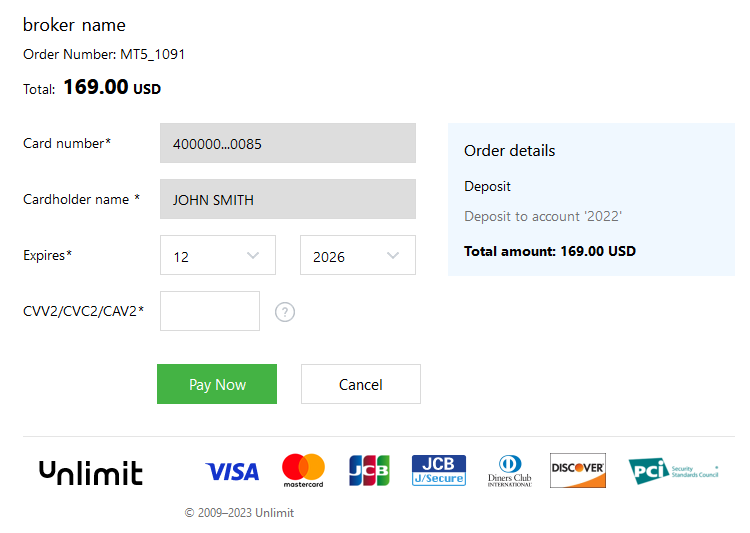
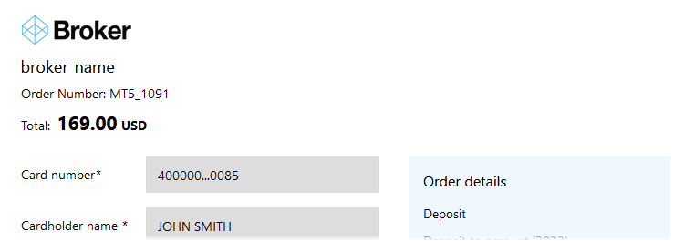

[🏠 Document Start](../../../../README.md) / [MetaTrader 5 Trading Platform](../../../../MetaTrader-5-Trading-Platform.md) / [Platform Setup](../../../Platform-Setup.md) / [Payments](../../Payments.md) / [Payment Gateways](../Payment-Gateways.md) / Unlimit

[Previous](../Payment-Gateways.md) | [Next](ECOMMPAY.md)

# Integration with Unlimit (#integration-with-unlimit)

[Unlimit](https://www.unlimit.com/) offers a wide range of digital payments services. Accept payments with any debit and credit cards, including Visa, Mastercard, Maestro, UnionPay, etc. Offer customers alternative payment systems, such as PayPal, Alipay and WebMoney. The system works with many currencies around the world. Unlimit provides extensive transaction control capabilities: event tracking, cash flow reports and much more.

To connect Unlimit payments, fill out a short [online form](https://www.unlimit.com/contacts/), after which their representative will contact you and will provide further instructions. After registration, you will receive system connection details.

Unlimit will create a wallet through which your payments will be processed. This wallet has:

  * Number or terminal code
  * Password
  * Callback Secret — a special password with which the payment system [signs it callbacks (#signature)](Unlimit.md#signature)

The wallet number is available in your account, under the Settings\Wallet settings section. It is indicated in the ID field. You receive the data you once when creating a wallet. If you lose or need to change the credentials, you should contact Unlimit support.

Also, request from Unlimit to enable [Payment page mode (#payment-page-mode)](https://integration.unlimit.com/v3/#payment-page-mode) for your account. In this mode, all the details of the payment method (card, wallet, etc.) should be specified on a separate page on the provider's side. This is the procedure adopted in the MetaTrader 5 payment system. It is not possible to receive and store all payment method details on the platform side due to legal restrictions. This would require brokers to have a special license.

Create [a payment gateway configuration](../Payment-Gateways.md), select Unlimit as the gateway, and then specify the wallet number in the Login field and the password:

In the "Type" field, select the payment method you want to connect:

  * Card payments
  * Alipay Money Transfer
  * UnionPay International
  * Boleto
  * WebMoney
  * PayPal
  * Direct Banking Nigeria
  * PIX Brasil
  * SEPA
  * PicPay
  * SPEI, Mexico
  * CODI, Mexico
  * Pago Effectivo, Peru/Ecuador

To use multiple payment methods in parallel, create separate wallet configurations. If you need additional payment methods, please contact our [support team](../../../Technical-Support.md).

## System limits features (#limitations)

When creating a wallet for the Pago Efectivo payment method, be sure to specify only one currency, USD or PEN, depending on the country in which you will be accepting payments (Ecuador or Peru). If you need both currencies, create two separate wallets.

## Setting up the environment (#sandbox)

Unlimit supports operations in a [sandbox environment](https://integration.unlimit.com/doc-guides/yzm1qp6ye8zag-sandbox-integration). In this environment, the provider simulates transaction processing so that you can check how payments work, without performing real money transactions. To connect to the sandbox environment, contact Unlimit for a special wallet. When setting up this wallet in the platform, open the Parameters tab and enable the Sandbox option. This option must be disabled for wallets running in a live environment.

## Setting up callbacks (#callback)

Callbacks are used to quickly get transaction processing results. After each transaction, Unlimit sends its status to the URL address which you specify in the wallet settings. Accordingly, to enable the receipt of these notifications at the specified address in the platform, you should configure the platform accordingly.

> The use of callbacks is optional. However, if you do not use them, updating payment statuses can take up to three minutes. This may reduce the quality of your customer service.

On the platform side, the callbacks are received and processed by access servers. To set up notifications:

1\. Register a domain (or a subdomain for your existing domain). Unlimit will access the platform at this address. Also, endpoint addresses for callbacks will be formed relative to this address.

2\. Associate the domain with the [public address (#public)](../../Network-cluster/Configuring-Servers.md#public) of one or more access servers. For further information please see [Integration\Web Services](../../Integrations/Web-Services.md).

3\. [Add an SSL certificate (#ssl)](../../Integrations/Web-Services.md#ssl) for the specified domain in the Integration\Web Services section. For the sandbox environment, you can use a [self-signed (#selfsigned)](../../Integrations/Web-Services.md#selfsigned) certificate. The live environment requires a certificate issued by a trusted certification authority. Only the HTTPS protocol is allowed. HTTP is not supported.

4\. Select the address for the endpoint where callbacks will be accepted. The address is specified relative to the previously selected domain, taking into account the following rules:

https://broker.com/api/callback/payments/Unlimit  
---  
  
  * The first part is an example of a domain name.
  * The second part is a predefined part of the address that is used for all callbacks related to payment systems. For example, callbacks to https://broker.com/api/callback/my/callback will not reach wallets.
  * The third part is defined by you. You can enter any address; however, we strongly recommend using a logical and clear naming system.

5\. Add the selected address to the allow list in the Web Services section, and also specify the list of IP addresses from which notifications will be allowed. You can request the addresses from Unlimit.

6\. Specify the callbacks address in the Callback URL parameter in the payment gateway settings. The system will use it to attribute the received request to the relevant wallets. The address is specified without a domain name.

7\. Specify the callback address in the wallet settings in your Unlimit account. Click on the wallet ID in the [Settings\Wallet settings (#wallet-settings)](Unlimit.md#wallet-settings) and find the 'JSON callback URL' field. The address is specified along with the domain.

8\. Return to the gateway settings in MetaTrader 5 and specify the password, which Unlimit uses to sign callbacks, in the Callback Secret parameter.

To protect callbacks from changes, Unlimit signs each callback with a special password. The full signature algorithm is described in the [documentation (#callback-signature)](https://integration.unlimit.com/api-reference/j24tapx2w31ik-request-format#callback-signature). The password is specified on the MetaTrader 5 platform side in order to verify signatures.

## Customizing the payment page (#payment-template)

Unlimit allows the customization of the page on which the user enters payment details. Design the page in accordance with your corporate style and add a logo. Such a customized appearance can increase customer trust.

To make the setup process more convenient, we have prepared a special style file that fits the payment page into the client terminal:

[Download the file](https://support.metaquotes.net/spfiles/payments/unlimint/style.css) and submit it to Unlimit through your manager or technical support, indicating which wallet it should be applied to. Styles will need to be reviewed by Unlimit risk management.

You can use the styles file as is or use it as a basis for your own template. For example, you can add your own logo to the page header by completing the following steps:

  * Uncomment the "#merchant-logo" and "#merchant-logo a" styles to enable the logo display
  * Specify the logo size and required indents
  * In the 'background: url("...")' parameter add a logo image in Base64 format

Example:

# merchant-logo { (#merchant-logo)
position: static;   
width: 100%;   
height: auto;   
text-align: left;   
margin-bottom: 12px;   
}   
  

# merchant-logo a { (#merchant-logo-a)
height: 32px;   
width: 120px;   
display: inline-block;   
background: url("data:image/png;base64,iVBORw0KGgoAAAANSUhEUgAAAPA...4fpsl2eS5myMYAAAAASUVORK5CYII=");   
background-size: 120px 32px;   
}  
---  
  
The logo will look like this:

For further details about the payment page customization please read the [Unlimit documentation](https://cardpay.atlassian.net/wiki/spaces/SUP/pages/144375811/Customization).

## Other settings (#other-settings)

All other settings are standard and do not differ from other gateways. You can set up currencies, commissions, gateway access by country, group, etc. For further details please visit the [Payment Gateways](../Payment-Gateways.md) section.
