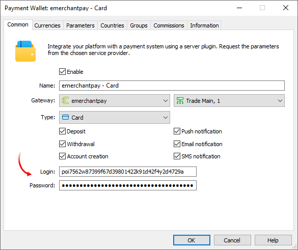
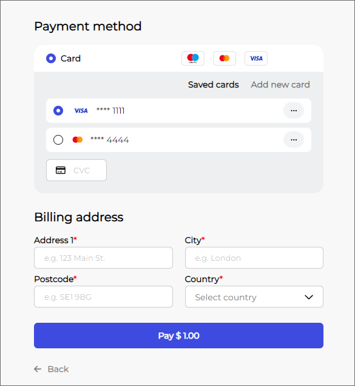
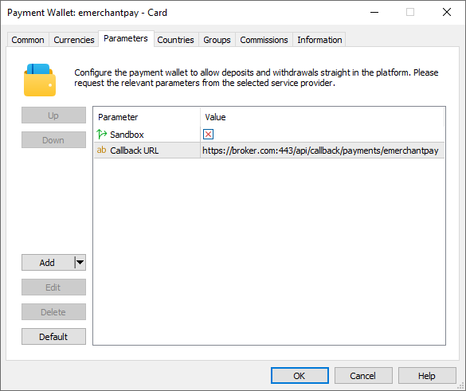
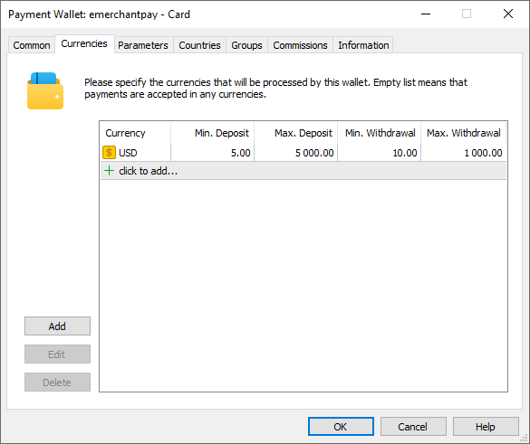
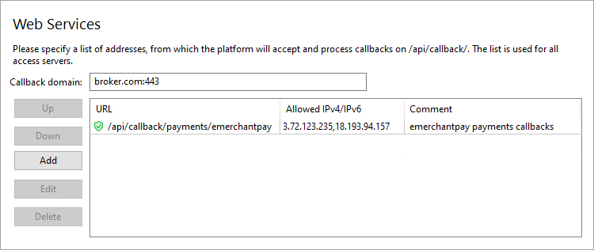

[🏠 Document Start](../../../../README.md) / [MetaTrader 5 Trading Platform](../../../../MetaTrader-5-Trading-Platform.md) / [Platform Setup](../../../Platform-Setup.md) / [Payments](../../Payments.md) / [Payment Gateways](../Payment-Gateways.md) / emerchantpay

[Previous](Kora.md) | [Next](Pay-com.md)

# emerchantpay (#emerchantpay)

[emerchantpay](https://www.emerchantpay.com/) is a leading global payment service provider and acquirer for online, mobile, in-store and over the phone payments. By connecting emerchantpay, you will receive a wide choice of payment methods: cards, e-wallets (Google Pay and Apple Pay), real-time bank transfers and many others. By providing more payment options, you will increase deposit conversion and pave the way for entering new markets.

To connect emerchantpay payments, click Connect Provider in the [showcase](../Payment-Gateways.md) and fill out a short online form. You can also use the registration form on the [provider's website](https://www.emerchantpay.com/contact-sales/). The company representative will contact you and will provide further instructions.

After registration, you will be given access to your personal account, where you can manage transactions. Also, the company manager will provide you with a special login and password for working via the API. They are required to connect to the provider in MetaTrader 5. Also, ask emerchantpay to allow Credit transactions for your account. They are required for withdrawal operations.

Create a [payment gateway configuration](../Payment-Gateways.md), select emerchantpay for the gateway and specify the API login and password:

In the Type field, select a payment method you wish to connect:

  * Card
  * Google Pay
  * Apple Pay
  * MultiBanco
  * P24
  * Blik
  * EPS
  * Giropay
  * MyBank
  * PayU

If you want to use multiple payment methods, create separate wallet configurations.

## System features and limitations (#limitations)

The payment system has the following features:

  * Withdrawal operations are only available for cards.
  * When linking a card, the currency data is saved in the created [payment account (#accounts)](../Controlling.md#accounts). This means the funds can be withdrawn to a saved card only in the currency the user selected when linking (when replenishing or adding the card). To withdraw funds to the same card in a different currency, you need to add it again with the desired currency.
  * To withdraw funds to a card, you should first add/authorize it.
  * [Refund operations (#refund)](../Processing.md#refund) are supported by all payment methods except Multibanco.

emerchantpay can store customers' payment methods on its side. This is a separate list in no way related to cards/wallets saved on the MetaTrader 5 side. The client and all of his or her payment methods in emerchantpay are linked to an email address. When sending a payment request, MetaTrader 5 transmits to emerchantpay the email address specified in a [user account (#personal)](../../Accounts/Editing-Account.md#personal). Based on that data, emerchantpay displays the saved payment methods in the payment dialog:

Therefore, it is extremely important that email addresses in user accounts are correct and [verified (#confirmation)](../../Accounts/Account-Allocation-Settings.md#confirmation).

## Setting up the environment (#sandbox)

emerchantpay supports operations in a [test (staging) environment (#environments)](https://emerchantpay.github.io/gateway-api-docs/#environments). In this environment, the provider simulates transaction processing so that you can check how payments work, without performing real money transactions. To connect to the staging environment, contact emerchantpay for a special wallet. You will receive a separate login and password. To work in the test environment, enable the Sandbox option on the Options tab of the gateway settings. This option must be disabled for wallets running in a live environment.

## Currency settings (#currencies)

emerchantpay supports payments in a variety of currencies. Request a list of available currencies for each payment method from the provider and explicitly specify currencies in the wallet settings. Also, set a limit on transaction amounts in accordance with emerchantpay requirements.

## Setting up callback requests (#callback)

Callback requests are used to quickly receive transaction processing results. In each transaction, the platform transmits a special URL, to which emerchantpay should send the processing result. To ensure proper generation of the addresses, you need to configure the platform accordingly.

> The use of callbacks is optional. However, if you do not configure them, updating payment statuses may take longer. This may reduce the quality of your customer service.

On the platform side, the callbacks are received and processed by access servers. To configure notifications:

1\. Register a domain (or subdomain for your existing domain). emerchantpay will use this address to communicate with the platform, and the endpoint address for callback requests will be formed relative to it.

2\. Associate the domain with the [public IP address (#public)](../../Network-cluster/Configuring-Servers.md#public) of one or more access servers. For further information, please see [Integration\Web Services](../../Integrations/Web-Services.md).

3\. [Add an SSL certificate (#ssl)](../../Integrations/Web-Services.md#ssl) for the specified domain in the Integration\Web Services section. The operation requires a certificate issued by a trusted certification authority, while self-signed certificates are not allowed even in a sandbox environment. Operation is only possible via the HTTPS protocol. HTTP is not supported.

4\. Choose an endpoint address for receiving callback requests. The address is specified relative to the previously selected domain, taking into account the following rules

https://broker.com/api/callback/payments/emerchantpay  
---  
  
  * The first part is an example of a domain name.
  * The second part is a predefined part of the address that is used for all callbacks related to payment systems. For example, callbacks to https://broker.com/api/callback/my/callback will not reach wallets.
  * The third part is defined by you. You can enter any address, however we strongly recommend using a logical and clear naming system.

5\. Add the selected URL to the allowed list in the Web Services section and specify the list of IP addresses, from which the payment provider will send transaction status notifications. You can obtain the address list from emerchantpay.

6\. Specify the callback address in the Callback URL parameter in the payment gateway settings. This address will be sent to emerchantpay in every transaction. Please make sure to specify a full address. The URL must include a domain name. Specifying an IP address is not allowed.

## Other settings (#other-settings)

All other settings are standard and do not differ from other gateways. You can set up currencies, commissions, gateway access by country, group, etc. For further details, please visit the [Payment Gateways](../Payment-Gateways.md) section.
