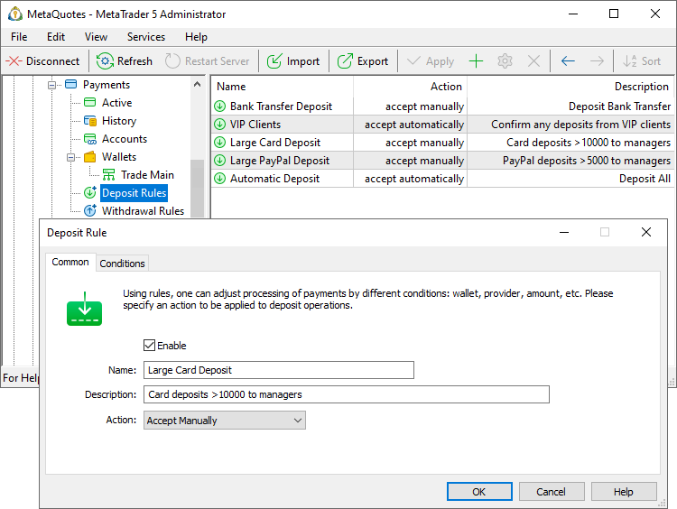
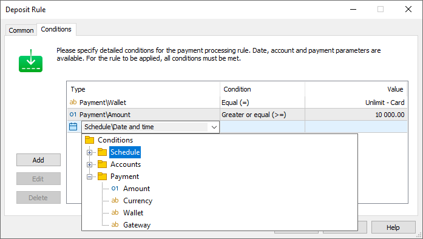

[🏠 Document Start](../../../README.md) / [MetaTrader 5 Trading Platform](../../../MetaTrader-5-Trading-Platform.md) / [Platform Setup](../../Platform-Setup.md) / [Payments](../Payments.md) / Payment Processing Rules

[Previous](Payment-Gateways/Bank-Transfer.md) | [Next](Controlling.md)

# Payment Processing Rules (#payment-processing-rules)

You can flexibly customize payment processing depending on various parameters. For example, you can automatically confirm card transactions within a certain amount limit, always manually process bank transfers, or track withdrawals for customers registered less than a month ago. Almost any parameters of a trading account, as well as parameters of wallets and operations, can be used as conditions.

Rules are configured separately for withdrawal and deposit operations. The parameters are the same, except for the availability of some conditions.

> By default, no payments are allowed. You must create at least one allow rule with the required set of conditions.

## Checking the Rules (#priority)

The rules are checked from top to bottom. If the operation matches the conditions of the upper rule, it is processed in accordance with it; if not, the next rule is checked, and so on. The rules are checked until the transaction is confirmed, rejected, or sent to the manager for processing.

To change the position of the rules, use the " Move Up" and " Move Down" commands in the context menu or toolbar. Whenever you change the list of rules, all operations currently in processing are checked again.

## Creating a Rule (#create)

Open the rules section for withdrawals or deposits and create a new entry.

In Common settings, specify the following:

  * Name — the name of the rule. Set descriptive names which reflect the idea of the action. This will ensure efficient control when you add multiple rules to the system.
  * Description — a more detailed description of the rule.
  * Action — the action to be applied to the operation that matches the rule conditions:
    * Accept automatically — the operations will be confirmed manually without requiring manual confirmation.
    * Accept manually — the operations will be forwarded to the manager for confirmation. For bank transfers, the processing is always manual, even if the rule sets automatic confirmation.
    * Reject — operations will be rejected immediately.

## Rule Specifics (#processing)

The rules apply in different ways, depending on the transaction type:

  * For deposits, the rules are checked twice. The first check is implemented after the user performs a transaction in the client terminal. If the rules do not require the rejection of the operation, the request is sent to the payment provider. After the transaction is successfully completion in the payment system, the rules are checked again. With manual confirmation, the manager will receive a request for processing; with automatic confirmation, the funds will be immediately credited to the trader's trading account as a balance operation.
  * For withdrawal operations, the rules are checked once, before sending the request to the payment provider.

## Rule Conditions (#conditions)

Having configured common rule parameters, describe rule trigger conditions.

### Comparison Types (#comparison-types)

Standard comparison types are available for all conditions:

  * Equal (=)
  * Not equal (!=)
  * Greater than (>)
  * Greater than or equal (>=)
  * Less than (<)
  * Less than or equal (<=)

For string conditions, such as the group name or a comment, the Match Mask condition is also available. Here you can specify strings with the "*" mask.

  * Condition "Ggroup", value "real\*" = all real groups.
  * Condition "Comment", value "*vip*" = all accounts, comments of which contain the string "vip".

The following conditions are available:

## Schedule (#time)

These parameters set date and time conditions. The rule is triggered if the user performs an operation on the specified date or time.

### Accounts (#accounts)

These settings specify conditions based on account parameters:

  * Login — the rule is triggered for the specified account. You can specify a comma-separated list of values and value ranges. For example 100,102,107,120-130.
  * Group, Country, City, Color, Comment — the rule is triggered for the account from the specified [group (#account)](../Accounts/Editing-Account.md#account), [country (#personal)](../Accounts/Editing-Account.md#personal), [city (#personal)](../Accounts/Editing-Account.md#personal), etc. For example, if the group is set to "real\*", then the rule will be triggered only for real accounts. If you specify "Argentina" as the country, then the rule will be applied to accounts from Argentina. The condition works similarly for other account parameters.
  * Registration — the condition is set relative to the account creation date in the platform. Specify the date and the comparison type: equal to, less than, or greater than. Accordingly, the condition will be triggered for accounts registered on the specified date, earlier or later than this date. For example, if you specify "Registration > 2020.09.01", The rule will only be triggered for accounts created after the specified date.
  * Last visit — the condition is set relative to the last connection of the account to the platform. Specify the date and the comparison type: equal to, less than or greater than. Accordingly, the condition will trigger for accounts connected on the specified date, earlier or later than this date. For example, if you specify "Last visit > 2023.01.01", then the rule will be triggered for accounts that last connected to the platform after the specified date.
  * Balance — the condition is set relative to the current [account balance (#account-state)](../Accounts/Editing-Account.md#account-state); the amount is specified in the [deposit currency (#currency)](../Groups/Group-Settings.md#currency). Using this condition, you can set up rules for large customers. 
  * Credit is similar to the "Balance" condition. In this case, the amount of [credit funds on the account (#account-state)](../Accounts/Editing-Account.md#account-state) is checked.
  * Floating profit, Equity, Margin, Free margin, Margin level — these conditions are similar to the "Balance" condition. Appropriate [trading account states (#account-state)](../Accounts/Editing-Account.md#account-state) are checked here.
  * Deposit currency — condition regarding account [deposit currency (#currency)](../Groups/Group-Settings.md#currency). For example, if you specify "EUR*", the rule will only apply to EUR-based accounts.

You can create an unlimited number of rules to cover any situation.

### Payment (#payment)

These settings specify conditions based on the payment transaction parameters:

  * Amount — the transaction amount. Using this option, you can automatically approve payments up to a certain amount, while transferring larger payments to managers for manual confirmation.
  * Currency — transaction currency.
  * Wallet — the [wallet](Payment-Gateways.md) via which the transaction is performed.
  * Gateway — the [gateway](Payment-Gateways.md) via which the transaction is performed.

### Check (#verification)

This is an additional group of conditions for checking operations:

  * Verify unbalanced withdrawal — this is a true/false condition. It checks if the user withdraws more funds than they deposited through the same wallet or more than they have earned. The condition allows additional measures to be taken to combat potential money laundering. For example, if you allow [transferring funds between accounts (#transfer-funds)](../Groups/Group-Settings.md#transfer-funds), you can enable additional control over withdrawal operations by the manager who will check how much money the user withdraws.
  * Verify cardholder name — a true/false condition. It checks whether the name [specified on the card (#details)](Controlling.md#details) in the completed payment matches the client's name indicated in the [trading account (#personal)](../Accounts/Editing-Account.md#personal). The condition enables additional protection against fraud using stolen cards. With this verification, you can create rules that will automatically reject suspicious payments or send them for additional manual verification to managers.  
  
Verification features:

  *     * When making transactions, users enter data (including name) not in the platform but on the payment provider’s page. Therefore, the platform can check the card name only after the transaction has been completed and only if the payment provider sends this information to the platform. At the moment, the transfer of the necessary data is supported by [Unlimit](Payment-Gateways/Unlimit.md), [ECOMMPAY](Payment-Gateways/ECOMMPAY.md) [emerchantpay](Payment-Gateways/emerchantpay.md) and [Exactly](Payment-Gateways/Exactly.md).
    * A name can be verified before performing a transaction only if the provider supports [card linking (#accounts)](Controlling.md#accounts) and allows further transactions only using previously authorized cards.
    * If you enable name checking, but the provider does not support the transfer of the necessary data, all checks will fail: in all cases, the system will consider that the name does not match.
    * In the trading account, the client's name is indicated in three separate fields: First Name, Last Name, Middle Name. The system compares any combination of these fields (Last Name+Middle Name, Middle Name+Last Name, First Name+Last Name, First Name+Last Name+Middle Name, etc.) with the cardholder field. The check is case insensitive.

