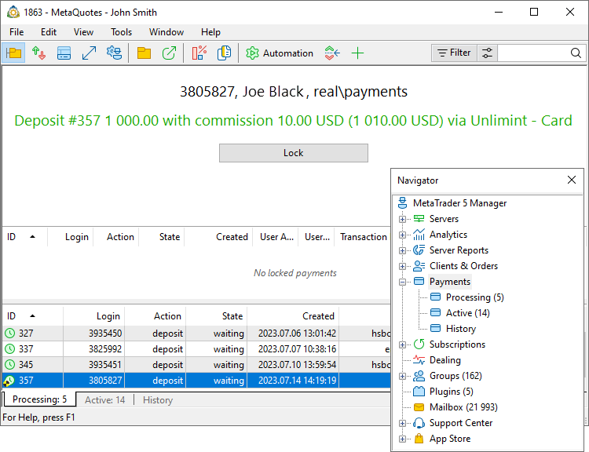
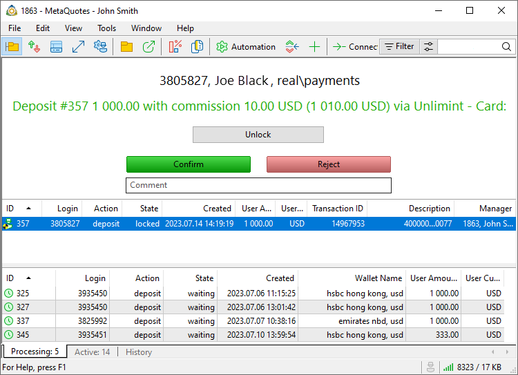
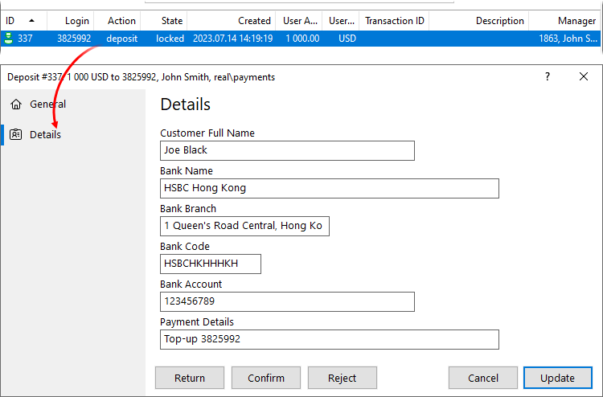
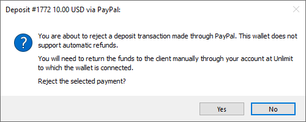
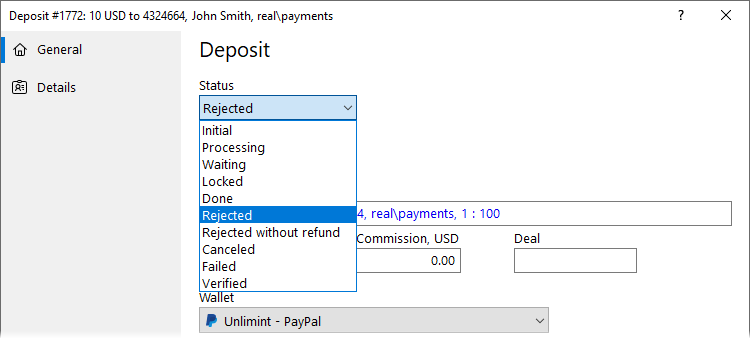

[🏠 Document Start](../../../README.md) / [MetaTrader 5 Trading Platform](../../../MetaTrader-5-Trading-Platform.md) / [Platform Setup](../../Platform-Setup.md) / [Payments](../Payments.md) / Processing

[Previous](Controlling.md) | [Next](in-Client-Terminals.md)

# Processing Payments (#processing-payments)

Using [payment processing rules (#action)](Payment-Processing-Rules.md#action), you can flexibly configure the system and process some transactions in a fully automatic mode, while requiring manual confirmation by the manager for others. This provides additional operation security. For example, you can require manual control for suspiciously large withdrawal operations. All bank transfers are always processed manually.

Manual payment processing is implemented through the Manager terminal. Open the Payments \ Processing section. The bottom part displays a list of all payments pending processing.

> To process payments, the manager should have the "Access payments" and "Process payments" [permissions (#payments)](../Managers.md#payments). The manager can receive for processing only payments made by account from [groups available to the manager (#groups)](../Managers.md#groups).

Select the desired payment, and then click "Lock" at the top. The captured payment is removed from the queue, and no other manager can process it at the same time. After checking the payment details, you can approve or reject it. If you do not want to process the payment, press "Unlock", and it will be returned to the queue.

Further actions depend on the payment type and the system through which it is performed.

### Payments by Cards and e-Wallets (#payments-by-cards-and-e-wallets)

Depending on the type, such transactions are sent to manual verification at different stages:

  * Deposits are forwarded for manual confirmation after they have been successfully completed in the payment system. If the manager confirms the transaction, the amount will immediately be credited to the user's trading account as a separate balance transaction. If the manager rejects the transaction, the amount will not be credited to the account. Further actions related to returning the funds to the client depend on the payment provider. For further details please read "[Refunds (#refund)](Processing.md#refund)".
  * Withdrawals require manual confirmation before being sent to the payment system. The amount is immediately debited from the user's account using a balance operation. If the manager confirms the operation, a request to transfer funds will be sent to the payment system. If the manager rejects the transaction, the user will receive a refusal and the money will be credited back to the trading account as a separate balance operation.

### Bank Transfer (#bank-transfer)

This type is always processed manually, without external payment systems. When you receive a request for a deposit or withdrawal via bank transfer, you should pass the relevant information to the company's accountant. Click on the row of a locked operation to open its details:

In the case of a deposit, the accountant must check your bank account and verify that the transfer has been completed. After that, the manager can confirm the operation. Next, the system will credit the funds to the trading account as a separate balance operation. 

In case of withdrawal, funds are first debited from the trading account by a balance transaction. Next, the accountant must perform the transfer using the specified details. The manager can then confirm the operation.

Additional information is available in the [Bank Transfer](Payment-Gateways/Bank-Transfer.md) section.

## Refunds (#refund)

Funds deposited by clients into their accounts can be returned according to two main scenarios.

### Rejection during initial processing by manager (#rejection-during-initial-processing-by-manager)

The initial processing occurs when the client replenishes the account, and the transaction is forwarded to the manager for manual confirmation. The manager may reject this transaction for some reason, for example, in accordance with the company's AML policy.

Deposits are forwarded for manual confirmation after they have been successfully completed in the payment system. Therefore, after rejection on the MetaTrader 5 side, the funds must be returned to the client back to the used payment method: card, wallet, etc. If the provider company through which the deposit transaction was made supports automatic refunds, then after the transaction is rejected, the platform will automatically send a corresponding request to the provider. In this case, no additional actions are required from the manager.

If the provider does not support automatic refunds, the funds will need to be returned manually. If you try to reject such a transaction, the system will display the following warning:

When you reject the payment, it will be set to the "Rejected without refund" [state (#common)](Controlling.md#common). After that, go to your account/dashboard on the payment provider's portal and cancel the corresponding deposit transaction. After this, on the MetaTrader 5 side, you should manually change the payment status to "Rejected".

### Canceling a completed payment (#canceling-a-completed-payment)

If the payment has already been accepted and credited to the client's trading account, the refund procedure is slightly different:

  * Write off the corresponding amount from the trading account balance using the Manager terminal
  * Go to your account/dashboard at the payment provider through which the top-up was made and create a refund for the corresponding transaction. In this case, no automatic returns are possible; the procedure must be performed manually.
  * Open the corresponding payment on the MetaTrader 5 side and change its status to "Rejected" or "Canceled". The reason for cancellation can be additionally specified in the "Description" field.

