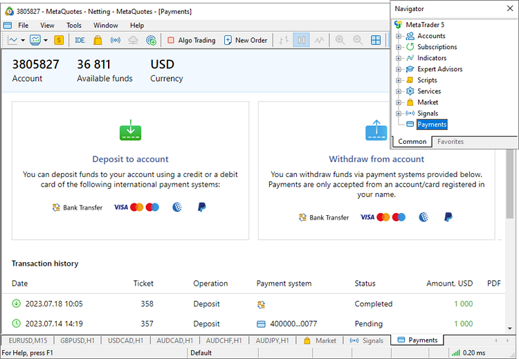

[🏠 Document Start](../../../README.md) / [MetaTrader 5 Trading Platform](../../../MetaTrader-5-Trading-Platform.md) / [Platform Setup](../../Platform-Setup.md) / [Payments](../Payments.md) / in Client Terminals

[Previous](Processing.md) | [Next](../Managers.md)

# Payments in Client Terminals

After you configure payments on the trading server side, a special section will appear in the client terminals, from where your traders will be able to make deposits and withdrawals.

In addition to deposit and withdrawal options, the section displays the history of all transactions completed through the payment system. Pending [invoices for depositing via a bank transfer (#deposit)](Payment-Gateways/Bank-Transfer.md#deposit) can be downloaded as a PDF file.

Transaction specifics:

  * Transactions are always associated with the currently connected account. To deposit or withdraw funds from another account, the user must first connect to it.
  * The payments section is only available for real accounts and is not shown for other account types.
  * The list of available payment methods is determined by the gateway settings. You can configure access based on [groups (#groups)](Payment-Gateways.md#groups) and [countries (#countries)](Payment-Gateways.md#countries).
  * Payment settings take precedence over [settings of links to deposit and withdrawal pages](../Accounts/Links-to-Depositing-and-Withdrawing.md). If payments are configured in the platform, all deposit and withdrawal commands will open the payments section rather than external pages.

Find detailed info on using the payment system on the client terminal side in the appropriate manuals:

  * [MetaTrader 5 for desktops](https://www.metatrader5.com/en/terminal/help/startworking/payments)
  * [MetaTrader 5 for iPhone/iPad](https://www.metatrader5.com/en/mobile-trading/iphone/help/settings_accounts/payments)
  * [MetaTrader 5 for Android](https://www.metatrader5.com/en/mobile-trading/android/help/settings_accounts/payments)

