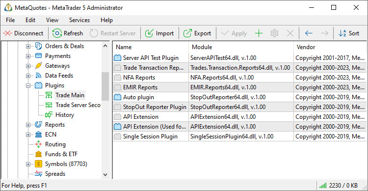
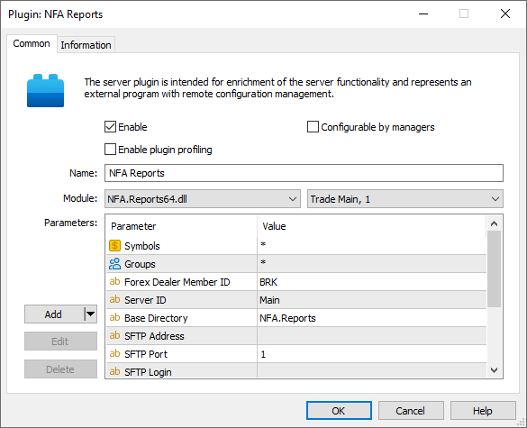
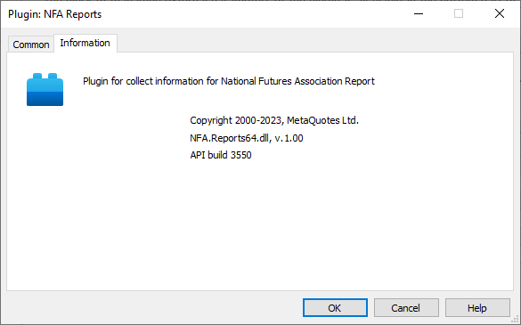

[🏠 Document Start](../../README.md) / [MetaTrader 5 Trading Platform](../../MetaTrader-5-Trading-Platform.md) / [Platform Setup](../Platform-Setup.md) / Plugins

[Previous](Data-Feeds/Setup-as-Service.md) | [Next](Reports.md)

# Plugins (#plugins)

Plugins are special modules for extending the set of functions of a trading platform as DLL files. Plugins can also be used to change algorithms of some operations performed by servers. For example, they can be used to change calculation of margin or swaps. [MetaTrader 5 Server API](https://support.metaquotes.net/en/docs/mt5/api/serverapi) is used to create plugins.

Each plugin is [set up (#module)](Plugins.md#module) for a certain server. To view plugins configured for a server, select it in the tree located in the left part of the terminal.

## Installing plugins (#installing-plugins)

Plugins are configured separately for each server. Copy the plugin DLL file to the [/plugins (#plugins)](../Platform-Components/Trade-Server/Structure-of-Directories-and-Files.md#plugins) directory of the corresponding trade or history server.

> When the server starts, it loads all the plugin DLLs in the /plugins directory and all of its subdirectories. The libraries are loaded even if the platform does not have the corresponding plugin configurations. In this regard, we strongly recommend against storing files you plan to use in these directories.

## Adding and Editing Plugins (#add-edit)

For the plugin to start working, create a configuration for it. Select  Add on the [toolbar](../MetaTrader-5-Administrator/User-Interface/Toolbar/Standard.md) or in the [context menu (#context)](Holidays.md#context). To edit the settings of an added plugin, click  Edit.

This section support group editing of plugin configurations. To do it, select several plugins by holding Ctrl or Ctrl+Shift, and then start editing them. Using the group editing you can enable and disable plugins in bulk. Additional general information about working with configuration records is given in the ["Working with Instructions"](General-Information/Working-with-Instructions.md) section.

Arrange plugins in the required order, as this affects the [hook processing order](https://support.metaquotes.net/ru/docs/mt5/api/serverapi_hooks). The higher the plugin is in the list, the earlier it receives the hook.

### Common (#common)

Set plugin settings:

  * Enable — enable/disable the plugin. The plugin starts operating immediately after the option is enabled and the configuration is saved. To get started, server restart is not required. If you disable the option, the server will completely unload the plugin from memory. This enables update of plug-in DLL files without the need to reload the platform.
  * Configurable by managers — if this option is enabled, it will be possible to change the settings of the plugin via the manager terminal. To be able to change the plugin settings, a manager account must have the ["Setup of plugins" (#permissions)](Managers.md#permissions) permission enabled.
  * Enable plugin profiling — after enabling the [profiling (#profiling)](Plugins.md#profiling), the server will start collecting the statistics on the plugin, what allows estimating its performance and detecting possible problems of its operation. It is not recommended to keep this option always enabled, as profiling decreases the plugin performance.
  * Name — name of the plugin configuration;
  * Module — in the first field select one of plugin modules. This field displays all the plugins located in the [/plugins (#plugins)](../Platform-Components/Trade-Server/Structure-of-Directories-and-Files.md#plugins) directory of the trade server specified in the field.

> Each configuration of plugin is bound to certain [trade server](Network-cluster/Configuring-Servers/Trade-Server.md), thus it affects only its operation accordingly.

Parameters

The block of managing external parameters of the plugin is available in the bottom part of the window. Such parameters can be implemented during the development of plugin modules; they allow managing them from the outside.

The following commands are used for managing parameters:

  * Add — add a new parameter. A line appears upon pressing this button. Specify the parameter name in the "Parameter" field, and the value of this parameter in the "Value" field. String type parameters are created by default. To select another type (integer or fractional) click the arrow on the "Add" button.
  * Edit — edit a selected parameter. The same action can be performed by a double click on the required field.
  * Delete — delete a selected parameter.

### Information (#info)

This tab displays various information on the plugin module: description, copyright, author, version of the plugin module and version of MetaTrader 5 Server API used for developing this plugin.

## Profiling (#profiling)

The profiling is enabled using the "Enable plugin profiling option" in the plugin settings. This procedure allows estimating the plugin performance by measuring the time of calls of hooks and event handlers within the plugin. The time is estimated separately for each hook and handler in the plugin.

After enabling the profiling, the server will start gathering the statistics on the plugin operation and outputting the results in the [journal](Network-cluster/Journal.md) every 5 minutes. To request the journal records, use "Profile" keyword.

  * It is recommended to enable profiling during testing only, as it slows down plugins.

  * Profiling should be enabled before enabling the plugin. If the plugin is already enabled, it should be re-launched after enabling profiling. This is necessary for the correct data collection.

  
---  
  
The following information is gathered during profiling:

  * Hook/event handler state — two states are possible: active state (the hook/event handler was executing during estimation), unactive state (the hook/event handler was not executing during estimation). If a hook/handler stays in the active state for more than 5 seconds, a message about a possible deadlock is displayed (the second line in the example). If a hook/handler stays active for more than 0.5 seconds, a message informing that the hook/handler is too slow is displayed (third line in the example).

14:10:01 Simple Plugin Profile IMTConSymbolSink::OnSymbolUpdate: unactive state   
14:10:01 Simple Plugin Profile IMTConSymbolSink::OnSymbolUpdate: possible deadlock: 6000 msc in active state   
14:10:01 Simple Plugin Profile IMTConSymbolSink::OnSymbolUpdate: too slow: max process time 1000 msc  
---  
  
  * Number of calls — the total number of calls of the hook/handler during the plugin operation.

14:10:01 Simple Plugin Profile IMTConSymbolSink::OnSymbolUpdate: 5 calls   
---  
  
  * Time of last call — time of the last call of the hook/handler accurate to millisecond.

14:10:01 Simple Plugin Profile IMTConSymbolSink::OnSymbolUpdate: last call at 2013.06.26 14:09:37.603  
---  
  
  * Minimal execution time — minimal time of execution of the hook/handler (in milliseconds) during the plugin operation. 

14:10:01 Simple Plugin Profile IMTConSymbolSink::OnSymbolUpdate: time min 0 msc  
---  
  
  * Maximal execution time — maximal time of execution of the hook/handler (in milliseconds) during the plugin operation.

14:10:01 Simple Plugin Profile IMTConSymbolSink::OnSymbolUpdate: time max 2 msc  
---  
  
  * Average execution time — average time of execution of the hook/handler (in milliseconds) during the plugin operation.

14:10:01 Simple Plugin Profile IMTConSymbolSink::OnSymbolUpdate: time avg 0 msc  
---  
  
  * Total execution time — total time of execution of the hook/handler (all calls in milliseconds) during the plugin operation.

14:10:01 Simple Plugin Profile IMTConSymbolSink::OnSymbolUpdate: time total 0 msc  
---  
  

## Context Menu (#context)

The context menu of the "Plugins" section contains the following commands:

  *  Add — add a new plugin configuration;
  *  Edit — edit a selected plugin configuration;
  *  Delete — delete a selected plugin configuration;
  *  Move Up — move a selected plugin configuration up relative to others;
  *  Move Down — move a selected plugin configuration down relative to others;
  *  Sort Alphabetically — sort configurations alphabetically. Please note that sorting is done on the server, not in the local terminal.
  *  Enable — enable the selected configuration.
  *  Disable — disable the selected configuration.
  *  Export to File — [export](General-Information/ImportExport-Settings.md) the settings of plugins to a file.
  *  Import from File — [import (#import)](General-Information/ImportExport-Settings.md#import) the settings of plugins to a file.
  *  Journal — request [logs](Network-cluster/Journal.md) according to the selected configuration. This will open the trade server logs section, with the name of the selected configuration automatically specified in the query field. You will only need to press the request button.
  *  Find — open a [search](../MetaTrader-5-Administrator/User-Interface/Search.md) window;
  * Auto Arrange — if this option is enabled the size of columns is selected automatically;
  * Grid — this option shows/hides field separators in the table .

