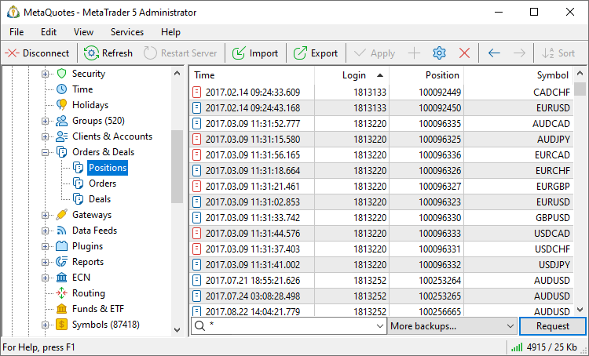
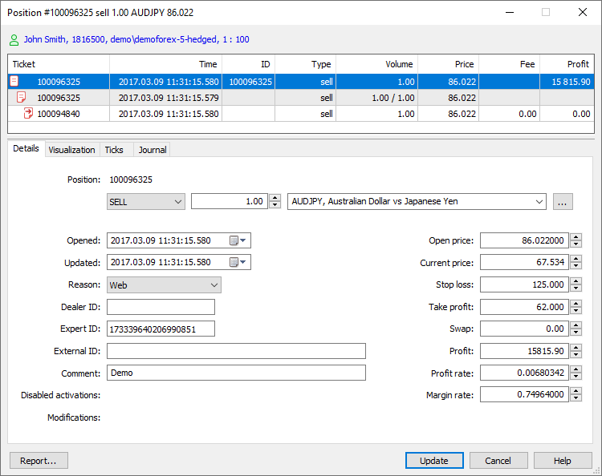

[🏠 Document Start](../../README.md) / [MetaTrader 5 Trading Platform](../../MetaTrader-5-Trading-Platform.md) / [Platform Setup](../Platform-Setup.md) / Positions

[Previous](Deals.md) | [Next](Gateways.md)

# Positions (#positions)

This section allows working with all current positions of your traders.

Depending on the items chosen in the context menu, different [information about positions (#view)](Positions.md#view) is displayed here. Positions can be sorted out by any field. To do it, click on its name.

> The trading platform supports two position accounting systems: [netting and hedging](Groups/Position-Accounting-Systems.md).

## Requesting Positions (#request)

To view current positions, compose a request in the line located in the lower part of the section. The request can be performed:

  * By Groups  
To do it, select a group from the dropdown list.
  * By Logins  
To do it, should specify one or several logins separated with commas.

To request all positions, specify the asterisk (*).

Further the following request parameters can be specified:

  * Trading instruments for which positions will be requested. One symbol or a group of symbols can be selected from the list. Optionally, you can specify a comma separated list of trading instruments or groups of symbols. For example, Forex\*, CFD\*, Metals\GOLD. Please note that filtering is performed on the server side, and not on the administrator terminal side. To obtain data on other instruments, send another request. The request is performed for all financial instruments by default.
  * Further you can specify from which database positions should be requested: current database or one of [backups (#backup)](Positions.md#backup). To perform the request, press the "Request" button or execute the " Request" command of the [context menu (#context)](Positions.md#context).

## Viewing a Position (#view)

To view or to edit a position, double-click on it in the list. The trading operation dialog is a fully-featured tool with a plethora of advanced features, such as the display of the structure of operations, visualization, tick history and logs.

### Account details (#account-details)

The upper part of the dialog features brief information about the account, on which the operation was performed: name, login, groups and leverage. Click on this line to view [account details](Accounts/Editing-Account.md).

### Overview and related operations (#connected-transactions)

This block shows the orders and deals related to the selected position, i.e. the entire history of position opening and change. Thus you can easily access the entire chain of related actions. Select an operation from the tree and all relevant parameters will be instantly displayed in the bottom part.

### Trading operation details (#details)

The following parameters are indicated for positions:

  * Login — [account](Accounts.md) number the position was opened on.
  * Position — ticket (unique number) of the position. Usually, a position ticket matches the [ticket of the order](Orders.md) used to open the position. The exceptions are positions re-opened as a result of service operations or opened without placing an order. The tickets may be different for positions having the following [opening reasons (#reason)](Positions.md#reason):
    * Rollover — charging swaps with position re-opening
    * Split — re-opening a position after a split
    * Variation margin — re-opening a position after charging a variation margin
    * Synchronization — opening a position when synchronizing with an external system (without a previous order)
    * Transfer — relocating a position with a calculated price to a new symbol with the same underlying asset

> Tickets of positions having other opening reasons match initial orders.

  * Open Time — time when the position was opened.
  * Update Time — last position modification time (when its volume was changed). This is actually the time of the last deal for the financial instrument which corresponds to this position. This time does not change when Stop Loss or Take Profit is modified or when the position is edited via the Administrator terminal or API.
  * Type — type of the position - buy or sell.
  * Symbol — [symbol](Symbols.md) the position was opened for.
  * Volume — the current position volume in lots.
  * Reason — reasons for position opening:
    * Client — opened by a client manually through the client terminal.
    * Expert — opened by a client with using an Expert Advisor.
    * Dealer — opened by a dealer through the manager terminal.
    * Stop loss — not used for positions.
    * Take profit — not used for positions.
    * Stop out — not used for positions.
    * Rollover — opened when reopening a position for charging [swaps](Symbols/Symbol-Settings/Swaps.md).
    * External Client — opened by a client from an external trading system.
    * Variation margin — not used for positions.
    * Gateway — opened by a MetaTrader 5 gateway that had connected to the trading platform.
    * Signal — opened as a result of copying a [trade signal](https://www.mql5.com/en/signals) according to a subscription in the client terminal.
    * Settlement — opened as a result of performing operations connected with the settlement of a futures contract/option. Not used at the moment.
    * Transfer — opened due to transferring a position at the settlement price to a new symbol with the same underlying asset. Not used at the moment.
    * Synchronization — opened as a result of [synchronization (#trade-accounts)](Accounts/Editing-Account.md#trade-accounts) of an account's trade state with an external system.
    * External Service — opened from an external trading system for technical reasons (for example, to correct the trade state of a client).
    * Mobile — position opened via the MetaTrader 5 mobile terminal for Android or iPhone.
    * Web — position opened via the web terminal.
    * Split — position opened as a result of a symbol split.
    * Corporate action — position created as a result of a corporate action, such as consolidating or renaming securities, transferring a client to a different account, etc. API applications set this flag for service operations so that the platform does not account for such corporate actions in commission calculations.
    * Migration — position opened as a result of import of clients' trading operations from the MetaTrader 4 server.
  * Price — weight-average price of the position opening: (price of deal 1 * volume of deal 1 + ... + price of deal N * volume of deal N) / (volume of deal 1 + ... + volume of deal N). The accuracy of rounding of the average weighted price is equal to the number of decimal places in the symbol price plus three additional digits.  
  
The weighted average price is calculated sequentially, as the position increases or is partially closed. For example, a client trading in a netting group has executed the following series of trades:  
  
1\. Buy 0.01 EURUSD at 1.10050 (In)  
2\. Buy 0.02 EURUSD at 1.10052 (In)  
3\. Sell 0.02 EURUSD at 1.10067 (Out)  
4\. Buy 0.01 EURUSD at 1.10056 (In)  
  
At each step, the following value will be displayed in the position open price:  
  
1\. The value of 1.10050 as is, since the position entry was performed in one trade  
2\. When the position is increased, the weighted average open price is calculated: (1.10050 * 0.01 + 1.10052 * 0.02) / (0.01 + 0.02) = 1.10051333  
3\. After partial closing of the position (0.02 lots out of 0.03 are closed), the client is left with a 0.01-lot position with the open price of 1.10051333  
4\. When the position is further increased, the new weighted average price is calculated taking into account the previous calculated one: (1.10051333 * 0.01 + 1.10056 * 0.01) / (0.01 + 0.01) = 1.10053666‬  

  * Stop Loss — the Stop Loss level of the position.
  * Take Profit — the Take Profit level of the position.
  * Profit — the current profit on this position. The profit does not include swap and commission.
  * Current Price — the current price of the symbol of the position.
  * Swap — swaps charged.
  * Margin Rate — exchange rate of the [margin currency (#margin-currency)](Symbols/Symbol-Settings/Currency.md#margin-currency) to the trader's [deposit currency (#currency)](Groups/Group-Settings.md#currency). It is usually calculated and registered at the moment when a position is opened or its volume is modified. The rate can be recalculated at the end of the trading day if the relevant option is enabled in [symbol settings (#recalculate-margin)](Symbols/Symbol-Settings/Trade/Margin-Calculation/Basic.md#recalculate-margin).

  * Profit rate — exchange rate of the position profit currency to the trader's group [deposit currency (#currency)](Groups/Group-Settings.md#currency).

  * Comment — a comment to the position. A comment to a position is inherited from the last [deal](Deals.md) by the symbol of the position.
  * Expert — the identifier (magic number) of an Expert Advisor that has opened this position in the client terminal.
  * ID — a unique identifier of the position in external systems;
  * Dealer — the login of a dealer (gateway) that processed an order, which opened the position. If "0" is specified in this field, it means that the order was processed without a dealer.
  * Disable activation — additional conditions (flags), with which [order (#activation)](Orders.md#activation) activation is prohibited. The flags can be set by Gateway API when orders are sent to an external system. For example, if activation of stop loss and take profit must be controlled by an external system, a flag disabling activation on the MetaTrader 5 side can be set for the order. Order flags are inherited by positions created upon order execution. Available flags:
    * Limit — no processing of limit level hitting.
    * Stop — no processing of stop level hitting.
    * Stop Limit — no processing of stop limit level hitting.
    * SL — no processing of Stop Loss activation.
    * TP — no processing of Take Profit activation.
    * Stop Out — no processing of Stop Out activation.
    * Expiration — no processing of expired order cancellation.
  * Modifications — if the position is changed manually, this field displays who implemented the changes:
    * Administrator — position changed by an administrator.
    * Manager — open price changed by a manager.
    * Restore — position restored.
    * Admin API — position changed via Manager API administrator interface.
    * Manager API — position changed via Manager API manager interface.
    * Server API — position changed via Server API.
    * Gateway API — position changed via Gateway API.

  * [Deals (#modification)](Deals.md#modification) that close positions fully or partially inherit their modification flags. After closing, no separate entry about the position remains in the database. In order not to lose data on modifications, the flags are copied to the deal closing the position. In this case, the additional Position modification flag is added to the deal meaning that the flags were inherited from the position. When inheriting, the deal modification flags are not lost. Instead, they are added to the position flags.
  * The positions changed by an administrator or manager, as well as restored positions are highlighted in the list in red.
  * Use [Trade Modification Report](Reports/Trade-Modifications.md) to obtain information about all modified trade operations.

  
---  
  

### Visualization (#visualization)

In this section, execution of a trading operation is visualized on the tick chart of the appropriate symbol.

### Nearest ticks before and after the operation (#ticks)

When examining disputable situations with traders, it is often necessary to analyze quotes which were broadcasted at the trading operation execution time. The relevant quote data can be obtained in a couple of clicks. Open operation details and navigate to the "Ticks" section. The terminal will automatically request the quote history from the server for the entire day on which the operation was performed. The nearest quote to operation execution time will be automatically selected in the list of received quotes.

### Operation journal (#journal)

This is another tool to assist during the follow-up operation examination. There is no need to manually request [logs from the server](Network-cluster/Journal.md) and to filter its records. Open operation details, navigate to the "Journal" section and the terminal will automatically request the necessary logs from the server, using ticket and time interval filters (from the operation date to the current day).

### Trading operation report (#report)

The trading operation details available in the editing dialogs can be saved as a report. The report contains the entire chain of operations from an order to a position, visualization on a tick chart, extract from the server log and the trading account overall status.

To generate a file, click "Report" in the context menu in the "[Overview and related operations (#connected-transactions)](Positions.md#connected-transactions)" section. Next, select data to be saved: account state, trading totals, logs, tick chart, etc.

Select the path on the disk and click "Save".

## Backup Databases of Positions (#backup)

[Backup copies (#file)](../Platform-Components/Backup-Server/Backup-Features.md#file) are copies of the position database at certain points in time. They are created daily on the [backup server (#enable-backups)](Network-cluster/Configuring-Servers/Backup-Server.md#enable-backups). To get the list of available backup copies, select "More backups..." and specify a time period:

After specifying a period the additional items will appear in the field of choosing database — all the backups made for the specified period of time. Then you should [request (#request)](Deals.md#request) positions from the selected database. Any position can be restored to the current database using the " Restore" command of the context menu.

  * Restored positions are not deleted from the backup databases.
  * When a position is restored, the deals that formed the position are not restored.

  
---  
  

## Context Menu (#context)

The context menu of this section contains the following commands:

  *  Edit — open a selected position for editing;
  *  Delete — delete a selected position;
  *  Request — [request (#request)](Positions.md#request) positions;
  *  Restore — restore a selected position from a backup database to the current one. This command is active only if a backup database is currently requested;
  * Copy As — copy positions selected in the list:

  *  Lines — copy entire selected information.
  * List of Logins — copy the list of logins only.
  * List of Tickets — copy the list of tickets only.
  *  Export — [export](General-Information/Data-Export.md) requested positions as a *.HTM, *.HTML file or as a *.CSV file;
  *  Find — open the [search](../MetaTrader-5-Administrator/User-Interface/Search.md) window;
  * Show Milliseconds — show the time of trade operations with a millisecond precision;
  * Auto Arrange — if this option is enabled the size of columns is selected automatically;
  * Grid — this option shows/hides field separators in the table with positions;
  * Columns — using this sub-menu, one can choose which [details of positions (#view)](Positions.md#view) will be displayed in the list.

