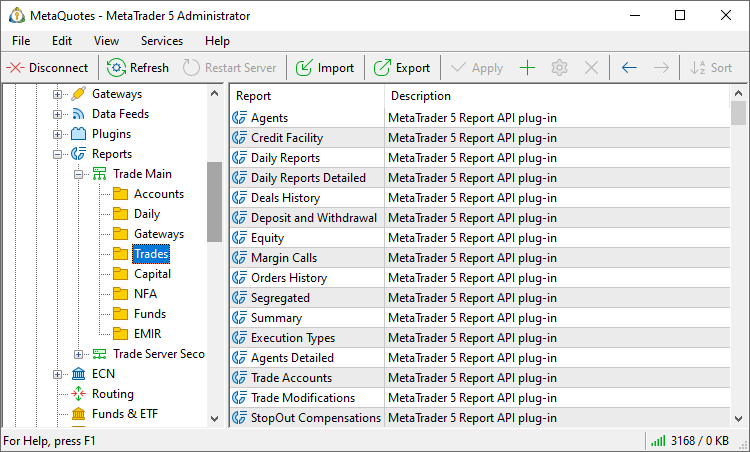
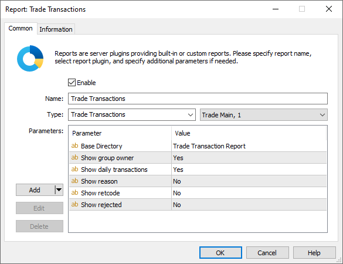
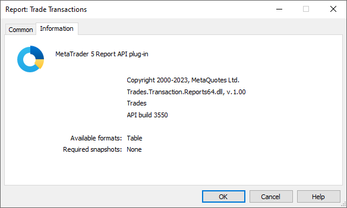
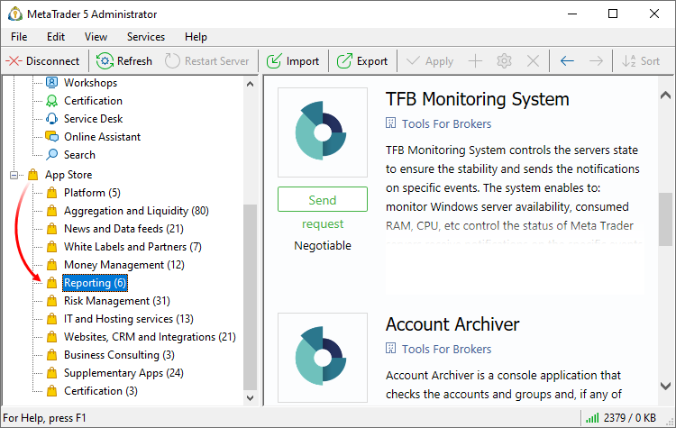

[🏠 Document Start](../../README.md) / [MetaTrader 5 Trading Platform](../../MetaTrader-5-Trading-Platform.md) / [Platform Setup](../Platform-Setup.md) / Reports

[Previous](Plugins.md) | [Next](Reports/Accounts-Groups.md)

# Reports (#reports)

Reports allow analyzing clients' trading activity. Report settings are managed in the administrator terminal, because they are generated exactly on the trade server side. Reports are viewed in a manager terminal. A manager requests a report with certain parameters, the server generates it and sends back ready HTML files.

> The trading platform features multiple [standard reports (#standard)](Reports.md#standard). Additional reports can be created using MetaTrader 5 Report API.

For easy access and efficiency, all reports are displayed as a tree list, in which reports are grouped by servers, for which they are configured. You can also [create subdirectories (#name)](Reports.md#name) to separate reports by purpose: "Accounts", "Daily Reports", "Gateways", etc.

## Adding and Editing Reports (#add-edit)

To add or edit a report, clickor in the [Edit](../MetaTrader-5-Administrator/User-Interface/Main-Menu/Edit.md) menu or in the [Standard](../MetaTrader-5-Administrator/User-Interface/Toolbar/Standard.md) toolbar. 

It is possible to edit multiple configurations. Select multiple reports using the Ctrl or Ctrl+Shift keys and proceed to editing. Using this functionality, you can enable and disable reports in bulk.

### Common (#common)

The following parameters should be specified on this tab:

  * Enable — enable/disable the report. If the report is disabled, it will not be available in the manager terminal. Disabled reports are marked with icon  in the list.
  * Name — the name of the report configuration and path to it.   
  
Specify paths to configurations to create a hierarchy of reports by arranging them into directories according to their purpose. A well-created structure can assist in setting individual [report access permissions (#reports)](Managers.md#reports) for manager accounts. For example, you can create a separate directory with dealer transaction reports, a separate directory for marketers who are responsible for database analysis and customer acquisition, etc.:  
  
Trades\Daily Reports  
Trades\Deals History  
Marketing\First Time Deposit  
Marketing\Lifetime Value  

  * Type — all reports available on the server are displayed here. The list is compiled based on the DLL report files which are located under the /report directory of the [main trading server](../Platform-Components/Trade-Server/Structure-of-Directories-and-Files.md). The platform features a variety of built-in [standard reports (#standard)](Reports.md#standard), while additional reports can be created using the MetaTrader 5 Report API.
  * Trader Server — to the right of the Type field, select a trade server the report is configured for. The report will be generated using the data on the specified server; and it will be available only when a [manager](Managers.md) connects to the specified server.

  * Each report configuration is bound to a certain [trade server](Network-cluster/Configuring-Servers/Trade-Server.md). Therefore, report generation will be available only when a [manager](Managers.md) connects to this server;
  * Reports are generated for a manager in accordance with his or her access permissions. Reports are generated only for available [groups of accounts (#groups)](Managers.md#groups).

  
---  
  
Parameters

The block of additional report parameters is available in the bottom part of the window. The additional parameters are available if they are implemented by the report developer.

The following commands are used for managing additional parameters:

  * Add — add a new parameter. A line appears upon pressing this button. Specify the parameter name and value in it. String type parameters are created by default. To select another type (integer or fractional) click the arrow on the "Add" button.
  * Edit — edit a selected parameter. The same action can be performed by a double click on the required field.
  * Delete — delete a selected parameter.

### Information (#info)

This tab displays various information on the report module: description, copyright, author, version of the report module and version of MetaTrader 5 Report API used for developing this report.

Furthermore, it displays information on available formats (a report can be generated in the form of a HTML page or in the form of a table), snapshots of databases required for the report generation. A database snapshot is a fixation of a database state on the server for generating the report (for example, the account database). 

## Standard Reports (#standard)

The standard delivery package of the trading platform includes several ready-made reports:

  * [Accounts Groups](Reports/Accounts-Groups.md) — statistical report on accounts in groups on a server.
  * [Accounts Grow](Reports/Accounts-Growth.md) — report on the growth of the number of accounts in groups on a server.

  * [Accounts Lifetime by Countries](Reports/Accounts-Lifetime-by-Countries.md) — lifetime of accounts with a distribution by countries.

  * [Agents](Reports/Agents.md) — report on all transactions connected with agent commissions.
  * [Agents Detailed](Reports/Agents-Detailed.md) — detailed report on agent commissions.
  * [Credit Facility](Reports/Credit-Facility.md) — credit operations report for the selected period.
  * [Daily](Reports/Daily.md) — report on the financial state of the requested accounts as of the end of the day.
  * [Daily Detailed](Reports/Daily-Detailed.md) — detailed report on the financial state of the one selected account as of the end of the day.
  * [Daily Server Logs](Reports/Daily-Server-Logs.md) — statistical report on the operation of the platform for the specified day.
  * [Daily Dealing](Reports/Daily-Dealing.md) — daily report on the activity of dealers.
  * [Daily Trades](Reports/Daily-Trades.md) — report on trade operations for the specified day.
  * [Daily Orders](Reports/Daily-Orders.md) — report on client orders open at the end of the selected day.
  * [Daily Positions](Reports/Daily-Positions.md) — report on client orders open at the end of the selected day.
  * [Daily Expert Advisors](Reports/Daily-Expert-Advisors.md) — report on trading operations performed by Expert Advisors of clients.
  * [Deals History](Reports/Deals-History.md) — summary report on the deals for the selected period.
  * [Deals Profit](Reports/Deals-Profit.md) — detailed report on deals for the selected period.
  * [Deals Initiators](Reports/Deals-Initiators.md) — deal initiators (reasons) report.
  * [Deals Geography](Reports/Deals-Geography.md) — trading activity distribution by country.
  * [Deals Weekly](Reports/Deals-Weekly.md) — trader activity report.
  * [Deposit and Withdrawal](Reports/Deposit-and-Withdrawal.md) — report on deposit and withdrawal operations for the selected period.
  * [Equity](Reports/Equity.md) — report on the financial state of the requested accounts as at the end of the day. The accounts are grouped according to their "Comment" field value. This report allows to generate reports on clients' accounts grouping them by custom criteria.
  * [Margin Calls](Reports/Margin-Calls.md) — report on the state of margin call or stop out accounts.
  * [Orders History](Reports/Orders-History.md) — summary report on the orders for the selected period.
  * [Positions History](Reports/Positions-History.md) — summary report on positions for the selected period.
  * [Segregated](Reports/Segregated.md) — summary report on the change of financial state of the requested accounts for the specified period.
  * [Summary](Reports/Summary.md) — summary motion of funds and funds cycles for the selected period.
  * [Gateways Turnover](Reports/Gateways-Turnover.md) — report on volumes of the deals handled by gateways.
  * [Gateways Profit](Reports/Gateways-Profit.md) — report on volumes of the deals handled by gateways, as well as the profit earned by a broker when handling these deals.
  * [Gateways White Label](Reports/Gateways-White-Label.md) — report on volumes of the deals performed on a trading server by external brokers via MetaTrader 5 Gateway (standard or White Label version).
  * [Execution Type](Reports/Execution-Types.md) — report on the number, volume and type of preformed trades.
  * [Trade Accounts](Reports/Trade-Accounts.md) — report on the current trading statuses of client accounts.
  * [Trade Transactions](Reports/Trade-Transactions.md) — provides detailed data on trading operations on MetaTrader 5 servers.
  * [Trade Modifications](Reports/Trade-Modifications.md) — report on trade operations manually changed by an administrator, manager or API.

  * [Trade Performance Summary](Reports/Trade-Performance-Summary.md) — detailed trading statistics of trading accounts.
  * [Trade Group Statistics](Reports/Trade-Group-Statistics.md) — detailed statistics of groups: the number of accounts, commission amounts, share of trades by type, and more.

  * [StopOut Compensations](Reports/StopOut-Compensations.md) — report on operations associated with the compensation of a negative balance in the situation of Stop out. All trades with the "so compensation" type are included into this report.
  * [Money Flow Daily](Reports/Money-Flow-Daily.md) — a group of reports presenting the movement of funds on client accounts.
  * [Money Flow Weekly](Reports/Money-Flow-Weekly.md) — a group of reports representing the weekly movement of funds on client accounts.
  * [Lifetime Value](Reports/Lifetime-Value.md) — a group of reports concerning client LTVs.
  * [First Time Deposit](Reports/First-Time-Deposit.md) — a group of reports on first-time deposits on client accounts.
  * [Retention of Clients](Reports/Retention-of-Clients.md) — new client retention report.
  * [Retention of Trading Accounts](Reports/Retention-of-Trading-Accounts.md) — new client retention report by individual accounts.
  * [NFA](Reports/NFA.md) — a group of reports to be submitted to NFA regulator.
  * [EMIR](Reports/EMIR.md) — a report to be submitted to a regulator according to EMIR.
  * [Fund Overview](Reports/Fund-Overview.md) — a report reflecting the key characteristics of a hedge fund.
  * [Risk Appetite](Reports/Risk-Appetite.md) — a report reflecting the risk level accepted by traders.
  * [Fast Profit Deals](Reports/Fast-Profit-Deals.md) — this report is designed to detect traders exploiting arbitrage opportunities through quote delays.

The availability of these reports is determined by an administrator when setting up the platform.

  * DLL modules of these reports are located in the /report folder of the [main trade server](../Platform-Components/Trade-Server/Structure-of-Directories-and-Files.md).
  * A DLL module is automatically unloaded from the memory of the trade server once all the report configurations of this module are disabled.

  
---  
  

## Additional reports (#additional)

A wide variety of additional reports is available in the [App Store](https://support.metaquotes.net/en/market/mt5/reporting) on the technical support website. The App Store showcase is featured directly in Manager Terminals, allowing managers to view and order additional products without leaving their workspace:

Furthermore, you can develop your own reports using [MetaTrader Report API](https://support.metaquotes.net/en/docs/mt5/api/reportapi). The package contains all the necessary tools, alongside the source code examples of standard reports. You can modify the source codes to create your own reports.

## Context Menu (#context)

The context menu of the "Reports" section contains the following commands:

  *  Add — add a new report;
  *  Edit — edit a selected report;
  *  Delete — delete a selected report;
  *  Move Up — move a selected report up relative to others;
  *  Move Down — move a selected report down relative to others;
  *  Sort Alphabetically — sort configurations alphabetically. Please note that sorting is done on the server, not in the local terminal.
  *  Enable — enable the selected configuration.
  *  Disable — disable the selected configuration.
  *  Export to File — [export](General-Information/ImportExport-Settings.md) the settings of reports to a file.
  *  Import from File — [import (#import)](General-Information/ImportExport-Settings.md#import) the settings of reports to a file.
  *  Journal — request [logs](Network-cluster/Journal.md) according to the selected configuration. This will open the trade server logs section, with the name of the selected configuration automatically specified in the query field. You will only need to press the request button.
  *  Find — open a [search](../MetaTrader-5-Administrator/User-Interface/Search.md) window;
  * Auto Arrange — if this option is enabled the size of columns is selected automatically;
  * Grid — this option shows/hides field separators in the table with the reports.

