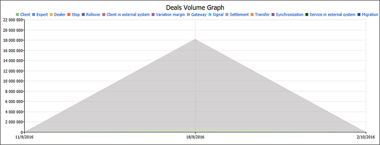

[🏠 Document Start](../../../README.md) / [MetaTrader 5 Trading Platform](../../../MetaTrader-5-Trading-Platform.md) / [Platform Setup](../../Platform-Setup.md) / [Reports](../Reports.md) / Execution Types

[Previous](Gateways-White-Label.md) | [Next](Trade-Accounts.md)

# Execution Types Report

Execution Type Report — a report on the number, volume and types of executed trades.

## Configuration in MetaTrader 5 Manager

The following parameter should be configured in the manager terminal before requesting the report:

  * Period — reports are generated for seven days preceding the specified day.

## Configuration in MetaTrader 5 Administrator

An additional parameter is configured in the report configuration in MetaTrader 5 Administrator:

  * Currency — the currency used when displaying various parameters in the report (Balance, Profit, etc.).

## Report Data

The report is divided into four units: information on accounts, a diagram on the number of trades, a diagram on the volume of trades, a summary of trades.

### Account Information

This unit provides the following information for each client group:

  * Group name
  * The number of clients in the group
  * The percentage of active accounts
  * The total balance of all accounts
  * The total floating profit/loss
  * The total equity amount
  * The group deposit currency

### Deals Count Graph

The chart shows the number of executed trades of each type separately: performed by clients, by dealers, executed for rollover and variation margin charges, etc.

### Deals Volume Graph

The chart shows the volume of executed trades of each type separately: performed by clients, by dealers, executed for rollover and variation margin charges, etc.

### A Summary Report on Trades

This unit features information on the number and volume of each type of trades for separate dates.

  * Client — the deal was performed by a client manually through the client terminal;
  * Expert — the deal was performed by a client using an Expert Advisor;
  * Dealer — the deal was performed by a dealer through the manager terminal;
  * Stop — the deal was performed when the client reached the [Stop out level (#stopout)](../Groups/Group-Settings.md#stopout);
  * Rollover — the deal was performed to calculate [swaps](../Symbols/Symbol-Settings/Swaps.md) when reopening a position;
  * External — the deal was performed by a client from an external trading system;
  * Variation margin — the deal was performed to charge variation margin;
  * Gateway — the deal was performed by the MetaTrader 5 Gateway connected to the platform.
  * Signal — the deal was performed as a result of copying a [trading signal](https://www.mql5.com/en/signals) as per a subscription in the client terminal.
  * Settlement — the deal was executed as a result of operations associated with a futures/option delivery date coming into effect. It is currently not used.
  * Transfer — the deal was performed as a result of relocating a position at a calculated price to a new symbol with the same underlying asset. It is currently not used.

