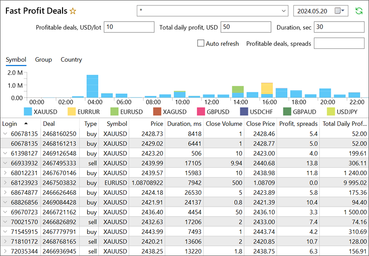

[🏠 Document Start](../../../README.md) / [MetaTrader 5 Trading Platform](../../../MetaTrader-5-Trading-Platform.md) / [Platform Setup](../../Platform-Setup.md) / [Reports](../Reports.md) / Fast Profit Deals

[Previous](Risk-Appetite.md) | [Next](../Ultency.md)

# Fast Profit Deals

This report is designed to detect traders exploiting arbitrage opportunities through quote delays. Due to various technical limitations, such as delays on the data provider side and network constraints, there may be slight variations in the speed at which quotes are received on brokerage servers. Quotes from one server may react to important news slightly faster than those from another. Traders may attempt to exploit this difference by finding a faster source, observing price movement, and quickly opening a trade in a favorable direction. This effect can be particularly significant during important economic news releases, when prices may move substantially in a short timeframe.

Typically, traders in such scenarios follow a certain pattern: upon the news release, they execute a short-term trade lasting no more than a minute, aiming to capture profit within a few spreads.

The 'Fast Profit Deals' report will assist in detecting such behavior. It shows all deals with a profit higher than the specified profit value and a duration shorter than the specified duration value. Specify the desired parameters in the report settings:

Duration is calculated in seconds between consecutive entry and exit deals based on the nearest previous entry preceding the closing deal within the same position. Profit is defined as the average amount in USD per position lot. This setup also allows determining those traders who accumulate large volumes/sums through small trades.

Additionally, information in the report can be filtered by the following parameters:

  * Profitable trades, spreads — profit form the deals in the number of spreads of the corresponding instrument.
  * Total daily profit — total profit on the trader's account for the selected day.
  * Groups — account groups for which the report is generated. You can specify one or several accounts separating them by commas.
  * Period — report day. A pair of deals is only included in the report only if both the entry and exit deals fall on the specified day.

## Profit Graph

The graph displays the profit for all deals included in the report, broken down by hour. It will allow you to trace the connection of suspicious deals with any events. Data can be analyzed from three perspectives: by symbol, group and country.

To filter the data in the table, select the desired time interval on the chart.

## List of Deals

Deals in the table are grouped by account. If multiple deals from the same account are included in the report, they will be shown together as a submenu that can be collapsed and expanded using arrows in the "Login" field.

The following information is available for the deals:

  * Login — account number on which the deal was performed.

  * Name — account holder's name.

  * Group — group to which the account belongs.
  * Country — client's country of residence.
  * Account comment — comment to the trading account.
  * Deal — deal ticket number (a unique identifier).

  * ID — ID of a deal in an external trading system.
  * Order — ticket of the order, as a result of which the deal has been performed.
  * Position — position ticket (unique number) to which the deal belongs.
  * Time — time of the position entry deal. Time is specified in the form of YYYY.MM.DD HH:MM (year.month.day hour:minute).
  * Type — trading operation type: Buy or Sell.
  * Symbol — financial instrument for which the deal was performed.
  * Volume — total volume of the initial position in lots.
  * Price — price at which the entry deal was executed.
  * S/L — Stop Loss level.
  * T/P — Take Profit level.
  * Close Time — time of the position exit deal. Time is specified in the form of YYYY.MM.DD HH:MM (year.month.day hour:minute).
  * Close Volume — exit deal volume in lots.
  * Close Price — price at which the exit deal was executed.
  * Duration — deal duration in milliseconds. Calculated as the difference between the Close Time and Time parameters.
  * Reason — [reason (#reason)](../Deals.md#reason) for executing the deal.
  * Commission — commission charged for the deal execution.
  * Fee — [fee (#details)](../Deals.md#details) charged for the deal execution.
  * Swap — swap amount.
  * Profit — financial result of the deal in the account deposit currency.
  * Currency — account deposit currency.
  * Profit, USD — financial result of the deal in USD. The amount is converted at the exchange rate of the deposit currency to USD at the time of the deal.
  * Profit, spreads — financial result of the deal in the number of spreads of the corresponding instrument. The value is calculated using the following formula: (Closing deal price - Position opening price) \ (Market Ask [from the deal (#details)](../Deals.md#details) \- Market Bid from the deal).
  * Total Daily Profit, USD — total profit on the trader's account for the selected day.
  * Comment — deal comment.

