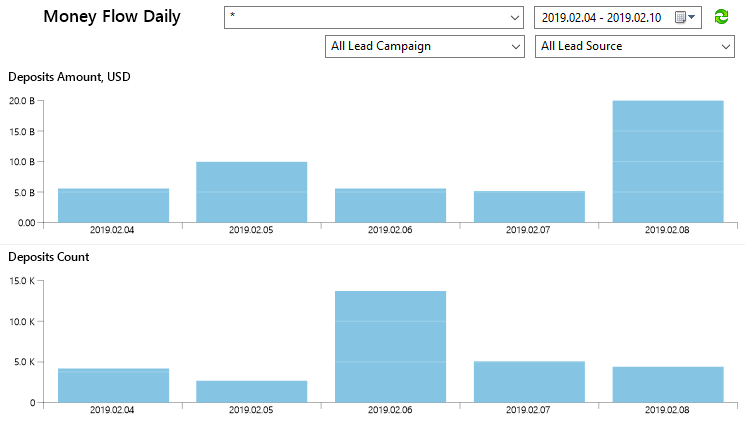
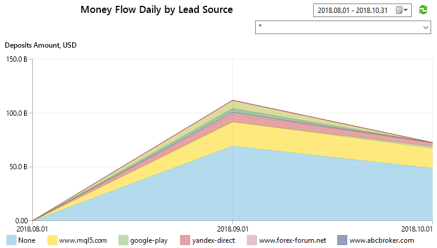

[🏠 Document Start](../../../README.md) / [MetaTrader 5 Trading Platform](../../../MetaTrader-5-Trading-Platform.md) / [Platform Setup](../../Platform-Setup.md) / [Reports](../Reports.md) / Money Flow Daily

[Previous](StopOut-Compensations.md) | [Next](Money-Flow-Weekly.md)

# Money Flow Daily

The report presents the distribution of deposits and withdrawals by days, as well as the difference between them. Data can be filtered by Lead Source and Lead Campaign, and thus you can evaluate the real effectiveness of advertising campaigns and marketing channel.

### Filters

Data requested for the report can be filtered. Specify the following parameters before requesting a report in the manager terminal:

  * Groups — the report will be generated for accounts from the specified groups. You can specify one or several groups separating them by commas.
  * Period — starting and ending date of the period, for which the report will be generated. For periods less than two months, data is displayed by days; for periods between 2 and 4 months, data is displayed by weeks (aggregated); data is presented by months for periods over 4 months.
  * Lead Campaign — the name of an advertising campaign by which the client was attracted.
  * Lead Source — the website from which the client came.

### Charts in the report

The report includes multiple charts:

  * Deposits Amount / Withdrawals Amount — distribution of deposit and withdrawal amounts over time.
  * Deposits Count / Withdrawals Count — distribution of the number of deposit and withdrawal operations over time.
  * Deposits Medium / Withdrawals Medium — the average deposit and withdrawal amount over time.
  * Balance-Withdrawal — difference between deposit and withdrawal amounts over time.
  * Balance-Withdrawal Accumulated — accumulated difference between deposit and withdrawal amounts over time.

> Balance operation values reflected in charts are automatically converted to the same currency in accordance with current quotes. The report currency is configured on the trade server side.

### Setup in MetaTrader 5 Administrator

The additional 'Currency' parameter can be set in the report configuration in MetaTrader 5 Administrator. Appropriate values in reports will be displayed in this currency. Conversion to the specified currency is performed in accordance with the current quotes in the platform. For example, EURUSD quotes are used to convert an amount in EUR to USD.

## Money Flow Daily by Lead Source / Lead Campaign / Country

These reports present the distribution of deposits and withdrawals not only by time, but also by attraction channels, marketing campaigns and countries. Select a group and time period and find out which advertisement drives the most of client deposits and which advertising sites provide the highest CTR.

### Filters

Data requested for the report can be filtered. Specify the following parameters before requesting a report in the manager terminal:

  * Groups — the report will be generated for accounts from the specified groups. You can specify one or several groups separating them by commas.
  * Period — starting and ending date of the period, for which the report will be generated. For periods less than two months, data is displayed by days; for periods between 2 and 4 months, data is displayed by weeks (aggregated); data is presented by months for periods over 4 months.

### Charts in the report

The report includes multiple charts:

  * Deposits Amount / Withdrawals Amount — distribution of deposit and withdrawal amounts over time, grouped by Lead Campaign, Lead Source or country.
  * Deposits Count / Withdrawals Count — distribution of the number of deposit and withdrawal operations over time, grouped by Lead Campaign, Lead Source or country.
  * Deposits Medium / Withdrawals Medium — average deposit and withdrawal amount over time, grouped by Lead Campaign, Lead Source or country.
  * Balance-Withdrawal — difference between deposit and withdrawal amounts over time, grouped by Lead Campaign, Lead Source or country.
  * Balance-Withdrawal Accumulated — accumulated difference between deposit and withdrawal amounts over time, grouped by Lead Campaign, Lead Source or country.

  * Balance operation values reflected in charts are automatically converted to the same currency in accordance with current quotes. The report currency is configured on the trade server side.
  * Lead Campaign and Lead Source data are available in appropriate fields of [trading accounts (#leadsource)](../Accounts/Editing-Account.md#leadsource).

  
---  
  
### Setup in MetaTrader 5 Administrator

The additional 'Currency' parameter can be set in the report configuration in MetaTrader 5 Administrator. Appropriate values in reports will be displayed in this currency.
