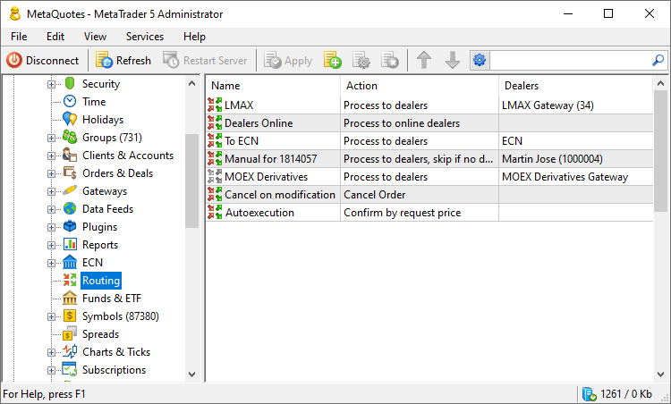
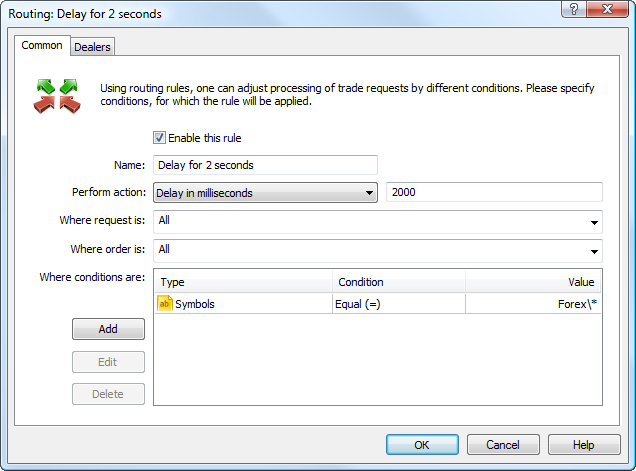
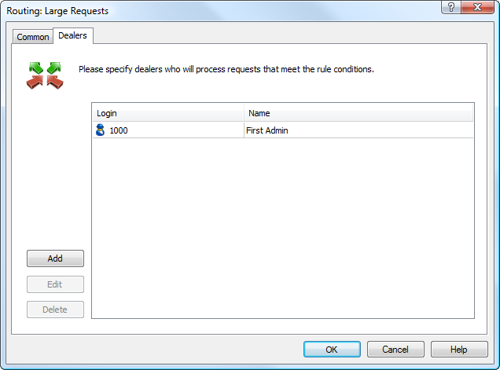
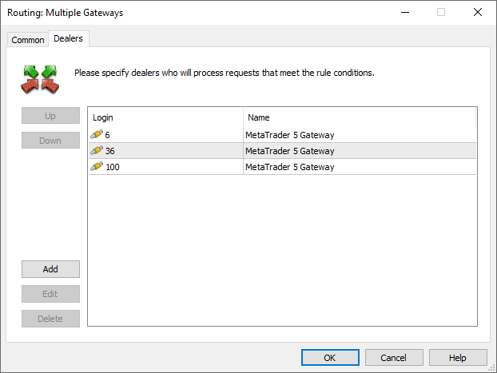
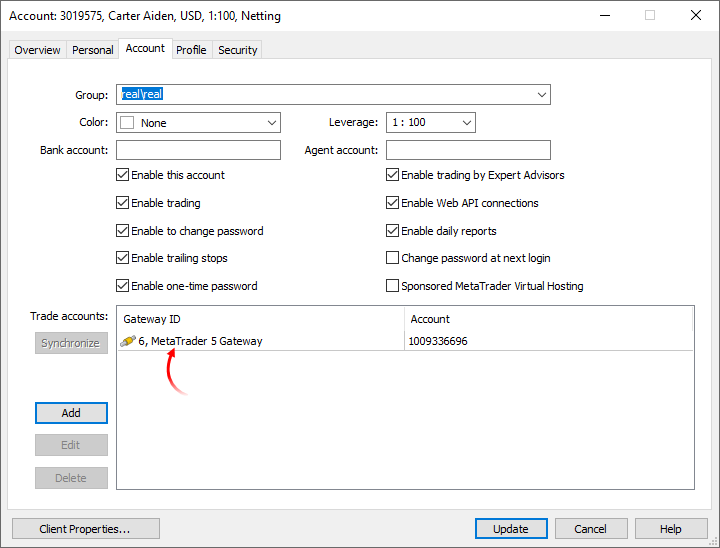

[🏠 Document Start](../../README.md) / [MetaTrader 5 Trading Platform](../../MetaTrader-5-Trading-Platform.md) / [Platform Setup](../Platform-Setup.md) / Routing

[Previous](ECN/Matching-History.md) | [Next](Routing/Actions-and-Conditions.md)

# Routing (#routing)

This section allows managing rules of processing clients' trade requests depending on different conditions.

The table of rules contains the following details:

  * Name — names of routing rules;
  * Dealers — list of dealers who process request that meet the conditions.

## Execution of Rules (#execution)

Rules are executed in the direction from top to bottom. If an incoming request meets the conditions of the upper rule, it is processed according to this rule; otherwise the request is checked for meeting conditions of the second rule, and so on. A request is processed according to the rules until it is executed or passed to a dealer. For example, meeting the rule directing to delay the request execution for some time, the request will be delayed and then checked for correspondence to further rules.

> Any change in the routing table leads to that all request currently processed according to these rules are moved to the beginning of the table and go through all rules again.

To change the position of rules in the list, use context menu commands: " Move Up" and " Move Down", the same commands of the [Edit](../MetaTrader-5-Administrator/User-Interface/Main-Menu/Edit.md) menu or buttons on the [Standard](../MetaTrader-5-Administrator/User-Interface/Toolbar/Standard.md) toolbar.

If you need to add a rule or change an existing one, press " Add" or " Edit", respectively. They are available in the [Edit](../MetaTrader-5-Administrator/User-Interface/Main-Menu/Edit.md) menu, on the [Standard](../MetaTrader-5-Administrator/User-Interface/Toolbar/Standard.md) toolbar and in the context menu. As soon as you press the button, the rule configuration window with two tabs will be opened.

> Additional general information about working with configuration records is given in the ["Working with Instructions"](General-Information/Working-with-Instructions.md) section.

## Common (#common)

On the "Common" tab you set common parameters of the rule, as well as conditions of requests, under which they will be processed according to this rule:

  * Enable this rule — to make a rule effective, tick this field;
  * Name — name of the rule;
  * Perform action — select the [action (#action)](Routing/Actions-and-Conditions.md#action) that should be executed with regard to the request that meets the rule conditions. For some actions an additional filed appears to the right of this one (for example, number of seconds and ticks for a delay);
  * Where request is — select a rule condition by the [type of request (#request)](Routing/Actions-and-Conditions.md#request). In order to select or deselect all elements in the list, click the right mouse button;
  * Where order is — select a rule condition by the [type of order (#order)](Routing/Actions-and-Conditions.md#order). In order to select or deselect all elements in the list, click the right mouse button;
  * Where conditions are — select [additional conditions (#condition)](Routing/Actions-and-Conditions.md#condition) to choose requests.

  * The rule conditions are taken into account according the to principle of "AND". In other words, in order for a request to be processed according to the rule, it must meet all the conditions specified in this rule.
  * The rule conditions must not contradict each other. For example, if you indicate the following two group conditions in one rule: \real* and demo\*, none of the trading requests will correspond to this rule. A request cannot belong to a demo account and a real one at the same time.

  
---  
  
A separate block is included for adding additional conditions. If you press "Add" a new line will be created in the table. Indicate the following in it:

  * Type — parameter, according to which the condition will be checked;
  * Condition — condition of rule triggering (equal, not equal, etc.);
  * Value — value the condition parameter is compared to.

> Be attentive when specifying conditions, For example, if you select the "Symbol" type, you can't set the condition "more than or equal to" (>=), etc. Otherwise the condition is incorrect and is not processed.

To edit an additional condition, select it and press "Edit" or double click on one of its parameters. To delete a condition press the "Delete" button or the Delete key.

## Dealers (#dealers)

There is an [action (#action)](Routing.md#action) performed by the request, at which it is sent to a dealer or a gateway to be handled - "Process to dealers". Requests processed by such a rule are enqueued to be processed by dealers specified in this tab. 

  * Add — add a dealer. A new line appears in the table as soon as you press this button. In the "Login" field select one of [managers' accounts](Managers.md) from the list. Only accounts with permissions to [modify orders (#modify-orders)](Managers.md#modify-orders) are shown in this list. The "Name" field is filled out automatically;
  * Delete — delete a selected dealer. The same action can be performed by pressing the "Delete" key;
  * Edit — edit a selected point. The same action can be performed by a double click on the field the login is specified in.

  * Only a [gateway](Gateways.md) or a manager account with the ["Dealing" (#dealing-permission)](Managers.md#dealing-permission) permission can be added to the list of dealers.

  * The list of dealers provides a special "ECN" item. Use this option to forward trade requests to [ECN matching](ECN/Order-Matching.md).

  
---  
  
To save the settings press "OK". If you press "Cancel", the changes will not be saved.

### Sending requests to multiple dealers (#multiple-dealers)

You can configure routing rules to forward request to multiple dealers/gateways at a time. For example, you can be using several gateway instances to connect to the same external system. in this case, each of the gateways uses its own account in the trading system, to which only operations from certain MetaTrader 5 accounts are forwarded.

In such cases, the routing system attempts to automatically send the request to the appropriate gateway.

1\. The server determines gateway/dealer priority: to which one the request should be sent in the first place. This is done based on the [external accounts data of the account (#trade-accounts)](Accounts/Editing-Account.md#trade-accounts) from which the request is received.

If the gateway from the routing rule is indicated in symbol settings, the request will be forwarded to this gateway.

If the gateway refuses the request for some reason or returns it, the request will be forwarded to other gateways. The gateway that captures the request first will process it.

2\. If a certain dealer/gateway refuses to process the request (for example, if processing contradicts the gateway's internal logic), the request is deleted from the dealer's/gateway's list. After that the request can be picked up by another dealer/gateway from the rule list.

For example:

  * The rule sets the action "Process to online dealers". Two gateways are indicated in the dealers list: gateway 1 and gateway 2.
  * Both gateways are currently online. A request is assigned to these connections.
  * Gateway 1 picks up the request and refuses it.
  * The requests is removed from the gateway 1 list and is forwarded to gateway 2.
  * Gateway 2 captures the request and processes it.

If gateway 2 also refuses the request, it will be deleted from the its list as well. Since there will be no gateways left to process the request, the server will reject the request and will add a corresponding log:

request rejected, due all assigned dealers returned request in queue (instant buy 4 EURUSD at 1.08700)  
---  
  
General example for the operation scheme:

  * If the request is assigned to only one gateway (and to no one else) in the rule, the request goes to this gateway.
  * If multiple gateways are assigned in the rule (and only gateways), the request goes to the one whose ID is found in the external accounts list. Gateways are checked in the same order as they are indicated in the rule.
  * If there is no such a gateway, the request is sent to the first gateway in the rule list (for which the request has not been deleted and is available).
  * If multiple gateways and dealers are assigned in the rule, gateways are checked first (in the same order used in group settings): gateways specified in the external accounts list of the account are searched. If such a gateway is found, the request is sent to that gateway.
  * If the gateway refuses the gateway, it will be processed according to the rules specified above.
  * If no priority gateway is found, the request will be passed to the gateway or dealer who first captures the request from the queue.

## Context Menu (#context)

The context menu of the "Routing" tab allows executing the following commands:

  *  Add — add a new rule;
  *  Edit — edit a selected rule;
  *  Delete — delete a selected rule;
  *  Move Up — move a selected rule up relative to others;
  *  Move Down — move a selected rule down relative to others;
  *  Sort Alphabetically — sort configurations alphabetically. Please note that sorting is done on the server, not in the local terminal.
  *  Enable — enable the selected configuration.
  *  Disable — disable the selected configuration.
  * Automation triggers — create an [automation](Automations.md) task for the selected event or edit an existing one. The menu displays only the triggers and tasks associated with the current section.
  * Automation actions — add an automation action to an existing task or create a new task based on the action. The menu displays only the actions associated with the current section.
  *  Export to File — [export](General-Information/ImportExport-Settings.md) routing settings to a file.
  *  Import from File — [import (#import)](General-Information/ImportExport-Settings.md#import) routing settings to a file.
  *  Journal — request [logs](Network-cluster/Journal.md) according to the selected configuration. This will open the trade server logs section, with the name of the selected configuration automatically specified in the query field. You will only need to press the request button.
  *  Find — open the [search](../MetaTrader-5-Administrator/User-Interface/Search.md) window;
  * Auto Arrange — if this option is enabled the size of columns is selected automatically;
  * Grid — this option shows/hides field separators in the table with the rules.

