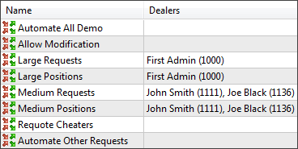
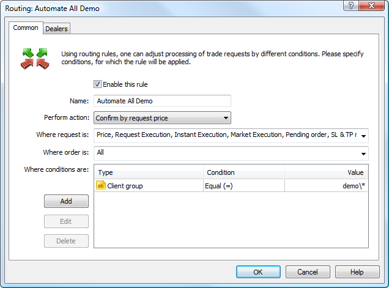
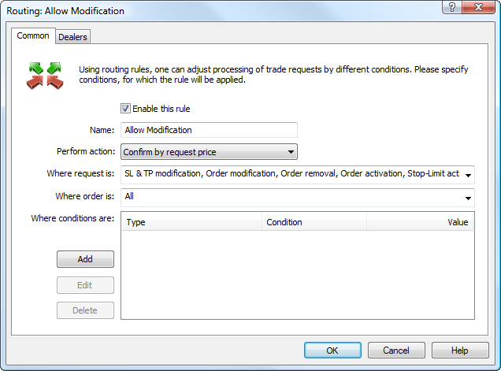
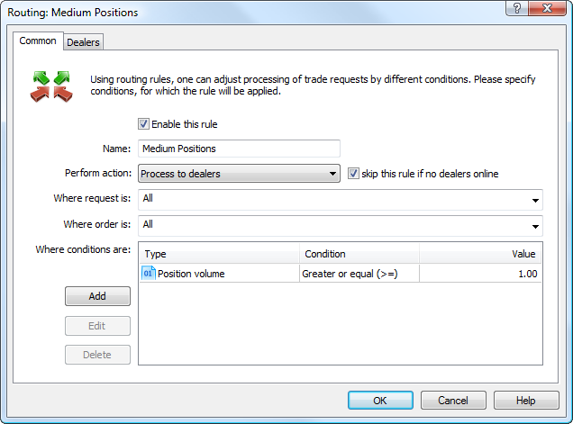
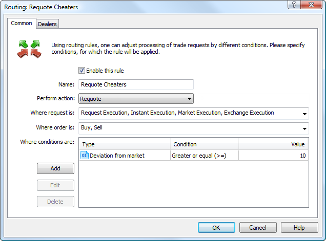
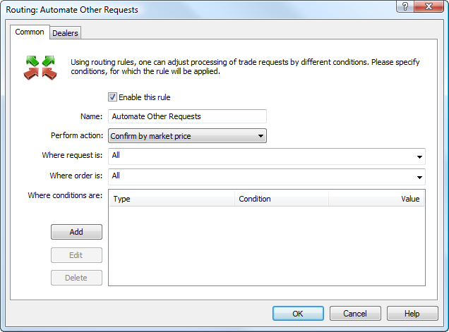

[🏠 Document Start](../../../README.md) / [MetaTrader 5 Trading Platform](../../../MetaTrader-5-Trading-Platform.md) / [Platform Setup](../../Platform-Setup.md) / [Routing](../Routing.md) / Example of Rules

[Previous](Actions-and-Conditions.md) | [Next](../Funds-&-ETF.md)

# Example of Rules

In this section we will consider a set of routing rules for processing most common situations that appear in the processing of trade requests. The set consists of eight rules:

## Automate All Demo

This rule allows to automatically process all requests that come from demo accounts without any changes.

The following parameters should be set up on the "Common" tab of the rule:

  * Perform action: Confirm by request price  
Confirm requests at prices that are specified in orders.
  * Where request is: All  
For all types of requests.
  * Where order is: All  
For all types of orders.
  * Where conditions are: Client group = demo\*  
For all sub-groups of the "demo" group.

## Allow Modification

This rule allows modifying positions and pending orders without any limitation. All operations of this type will be processed automatically without any changes.

The following parameters are specified for this rule:

  * Perform action: Confirm by request prices  
Confirm requests at prices that are specified in orders.
  * Where request is: SL & TP modification, Order modification, Order removal  
For requests to change levels of Stop Loss and Take Profit of open positions, as well as to change and delete pending orders.
  * Where order is: All  
For all types of orders.
  * Where conditions are: No  
No additional conditions are required.

## Large Requests

This rule allows routing large trade requests to be processed by dealers.

The following parameters are specified in this rule:

  * Perform action: Process to dealers  
Pass the processing to dealers specified in the ["Dealers" (#dealers)](../Routing.md#dealers) tab.
  * Where request is: All  
For all types of requests.
  * Where order is: All  
For all types of orders.
  * Where conditions are: Request volume >= 10  
For requests with the volume of 10 lots and more.

## Large Positions

This rule helps to prevent omission of the previous rule that limits automatic execution of requests larger than 10 lots. Some clients may attempt to open large positions by sending several requests of smaller volume. This rule analyzes the size of a client's position of a symbol.

The following parameters are specified in this rule:

  * Perform action: Process to dealers  
Pass the processing to dealers specified in the ["Dealers" (#dealers)](../Routing.md#dealers) tab.
  * Where request is: All  
For all types of requests.
  * Where order is: All  
For all types of orders.
  * Where conditions are: Position volume >= 10  
For requests, which being fulfilled, the symbol position will be equal to 10 lots or even larger.

## Medium Requests

This rule allows routing trade requests of average volumes to be processed by dealers. In this case this is a different group of dealers, other than that on the previous rule.

The following parameters are specified in this rule:

  * Perform action: Pass to dealers. Skip this rule if no dealers online.  
Pass the processing to dealers specified in the ["Dealers" (#dealers)](../Routing.md#dealers) tab. The additional condition is set - the rule will be skipped if there are no dealers online.
  * Where request is: All  
For all types of requests.
  * Where order is: All  
For all types of orders.
  * Where conditions are: Request volume >= 1  
For requests with the volume equal to or larger than 1 lot.

## Medium Positions

This rule helps to prevent omission of the previous rule that limits automatic execution of requests larger than 1 lot. Some clients may attempt to open large positions by sending several requests of smaller volume. This rule analyzes the size of a client's position on this symbol.

The following parameters are specified in this rule:

  * Perform action: Pass to dealers. Skip this rule if no dealers online.  
Pass the processing to dealers specified in the ["Dealers" (#dealers)](../Routing.md#dealers) tab. The additional condition is set - the rule will be skipped if there are no dealers online.
  * Where request is: All  
For all types of requests.
  * Where order is: All  
For all types of orders.
  * Where conditions are: Position volume >= 1  
For requests, which being fulfilled, the symbol position will be equal to 1 lot or even larger.

## Requote Cheaters

This routing rule allows to block trade requests that are at non-market prices. For the additional condition, this rule takes into account the number of non-market requests sent by the client for this day.

The following parameters are specified in this rule:

  * Perform action: Requote  
Send current market prices replying to the request.
  * Where request is: Request Execution, Instant Execution, Market Execution, Exchange Execution  
This is the rule for the above execution types.
  * Where order is: Buy, Sell  
For Buy and Sell orders.
  * Where conditions are: Deviation from market >= 10  
For requests with the price that differs from the market price by 10 or more points. Clients who have sent 30 requests at non-market prices or more are taken into account.

## Automate Other Requests

This rule allows to automatically process requests that have not been processed according to the above rules. If such a rule is not specified at the end of the list, such requests will not be processed by the server.

The following parameters are specified in this rule:

  * Perform action: Confirm by market price  
Confirm by prices specified in orders.
  * Where request is: All  
For all types of requests.
  * Where order is: All  
For all types of orders.
  * Where conditions are: No  
No additional conditions are required.

