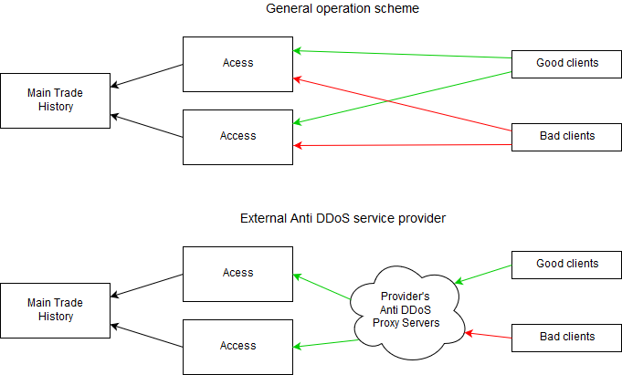
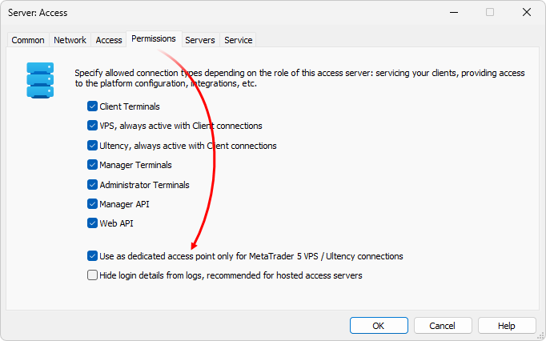
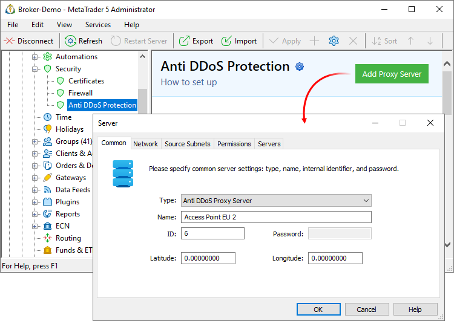
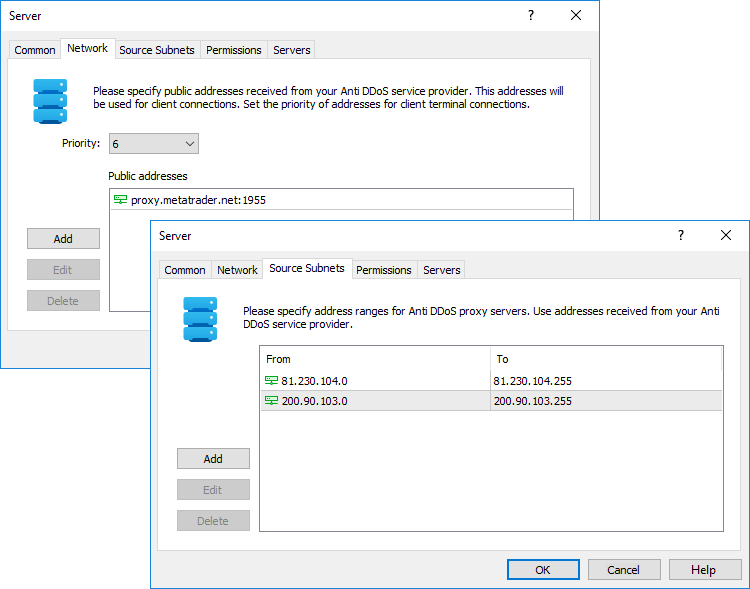
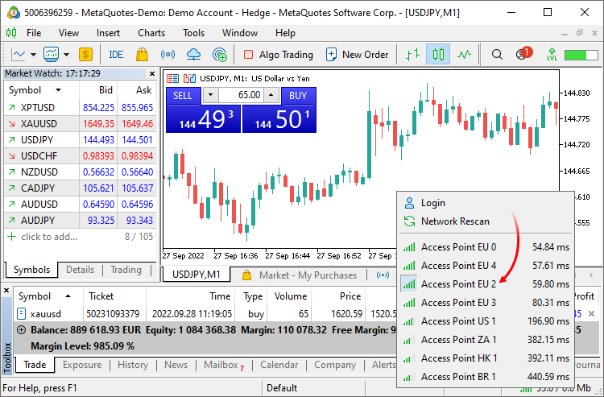

[🏠 Document Start](../../../README.md) / [MetaTrader 5 Trading Platform](../../../MetaTrader-5-Trading-Platform.md) / [Platform Setup](../../Platform-Setup.md) / [Security](../Security.md) / Anti DDoS Protection

[Previous](Firewall.md) | [Next](Authentication-Protocols.md)

# Protection against DDoS Attacks (#protection-against-ddos-attacks)

The access servers of the platform are provided with the [DDoS protection](../../Platform-Components/Access-Server/Antiflood-Control.md) mechanism. The mechanism monitors the network activity of clients in real time and blocks connections from IP addresses, on which suspicious activity is registered, such as sending too many requests or invalid data, authorization errors, etc.

Unfortunately, the mechanism cannot protect the platform against all existing types of attacks. For example, it cannot defend against attacks targeting the network infrastructure, since such attacks cannot be physically dealt with at the access server application level. Additional mechanisms are required for effective protection.

The trading platform provides a special component Anti-DDoS Proxy Server. The component enables the use of external Anti-DDoS service providers. In this case, blocking of unwanted connections is performed on the distributed network of Anti-DDoS provider's servers rather than on access servers. The Anti-DDos provider's server network actually acts as an additional component between the client and the access server.

Instead of directly connecting to access servers, all clients will be connected to the provider's public access points. Unwanted connections will be filtered in the provider's own network of servers, while legitimate connections from real clients will be forwarded to access servers.

The broker's infrastructure is practically not affected.

## Configure your access server for the operation with an external Anti-DDoS service provider (#hide-access)

Choose an access server, to which the connections via the Anti-DDoS provider will be redirected. It is recommended to install and configure a new access server, because its address must not be publicly known (otherwise attackers will be able to directly attack this server). If you have an access server that was never visible to clients (had the [Idle priority (#priority)](../Network-cluster/Configuring-Servers/Access-Server.md#priority) or [client connections were disabled (#permissions)](../Network-cluster/Configuring-Servers/Access-Server.md#permissions) in its settings), you may use this server.

The 'Use as dedicated access point only for MetaTrader 5 VPS / Ultency connections' option is available for servers that work with an external Anti-DDoS provider.

Enable this option for the access server, to which connections will be redirected. The server will be hidden from all terminals, including client, manager and administrator, and will not be displayed in the list of access points. Not knowing the address of the server, attackers will not be able to perform an attack.

> By hiding a server, you do not disable the possibility to connect to it. Terminals can connect to this server if the address is specified manually, and the Anti-DDoS provider can redirect client connections to it.

## Choose an Anti-DDoS service provider and receive necessary data (#choose-an-anti-ddos-service-provider-and-receive-necessary-data)

You should contact the Anti-DDoS provider and sign an appropriate agreement.

  * You will need to provide information about the [public address (#public)](../Network-cluster/Configuring-Servers.md#public) of your access server to your Anti-DDoS provider.
  * The provide will allocate one or more public addresses, to which your clients will be connected. These addresses should be specified in the [Anti DDoS Proxy Server settings (#public)](Anti-DDoS-Protection.md#public) in the 'Public Addresses' field.
  * Also you will be provided with ranges of proxy server addresses through which client connections will be forwarded to access servers. These ranges should also be specified in the Anti DDoS Proxy Server settings (tab [Source Subnets (#range)](Anti-DDoS-Protection.md#range). The ranges are used as an additional protection measure: connections forwarded by the Anti-DDoS provider will only be accepted from these addresses.

> The platform supports the following service providers — [Akamai](https://support.metaquotes.net/en/market/product/194), [Qrator](https://support.metaquotes.net/en/market/product/477), [Cloudflare](https://support.metaquotes.net/en/market/product/478). Support for other providers will be added soon.

## Configure the Anti DDoS Proxy Server component in MetaTrader 5 (#configure-the-anti-ddos-proxy-server-component-in-metatrader-5)

After you receive the required information, add the Anti-DDoS Proxy Server component in the Network Cluster section. Set a name for this component. Note that this name will be used for the display access points in client terminals. Do not use phrases like Anti DDoS etc., the point should look like a regular access server.

Also set the internal ID; passwords are not used for this component.

Next, on the Network tab, specify:

  * Priority — the basic priority for the access points of the Anti-DDoS provider, from 0 to 15. It is similar to priority settings of access servers. Preference of a server for client connections is calculated based on the basic priority and the quality of connection with the server (ping). The lower the priority is, the more preferred the server is for clients.
  * Public addresses — one or more public access points through which clients connect to the platform (via the provider's network). These points are prvided to you by the Anti DDoS service provider.

On the "Source Subnets" tab, set the range of addresses for the provider's proxy servers. Connections forwarded by the Anit-DDoS provider from these addresses will be accepted.

> Anti-DDoS Proxy Server will work even if you do not specify provider's proxy ranges. However, we strongly recommend specifying the ranges, otherwise, connections from any addresses will be allowed in the Anti DDOS provider mode.

## Check the accessibility of the Anti-DDoS server in terminals (#check-the-accessibility-of-the-anti-ddos-server-in-terminals)

After configuration Anti DDoS, the server will be available for client connections. The provider's server is displayed as a regular access point in client terminals:

## How to Hide Access Servers (#how-to-hide-access-servers)

After the configuration of the Anti-DDoS proxy server, the provider's access point will be available for all terminals, including client, manager and administrator. However, your access points will still be available to these terminals. If a server address is publicly available, attackers can find out this address and perform an attack. In order to protect from possible attacks, you can hide access servers. This can be done by enabling the option 'Hide server from all types of terminals (connections will be allowed)'.

The server will be hidden from all terminals and will not be displayed in the list of access points. Not knowing the address of the server, attackers will not be able to perform an attack.

> By hiding a server, you do not disable the possibility to connect to it. Terminals can connect to this server if the is specified manually, and the Anti-DDoS provider will be able to forward client connections to it.

## How to identify connections through the Anti-DDoS provider (#how-to-identify-connections-through-the-anti-ddos-provider)

Forwarded client connections are received from the Anti-DDoS provider's addresses. However, the real original addresses of clients are also known, since this information is transmitted by the provider. The proper original client's address is written to the platform logs and [client records](../Accounts/Editing-Account.md) (e.g. in the Last IP parameter).

Check the [access server journal](../Network-cluster/Journal.md) to find out if the client is connected via the Anti DDoS provider:

2017.10.13 17:42:08.441 84.101.15.116 '1814046': login (Client build 1674, cid: 13ea0a897463ba4aeb76db5d8cdc4afa, ping: 108.83 ms, anti ddos server: 81.230.104.100)  
---
