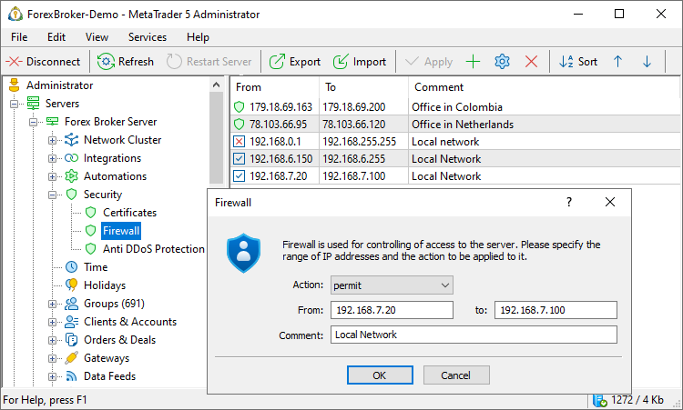
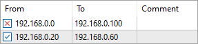
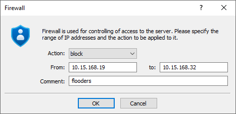

[🏠 Document Start](../../../README.md) / [MetaTrader 5 Trading Platform](../../../MetaTrader-5-Trading-Platform.md) / [Platform Setup](../../Platform-Setup.md) / [Security](../Security.md) / Firewall

[Previous](Certificates.md) | [Next](Anti-DDoS-Protection.md)

# Firewall (#firewall)

The Firewall section is intended for setting up protection of the system from the access from undesirable IP addresses. If a group of addresses is blocked, no users (client, manager or administrator) from the address inside the specified range will be able to connect to the server. By default all addresses are allowed.

Checking of any address is performed top-down. Each type of instructions is displayed with a special icon:

  *  — blocked range of addresses;
  *  — allowed range of addresses;
  *  — range of addresses that are always allowed irrespective of blocking instructions and [antiflood control](../../Platform-Components/Access-Server/Antiflood-Control.md).

The last instruction is always applied to an address, irrespective of previous instructions, except for the addresses that are [always allowed (#action)](Firewall.md#action). Thus the position of an instruction in the list is an important condition in the limitation of access from IP addresses. Let's consider an example:

In the above example, the allowing instruction (from 192.168.0.20 to 192.168.0.60) is located below the blocking one. This allows to enable access of a certain range within blocked addresses. Only the addresses 192.168.0.0 — 192.168.0.20 and 192.168.0.60 — 192.168.0.100 stay blocked. But if you change places of these instructions, the entire range 192.168.0.0 — 192.168.0.100 will be blocked.

To change positions of instructions in the list, use context menu commands " Move Up" and " Move Down", ore the same command in [Edit](../../MetaTrader-5-Administrator/User-Interface/Main-Menu/Edit.md) menu or on toolbar [Standard](../../MetaTrader-5-Administrator/User-Interface/Toolbar/Standard.md).

  * Do not block address ranges, which include IP used for connecting by the administrator terminal. If such instructions become effective, you won't be able to connect to the server.

  * In case of blocking your own IP address and inability to connect to the server via another administrator account the only way is to stop the main server service, delete the file configs\access.ini and then start the server again. Note that this will lead to deleting all previously created firewall configurations.

  * Instructions become effective as soon as you press "OK". But they are applied to new connections only. Current connections are not reset.

  * You should carefully treat not only access blocking and allowing, but also the position of instructions in the list. Remember, only the last instruction concerning the IP address is applied to it, while all previous ones are ignored.

  
---  
  

## Adding and Modifying Instructions (#add-edit)

In order to add an instruction or modify an existing one, press " Add" or " Edit", respectively. They can be found in the [Edit](../../MetaTrader-5-Administrator/User-Interface/Main-Menu/Edit.md) menu, on [Standard](../../MetaTrader-5-Administrator/User-Interface/Toolbar/Standard.md) toolbar or in the context menu. After you press them, the following window will appear:

The following parameters should be specified in this window:

  * Action — select an action: always permit, permit or block the bellow range of IP addresses;
  * From — starting address of the range. The instruction will be effective starting from this address;
  * To — end address of the range. The instruction will be effective till this address;
  * Comment — a text comment to the instruction.

To finish adding or editing an instruction, press "OK". If you press "Cancel", the window will be closed while changes will not be saved.

A created instruction can be deleted using command " Delete" of the [Edit (#delete)](../../MetaTrader-5-Administrator/User-Interface/Main-Menu/Edit.md#delete) menu, [Standard](../../MetaTrader-5-Administrator/User-Interface/Toolbar/Standard.md) toolbar or the context menu.

  * For quick addition of instructions on any of IP addresses, insert it into the Comment field from the clipboard. After you press "Ok", it will be automatically added to fields "From" and "To".
  * Additional general information about working with configuration records is given in the ["Working with Instructions"](../General-Information/Working-with-Instructions.md) section.

  
---  
  

## Context Menu (#context)

The context menu of Firewall contains the following commands:

  *  Add — add a new instruction;
  *  Edit — edit the selected instruction;
  *  Delete — delete the selected instruction;
  *  Move Up — move the selected instruction up relative to others;
  *  Move Down — move the selected instruction down relative to others;
  *  Sort Alphabetically — sort configurations alphabetically. Please note that sorting is done on the server, not in the local terminal.
  *  Export to File — [export](../General-Information/ImportExport-Settings.md) firewall settings to a file.
  *  Import from File — [import (#import)](../General-Information/ImportExport-Settings.md#import) firewall settings to a file.
  *  Journal — request [logs](../Network-cluster/Journal.md) according to the selected configuration. This will open the trade server logs section, with the name of the selected configuration automatically specified in the query field. You will only need to press the request button.
  *  Find — open the [search](../../MetaTrader-5-Administrator/User-Interface/Search.md) window;
  * Auto Arrange — if this option is enabled the size of columns is selected automatically;
  * Grid — this option shows/hides field separators in the table.

