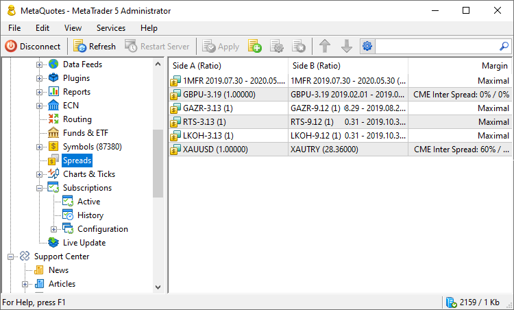
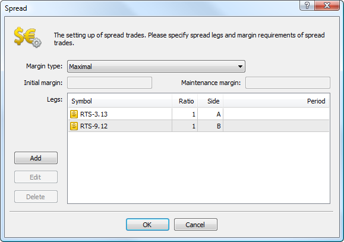
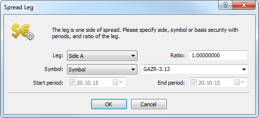

[🏠 Document Start](../../README.md) / [MetaTrader 5 Trading Platform](../../MetaTrader-5-Trading-Platform.md) / [Platform Setup](../Platform-Setup.md) / Spreads

[Previous](Symbols/Collateral.md) | [Next](1-Minute-History-Charts.md)

# Spreads (#spreads)

This section allows users to configure the charging of the margin in case client's trading positions are in a spread to one another. Being in a spread means the presence of the oppositely directed positions on related symbols. Reduced margin requirements for positions in a spread present traders with wider trading opportunities.

> Spread settings are only used on [netting (#netting)](Groups/Position-Accounting-Systems.md#netting) accounts.

## Creating and Editing a Spread (#creating-and-editing-a-spread)

To create a Spread, click " Add" or " Edit" in ["Edit"](../MetaTrader-5-Administrator/User-Interface/Main-Menu/Edit.md) menu of ["Standard"](../MetaTrader-5-Administrator/User-Interface/Toolbar/Standard.md) panel or in the context menu of this section.

### Margin Calculation Type (#margin-calculation-type)

First of all, a type of margin charging should be specified for a spread.

  * For all calculations types except Maximal, the specified margin is charged per unit of spread — specified combination of positions. If any part of the position does not fit in the spread, an additional margin is charged according to [symbol](Symbols/Symbol-Settings/Margin.md) settings. If the client's current positions have the volume the mentioned combination fits in several times, the charged margin is increased appropriately. For example, two instruments A and B are in a spread with the ratio of 1 and 2. If a client has positions by those instruments of 3 and 4 lots respectively, the total margin will be equal to the doubled value of the spread configuration (two spreads: 1 lot of A and 2 lots of B, 1 lot of A and 2 lots of B) plus the margin for one left lot of A instrument.
  * The values are displayed in the margin currency (excluding CME Inter Spread where ratios are specified). It is assumed that the margin currency of all spread symbols is the same.

  
---  
  
Value

When this type is selected, the appropriate margin values that will be charged at the specified combination of positions are set in "Initial margin" and "Maintenance margin" fields.

Example:

  * Initial and maintenance margins are set at 2 000;
  * two symbols (GAZR-9.12 having the ratio of 2 and GAZR-3.13 having the ratio of 1) form the spread;

When a client has an opposite directed positions at GAZR-9.12 and GAZR-3.13 with the volume 2 and 1 lot respectively, the margin of 2 000 units will be charged. With the volume of 4 and 2 lots, the margin of 4 000 units will be charged.

Maximal

When this type is selected, the values of initial and maintenance margins will be calculated for each spread leg. The calculation is performed by summing up the margin requirements for all symbols of the leg. The margin requirements of the leg having a greater value will be used for the spread.

> In this mode the total volume of positions on each side is considered, not only covered volume. Ratio for symbols in the spread legs cannot be specified in this mode.

Example:

  * two symbols GAZR-9.12 and GAZR-3.13 form the spread;
  * for GAZR-9.12 symbol, the values of initial and maintenance margins are equal to 2 000;
  * for GAZR-3.13 symbol, the values of initial and maintenance margins are equal to 2 100.

When a client has an opposite directed positions at GAZR-9.12 and GAZR-3.13 with the volume of 2 and 1 lot respectively, the margin of 4 000 units will be charged.

CME Inter Spread

When this option is selected, ratios (multipliers) for the appropriate margin types should be selected in "Initial" and "Maintenance" fields. The final value of the margin is defined by summing up the margin requirements for all spread symbols and multiplying the obtained value by the specified ratio.

Example:

  * two symbols (GAZR-9.12 having leg A and ratio of 2 and GAZR-3.13 having leg B and the ratio of 1) form the spread;
  * for GAZR-9.12 symbol, the values of initial and maintenance margins are equal to 2 000;
  * for GAZR-3.13 symbol, the values of initial and maintenance margins are equal to 2 100;
  * The ratios of 0.5 are specified in spread settings in Initial and Maintenance fields.

The final value of the initial and maintenance margins will be calculated the following way: (2 000 * 2 + 2 100) * 0.5 = 3 050.

CME Intra Spread

When this option is selected, the margin is calculated the following way: the difference between the total margin of A leg symbols and the total margin of B leg symbols is calculated (the difference in absolute magnitude is used, so that it does not matter what leg is a deductible one). According to the type of the calculated margin, the value specified in "Initial" or "Maintenance" field is added to the obtained difference.

Example:

  * two symbols (GAZR-9.12 having leg A and ratio of 2 and GAZR-3.13 having leg B and the ratio of 1) form the spread;
  * for GAZR-9.12 symbol, the values of initial and maintenance margins are equal to 2 000;
  * for GAZR-3.13 symbol, the values of initial and maintenance margins are equal to 2 100;
  * The values of 500 are specified in spread settings in Initial and Maintenance fields.

Maintenance and initial margin will be calculated the following way: (2 000 * 2 - 2 100) + 500 = 2 400.

### Spread Legs (#spread-legs)

The next step is configuring spread legs. The legs are oppositely directed positions in a spread — buy or sell. To create a leg, click "Add".

Select A or B leg to be configured. The leg type is not connected to some definite position direction (buy or sell). Note that client's positions at all leg's symbols should be either long or short.

Several symbols can be configured for each leg. A volume ratio at this spread leg can be specified for each of them.

Example:

  * leg A consists of GAZR-9.12 and GAZR-3.13 symbols having the ratios of 1 and 2 respectively
  * leg B consists of GAZR-6.13 symbol having the ratio of 1.

To keep the client's positions in the spread, the client should open positions of 1 and 2 lots for GAZR-9.12 and GAZR-3.13 respectively to one direction and position of 1 lot for GAZR-6.13 to another direction.

Symbols for a leg can be specified as some definite symbol ("Symbol" option) or as an underlying asset ("Basis") in case there are quite a lot of symbols in the spread.

If an underlying asset is specified for the leg, all symbols with this underlying asset are considered ("Basis" field in [symbol settings](Symbols/Symbol-Settings/Common.md)). In this case, symbols can be additionally filtered by the time of their operation (specified in "From" and "To" fields of ["Sessions"](Symbols/Symbol-Settings/Sessions.md) tab). To do this, specify the time interval in "Start period" and "End period" fields. To be able to use the symbol, its expiration date ("To" field) should be in the specified interval. To make the date open, uncheck the box in the Start or End period field.

> If the start and end dates are not specified, all symbols with the specified underlying asset will be used without considering their expiration date.

## Context Menu (#context)

The context menu of "Spreads" section contains the following commands:

  *  Add — add a new spread configuration;
  *  Edit — edit the selected configuration;
  *  Delete — delete the selected configuration;
  *  Move up — move the selected configuration up relative to others;
  *  Move down — move the selected configuration down relative to others;
  *  Sort Alphabetically — sort configurations alphabetically. Please note that sorting is done on the server, not in the local terminal.
  *  Export to File — [export](General-Information/ImportExport-Settings.md) the settings of spreads to a file.
  *  Import from File — [import (#import)](General-Information/ImportExport-Settings.md#import) the settings of spreads to a file.
  *  Journal — request [logs](Network-cluster/Journal.md) according to the selected configuration. This will open the trade server logs section, with the name of the selected configuration automatically specified in the query field. You will only need to press the request button.
  *  Find — open the [search](../MetaTrader-5-Administrator/User-Interface/Search.md) window;
  * Auto Arrange — if this option is enabled, the size of columns will be selected automatically;
  * Grid — show/hide grid to separate the table fields.

